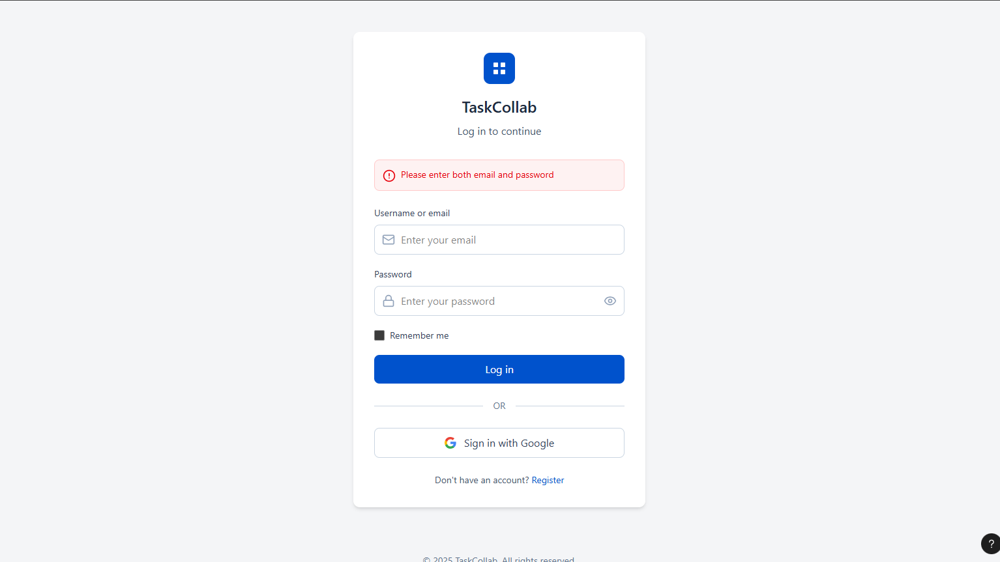
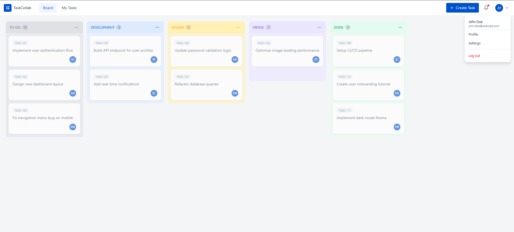
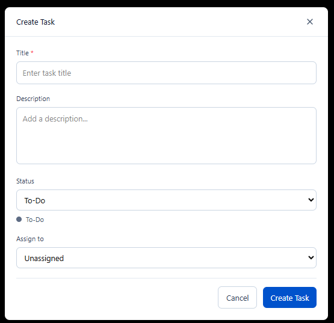
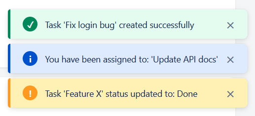

# API Contract Documentation

## Task Collaboration System - Two-Tier Architecture

This document outlines the API contracts for each page/wireframe of the Task Collaboration System. Each section includes the wireframe, user actions, frontend needs, backend processing, project requirements reference, and detailed API specifications.

---

## Table of Contents

1. [Login Page](#page-1-login-page)
2. [Registration Page](#page-2-registration-page)
3. [Task Board (Kanban)](#page-3-task-board-kanban)
4. [Task Details](#page-4-task-details)
5. [Create/Edit Task Modal](#page-5-createedit-task-modal)
6. [Admin - All Tasks View](#page-6-admin---all-tasks-view)
7. [Toast Notifications](#page-7-toast-notifications)
8. [API Summary](#api-summary)

---

# Page 1: Login Page

## Wireframe



---

## User Actions

- Enter Username/Email and Password to login
- Click "Sign in with Google" for OAuth login
- Click "Register" link to navigate to registration page
- Toggle password visibility
- Check "Remember me" for persistent session

---

## Frontend Needs

| Component | Description |
|-----------|-------------|
| Username/Email input | Text field with email icon |
| Password input | Password field with show/hide toggle |
| Remember me | Checkbox for session persistence |
| Login button | Primary action button (JIRA blue) |
| Google OAuth button | "Sign in with Google" with Google logo |
| Register link | Navigation to registration page |
| Error message area | Display validation/authentication errors |

---

## Backend Processing

| Validation | Description |
|------------|-------------|
| Username/Email | Required, must exist in database |
| Password | Required, must match hashed password |
| Account status | Check if account is active/not locked |
| JWT Generation | Generate token with user claims and role |
| Token expiry | Set to 7 days as per requirements |

---

## Project Requirements

> **From Final Project PDF - Section 1: Authentication & Security (4 marks)**
>
> - Implement **JWT-based authentication** for API endpoints
> - Support **dual authentication**: OAuth (Google) + Username/Password
> - Create secure user registration and login endpoints
> - Configure **CORS policies** for frontend consumption
> - Add **role-based claims** to JWT tokens (Admin, User)
>
> **API Endpoints Required:**
> | Method | Endpoint | Description |
> |--------|----------|-------------|
> | POST | /api/auth/login | Login with username/password |
> | POST | /api/auth/google | Google OAuth callback |
>
> **Configuration Requirements:**
> - JWT secret key in appsettings.json
> - Token expiry: 7 days
> - Admin user email configurable

---

## API Contracts

### API 1.1: Username/Password Login

```http
POST /api/auth/login
Content-Type: application/json
```

**Request Body:**
```json
{
  "usernameOrEmail": "john.doe@example.com",
  "password": "SecurePass123!"
}
```

**Response - Success (200):**
```json
{
  "token": "eyJhbGciOiJIUzI1NiIsInR5cCI6IkpXVCJ9...",
  "refreshToken": "dGhpcyBpcyBhIHJlZnJlc2ggdG9rZW4...",
  "expiresIn": 604800,
  "user": {
    "id": 1,
    "name": "John Doe",
    "email": "john.doe@example.com",
    "username": "johndoe",
    "role": "User"
  }
}
```

**Response - Error (400):**
```json
{
  "error": "Invalid credentials",
  "message": "Username or password is incorrect"
}
```

**Response - Error (401):**
```json
{
  "error": "Unauthorized",
  "message": "Account is locked or disabled"
}
```

---

### API 1.2: Google OAuth Login

```http
POST /api/auth/google
Content-Type: application/json
```

**Request Body:**
```json
{
  "idToken": "google-oauth-id-token-from-frontend"
}
```

**Response - Success (200):**
```json
{
  "token": "eyJhbGciOiJIUzI1NiIsInR5cCI6IkpXVCJ9...",
  "refreshToken": "dGhpcyBpcyBhIHJlZnJlc2ggdG9rZW4...",
  "expiresIn": 604800,
  "user": {
    "id": 2,
    "name": "Jane Smith",
    "email": "jane.smith@gmail.com",
    "username": "janesmith",
    "role": "User"
  },
  "isNewUser": false
}
```

**Response - Error (400):**
```json
{
  "error": "Invalid token",
  "message": "Google authentication failed"
}
```

---

### API 1.3: Refresh Token

```http
POST /api/auth/refresh
Content-Type: application/json
```

**Request Body:**
```json
{
  "refreshToken": "dGhpcyBpcyBhIHJlZnJlc2ggdG9rZW4..."
}
```

**Response - Success (200):**
```json
{
  "token": "new-jwt-token...",
  "refreshToken": "new-refresh-token...",
  "expiresIn": 604800
}
```

**Response - Error (401):**
```json
{
  "error": "Unauthorized",
  "message": "Invalid or expired refresh token"
}
```

---

# Page 2: Registration Page

## Wireframe


---

## User Actions

- Enter Full Name, Email, Username, Password, Confirm Password
- Click "Sign up with Google" for OAuth registration
- Click "Login" link to navigate to login page
- View inline validation errors

---

## Frontend Needs

| Component | Description |
|-----------|-------------|
| Full Name input | Required text field |
| Email input | Required, email format validation |
| Username input | Required, alphanumeric validation |
| Password input | Required, with strength indicator |
| Confirm Password input | Must match password |
| Create Account button | Primary action button |
| Google OAuth button | "Sign up with Google" |
| Login link | Navigation to login page |
| Validation errors | Inline error messages per field |

---

## Backend Processing

| Validation | Description |
|------------|-------------|
| Full Name | Required, 2-100 characters |
| Email | Required, valid format, unique in database |
| Username | Required, 3-50 chars, alphanumeric, unique |
| Password | Min 8 chars, uppercase, lowercase, number, special char |
| Confirm Password | Must match password (frontend only) |
| Password Hashing | Use BCrypt or similar secure hashing |

---

## Project Requirements

> **From Final Project PDF - Section 1: Authentication & Security (4 marks)**
>
> - Create secure user **registration** and login endpoints
> - **Password hashing and security** (0.5 marks)
>
> **API Endpoints Required:**
> | Method | Endpoint | Description |
> |--------|----------|-------------|
> | POST | /api/auth/register | User registration |
>
> **From Section 2: Data Layer - Database Schema**
>
> **Users Table:**
> | Column | Type | Constraints |
> |--------|------|-------------|
> | Id | int | Primary Key |
> | Name | string | Required |
> | Email | string | Unique, Required |
> | Username | string | Unique, Required |
> | PasswordHash | string | Required |
> | Role | string | Required |
> | CreatedAt | DateTime | Required |
>
> **Sample Users to Seed:**
> - 1 Admin user (configurable email)
> - 4 Regular users

---

## API Contracts

### API 2.1: User Registration

```http
POST /api/auth/register
Content-Type: application/json
```

**Request Body:**
```json
{
  "name": "John Doe",
  "email": "john.doe@example.com",
  "username": "johndoe",
  "password": "SecurePass123!",
  "confirmPassword": "SecurePass123!"
}
```

**Response - Success (201):**
```json
{
  "message": "User registered successfully",
  "user": {
    "id": 6,
    "name": "John Doe",
    "email": "john.doe@example.com",
    "username": "johndoe",
    "role": "User",
    "createdAt": "2025-12-07T10:30:00Z"
  }
}
```

**Response - Error (400) - Validation:**
```json
{
  "error": "Validation failed",
  "errors": {
    "email": "Email is already registered",
    "username": "Username is already taken",
    "password": "Password must be at least 8 characters with uppercase, lowercase, number, and special character"
  }
}
```

---

# Page 3: Task Board (Kanban)

## Wireframe



---

## User Actions

- View all tasks organized by status columns
- Click on a task card to view details
- Click "+ Create Task" to open create modal
- Access user dropdown (Profile, Settings, Logout)
- Receive real-time updates when tasks change

---

## Frontend Needs

| Component | Description |
|-----------|-------------|
| Navigation Header | Logo, Board, My Tasks links, Create button, notifications, user avatar |
| 5 Kanban Columns | To-Do, Development, Review, Merge, Done |
| Column Headers | Status name with task count badge |
| Task Cards | Task ID, Title, Assignee avatar |
| User Dropdown | Profile, Settings, Logout options |
| SignalR Connection | Real-time task updates |

**Column Colors (from PDF):**
| Status | Background | Text Color |
|--------|------------|------------|
| To-Do | #dfe1e6 | #5e6c84 |
| Development | #deebff | #0052cc |
| Review | #fff0b3 | #ff991f |
| Merge | #eae6ff | #6554c0 |
| Done | #e3fcef | #00875a |

---

## Backend Processing

| Validation | Description |
|------------|-------------|
| JWT Token | Validate token, extract user claims |
| User Role | Determine visible tasks based on role |
| Archived Filter | Exclude archived tasks for regular users |
| Pagination | Support page and pageSize parameters |

---

## Project Requirements

> **From Final Project PDF - Section 3: RESTful API Development (3 marks)**
>
> - Design and implement **RESTful API** following REST principles
> - Implement complete **CRUD operations** for tasks
> - Return proper **HTTP status codes** (200, 201, 400, 401, 404, 500)
> - Implement **filtering and pagination** for GET requests
>
> **Required Endpoints:**
> | Method | Endpoint | Description | Auth Required |
> |--------|----------|-------------|---------------|
> | GET | /api/tasks | Get all tasks (with pagination) | Yes |
> | GET | /api/tasks/my | Get current user's tasks | Yes |
> | GET | /api/tasks/assigned | Get tasks assigned to current user | Yes |
>
> **Query Parameters for GET /api/tasks:**
> - page - Page number (default: 1)
> - pageSize - Items per page (default: 20)
> - status - Filter by status
> - assignedTo - Filter by assignee ID
> - createdBy - Filter by creator ID
> - search - Search in title/description
>
> **From Section 7: User Interface (4 marks)**
>
> **Task Board - Kanban Layout (1.5 marks):**
> - 5 columns: To-Do, Development, Review, Merge, Done
> - Color-coded cards based on status
> - Task count per column in header
> - User avatars on cards showing assignee
> - Click to view details
> - Real-time updates when tasks change
> - Responsive grid layout

---

## API Contracts

### API 3.1: Get All Tasks (Board View)

```http
GET /api/tasks?page=1&pageSize=20
Authorization: Bearer {token}
```

**Query Parameters:**
| Parameter | Type | Default | Description |
|-----------|------|---------|-------------|
| page | number | 1 | Page number |
| pageSize | number | 20 | Items per page |
| status | string | - | Filter by status (ToDo, Development, Review, Merge, Done) |
| assignedTo | number | - | Filter by assignee user ID |
| createdBy | number | - | Filter by creator user ID |
| search | string | - | Search in title/description |

**Response - Success (200):**
```json
{
  "data": [
    {
      "id": 101,
      "title": "Implement user authentication flow",
      "description": "We need to implement...",
      "status": "ToDo",
      "createdBy": {
        "id": 1,
        "name": "Mike Johnson",
        "initials": "MJ"
      },
      "assignedTo": {
        "id": 2,
        "name": "Sarah Chen",
        "initials": "SC"
      },
      "createdAt": "2025-12-01T09:00:00Z",
      "updatedAt": "2025-12-07T14:30:00Z",
      "isArchived": false
    },
    {
      "id": 102,
      "title": "Design new dashboard layout",
      "description": "Create wireframes for...",
      "status": "ToDo",
      "createdBy": {
        "id": 2,
        "name": "Sarah Chen",
        "initials": "SC"
      },
      "assignedTo": {
        "id": 3,
        "name": "Mike Johnson",
        "initials": "MJ"
      },
      "createdAt": "2025-12-02T10:00:00Z",
      "updatedAt": "2025-12-06T11:00:00Z",
      "isArchived": false
    }
  ],
  "page": 1,
  "pageSize": 20,
  "totalCount": 11,
  "totalPages": 1
}
```

**Response - Error (401):**
```json
{
  "error": "Unauthorized",
  "message": "Invalid or expired token"
}
```

---

### API 3.2: Get Current User Info

```http
GET /api/auth/me
Authorization: Bearer {token}
```

**Response - Success (200):**
```json
{
  "id": 1,
  "name": "John Doe",
  "email": "john.doe@example.com",
  "username": "johndoe",
  "role": "Admin",
  "createdAt": "2025-11-01T08:00:00Z"
}
```

---

### API 3.3: Get My Tasks

```http
GET /api/tasks/my?page=1&pageSize=20
Authorization: Bearer {token}
```

**Response - Success (200):**
```json
{
  "data": [
    {
      "id": 101,
      "title": "Implement user authentication flow",
      "status": "Development",
      "createdBy": {
        "id": 1,
        "name": "John Doe",
        "initials": "JD"
      },
      "assignedTo": {
        "id": 2,
        "name": "Sarah Chen",
        "initials": "SC"
      },
      "createdAt": "2025-12-01T09:00:00Z",
      "updatedAt": "2025-12-07T14:30:00Z",
      "isArchived": false
    }
  ],
  "page": 1,
  "pageSize": 20,
  "totalCount": 5,
  "totalPages": 1
}
```

---

### API 3.4: Get Assigned Tasks

```http
GET /api/tasks/assigned?page=1&pageSize=20
Authorization: Bearer {token}
```

**Response - Success (200):**
```json
{
  "data": [
    {
      "id": 104,
      "title": "Build API endpoint for user profiles",
      "status": "Development",
      "createdBy": {
        "id": 2,
        "name": "Sarah Chen",
        "initials": "SC"
      },
      "assignedTo": {
        "id": 1,
        "name": "John Doe",
        "initials": "JD"
      },
      "createdAt": "2025-12-03T11:00:00Z",
      "updatedAt": "2025-12-07T09:00:00Z",
      "isArchived": false
    }
  ],
  "page": 1,
  "pageSize": 20,
  "totalCount": 3,
  "totalPages": 1
}
```

---

### API 3.5: SignalR Hub Connection

> **From Final Project PDF - Section 4: Real-Time Communication - SignalR (3 marks)**
>
> - Implement **SignalR Hub** for real-time notifications
> - Broadcast task creation, updates, and deletions
> - Implement **targeted notifications** (only to specific users)
> - Track online users and connections
> - Handle connection lifecycle properly

```
Hub URL: /hubs/tasks
Connection: wss://localhost:5001/hubs/tasks?access_token={token}
```

**Client Events (Listen):**

| Event | Description | Payload |
|-------|-------------|---------|
| TaskCreated | Fired when any user creates a task | `{ task: TaskObject, message: "Task created: {title}" }` |
| TaskUpdated | Fired when any task is updated | `{ task: TaskObject, message: "Task '{title}' status updated to: {status}" }` |
| TaskDeleted | Fired when any task is deleted | `{ taskId: number, message: "Task deleted: {title}" }` |
| TaskAssigned | Fired only to assigned user | `{ task: TaskObject, message: "You have been assigned to: {title}" }` |

**Server Methods (Invoke):**

| Method | Description |
|--------|-------------|
| JoinBoard | Join the task board room for updates |
| LeaveBoard | Leave the task board room |

---

# Page 4: Task Details

## Wireframes

.png)

.png)

---

## User Actions

- View task details (Title, Description, Activity, Comments)
- Change task status via dropdown
- Change assignee
- Add comments
- Edit task (if authorized)
- Delete task (if authorized)
- Navigate back via breadcrumb

---

## Frontend Needs

| Component | Description |
|-----------|-------------|
| Breadcrumb | "Board > {taskId}" navigation |
| Two-column layout | Main content (70%) + Sidebar (30%) |
| Task Title | Large, prominent display |
| Description | Markdown-supported text area |
| Activity Timeline | List of status changes and updates |
| Comments Section | List of comments with add input |
| Status Dropdown | 5 status options with colors |
| Assignee Section | Avatar, name, "Change" button |
| Reporter Section | Avatar and name |
| Dates Section | Created and Updated timestamps |
| Cache Status | "Cached" or "Live" badge |
| Edit/Delete buttons | Top-right action icons |
| Archived Banner | Yellow warning if task is archived |

---

## Backend Processing

| Validation | Description |
|------------|-------------|
| JWT Token | Validate and extract user |
| Task Existence | Return 404 if not found |
| Authorization | Check edit/delete permissions |
| Cache Check | Return X-Cache header (HIT/MISS) |
| Activity Logging | Log status changes, updates |

---

## Project Requirements

> **From Final Project PDF - Section 7: User Interface (4 marks)**
>
> **Task Details Page (1 mark):**
> - **Two-column layout** (main content + sidebar)
> - Main content: Task title, description, activity timeline
> - Sidebar: Status, assignee, reporter, dates
> - **Breadcrumb navigation**
> - Edit button (if authorized)
> - **Cache indicator badge** (if loaded from cache)
> - **Archived warning banner** (if archived)
>
> **From Section 6: Caching Strategy (2 marks)**
>
> - Cache key format: `task_{id}`
> - TTL: 5 minutes (configurable)
> - Invalidate on: PUT/DELETE operations
> - Cache header: Add `X-Cache: HIT` or `X-Cache: MISS` to responses
> - Simulate delay: 2-second database delay to demonstrate caching benefit

---

## API Contracts

### API 4.1: Get Single Task

```http
GET /api/tasks/{id}
Authorization: Bearer {token}
```

**Response Headers:**
```
X-Cache: HIT (or MISS)
```

**Response - Success (200):**
```json
{
  "id": 101,
  "title": "Implement user authentication flow",
  "description": "We need to implement a comprehensive user authentication system that includes login, registration, password reset, and social authentication (Google). The system should be secure and follow industry best practices.",
  "status": "Development",
  "createdBy": {
    "id": 1,
    "name": "Mike Johnson",
    "initials": "MJ"
  },
  "assignedTo": {
    "id": 2,
    "name": "Sarah Chen",
    "initials": "SC"
  },
  "createdAt": "2025-12-07T10:00:00Z",
  "updatedAt": "2025-12-08T14:30:00Z",
  "isArchived": false,
  "archivedAt": null,
  "activities": [
    {
      "id": 1,
      "userId": 2,
      "userName": "Sarah Chen",
      "userInitials": "SC",
      "action": "changed status from To-Do to Development",
      "createdAt": "2025-12-08T12:00:00Z"
    },
    {
      "id": 2,
      "userId": 1,
      "userName": "Mike Johnson",
      "userInitials": "MJ",
      "action": "updated description",
      "createdAt": "2025-12-07T15:00:00Z"
    },
    {
      "id": 3,
      "userId": 2,
      "userName": "Sarah Chen",
      "userInitials": "SC",
      "action": "created this task",
      "createdAt": "2025-12-07T10:00:00Z"
    }
  ],
  "comments": [
    {
      "id": 1,
      "userId": 3,
      "userName": "Alex Turner",
      "userInitials": "AT",
      "content": "Should we use JWT tokens or session-based authentication?",
      "createdAt": "2025-12-08T11:00:00Z"
    },
    {
      "id": 2,
      "userId": 2,
      "userName": "Sarah Chen",
      "userInitials": "SC",
      "content": "I think JWT would be better for our use case since we might need mobile apps in the future.",
      "createdAt": "2025-12-08T12:00:00Z"
    }
  ]
}
```

**Response - Error (404):**
```json
{
  "error": "Not found",
  "message": "Task not found"
}
```

---

### API 4.2: Update Task

```http
PUT /api/tasks/{id}
Authorization: Bearer {token}
Content-Type: application/json
```

**Request Body:**
```json
{
  "title": "Implement user authentication flow",
  "description": "Updated description with more details...",
  "status": "Review",
  "assignedToId": 2
}
```

**Response - Success (200):**
```json
{
  "id": 101,
  "title": "Implement user authentication flow",
  "description": "Updated description with more details...",
  "status": "Review",
  "createdBy": {
    "id": 1,
    "name": "Mike Johnson",
    "initials": "MJ"
  },
  "assignedTo": {
    "id": 2,
    "name": "Sarah Chen",
    "initials": "SC"
  },
  "createdAt": "2025-12-07T10:00:00Z",
  "updatedAt": "2025-12-08T15:00:00Z",
  "isArchived": false
}
```

**Response - Error (403):**
```json
{
  "error": "Forbidden",
  "message": "You don't have permission to edit this task"
}
```

**Response - Error (400):**
```json
{
  "error": "Validation failed",
  "errors": {
    "title": "Title is required",
    "status": "Invalid status value"
  }
}
```

---

### API 4.3: Delete Task

```http
DELETE /api/tasks/{id}
Authorization: Bearer {token}
```

**Response - Success (204):** No Content

**Response - Error (403):**
```json
{
  "error": "Forbidden",
  "message": "You don't have permission to delete this task"
}
```

**Response - Error (404):**
```json
{
  "error": "Not found",
  "message": "Task not found"
}
```

---

### API 4.4: Add Comment

```http
POST /api/tasks/{id}/comments
Authorization: Bearer {token}
Content-Type: application/json
```

**Request Body:**
```json
{
  "content": "I think JWT would be better for our use case since we might need mobile apps in the future."
}
```

**Response - Success (201):**
```json
{
  "id": 3,
  "taskId": 101,
  "userId": 2,
  "userName": "Sarah Chen",
  "userInitials": "SC",
  "content": "I think JWT would be better for our use case since we might need mobile apps in the future.",
  "createdAt": "2025-12-08T12:00:00Z"
}
```

**Response - Error (400):**
```json
{
  "error": "Validation failed",
  "message": "Comment content is required"
}
```

---

### API 4.5: Get All Users (for Assignee Dropdown)

```http
GET /api/users
Authorization: Bearer {token}
```

**Response - Success (200):**
```json
{
  "data": [
    {
      "id": 1,
      "name": "John Doe",
      "email": "john.doe@example.com",
      "username": "johndoe",
      "role": "Admin",
      "initials": "JD"
    },
    {
      "id": 2,
      "name": "Sarah Chen",
      "email": "sarah.chen@example.com",
      "username": "sarahchen",
      "role": "User",
      "initials": "SC"
    },
    {
      "id": 3,
      "name": "Mike Johnson",
      "email": "mike.johnson@example.com",
      "username": "mikejohnson",
      "role": "User",
      "initials": "MJ"
    },
    {
      "id": 4,
      "name": "Emma Wilson",
      "email": "emma.wilson@example.com",
      "username": "emmawilson",
      "role": "User",
      "initials": "EW"
    },
    {
      "id": 5,
      "name": "Alex Turner",
      "email": "alex.turner@example.com",
      "username": "alexturner",
      "role": "User",
      "initials": "AT"
    }
  ]
}
```

---

### API 4.6: Get User by ID

```http
GET /api/users/{id}
Authorization: Bearer {token}
```

**Response - Success (200):**
```json
{
  "id": 2,
  "name": "Sarah Chen",
  "email": "sarah.chen@example.com",
  "username": "sarahchen",
  "role": "User",
  "initials": "SC",
  "createdAt": "2025-11-15T08:00:00Z"
}
```

**Response - Error (404):**
```json
{
  "error": "Not found",
  "message": "User not found"
}
```

---

# Page 5: Create/Edit Task Modal

## Wireframes



.png)

.png)

---

## User Actions

- Enter task Title (required)
- Enter task Description (optional)
- Select Status from dropdown
- Select Assignee from dropdown (or leave Unassigned)
- Click "Create Task" or "Save Changes"
- Click "Cancel" to close modal

---

## Frontend Needs

| Component | Description |
|-----------|-------------|
| Modal overlay | Dark background overlay |
| Modal header | "Create Task" or "Edit Task" with close (X) button |
| Title input | Required field with validation |
| Description textarea | Optional, multi-line input |
| Status dropdown | 5 options: To-Do, Development, Review, Merge, Done |
| Assign to dropdown | List of all users + "Unassigned" option |
| Cancel button | Secondary action, closes modal |
| Submit button | "Create Task" or "Save Changes" |
| Validation errors | Inline error messages |

---

## Backend Processing

| Validation | Description |
|------------|-------------|
| Title | Required, 1-200 characters |
| Description | Optional, max 2000 characters |
| Status | Required, must be valid enum value |
| AssignedToId | Optional, must be valid user ID if provided |
| CreatedById | Set from JWT token claims |

---

## Project Requirements

> **From Final Project PDF - Section 7: User Interface (4 marks)**
>
> **Create/Edit Task Form (0.5 marks):**
> - Title (required, text input)
> - Description (optional, textarea)
> - Status (dropdown with 5 options)
> - Assign to (dropdown with all users)
> - Validation messages
> - Submit/Cancel buttons
>
> **From Section 3: RESTful API Development (3 marks)**
>
> | Method | Endpoint | Description | Auth Required |
> |--------|----------|-------------|---------------|
> | POST | /api/tasks | Create new task | Yes |
> | PUT | /api/tasks/{id} | Update task | Yes |
> | DELETE | /api/tasks/{id} | Delete task | Yes |
>
> **From Section 2: Data Layer - Tasks Table Schema**
>
> | Column | Type | Constraints |
> |--------|------|-------------|
> | Id | int | Primary Key |
> | Title | string | Required |
> | Description | string | Nullable |
> | Status | enum | Required (ToDo, Development, Review, Merge, Done) |
> | CreatedById | int | Foreign Key -> Users |
> | AssignedToId | int | Foreign Key -> Users, Nullable |
> | CreatedAt | DateTime | Required |
> | UpdatedAt | DateTime | Required |
> | IsArchived | bool | Required |
> | ArchivedAt | DateTime | Nullable |

---

## API Contracts

### API 5.1: Create Task

```http
POST /api/tasks
Authorization: Bearer {token}
Content-Type: application/json
```

**Request Body:**
```json
{
  "title": "Implement dark mode theme",
  "description": "Add dark mode support to the application with toggle in settings.",
  "status": "ToDo",
  "assignedToId": 3
}
```

**Response - Success (201):**
```json
{
  "id": 112,
  "title": "Implement dark mode theme",
  "description": "Add dark mode support to the application with toggle in settings.",
  "status": "ToDo",
  "createdBy": {
    "id": 1,
    "name": "John Doe",
    "initials": "JD"
  },
  "assignedTo": {
    "id": 3,
    "name": "Mike Johnson",
    "initials": "MJ"
  },
  "createdAt": "2025-12-08T16:00:00Z",
  "updatedAt": "2025-12-08T16:00:00Z",
  "isArchived": false
}
```

**Response - Error (400):**
```json
{
  "error": "Validation failed",
  "errors": {
    "title": "Title is required"
  }
}
```

---

### API 5.2: Update Task

*(Same as API 4.2)*

```http
PUT /api/tasks/{id}
Authorization: Bearer {token}
Content-Type: application/json
```

---

### API 5.3: Delete Task

*(Same as API 4.3)*

```http
DELETE /api/tasks/{id}
Authorization: Bearer {token}
```

---

# Page 6: Admin - All Tasks View

## Wireframes


.png)

.png)

.png)

.png)

---

## User Actions

- View all tasks in table format (including archived for Admin)
- Search tasks by title/description
- Filter by Status
- Filter by Assignee
- Toggle "Include Archived" to show/hide archived tasks
- Click Clear to reset filters
- View/Edit/Delete actions on each row
- Navigate pages via pagination

---

## Frontend Needs

| Component | Description |
|-----------|-------------|
| Page Title | "All Tasks" with count badge |
| Search Input | Search by title/description |
| Status Filter | Dropdown: All Statuses, To-Do, Development, Review, Merge, Done |
| Assignee Filter | Dropdown: All Users, individual users |
| Include Archived | Checkbox toggle (Admin only) |
| Clear Button | Reset all filters |
| Data Table | ID, Title, Status, Assignee, Created By, Created, Updated, Actions |
| Status Badges | Color-coded status pills |
| Archived Indicator | Faded row + "Archived" badge |
| Action Icons | View (eye), Edit (pencil), Delete (trash) |
| Pagination | Previous, Page numbers, Next |

---

## Backend Processing

| Validation | Description |
|------------|-------------|
| JWT Token | Validate and extract user |
| Admin Role | Required to access this page |
| Include Archived | Only Admin can set to true |
| Filters | Apply status, assignee, search filters |
| Pagination | Apply page and pageSize |

---

## Project Requirements

> **From Final Project PDF - Section 7: User Interface (4 marks)**
>
> **Admin - All Tasks View (0.5 marks):**
> - Table or list view
> - Show **ALL tasks including archived**
> - **Filters**: Status, Assignee
> - **Search** functionality
> - **Visual indicator for archived tasks** (faded, badge)
> - Sorting options
>
> **From Section 9: Authorization & Business Rules (1.5 marks)**
>
> **Admin Users:**
> - Can edit/delete **any task**
> - Can see **"All Tasks" page** with filters
> - Can assign tasks to anyone
> - Can change any task status
>
> **UI Rules:**
> | Element | User | Admin |
> |---------|------|-------|
> | "All Tasks" menu | Hide | Show |
>
> **From Section 5: Background Services (2 marks)**
>
> **Important Notes:**
> - Tasks are **archived, not deleted**
> - Archived tasks remain in database permanently
> - **Admin users can see archived tasks**
> - Regular users cannot see archived tasks

---

## API Contracts

### API 6.1: Get All Tasks (Admin View with Archived)

```http
GET /api/tasks?page=1&pageSize=20&includeArchived=true
Authorization: Bearer {token}
```

**Query Parameters:**
| Parameter | Type | Default | Description |
|-----------|------|---------|-------------|
| page | number | 1 | Page number |
| pageSize | number | 20 | Items per page |
| status | string | - | Filter by status |
| assignedTo | number | - | Filter by assignee user ID |
| search | string | - | Search in title/description |
| includeArchived | boolean | false | Include archived tasks (Admin only) |

**Response - Success (200):**
```json
{
  "data": [
    {
      "id": 107,
      "title": "Refactor database queries",
      "status": "Merge",
      "createdBy": {
        "id": 5,
        "name": "Alex Turner",
        "initials": "AT"
      },
      "assignedTo": {
        "id": 4,
        "name": "Emma Wilson",
        "initials": "EW"
      },
      "createdAt": "2025-12-06T10:00:00Z",
      "updatedAt": "2025-12-07T14:00:00Z",
      "isArchived": false,
      "archivedAt": null
    },
    {
      "id": 109,
      "title": "Setup CI/CD pipeline",
      "status": "Done",
      "createdBy": {
        "id": 3,
        "name": "Mike Johnson",
        "initials": "MJ"
      },
      "assignedTo": {
        "id": 2,
        "name": "Sarah Chen",
        "initials": "SC"
      },
      "createdAt": "2025-11-24T09:00:00Z",
      "updatedAt": "2025-11-30T16:00:00Z",
      "isArchived": true,
      "archivedAt": "2025-11-30T16:05:00Z"
    },
    {
      "id": 110,
      "title": "Create user onboarding tutorial",
      "status": "Done",
      "createdBy": {
        "id": 1,
        "name": "John Doe",
        "initials": "JD"
      },
      "assignedTo": {
        "id": 3,
        "name": "Mike Johnson",
        "initials": "MJ"
      },
      "createdAt": "2025-11-19T08:00:00Z",
      "updatedAt": "2025-11-29T12:00:00Z",
      "isArchived": true,
      "archivedAt": "2025-11-29T12:05:00Z"
    }
  ],
  "page": 1,
  "pageSize": 20,
  "totalCount": 10,
  "totalPages": 1
}
```

**Response - Error (403):**
```json
{
  "error": "Forbidden",
  "message": "Admin access required to view archived tasks"
}
```

---

### API 6.2: Search Tasks

```http
GET /api/tasks?search=Re&page=1&pageSize=20
Authorization: Bearer {token}
```

**Response - Success (200):**
```json
{
  "data": [
    {
      "id": 107,
      "title": "Refactor database queries",
      "status": "Merge",
      ...
    },
    {
      "id": 105,
      "title": "Add real-time notifications",
      "status": "Review",
      ...
    }
  ],
  "page": 1,
  "pageSize": 20,
  "totalCount": 2,
  "totalPages": 1
}
```

---

# Page 7: Toast Notifications

## Wireframe



---

## User Actions

- View real-time notifications when events occur
- Click close (X) button to dismiss notification
- Notifications persist until manually closed

---

## Frontend Needs

| Component | Description |
|-----------|-------------|
| Toast Container | Fixed position, top-right corner |
| Success Toast | Green (#00875a), checkmark icon |
| Info Toast | Blue (#0052cc), info icon |
| Warning Toast | Yellow (#ff991f), warning icon |
| Error Toast | Red (#de350b), error icon |
| Close Button | X button on each toast |
| Stacking | Multiple toasts stack vertically |

---

## Backend Processing

| Event | Trigger |
|-------|---------|
| TaskCreated | SignalR broadcast to all connected users |
| TaskAssigned | SignalR targeted to assigned user only |
| TaskUpdated | SignalR broadcast with status change info |
| TaskDeleted | SignalR broadcast to all connected users |

---

## Project Requirements

> **From Final Project PDF - Section 10: Toast Notifications & Real-Time Feedback (1.5 marks)**
>
> - Implement **toast notification system**
> - Show notifications for all real-time events
> - Notifications must **persist until user closes them**
> - Include **close button (X)** on each notification
> - Display **notification type** (success, info, warning, error)
> - Show **proper messages with task details**
>
> **Notification Triggers:**
> | Event | Message | Type |
> |-------|---------|------|
> | Task created | "Task '{title}' created successfully" | Success (Green) |
> | Task assigned to you | "You have been assigned to: {title}" | Info (Blue) |
> | Task status updated | "Task '{title}' status updated to: {status}" | Info (Blue) |
> | Task deleted | "Task deleted: {title}" | Warning (Red) |
> | Error occurred | Show error message | Error (Red) |
>
> **Notification Design:**
> - Color-coded by type:
>   - Success: Green (#00875a)
>   - Info: Blue (#0052cc)
>   - Warning: Yellow (#ff991f)
>   - Error: Red (#de350b)
> - Position: Top-right corner (fixed)
> - Animation: Slide-in from right
> - Close button: X in top-right of notification
> - Auto-stack: Multiple notifications stack vertically
> - **Persistence: Display until manually closed (no auto-dismiss)**
>
> **Implementation Notes:**
> - Do NOT auto-dismiss after 3 seconds
> - User must click X to close
> - Page can refresh 5 seconds after notification appears
> - Notification stays visible until closed

---

## SignalR Events to Toast Mapping

### Event: TaskCreated

**SignalR Payload:**
```json
{
  "task": {
    "id": 112,
    "title": "Implement dark mode theme",
    "status": "ToDo"
  },
  "message": "Task created: Implement dark mode theme"
}
```

**Toast Display:**
- Type: Success (Green)
- Icon: Checkmark
- Message: "Task 'Implement dark mode theme' created successfully"

---

### Event: TaskAssigned

**SignalR Payload (sent only to assigned user):**
```json
{
  "task": {
    "id": 112,
    "title": "Implement dark mode theme",
    "assignedTo": {
      "id": 3,
      "name": "Mike Johnson"
    }
  },
  "message": "You have been assigned to: Implement dark mode theme"
}
```

**Toast Display:**
- Type: Info (Blue)
- Icon: Info circle
- Message: "You have been assigned to: 'Implement dark mode theme'"

---

### Event: TaskUpdated (Status Change)

**SignalR Payload:**
```json
{
  "task": {
    "id": 101,
    "title": "Implement user authentication flow",
    "status": "Done",
    "previousStatus": "Review"
  },
  "message": "Task 'Implement user authentication flow' status updated to: Done"
}
```

**Toast Display:**
- Type: Info (Blue)
- Icon: Checkmark
- Message: "Task 'Implement user authentication flow' status updated to: Done"

---

### Event: TaskDeleted

**SignalR Payload:**
```json
{
  "taskId": 105,
  "title": "Old feature request",
  "message": "Task deleted: Old feature request"
}
```

**Toast Display:**
- Type: Warning (Yellow)
- Icon: Trash
- Message: "Task deleted: 'Old feature request'"

---

### API Error Response

**When any API returns an error:**

**Toast Display:**
- Type: Error (Red)
- Icon: X circle
- Message: `error.message` or "Something went wrong. Please try again."

---

# API Summary

## Authentication Endpoints

| Method | Endpoint | Description | Auth Required |
|--------|----------|-------------|---------------|
| POST | `/api/auth/register` | User registration | No |
| POST | `/api/auth/login` | Login with username/password | No |
| POST | `/api/auth/google` | Google OAuth callback | No |
| POST | `/api/auth/refresh` | Refresh JWT token | No |
| GET | `/api/auth/me` | Get current user info | Yes |

## Task Endpoints

| Method | Endpoint | Description | Auth Required |
|--------|----------|-------------|---------------|
| GET | `/api/tasks` | Get all tasks (with pagination) | Yes |
| GET | `/api/tasks/{id}` | Get single task | Yes |
| POST | `/api/tasks` | Create new task | Yes |
| PUT | `/api/tasks/{id}` | Update task | Yes |
| DELETE | `/api/tasks/{id}` | Delete task | Yes |
| GET | `/api/tasks/my` | Get current user's tasks | Yes |
| GET | `/api/tasks/assigned` | Get tasks assigned to current user | Yes |
| POST | `/api/tasks/{id}/comments` | Add comment to task | Yes |

## User Endpoints

| Method | Endpoint | Description | Auth Required |
|--------|----------|-------------|---------------|
| GET | `/api/users` | Get all users (for assignment) | Yes |
| GET | `/api/users/{id}` | Get user details | Yes |

## SignalR Hub

| Hub URL | Events |
|---------|--------|
| `/hubs/tasks` | TaskCreated, TaskUpdated, TaskDeleted, TaskAssigned |

---

## HTTP Status Codes

| Code | Description | Usage |
|------|-------------|-------|
| 200 | OK | Successful GET, PUT requests |
| 201 | Created | Successful POST requests |
| 204 | No Content | Successful DELETE requests |
| 400 | Bad Request | Validation errors |
| 401 | Unauthorized | Invalid/expired token |
| 403 | Forbidden | Insufficient permissions |
| 404 | Not Found | Resource not found |
| 500 | Server Error | Internal server error |

---

## Authorization Rules

### Regular Users
- Can create tasks
- Can edit/delete only their **own created** tasks
- Can edit tasks **assigned to them** (status only)
- Can view tasks assigned to them
- Cannot see "All Tasks" page

### Admin Users
- Can edit/delete **any** task
- Can see "All Tasks" page with filters
- Can assign tasks to anyone
- Can change any task status
- Can view archived tasks

---

*Document generated for Task Collaboration System - Two-Tier Architecture*
