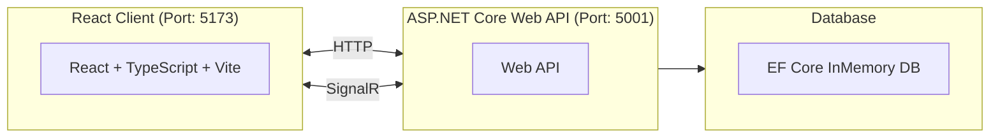
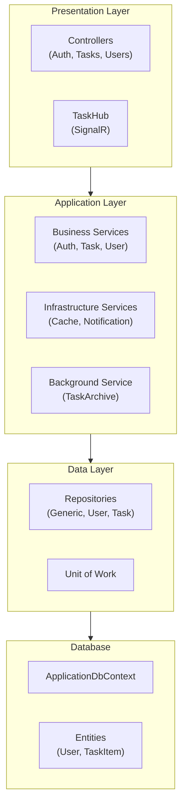
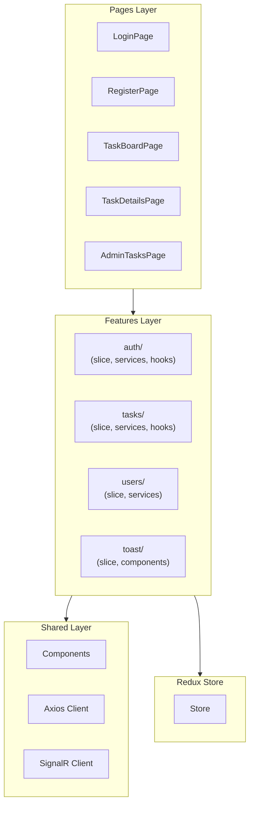

# Task Collaboration System

A full-stack task management application with real-time collaboration features, built as a final project for ASP.NET Enterprise Application course at Conestoga College.

## Table of Contents

- [Author](#author)
- [Project Overview](#project-overview)
- [Architecture](#architecture)
- [Setup Instructions](#setup-instructions)
- [Conclusion](#conclusion)

---

## Author

**Jindo Kim** - Solo Developer ( Student ID: 8888918 )

---

## Project Overview

This application enables teams to manage tasks through an intuitive Kanban board interface with real-time updates. Users can create, assign, and track tasks while receiving instant notifications when changes occur.

### Key Features

- **Authentication**: JWT-based login with Google OAuth 2.0 integration
- **Task Management**: Full CRUD operations with drag-and-drop Kanban board
- **Real-Time Updates**: SignalR-powered instant notifications across all connected clients
- **Background Processing**: Automatic task archiving service
- **Performance**: Server-side caching with cache status indicators
- **Role-Based Access**: Admin and User roles with protected routes

---

## Architecture

### System Design



### Tech Stack

| Layer      | Technology                   |
| ---------- | ---------------------------- |
| Backend    | ASP.NET Core 8.0 Web API     |
| Frontend   | React 18 + TypeScript + Vite |
| Database   | EF Core InMemory Database    |
| Real-time  | SignalR                      |
| Auth       | JWT + Google OAuth 2.0       |
| Caching    | IMemoryCache                 |
| Background | IHostedService               |
| State      | Redux Toolkit                |
| Styling    | Tailwind CSS                 |

### Backend Architecture



**Key Patterns:**
- **Repository Pattern** with Unit of Work for data access abstraction
- **Service Layer** for business logic separation
- **Background Services** (IHostedService) for auto-archiving completed tasks
- **Memory Caching** with automatic invalidation and X-Cache headers

### Frontend Architecture



**Key Patterns:**
- **Feature-based** folder structure (auth, tasks, users, toast)
- **Redux Toolkit** for global state management
- **React Router v6** for navigation with protected routes
- **SignalR Client** for real-time event handling

---

## Setup Instructions

### Prerequisites

- .NET 8.0 SDK
- Node.js 18+

### 1. Clone the Repository

```bash
git clone <repository-url>
cd Task-Collaboration-System-Two-Tier-Architecture
```

### 2. Backend Setup

```bash
cd Backend/TaskCollaborationApp.API

# Run the API
dotnet run --launch-profile https
```

- API: `https://localhost:5001`
- Swagger: `https://localhost:5001/swagger`

### 3. Frontend Setup

```bash
cd Frontend/TaskCollaborationApp.Client

# Install dependencies
npm install

# Run development server
npm run dev
```

Client will be available at: `http://localhost:5173`

### Default Test Users (Seeded)

| Role  | Username    | Email             | Password  |
| ----- | ----------- | ----------------- | --------- |
| Admin | admin       | admin@taskapp.com | Admin123! |
| User  | johndoe     | john@example.com  | User123!  |
| User  | janesmith   | jane@example.com  | User123!  |
| User  | mikejohnson | mike@example.com  | User123!  |
| User  | sarahchen   | sarah@example.com | User123!  |

> **Note**: Uses InMemory Database. All data resets on server restart.

> **Note**: You could login with either user name or email

---

## Conclusion

### Challenges Faced

- **SignalR Connection Scope**: Initially implemented SignalR at page level, causing connection drops on navigation. Solved by moving connection management to App level for persistent WebSocket connection.
- **React Strict Mode & Caching**: Double-rendering in development mode made cache appear broken. Understood that Strict Mode intentionally mounts components twice, causing duplicate API calls.

---
