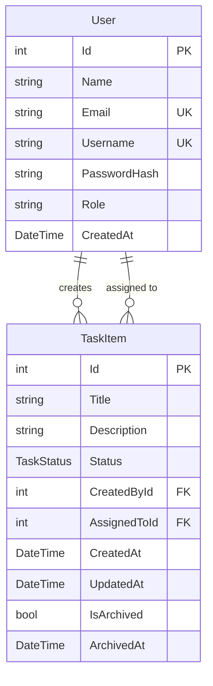
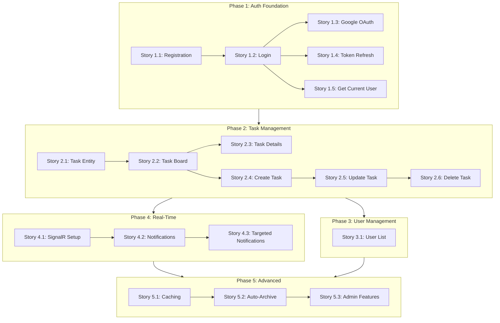

# Development Plan

## Task Collaboration System - Two-Tier Architecture

This document defines the development strategy, implementation order, and rationale for building the Task Collaboration System.

---

## Development Approach: Feature-Based Development

### Why Feature-Based (Not Infrastructure-First)?

| Approach | Description | Problem |
|----------|-------------|---------|
| **Infrastructure-First** | Create all entities, repositories, services first, then features | Hard to know what's actually needed; over-engineering risk |
| **Feature-Based** (My Choice) | Implement complete features end-to-end, adding infrastructure as needed | Each feature reveals exactly what infrastructure it requires |

### Benefits of Feature-Based Development

1. **Clear Infrastructure Needs**: Each feature explicitly declares what infrastructure it needs
2. **Progressive Complexity**: Start simple, add complexity incrementally
3. **Microservices Ready**: Features are naturally isolated, making future decomposition easier
4. **Testable Units**: Each feature can be tested independently
5. **Learning-Friendly**: Easier to understand why each component exists

---

## Entity Dependency Analysis

### Database Schema (from Final Project.pdf)



### Entity Implementation Order

| Order | Entity | Reason |
|-------|--------|--------|
| 1 | **User** | Independent entity - no foreign key dependencies |
| 2 | **TaskItem** | Depends on User (CreatedById FK, AssignedToId FK) |

**Key Insight**: User entity must be created first because TaskItem has foreign key relationships to User. This is a database constraint, not a development preference.

---

## Story Implementation Order

### Phase 1: Authentication Foundation (Auth Domain)

User authentication must be implemented first because:
- All subsequent features require authenticated users
- Task creation requires a `CreatedById` (User ID)
- Task assignment requires `AssignedToId` (User ID)

| Story | Description | Backend Tasks | Frontend Tasks |
|-------|-------------|---------------|----------------|
| 1.1 | User Registration | User Entity, Generic Repository, UserRepository, UnitOfWork, AuthService.Register, AuthController, CORS, DbSeeder | RegisterForm, authSlice, RegisterPage |
| 1.2 | User Login | AuthService.Login, JWT Generation, JWT Middleware | LoginForm, Token Storage |
| 1.3 | Google OAuth | AuthService.GoogleAuth, Google.Apis.Auth | Google OAuth Button |
| 1.4 | Token Refresh | AuthService.RefreshToken | Auto-refresh logic |
| 1.5 | Get Current User | AuthService.GetCurrentUser | /api/auth/me integration |

### Phase 2: Core Task Management (Task Domain)

After authentication is complete, we can implement task management:

| Story | Description | Backend Tasks | Frontend Tasks |
|-------|-------------|---------------|----------------|
| 2.1 | Task Entity & CRUD | TaskItem Entity, Repository, TaskService, TaskController | - |
| 2.2 | Task Board Display | GET /api/tasks with filtering | KanbanBoard, TaskColumn, TaskCard |
| 2.3 | Task Details | GET /api/tasks/{id} | TaskDetailsPage |
| 2.4 | Create Task | POST /api/tasks | CreateTaskPage |
| 2.5 | Update Task | PUT /api/tasks/{id} | EditTaskPage |
| 2.6 | Delete Task | DELETE /api/tasks/{id} | Delete confirmation |
| 2.7 | My Tasks & Assigned | GET /api/tasks/my, /tasks/assigned | Filter tabs |

### Phase 3: User Management (User Domain)

User listing for task assignment dropdown:

| Story | Description | Backend Tasks | Frontend Tasks |
|-------|-------------|---------------|----------------|
| 3.1 | User List | UserService, UsersController | User dropdown component |

### Phase 4: Real-Time Features (SignalR)

SignalR for live updates:

| Story | Description | Backend Tasks | Frontend Tasks |
|-------|-------------|---------------|----------------|
| 4.1 | SignalR Setup | TaskHub, NotificationService | SignalR client connection |
| 4.2 | Task Notifications | Broadcast events on CRUD | Toast notifications |
| 4.3 | Targeted Notifications | User-specific notifications | Filtered event handling |

### Phase 5: Advanced Features

| Story | Description | Backend Tasks | Frontend Tasks |
|-------|-------------|---------------|----------------|
| 5.1 | Caching | CacheService, X-Cache header | Cache indicator badge |
| 5.2 | Background Archiving | TaskArchiveBackgroundService | Archived task styling |
| 5.3 | Admin Features | includeArchived filter | AdminTasksPage |

---

## Infrastructure Build-Up per Story

### Story 1.1: User Registration

**New Infrastructure Required:**

| Category | Component | Why Needed |
|----------|-----------|------------|
| Database | ApplicationDbContext | Store user data |
| ORM | Entity Framework Core | Map User class to database |
| Entity | User.cs | Represent user in code |
| Pattern | IRepository<T>, Repository<T> | Generic data access abstraction |
| Pattern | IUserRepository, UserRepository | User-specific queries |
| Pattern | IUnitOfWork, UnitOfWork | Transaction management |
| Service | IAuthService, AuthService | Business logic for registration |
| Security | BCrypt.Net | Password hashing |
| API | AuthController | HTTP endpoint |
| API Config | CORS Policy | Allow frontend to consume API |
| DTO | RegisterRequestDto, LoginResponseDto | API contracts |
| Seed Data | DbSeeder | Seed 1 Admin + 4 Regular users |

### Story 1.2: User Login

**New Infrastructure Required:**

| Category | Component | Why Needed |
|----------|-----------|------------|
| Security | JWT Bearer Authentication | Token-based auth |
| Config | JwtSettings | Store JWT configuration |
| Service | GenerateJwtToken method | Create JWT tokens |

### Story 2.1: Task Entity & CRUD

**New Infrastructure Required:**

| Category | Component | Why Needed |
|----------|-----------|------------|
| Entity | TaskItem.cs | Represent task in code |
| Enum | TaskStatus.cs | Task status values |
| Pattern | ITaskRepository, TaskRepository | Task-specific queries |
| Service | ITaskService, TaskService | Business logic for tasks |
| API | TasksController | HTTP endpoints |
| DTO | Task DTOs | API contracts |
| **Update** | User.cs Navigation Properties | Link User to TaskItem |

> **Note**: User entity's Navigation Properties (CreatedTasks, AssignedTasks) are added in this story, not in Story 1.1. This is because Navigation Properties require TaskItem to exist.

---

## Navigation Properties Timing

### Why Not Add Navigation Properties to User in Story 1.1?

```
Story 1.1: User Registration
├── User entity created
├── Properties: Id, Name, Email, Username, PasswordHash, Role, CreatedAt
└── Navigation Properties: NOT YET (TaskItem doesn't exist)

Story 2.1: Task Entity & CRUD
├── TaskItem entity created
├── TaskItem has FK: CreatedById → User, AssignedToId → User
└── NOW add to User: CreatedTasks, AssignedTasks (Navigation Properties)
```

**Rationale**:
1. Navigation Properties reference TaskItem type
2. TaskItem doesn't exist until Story 2.1
3. Adding them early would create compile errors
4. This follows natural dependency order

---

## Development Flow Visualization



---

## Microservices Consideration

### Why Feature-Based Development Helps Future Microservices

If this system were to evolve into microservices:

| Feature/Domain | Potential Microservice | Data Owned |
|----------------|----------------------|------------|
| Auth | Auth Service | User credentials, tokens |
| Task | Task Service | Tasks, task status |
| User | User Service | User profiles |
| Notification | Notification Service | Push notifications |

**Feature-based development naturally creates these boundaries** because:
1. Each feature has its own data access layer
2. Features communicate through well-defined interfaces
3. Infrastructure needs are scoped to features
4. Minimal coupling between features

---

## Summary

### Key Principles

1. **User First**: User entity is independent and required for TaskItem FK relationships
2. **Feature-Complete**: Each story delivers a working feature end-to-end
3. **Progressive Infrastructure**: Add infrastructure only when a feature needs it
4. **Navigation Properties Later**: Added when the referenced entity exists
5. **Microservices Mindset**: Features are isolated and could become services

### Implementation Checkpoints

- [ ] Phase 1 Complete: Users can register, login, and stay authenticated
- [ ] Phase 2 Complete: Full task CRUD with Kanban board
- [ ] Phase 3 Complete: Users can assign tasks to others
- [ ] Phase 4 Complete: Real-time updates via SignalR
- [ ] Phase 5 Complete: Caching, archiving, admin features

---

## Related Documentation

- [Layer Architecture](./backend/Layer-Architecture.md) - Backend structure
- [Frontend Architecture](./frontend/Frontend-Architecture.md) - Frontend structure
- [API Contract Documentation](./API-Contract-Documentation.md) - API overview

---

*Document created for Task Collaboration System - Two-Tier Architecture*
*Development Strategy: Feature-Based with Progressive Infrastructure*
