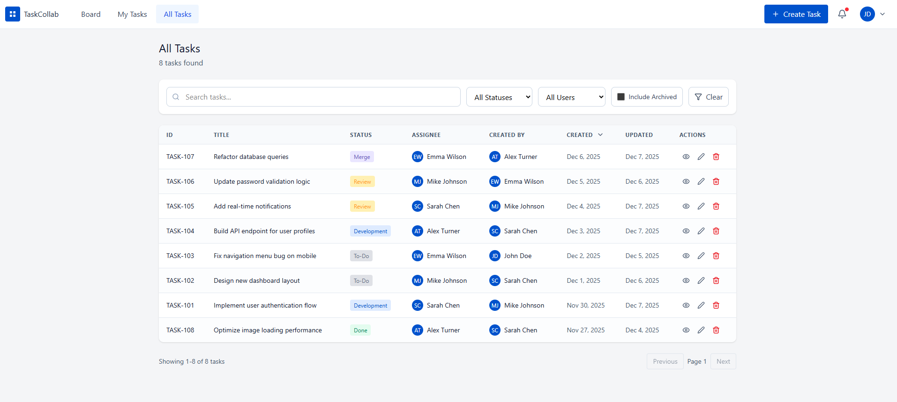

# Admin - All Tasks View - API Contract

[Back to API Documentation](../API-Contract-Documentation.md)

---

## Wireframes



.png)

.png)

.png)

.png)

---

## User Actions

- View all tasks in table format (including archived for Admin)
- Search tasks by title/description
- Filter by Status
- Filter by Assignee
- Toggle "Include Archived" to show/hide archived tasks
- Click Clear to reset filters
- View/Edit/Delete actions on each row
- Navigate pages via pagination

---

## Frontend Needs

| Component | Description |
|-----------|-------------|
| Page Title | "All Tasks" with count badge |
| Search Input | Search by title/description |
| Status Filter | Dropdown: All Statuses, To-Do, Development, Review, Merge, Done |
| Assignee Filter | Dropdown: All Users, individual users |
| Include Archived | Checkbox toggle (Admin only) |
| Clear Button | Reset all filters |
| Data Table | ID, Title, Status, Assignee, Created By, Created, Updated, Actions |
| Status Badges | Color-coded status pills |
| Archived Indicator | Faded row + "Archived" badge |
| Action Icons | View (eye), Edit (pencil), Delete (trash) |
| Pagination | Previous, Page numbers, Next |

---

## Backend Processing

| Validation | Description |
|------------|-------------|
| JWT Token | Validate and extract user |
| Admin Role | Required to access this page |
| Include Archived | Only Admin can set to true |
| Filters | Apply status, assignee, search filters |
| Pagination | Apply page and pageSize |

---

## Project Requirements

> **From Final Project PDF - Section 7: User Interface (4 marks)**
>
> **Admin - All Tasks View (0.5 marks):**
> - Table or list view
> - Show **ALL tasks including archived**
> - **Filters**: Status, Assignee
> - **Search** functionality
> - **Visual indicator for archived tasks** (faded, badge)
> - Sorting options
>
> **From Section 9: Authorization & Business Rules (1.5 marks)**
>
> **Admin Users:**
> - Can edit/delete **any task**
> - Can see **"All Tasks" page** with filters
> - Can assign tasks to anyone
> - Can change any task status
>
> **UI Rules:**
> | Element | User | Admin |
> |---------|------|-------|
> | "All Tasks" menu | Hide | Show |
>
> **From Section 5: Background Services (2 marks)**
>
> **Important Notes:**
> - Tasks are **archived, not deleted**
> - Archived tasks remain in database permanently
> - **Admin users can see archived tasks**
> - Regular users cannot see archived tasks

---

## API Contracts

### API 6.1: Get All Tasks (Admin View with Archived)

```http
GET /api/tasks?page=1&pageSize=20&includeArchived=true
Authorization: Bearer {token}
```

**Query Parameters:**
| Parameter | Type | Default | Description |
|-----------|------|---------|-------------|
| page | number | 1 | Page number |
| pageSize | number | 20 | Items per page |
| status | string | - | Filter by status |
| assignedTo | number | - | Filter by assignee user ID |
| search | string | - | Search in title/description |
| includeArchived | boolean | false | Include archived tasks (Admin only) |

**Response - Success (200):**
```json
{
  "data": [
    {
      "id": 107,
      "title": "Refactor database queries",
      "status": "Merge",
      "createdBy": {
        "id": 5,
        "name": "Alex Turner",
        "initials": "AT"
      },
      "assignedTo": {
        "id": 4,
        "name": "Emma Wilson",
        "initials": "EW"
      },
      "createdAt": "2025-12-06T10:00:00Z",
      "updatedAt": "2025-12-07T14:00:00Z",
      "isArchived": false,
      "archivedAt": null
    },
    {
      "id": 109,
      "title": "Setup CI/CD pipeline",
      "status": "Done",
      "createdBy": {
        "id": 3,
        "name": "Mike Johnson",
        "initials": "MJ"
      },
      "assignedTo": {
        "id": 2,
        "name": "Sarah Chen",
        "initials": "SC"
      },
      "createdAt": "2025-11-24T09:00:00Z",
      "updatedAt": "2025-11-30T16:00:00Z",
      "isArchived": true,
      "archivedAt": "2025-11-30T16:05:00Z"
    },
    {
      "id": 110,
      "title": "Create user onboarding tutorial",
      "status": "Done",
      "createdBy": {
        "id": 1,
        "name": "John Doe",
        "initials": "JD"
      },
      "assignedTo": {
        "id": 3,
        "name": "Mike Johnson",
        "initials": "MJ"
      },
      "createdAt": "2025-11-19T08:00:00Z",
      "updatedAt": "2025-11-29T12:00:00Z",
      "isArchived": true,
      "archivedAt": "2025-11-29T12:05:00Z"
    }
  ],
  "page": 1,
  "pageSize": 20,
  "totalCount": 10,
  "totalPages": 1
}
```

**Response - Error (403):**
```json
{
  "error": "Forbidden",
  "message": "Admin access required to view archived tasks"
}
```

---

### API 6.2: Search Tasks

```http
GET /api/tasks?search=Re&page=1&pageSize=20
Authorization: Bearer {token}
```

**Response - Success (200):**
```json
{
  "data": [
    {
      "id": 107,
      "title": "Refactor database queries",
      "status": "Merge",
      "createdBy": {
        "id": 5,
        "name": "Alex Turner",
        "initials": "AT"
      },
      "assignedTo": {
        "id": 4,
        "name": "Emma Wilson",
        "initials": "EW"
      },
      "createdAt": "2025-12-06T10:00:00Z",
      "updatedAt": "2025-12-07T14:00:00Z",
      "isArchived": false,
      "archivedAt": null
    },
    {
      "id": 105,
      "title": "Add real-time notifications",
      "status": "Review",
      "createdBy": {
        "id": 2,
        "name": "Sarah Chen",
        "initials": "SC"
      },
      "assignedTo": {
        "id": 1,
        "name": "John Doe",
        "initials": "JD"
      },
      "createdAt": "2025-12-04T09:00:00Z",
      "updatedAt": "2025-12-07T11:00:00Z",
      "isArchived": false,
      "archivedAt": null
    }
  ],
  "page": 1,
  "pageSize": 20,
  "totalCount": 2,
  "totalPages": 1
}
```

---

### API 6.3: Filter by Status

```http
GET /api/tasks?status=Done&includeArchived=true&page=1&pageSize=20
Authorization: Bearer {token}
```

**Response - Success (200):**
```json
{
  "data": [
    {
      "id": 109,
      "title": "Setup CI/CD pipeline",
      "status": "Done",
      "isArchived": true,
      "archivedAt": "2025-11-30T16:05:00Z"
    },
    {
      "id": 110,
      "title": "Create user onboarding tutorial",
      "status": "Done",
      "isArchived": true,
      "archivedAt": "2025-11-29T12:05:00Z"
    }
  ],
  "page": 1,
  "pageSize": 20,
  "totalCount": 2,
  "totalPages": 1
}
```

---

### API 6.4: Filter by Assignee

```http
GET /api/tasks?assignedTo=2&page=1&pageSize=20
Authorization: Bearer {token}
```

**Response - Success (200):**
```json
{
  "data": [
    {
      "id": 101,
      "title": "Implement user authentication flow",
      "status": "Development",
      "assignedTo": {
        "id": 2,
        "name": "Sarah Chen",
        "initials": "SC"
      },
      "isArchived": false
    },
    {
      "id": 109,
      "title": "Setup CI/CD pipeline",
      "status": "Done",
      "assignedTo": {
        "id": 2,
        "name": "Sarah Chen",
        "initials": "SC"
      },
      "isArchived": true
    }
  ],
  "page": 1,
  "pageSize": 20,
  "totalCount": 2,
  "totalPages": 1
}
```
