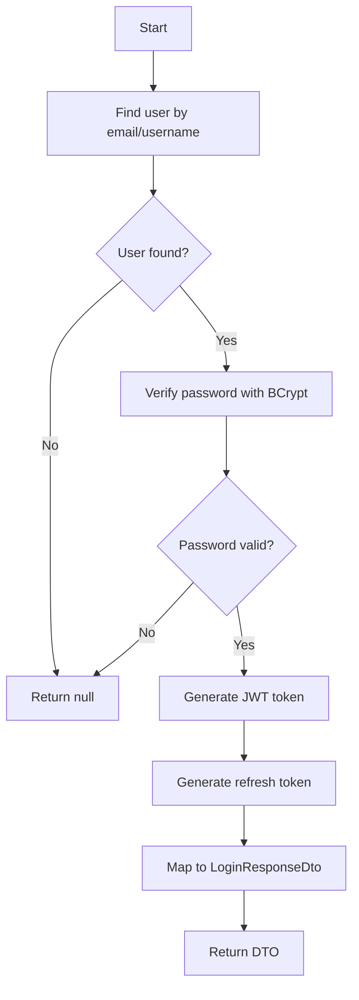
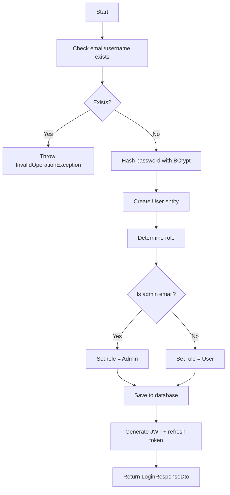
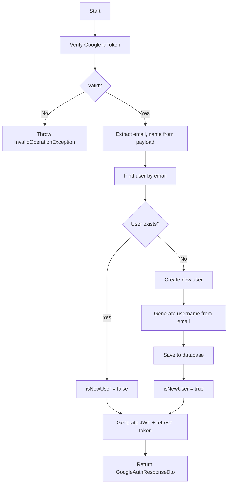
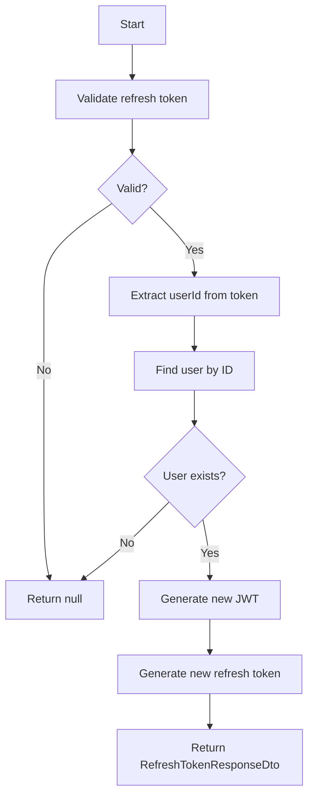
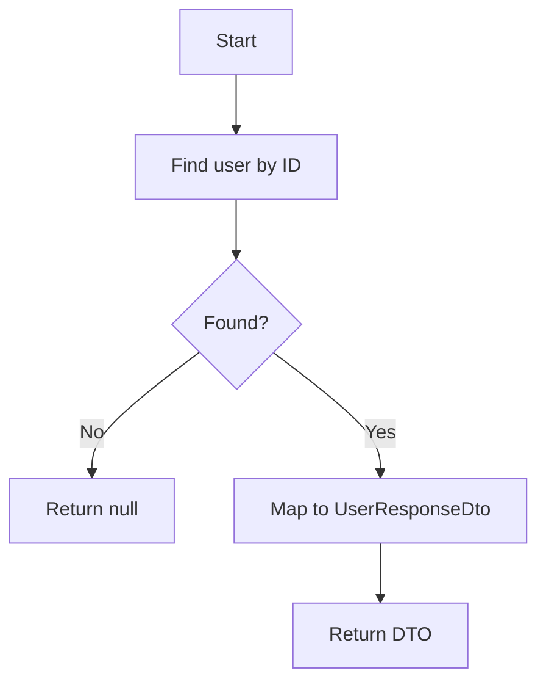

# Auth - Application Layer

## IAuthService

**Interface:** `Services/Interfaces/IAuthService.cs`
**Implementation:** `Services/AuthService.cs`

---

## Methods Overview

| Method | Input | Output | Description |
|--------|-------|--------|-------------|
| `LoginAsync` | usernameOrEmail, password | LoginResponseDto? | Authenticate user |
| `RegisterAsync` | RegisterRequestDto | LoginResponseDto | Create new user |
| `GoogleAuthAsync` | idToken | GoogleAuthResponseDto | Google OAuth login |
| `RefreshTokenAsync` | refreshToken | RefreshTokenResponseDto? | Refresh JWT |
| `GetCurrentUserAsync` | userId | UserResponseDto? | Get user profile |

---

## LoginAsync

### Signature

```csharp
Task<LoginResponseDto?> LoginAsync(string usernameOrEmail, string password);
```

### Input

| Parameter | Type | Description |
|-----------|------|-------------|
| usernameOrEmail | string | User's email or username |
| password | string | Plain text password |

### Output

| Type | Description |
|------|-------------|
| `LoginResponseDto?` | Token + user info, or null if failed |

### Implementation Logic



### Implementation Steps

1. Find user via `IUnitOfWork.Users.FindByEmailOrUsernameAsync()`
2. If not found, return null
3. Verify password using `BCrypt.Net.BCrypt.Verify()`
4. If invalid, return null
5. Generate JWT token with user claims
6. Generate refresh token (random 64 bytes, Base64)
7. Return LoginResponseDto with token, refreshToken, expiresIn (604800), user info

### Dependencies

- `IUnitOfWork.Users.FindByEmailOrUsernameAsync()`
- `BCrypt.Net.BCrypt.Verify()`
- `GenerateJwtToken()` (private method)

---

## RegisterAsync

### Signature

```csharp
Task<LoginResponseDto> RegisterAsync(RegisterRequestDto request);
```

### Input

| Parameter | Type | Description |
|-----------|------|-------------|
| request | RegisterRequestDto | name, email, username, password |

### Output

| Type | Description |
|------|-------------|
| `LoginResponseDto` | Token + user info |

### Exceptions

| Exception | Condition |
|-----------|-----------|
| `InvalidOperationException` | Email or username already exists |

### Implementation Logic



### Implementation Steps

1. Check duplicates via `IUnitOfWork.Users.ExistsAsync(email, username)`
2. If exists, throw `InvalidOperationException`
3. Hash password using `BCrypt.Net.BCrypt.HashPassword()`
4. Determine role: if email == adminEmail from config → "Admin", else "User"
5. Create User entity with Name, Email, Username, PasswordHash, Role, CreatedAt
6. Save via `IUnitOfWork.Users.AddAsync()` + `SaveChangesAsync()`
7. Generate JWT + refresh token
8. Return LoginResponseDto

### Dependencies

- `IUnitOfWork.Users.ExistsAsync()`
- `IUnitOfWork.Users.AddAsync()`
- `BCrypt.Net.BCrypt.HashPassword()`
- `_adminEmail` (from configuration)

---

## GoogleAuthAsync

### Signature

```csharp
Task<GoogleAuthResponseDto> GoogleAuthAsync(string idToken);
```

### Input

| Parameter | Type | Description |
|-----------|------|-------------|
| idToken | string | Google OAuth ID token from frontend |

### Output

| Type | Description |
|------|-------------|
| `GoogleAuthResponseDto` | Token + user info + isNewUser flag |

### Exceptions

| Exception | Condition |
|-----------|-----------|
| `InvalidOperationException` | Google token verification failed |

### Implementation Logic



### Implementation Steps

1. Verify Google token via `GoogleJsonWebSignature.ValidateAsync(idToken)`
2. If invalid, throw `InvalidOperationException`
3. Extract email, name from payload
4. Find user by email via `IUnitOfWork.Users.FindByEmailAsync()`
5. If not found:
   - Create new User with email, name, generated username
   - Set PasswordHash = "" (OAuth users have no password)
   - Determine role based on adminEmail config
   - Save to database
   - isNewUser = true
6. Generate JWT + refresh token
7. Return GoogleAuthResponseDto with isNewUser flag

### Dependencies

- `Google.Apis.Auth.GoogleJsonWebSignature.ValidateAsync()`
- `IUnitOfWork.Users.FindByEmailAsync()`
- `IUnitOfWork.Users.AddAsync()`

---

## RefreshTokenAsync

### Signature

```csharp
Task<RefreshTokenResponseDto?> RefreshTokenAsync(string refreshToken);
```

### Input

| Parameter | Type | Description |
|-----------|------|-------------|
| refreshToken | string | Valid refresh token |

### Output

| Type | Description |
|------|-------------|
| `RefreshTokenResponseDto?` | New token pair, or null if invalid |

### Implementation Logic



### Implementation Steps

1. Validate refresh token (implementation-specific)
2. If invalid, return null
3. Extract userId from token
4. Find user via `IUnitOfWork.Users.GetByIdAsync(userId)`
5. If not found, return null
6. Generate new JWT + refresh token
7. Return RefreshTokenResponseDto

---

## GetCurrentUserAsync

### Signature

```csharp
Task<UserResponseDto?> GetCurrentUserAsync(int userId);
```

### Input

| Parameter | Type | Description |
|-----------|------|-------------|
| userId | int | User ID from JWT claims |

### Output

| Type | Description |
|------|-------------|
| `UserResponseDto?` | User profile, or null if not found |

### Implementation Logic



### Implementation Steps

1. Find user via `IUnitOfWork.Users.GetByIdAsync(userId)`
2. If not found, return null
3. Map to UserResponseDto (Id, Name, Email, Username, Role, CreatedAt)
4. Return DTO

---

## Private Helper Methods

### GenerateJwtToken

```csharp
private string GenerateJwtToken(User user);
```

**Implementation Logic:**
1. Create claims: NameIdentifier (Id), Email, Name, Role
2. Create SymmetricSecurityKey from JWT secret
3. Create SigningCredentials with HmacSha256
4. Create JwtSecurityToken with issuer, audience, claims, expiry (7 days)
5. Return token string via JwtSecurityTokenHandler

### GenerateRefreshToken

```csharp
private string GenerateRefreshToken();
```

**Implementation Logic:**
1. Create 64-byte random array
2. Fill with cryptographically secure random bytes (RandomNumberGenerator)
3. Convert to Base64 string
4. Return token string

---

## Service Dependencies

| Dependency | Description |
|------------|-------------|
| `IUnitOfWork` | Data access via repositories |
| `IOptions<JwtSettings>` | JWT configuration |
| `IConfiguration` | Admin email configuration |

---

## Configuration

**appsettings.json:**
```json
{
  "JwtSettings": {
    "SecretKey": "your-256-bit-secret-key-here",
    "Issuer": "TaskCollaborationApp",
    "Audience": "TaskCollaborationApp",
    "ExpiryDays": 7
  },
  "AdminEmail": "admin@example.com"
}
```

---

## Related Documentation

- [Auth Presentation Layer](./Presentation.md)
- [Auth Data Layer](./Data.md)
- [Layer Architecture](../Layer-Architecture.md)
