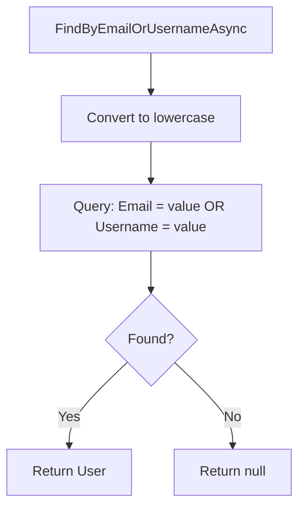
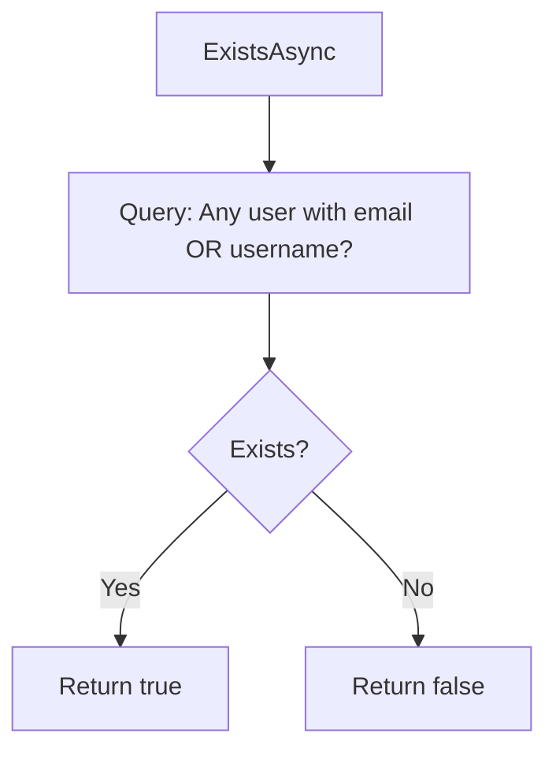
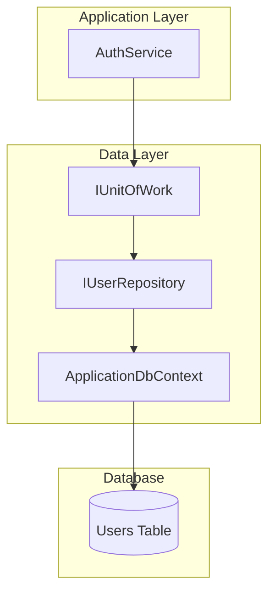

# Auth - Data Layer

## IUserRepository

**Interface:** `Repositories/Interfaces/IUserRepository.cs`
**Implementation:** `Repositories/UserRepository.cs`

---

## Entity

### User

**File:** `Data/Entities/User.cs`

| Property | Type | Description |
|----------|------|-------------|
| Id | int | Primary Key |
| Name | string | User's full name |
| Email | string | Unique email address |
| Username | string | Unique username |
| PasswordHash | string | BCrypt hashed password |
| Role | string | "Admin" or "User" |
| CreatedAt | DateTime | Account creation timestamp |
| CreatedTasks | ICollection<TaskItem> | Navigation: tasks created by user |
| AssignedTasks | ICollection<TaskItem> | Navigation: tasks assigned to user |

### Database Schema

| Column | Type | Constraints |
|--------|------|-------------|
| Id | int | Primary Key, Auto Increment |
| Name | nvarchar(100) | Required |
| Email | nvarchar(255) | Unique, Required |
| Username | nvarchar(50) | Unique, Required |
| PasswordHash | nvarchar(255) | Required |
| Role | nvarchar(20) | Required |
| CreatedAt | datetime | Required |

---

## Methods Overview

| Method | Input | Output | Description |
|--------|-------|--------|-------------|
| `GetByIdAsync` | id | User? | Get user by ID |
| `FindByEmailAsync` | email | User? | Find by email |
| `FindByUsernameAsync` | username | User? | Find by username |
| `FindByEmailOrUsernameAsync` | value | User? | Find by email or username |
| `ExistsAsync` | email, username | bool | Check if exists |
| `AddAsync` | user | void | Add new user |

---

## FindByEmailAsync

### Signature

```csharp
Task<User?> FindByEmailAsync(string email);
```

### Input

| Parameter | Type | Description |
|-----------|------|-------------|
| email | string | Email address to search |

### Output

| Type | Description |
|------|-------------|
| `User?` | User entity or null if not found |

### Implementation Logic

1. Convert email to lowercase for case-insensitive comparison
2. Query Users table where Email (lowercase) matches
3. Return first match or null

### Query Generated

```sql
SELECT TOP(1) *
FROM Users
WHERE LOWER(Email) = LOWER(@email)
```

---

## FindByUsernameAsync

### Signature

```csharp
Task<User?> FindByUsernameAsync(string username);
```

### Input

| Parameter | Type | Description |
|-----------|------|-------------|
| username | string | Username to search |

### Output

| Type | Description |
|------|-------------|
| `User?` | User entity or null if not found |

### Implementation Logic

1. Convert username to lowercase for case-insensitive comparison
2. Query Users table where Username (lowercase) matches
3. Return first match or null

---

## FindByEmailOrUsernameAsync

### Signature

```csharp
Task<User?> FindByEmailOrUsernameAsync(string emailOrUsername);
```

### Input

| Parameter | Type | Description |
|-----------|------|-------------|
| emailOrUsername | string | Email or username to search |

### Output

| Type | Description |
|------|-------------|
| `User?` | User entity or null if not found |

### Implementation Logic



1. Convert input to lowercase
2. Query Users where Email OR Username matches (case-insensitive)
3. Return first match or null

### Query Generated

```sql
SELECT TOP(1) *
FROM Users
WHERE LOWER(Email) = @value OR LOWER(Username) = @value
```

---

## ExistsAsync

### Signature

```csharp
Task<bool> ExistsAsync(string email, string username);
```

### Input

| Parameter | Type | Description |
|-----------|------|-------------|
| email | string | Email to check |
| username | string | Username to check |

### Output

| Type | Description |
|------|-------------|
| `bool` | True if email OR username already exists |

### Implementation Logic



1. Use AnyAsync to check existence
2. Match email OR username (case-insensitive)
3. Return boolean result

### Query Generated

```sql
SELECT CASE WHEN EXISTS (
    SELECT 1 FROM Users
    WHERE LOWER(Email) = @email OR LOWER(Username) = @username
) THEN 1 ELSE 0 END
```

---

## GetByIdAsync

### Signature

```csharp
Task<User?> GetByIdAsync(int id);
```

### Input

| Parameter | Type | Description |
|-----------|------|-------------|
| id | int | User ID |

### Output

| Type | Description |
|------|-------------|
| `User?` | User entity or null |

### Implementation Logic

1. Use FindAsync for primary key lookup
2. Return user or null

---

## AddAsync

### Signature

```csharp
Task AddAsync(User user);
```

### Input

| Parameter | Type | Description |
|-----------|------|-------------|
| user | User | User entity to add |

### Implementation Logic

1. Add user entity to DbContext
2. Entity is tracked but not persisted until SaveChangesAsync

> **Note:** `SaveChangesAsync()` must be called via `IUnitOfWork` to persist.

---

## EF Core Configuration

### Entity Configuration

| Property | Configuration |
|----------|---------------|
| Id | Primary Key |
| Name | Required, MaxLength(100) |
| Email | Required, MaxLength(255), Unique Index |
| Username | Required, MaxLength(50), Unique Index |
| PasswordHash | Required, MaxLength(255) |
| Role | Required, MaxLength(20) |

---

## Seed Data

### DbSeeder

**File:** `Data/DbSeeder.cs`

**Logic:**
1. Check if Users table has any data
2. If empty, seed sample users
3. Hash passwords using BCrypt

### Seeded Users

| Name | Email | Username | Role | Password |
|------|-------|----------|------|----------|
| Admin User | (configurable) | admin | Admin | Admin123! |
| John Doe | john@example.com | johndoe | User | User123! |
| Jane Smith | jane@example.com | janesmith | User | User123! |
| Mike Johnson | mike@example.com | mikejohnson | User | User123! |
| Sarah Chen | sarah@example.com | sarahchen | User | User123! |

---

## Data Flow Diagram



---

## Related Documentation

- [Auth Presentation Layer](./Presentation.md)
- [Auth Application Layer](./Application.md)
- [Layer Architecture](../Layer-Architecture.md)
