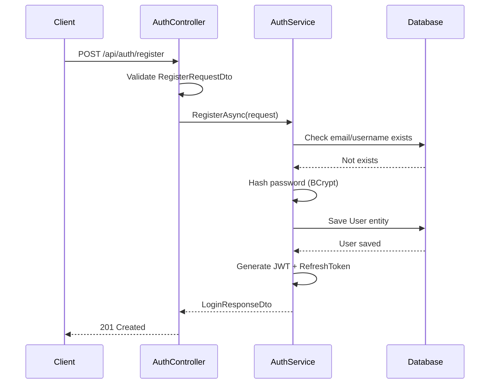
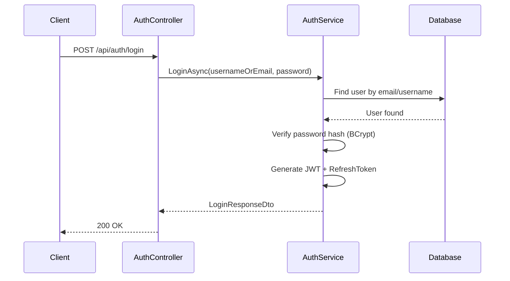
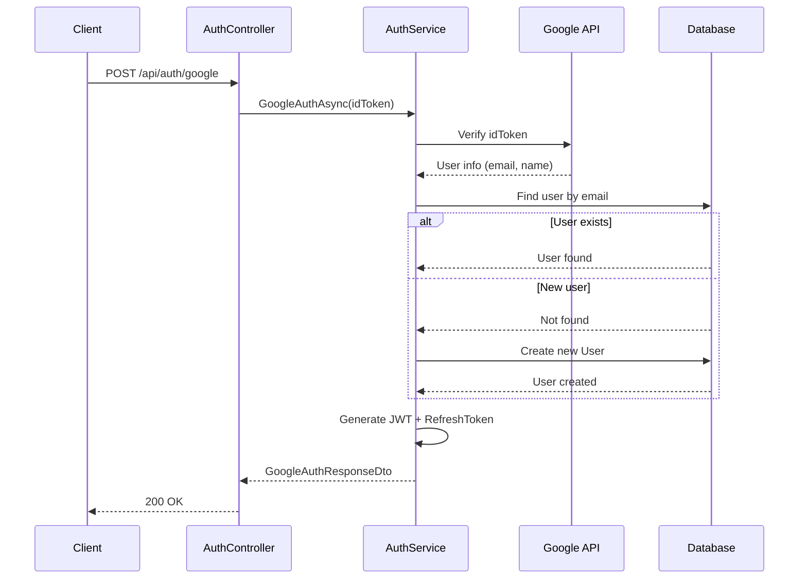
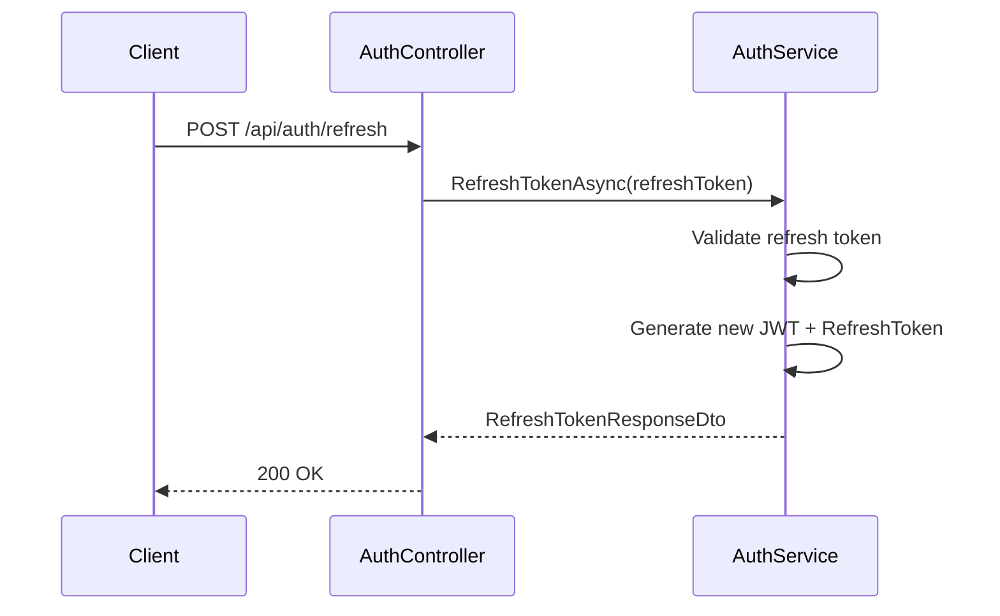
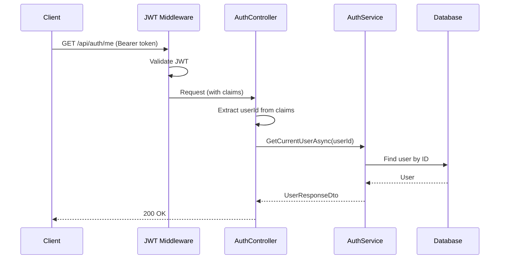

# Auth - Presentation Layer

## AuthController

**File:** `Controllers/AuthController.cs`
**Route:** `/api/auth`

---

## Endpoints Overview

| Method | Endpoint | Description | Auth Required |
|--------|----------|-------------|---------------|
| POST | `/api/auth/register` | User registration | No |
| POST | `/api/auth/login` | Login with username/password | No |
| POST | `/api/auth/google` | Google OAuth callback | No |
| POST | `/api/auth/refresh` | Refresh JWT token | No |
| GET | `/api/auth/me` | Get current user info | Yes |

---

## POST `/api/auth/register`

### Description
Register a new user account with username/password credentials.

### Request

**Headers:**
```
Content-Type: application/json
```

**Body:** `RegisterRequestDto`
```json
{
  "name": "John Doe",
  "email": "john.doe@example.com",
  "username": "johndoe",
  "password": "SecurePass123!"
}
```

**Validation Rules:**
| Field | Rules |
|-------|-------|
| name | Required, MaxLength(100) |
| email | Required, EmailAddress, Unique |
| username | Required, MinLength(3), MaxLength(50), Unique |
| password | Required, MinLength(8), uppercase + lowercase + number |

### Response

**Success (201 Created):**
```json
{
  "token": "eyJhbGciOiJIUzI1NiIsInR5cCI6IkpXVCJ9...",
  "refreshToken": "dGhpcyBpcyBhIHJlZnJlc2ggdG9rZW4...",
  "expiresIn": 604800,
  "user": {
    "id": 1,
    "name": "John Doe",
    "email": "john.doe@example.com",
    "username": "johndoe",
    "role": "User"
  }
}
```

**Error (400 Bad Request) - Validation:**
```json
{
  "error": "Validation failed",
  "message": "One or more validation errors occurred",
  "details": {
    "email": ["Email is already registered"],
    "password": ["Password must contain at least one uppercase letter"]
  }
}
```

**Error (400 Bad Request) - Duplicate:**
```json
{
  "error": "Registration failed",
  "message": "Email or username already exists"
}
```

### Controller Implementation

```csharp
[HttpPost("register")]
[ProducesResponseType(typeof(LoginResponseDto), StatusCodes.Status201Created)]
[ProducesResponseType(typeof(ErrorResponseDto), StatusCodes.Status400BadRequest)]
public async Task<IActionResult> Register([FromBody] RegisterRequestDto request)
{
    // 1. Model validation (automatic via [ApiController])
    // 2. Call AuthService.RegisterAsync(request)
    // 3. Return Created with LoginResponseDto
    // 4. On error, return BadRequest with error details
}
```

### Flow Diagram



---

## POST `/api/auth/login`

### Description
Authenticate user with username/email and password, returns JWT token.

### Request

**Headers:**
```
Content-Type: application/json
```

**Body:** `LoginRequestDto`
```json
{
  "usernameOrEmail": "john.doe@example.com",
  "password": "SecurePass123!"
}
```

**Validation Rules:**
| Field | Rules |
|-------|-------|
| usernameOrEmail | Required |
| password | Required |

### Response

**Success (200 OK):**
```json
{
  "token": "eyJhbGciOiJIUzI1NiIsInR5cCI6IkpXVCJ9...",
  "refreshToken": "dGhpcyBpcyBhIHJlZnJlc2ggdG9rZW4...",
  "expiresIn": 604800,
  "user": {
    "id": 1,
    "name": "John Doe",
    "email": "john.doe@example.com",
    "username": "johndoe",
    "role": "User"
  }
}
```

**Error (400 Bad Request):**
```json
{
  "error": "Invalid credentials",
  "message": "Username or password is incorrect"
}
```

**Error (401 Unauthorized):**
```json
{
  "error": "Unauthorized",
  "message": "Account is locked or disabled"
}
```

### Controller Implementation

```csharp
[HttpPost("login")]
[ProducesResponseType(typeof(LoginResponseDto), StatusCodes.Status200OK)]
[ProducesResponseType(typeof(ErrorResponseDto), StatusCodes.Status400BadRequest)]
[ProducesResponseType(typeof(ErrorResponseDto), StatusCodes.Status401Unauthorized)]
public async Task<IActionResult> Login([FromBody] LoginRequestDto request)
{
    // 1. Call AuthService.LoginAsync(usernameOrEmail, password)
    // 2. If null, return BadRequest (invalid credentials)
    // 3. Return Ok with LoginResponseDto
}
```

### Flow Diagram



---

## POST `/api/auth/google`

### Description
Authenticate user via Google OAuth. Creates new user if first-time login.

### Request

**Headers:**
```
Content-Type: application/json
```

**Body:** `GoogleAuthRequestDto`
```json
{
  "idToken": "google-oauth-id-token-from-frontend"
}
```

### Response

**Success (200 OK):**
```json
{
  "token": "eyJhbGciOiJIUzI1NiIsInR5cCI6IkpXVCJ9...",
  "refreshToken": "dGhpcyBpcyBhIHJlZnJlc2ggdG9rZW4...",
  "expiresIn": 604800,
  "user": {
    "id": 2,
    "name": "Jane Smith",
    "email": "jane.smith@gmail.com",
    "username": "janesmith",
    "role": "User"
  },
  "isNewUser": true
}
```

**Error (400 Bad Request):**
```json
{
  "error": "Invalid token",
  "message": "Google authentication failed"
}
```

### Controller Implementation

```csharp
[HttpPost("google")]
[ProducesResponseType(typeof(GoogleAuthResponseDto), StatusCodes.Status200OK)]
[ProducesResponseType(typeof(ErrorResponseDto), StatusCodes.Status400BadRequest)]
public async Task<IActionResult> GoogleAuth([FromBody] GoogleAuthRequestDto request)
{
    // 1. Call AuthService.GoogleAuthAsync(idToken)
    // 2. If fails, return BadRequest
    // 3. Return Ok with GoogleAuthResponseDto (includes isNewUser flag)
}
```

### Flow Diagram



---

## POST `/api/auth/refresh`

### Description
Generate new JWT token using refresh token.

### Request

**Headers:**
```
Content-Type: application/json
```

**Body:** `RefreshTokenRequestDto`
```json
{
  "refreshToken": "dGhpcyBpcyBhIHJlZnJlc2ggdG9rZW4..."
}
```

### Response

**Success (200 OK):**
```json
{
  "token": "new-jwt-token...",
  "refreshToken": "new-refresh-token...",
  "expiresIn": 604800
}
```

**Error (401 Unauthorized):**
```json
{
  "error": "Unauthorized",
  "message": "Invalid or expired refresh token"
}
```

### Controller Implementation

```csharp
[HttpPost("refresh")]
[ProducesResponseType(typeof(RefreshTokenResponseDto), StatusCodes.Status200OK)]
[ProducesResponseType(typeof(ErrorResponseDto), StatusCodes.Status401Unauthorized)]
public async Task<IActionResult> RefreshToken([FromBody] RefreshTokenRequestDto request)
{
    // 1. Call AuthService.RefreshTokenAsync(refreshToken)
    // 2. If null, return Unauthorized
    // 3. Return Ok with new token pair
}
```

### Flow Diagram



---

## GET `/api/auth/me`

### Description
Get current authenticated user's profile information.

### Request

**Headers:**
```
Authorization: Bearer {token}
```

### Response

**Success (200 OK):**
```json
{
  "id": 1,
  "name": "John Doe",
  "email": "john.doe@example.com",
  "username": "johndoe",
  "role": "Admin",
  "createdAt": "2025-11-01T08:00:00Z"
}
```

**Error (401 Unauthorized):**
```json
{
  "error": "Unauthorized",
  "message": "Invalid or expired token"
}
```

### Controller Implementation

```csharp
[HttpGet("me")]
[Authorize]
[ProducesResponseType(typeof(UserResponseDto), StatusCodes.Status200OK)]
[ProducesResponseType(typeof(ErrorResponseDto), StatusCodes.Status401Unauthorized)]
public async Task<IActionResult> GetCurrentUser()
{
    // 1. Extract userId from JWT claims
    // 2. Call AuthService.GetCurrentUserAsync(userId)
    // 3. Return Ok with UserResponseDto
}
```

### Flow Diagram



---

## DTOs

### Request DTOs

**Location:** `Controllers/DTOs/Auth/`

| DTO | Fields |
|-----|--------|
| `RegisterRequestDto` | name, email, username, password |
| `LoginRequestDto` | usernameOrEmail, password |
| `GoogleAuthRequestDto` | idToken |
| `RefreshTokenRequestDto` | refreshToken |

### Response DTOs

| DTO | Fields |
|-----|--------|
| `LoginResponseDto` | token, refreshToken, expiresIn, user |
| `GoogleAuthResponseDto` | token, refreshToken, expiresIn, user, isNewUser |
| `RefreshTokenResponseDto` | token, refreshToken, expiresIn |

---

## Dependencies

```csharp
public class AuthController : ControllerBase
{
    private readonly IAuthService _authService;

    public AuthController(IAuthService authService)
    {
        _authService = authService;
    }
}
```

---

## Related Documentation

- [Auth Application Layer](./Application.md)
- [Auth Data Layer](./Data.md)
- [Layer Architecture](../Layer-Architecture.md)
