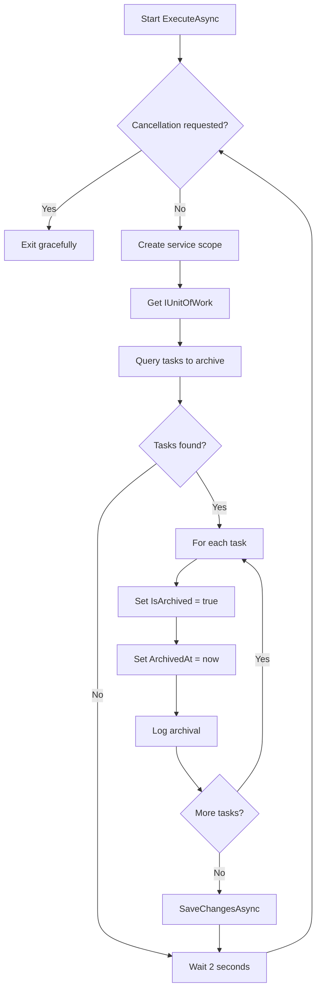

# Task - Application Layer (Background Service)

## TaskArchiveBackgroundService

**File:** `BackgroundServices/TaskArchiveBackgroundService.cs`
**Base Class:** `BackgroundService` (IHostedService)

---

## Service Overview

Background service that automatically archives completed tasks after a delay.

| Property | Value |
|----------|-------|
| Execution Interval | Every 2 seconds |
| Archive Delay | 5 seconds after Done |
| Action | Set IsArchived = true |

---

## Archive Conditions

Tasks are archived when ALL conditions are met:

| Condition | Value |
|-----------|-------|
| Status | `Done` |
| IsArchived | `false` |
| UpdatedAt | More than 5 seconds ago |

---

## ExecuteAsync

### Signature

```csharp
protected override Task ExecuteAsync(CancellationToken stoppingToken);
```

### Input

| Parameter | Type | Description |
|-----------|------|-------------|
| stoppingToken | CancellationToken | Token for graceful shutdown |

### Implementation Logic

1. Enter while loop: `while (!stoppingToken.IsCancellationRequested)`
2. Create new scope via `IServiceScopeFactory`
3. Get `IUnitOfWork` from scoped services
4. Call `GetTasksToArchiveAsync()` to find eligible tasks
5. For each task:
   - Set `IsArchived = true`
   - Set `ArchivedAt = DateTime.UtcNow`
   - Log archival operation
6. Call `SaveChangesAsync()`
7. Wait 2 seconds: `await Task.Delay(2000, stoppingToken)`
8. Repeat

### Important Notes

- Use `IServiceScopeFactory` because BackgroundService is singleton
- Must create new scope for each iteration to get fresh DbContext
- Use `CancellationToken` for all async operations
- Do NOT delete tasks, only archive them

---

## Archive Logic Flow



---

## Repository Method Used

### GetTasksToArchiveAsync

```csharp
Task<IEnumerable<TaskItem>> GetTasksToArchiveAsync();
```

**Query Logic:**
- Filter by `Status == TaskStatus.Done`
- Filter by `IsArchived == false`
- Filter by `UpdatedAt < DateTime.UtcNow.AddSeconds(-5)`
- Return matching tasks

---

## Logging Requirements

| Event | Log Level | Message |
|-------|-----------|---------|
| Service started | Information | "TaskArchiveBackgroundService started" |
| Task archived | Information | "Archived task {Id}: {Title}" |
| Batch completed | Debug | "Archived {count} tasks" |
| Error occurred | Error | "Error archiving tasks: {message}" |
| Service stopped | Information | "TaskArchiveBackgroundService stopped" |

---

## Service Dependencies

| Dependency | Description |
|------------|-------------|
| `IServiceScopeFactory` | Create scoped services in singleton |
| `ILogger<TaskArchiveBackgroundService>` | Logging |

---

## Graceful Shutdown

When application shuts down:

1. `CancellationToken` is triggered
2. Current `Task.Delay` is cancelled
3. Loop exits naturally
4. Any in-progress database operation completes
5. Service disposes cleanly

---

## Visibility Rules

| User Role | Can See Archived Tasks? |
|-----------|------------------------|
| Admin | Yes (with `includeArchived=true`) |
| Regular User | No |

---

## Timeline Example

```
T+0s:  User marks task as "Done"
       → Task.Status = Done
       → Task.UpdatedAt = T+0s

T+2s:  Background service runs
       → Checks: UpdatedAt (T+0s) < Now-5s (T-3s)? NO
       → Task NOT archived

T+4s:  Background service runs
       → Checks: UpdatedAt (T+0s) < Now-5s (T-1s)? NO
       → Task NOT archived

T+6s:  Background service runs
       → Checks: UpdatedAt (T+0s) < Now-5s (T+1s)? YES
       → Task IS archived
       → IsArchived = true
       → ArchivedAt = T+6s
```

---

## Configuration

**appsettings.json:**
```json
{
  "BackgroundService": {
    "ArchiveIntervalSeconds": 2,
    "ArchiveDelaySeconds": 5
  }
}
```

**DI Registration:**
```csharp
builder.Services.AddHostedService<TaskArchiveBackgroundService>();
```

---

## Error Handling

- Wrap main logic in try-catch
- Log errors but don't crash the service
- Continue running after errors
- Use cancellation token to check for shutdown

---

## Related Documentation

- [Task Data Layer](./Data.md) - GetTasksToArchiveAsync method
- [Task Application Layer](./Application.md)
- [Layer Architecture](../Layer-Architecture.md)
