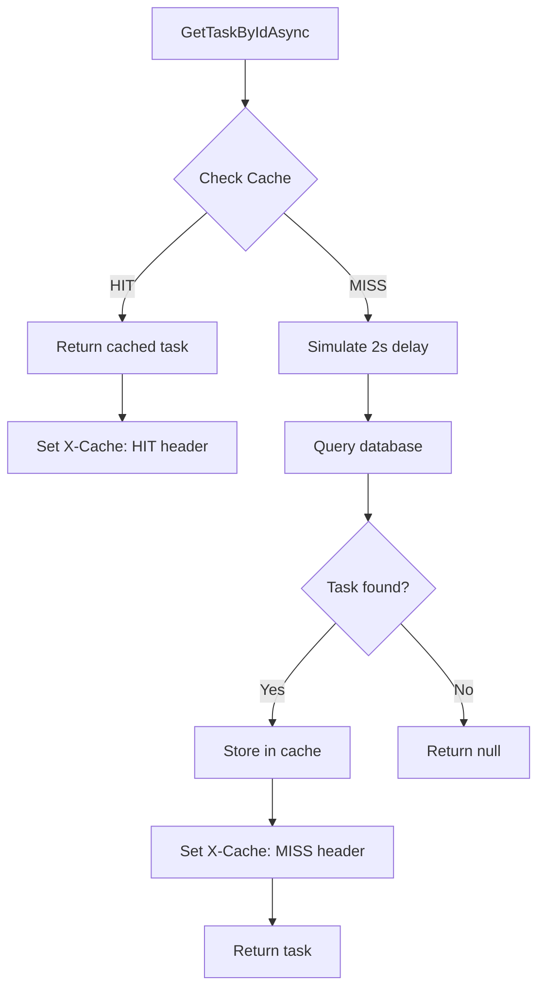
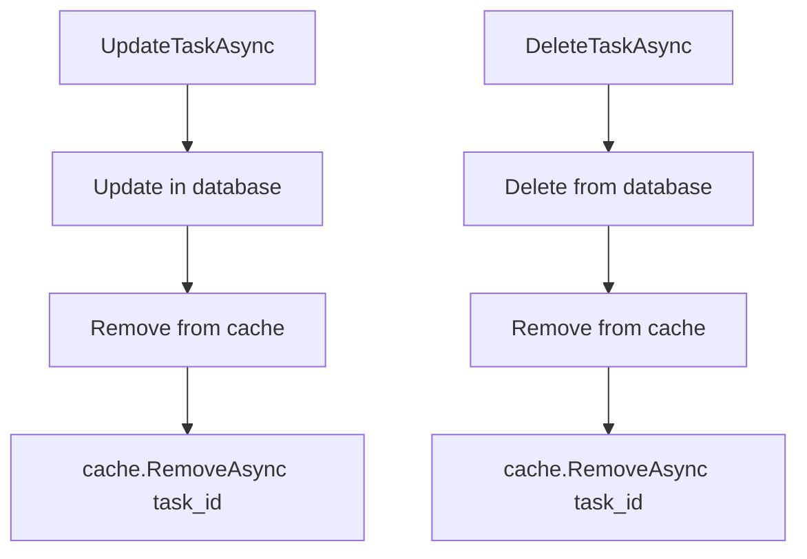

# Task - Application Layer (Cache)

## ICacheService

**Interface:** `Services/Interfaces/ICacheService.cs`
**Implementation:** `Services/CacheService.cs`

---

## Service Overview

Caching abstraction using IMemoryCache for Task performance optimization.

| Method | Description |
|--------|-------------|
| `GetAsync<T>` | Get cached item by key |
| `SetAsync<T>` | Set cached item with TTL |
| `RemoveAsync` | Remove cached item |

---

## Caching Rules

| Rule | Value |
|------|-------|
| Cache Key Format | `task_{id}` |
| TTL | 5 minutes (configurable) |
| Invalidate On | PUT, DELETE operations |
| Response Header | `X-Cache: HIT` or `X-Cache: MISS` |
| Database Delay | 2 seconds (for demo) |

---

## GetAsync

### Signature

```csharp
T? GetAsync<T>(string key);
```

### Input

| Parameter | Type | Description |
|-----------|------|-------------|
| key | string | Cache key (e.g., "task_5") |

### Output

| Type | Description |
|------|-------------|
| `T?` | Cached value or null if not found |

### Implementation Logic

1. Call `IMemoryCache.TryGetValue(key, out value)`
2. If found, return cached value
3. If not found, return null (or default)

---

## SetAsync

### Signature

```csharp
void SetAsync<T>(string key, T value, TimeSpan? ttl = null);
```

### Input

| Parameter | Type | Description |
|-----------|------|-------------|
| key | string | Cache key |
| value | T | Value to cache |
| ttl | TimeSpan? | Time to live (default: 5 min) |

### Implementation Logic

1. Create `MemoryCacheEntryOptions` with absolute expiration
2. If ttl is null, use default 5 minutes from configuration
3. Call `IMemoryCache.Set(key, value, options)`

---

## RemoveAsync

### Signature

```csharp
void RemoveAsync(string key);
```

### Input

| Parameter | Type | Description |
|-----------|------|-------------|
| key | string | Cache key to remove |

### Implementation Logic

1. Call `IMemoryCache.Remove(key)`
2. Used for cache invalidation on updates/deletes

---

## Usage in TaskService

### GetTaskByIdAsync (with caching)



### Cache Invalidation Flow



---

## Performance Demonstration

**First Request (Cache MISS):**
```
GET /api/tasks/5
Response Time: ~2050ms (2s delay + query)
Header: X-Cache: MISS
```

**Second Request (Cache HIT):**
```
GET /api/tasks/5
Response Time: ~5ms (from memory)
Header: X-Cache: HIT
```

**After Update (Cache Invalidated):**
```
PUT /api/tasks/5
→ Cache invalidated

GET /api/tasks/5
Response Time: ~2040ms (cache miss again)
Header: X-Cache: MISS
```

---

## Service Dependencies

| Dependency | Description |
|------------|-------------|
| `IMemoryCache` | .NET built-in memory cache |
| `IConfiguration` | For TTL configuration |

---

## Configuration

**appsettings.json:**
```json
{
  "CacheSettings": {
    "TaskCacheTTLMinutes": 5,
    "SimulatedDelaySeconds": 2
  }
}
```

**DI Registration:**
```csharp
builder.Services.AddMemoryCache();
builder.Services.AddSingleton<ICacheService, CacheService>();
```

---

## Related Documentation

- [Task Application Layer](./Application.md)
- [Task Presentation Layer](./Presentation.md)
- [Layer Architecture](../Layer-Architecture.md)
