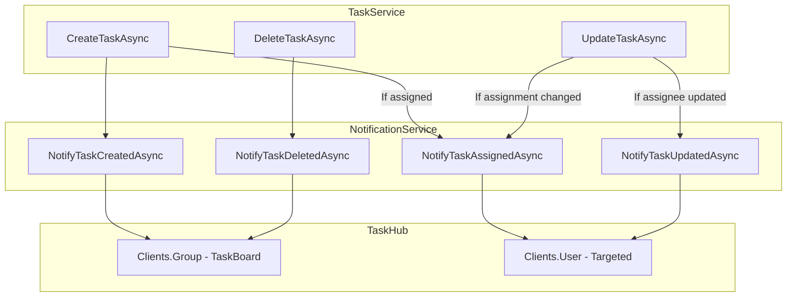

# Task - Application Layer (SignalR)

## INotificationService

**Interface:** `Services/Interfaces/INotificationService.cs`
**Implementation:** `Services/NotificationService.cs`

---

## Service Overview

SignalR wrapper service for sending task notifications through TaskHub.

| Method | Recipients | Description |
|--------|------------|-------------|
| `NotifyTaskCreatedAsync` | All users | Broadcast task creation |
| `NotifyTaskAssignedAsync` | Assigned user | Notify assignment |
| `NotifyTaskUpdatedAsync` | Task creator | Notify status change |
| `NotifyTaskDeletedAsync` | All users | Broadcast deletion |

---

## NotifyTaskCreatedAsync

### Signature

```csharp
Task NotifyTaskCreatedAsync(TaskItem task);
```

### Input

| Parameter | Type | Description |
|-----------|------|-------------|
| task | TaskItem | Newly created task |

### Implementation Logic

1. Build payload with task info (id, title, status)
2. Build message: `"Task created: {title}"`
3. Send to all users in "TaskBoard" group via `Clients.Group("TaskBoard").SendAsync("TaskCreated", payload)`

### Recipients

All connected users in "TaskBoard" group

---

## NotifyTaskAssignedAsync

### Signature

```csharp
Task NotifyTaskAssignedAsync(TaskItem task);
```

### Input

| Parameter | Type | Description |
|-----------|------|-------------|
| task | TaskItem | Task with AssignedToId set |

### Implementation Logic

1. Check if `task.AssignedToId` is not null
2. Build payload with task info and assignee details
3. Build message: `"You have been assigned to: {title}"`
4. Send to assigned user only via `Clients.User(assigneeId).SendAsync("TaskAssigned", payload)`

### Recipients

Only the assigned user (targeted notification)

---

## NotifyTaskUpdatedAsync

### Signature

```csharp
Task NotifyTaskUpdatedAsync(TaskItem task, string previousStatus);
```

### Input

| Parameter | Type | Description |
|-----------|------|-------------|
| task | TaskItem | Updated task |
| previousStatus | string | Status before update |

### Implementation Logic

1. Build payload with task info, new status, and previous status
2. Build message: `"Task '{title}' status updated to: {status}"`
3. Send to task creator only via `Clients.User(creatorId).SendAsync("TaskUpdated", payload)`

### Recipients

Only the task creator (when assignee updates status)

### When to Call

- Called only when **assignee** updates task status
- NOT called when **creator** updates their own task

---

## NotifyTaskDeletedAsync

### Signature

```csharp
Task NotifyTaskDeletedAsync(int taskId, string title);
```

### Input

| Parameter | Type | Description |
|-----------|------|-------------|
| taskId | int | Deleted task ID |
| title | string | Deleted task title |

### Implementation Logic

1. Build payload with taskId and title
2. Build message: `"Task deleted: {title}"`
3. Send to all users in "TaskBoard" group via `Clients.Group("TaskBoard").SendAsync("TaskDeleted", payload)`

### Recipients

All connected users in "TaskBoard" group

---

## Notification Payloads

### TaskCreated Payload

```json
{
  "task": {
    "id": 112,
    "title": "Implement dark mode theme",
    "status": "ToDo"
  },
  "message": "Task created: Implement dark mode theme"
}
```

### TaskAssigned Payload

```json
{
  "task": {
    "id": 112,
    "title": "Implement dark mode theme",
    "assignedTo": {
      "id": 3,
      "name": "Mike Johnson"
    }
  },
  "message": "You have been assigned to: Implement dark mode theme"
}
```

### TaskUpdated Payload

```json
{
  "task": {
    "id": 101,
    "title": "Implement user authentication flow",
    "status": "Done",
    "previousStatus": "Review"
  },
  "message": "Task 'Implement user authentication flow' status updated to: Done"
}
```

### TaskDeleted Payload

```json
{
  "taskId": 105,
  "title": "Old feature request",
  "message": "Task deleted: Old feature request"
}
```

---

## Service Dependencies

| Dependency | Description |
|------------|-------------|
| `IHubContext<TaskHub>` | SignalR hub context for sending messages |

---

## Notification Flow Diagram



---

## Usage in TaskService

### After Task Creation

```
1. Save task to database
2. Call NotifyTaskCreatedAsync(task) → All users
3. If task.AssignedToId != null:
   Call NotifyTaskAssignedAsync(task) → Assigned user
```

### After Task Update

```
1. Save changes to database
2. If status changed AND updater is assignee:
   Call NotifyTaskUpdatedAsync(task, previousStatus) → Creator
3. If assignment changed:
   Call NotifyTaskAssignedAsync(task) → New assignee
```

### After Task Deletion

```
1. Store task title before deletion
2. Delete from database
3. Call NotifyTaskDeletedAsync(taskId, title) → All users
```

---

## DI Registration

```csharp
builder.Services.AddScoped<INotificationService, NotificationService>();
```

---

## Related Documentation

- [TaskHub](./Presentation-SignalR-TaskHub.md)
- [Task Application Layer](./Application.md)
- [Layer Architecture](../Layer-Architecture.md)
