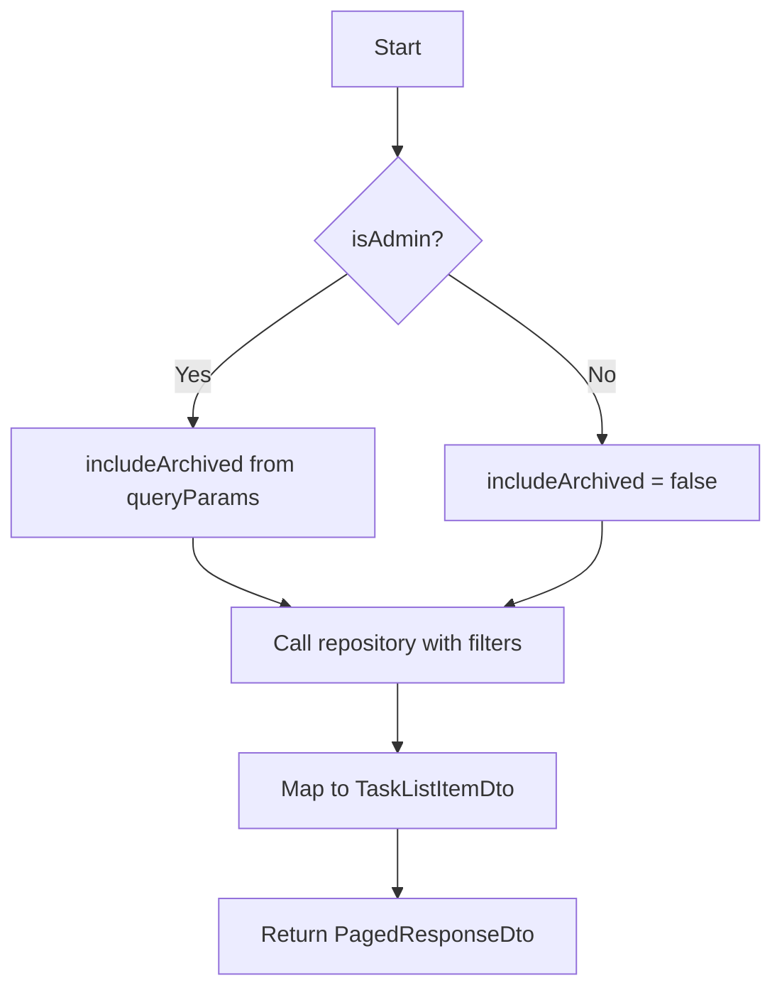
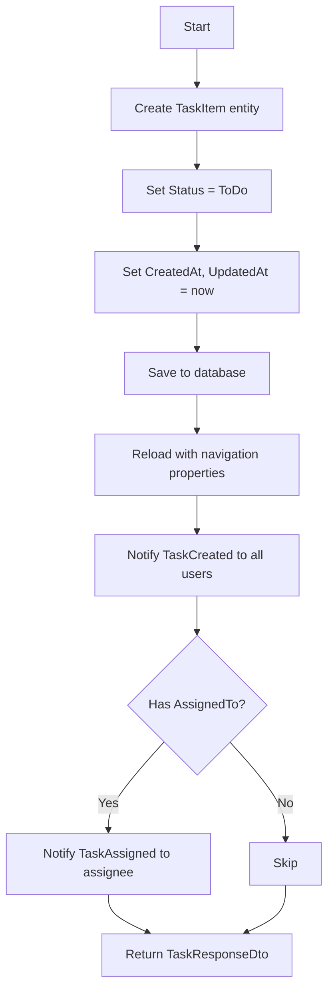
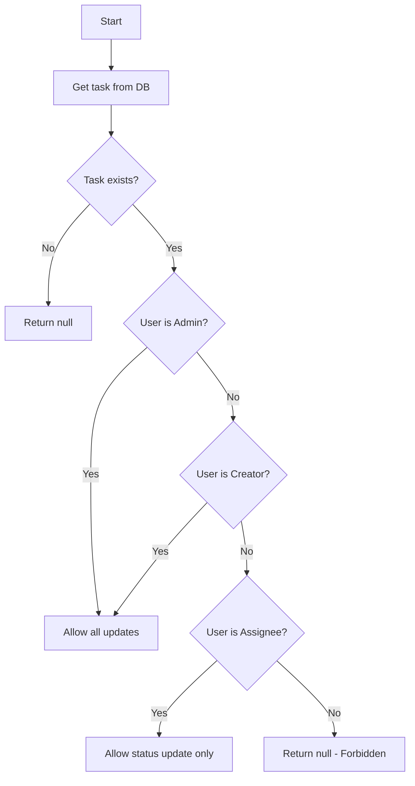
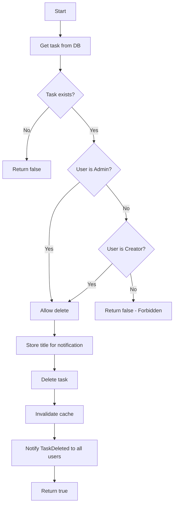

# Task - Application Layer

## ITaskService

**Interface:** `Services/Interfaces/ITaskService.cs`
**Implementation:** `Services/TaskService.cs`

---

## Methods Overview

| Method | Input | Output | Description |
|--------|-------|--------|-------------|
| `GetTasksAsync` | queryParams, isAdmin | PagedResponseDto | Get filtered tasks |
| `GetTaskByIdAsync` | id | (TaskResponseDto?, bool) | Get task with cache |
| `CreateTaskAsync` | dto, creatorId | TaskResponseDto | Create task |
| `UpdateTaskAsync` | id, dto, userId, role | TaskResponseDto? | Update task |
| `DeleteTaskAsync` | id, userId, role | bool | Delete task |
| `GetMyTasksAsync` | userId, page, pageSize | PagedResponseDto | Get user's tasks |
| `GetAssignedTasksAsync` | userId, page, pageSize | PagedResponseDto | Get assigned tasks |

---

## GetTasksAsync

### Signature

```csharp
Task<PagedResponseDto<TaskListItemDto>> GetTasksAsync(TaskQueryParams queryParams, bool isAdmin);
```

### Input

| Parameter | Type | Description |
|-----------|------|-------------|
| queryParams | TaskQueryParams | page, pageSize, status, assignedTo, createdBy, search, includeArchived |
| isAdmin | bool | Whether user is admin |

### Output

| Type | Description |
|------|-------------|
| `PagedResponseDto<TaskListItemDto>` | Paginated list of tasks |

### Implementation Logic



1. Check if user is admin - non-admin users cannot see archived tasks
2. Call `_unitOfWork.Tasks.GetTasksWithFilterAsync(queryParams, includeArchived)`
3. Map each TaskItem to TaskListItemDto
4. Build and return PagedResponseDto with pagination metadata

---

## GetTaskByIdAsync

### Signature

```csharp
Task<(TaskResponseDto? Task, bool FromCache)> GetTaskByIdAsync(int id);
```

### Input

| Parameter | Type | Description |
|-----------|------|-------------|
| id | int | Task ID |

### Output

| Type | Description |
|------|-------------|
| `(TaskResponseDto?, bool)` | Task DTO and cache hit flag |

### Implementation Logic

```mermaid
flowchart TD
    A[Start] --> B[Generate cache key: task_{id}]
    B --> C{Cache hit?}
    C -->|Yes| D[Return cached task, fromCache=true]
    C -->|No| E[Simulate 2-second delay]
    E --> F[Query from database]
    F --> G{Task found?}
    G -->|No| H[Return null, false]
    G -->|Yes| I[Map to TaskResponseDto]
    I --> J[Store in cache with 5-min TTL]
    J --> K[Return task, fromCache=false]
```

1. Generate cache key using `_cacheService.GetTaskCacheKey(id)`
2. Check cache using `_cacheService.TryGet<TaskResponseDto>(cacheKey, out var cachedTask)`
3. If cache hit, return `(cachedTask, true)`
4. If cache miss:
   - Simulate 2-second delay using `Task.Delay(2000)` for caching demonstration
   - Query from database using `_unitOfWork.Tasks.GetTaskWithDetailsAsync(id)`
   - If task is null, return `(null, false)`
   - Map to TaskResponseDto
   - Store in cache using `_cacheService.Set(cacheKey, taskDto, TimeSpan.FromMinutes(5))`
   - Return `(taskDto, false)`

### Cache Configuration

| Setting | Value |
|---------|-------|
| Key Format | `task_{id}` |
| TTL | 5 minutes |
| Invalidation | On PUT/DELETE |
| Delay Simulation | 2 seconds |

---

## CreateTaskAsync

### Signature

```csharp
Task<TaskResponseDto> CreateTaskAsync(CreateTaskRequestDto request, int creatorId);
```

### Input

| Parameter | Type | Description |
|-----------|------|-------------|
| request | CreateTaskRequestDto | title, description, assignedToId |
| creatorId | int | ID of user creating the task |

### Output

| Type | Description |
|------|-------------|
| `TaskResponseDto` | Created task with full details |

### Implementation Logic



1. Create new TaskItem entity with:
   - Title, Description from request
   - Status = TaskStatus.ToDo
   - CreatedById = creatorId
   - AssignedToId = request.AssignedToId (optional)
   - CreatedAt, UpdatedAt = DateTime.UtcNow
   - IsArchived = false
2. Add to repository using `_unitOfWork.Tasks.AddAsync(task)`
3. Save changes using `_unitOfWork.SaveChangesAsync()`
4. Reload task with navigation properties using `_unitOfWork.Tasks.GetTaskWithDetailsAsync(task.Id)`
5. Send SignalR notification using `_notificationService.NotifyTaskCreatedAsync(task)`
6. If task has AssignedToId, send `_notificationService.NotifyTaskAssignedAsync(task)`
7. Map and return TaskResponseDto

### SignalR Events Triggered

| Event | Recipients | Message |
|-------|------------|---------|
| TaskCreated | All users | "Task created: {title}" |
| TaskAssigned | Assigned user only | "You have been assigned to: {title}" |

---

## UpdateTaskAsync

### Signature

```csharp
Task<TaskResponseDto?> UpdateTaskAsync(int id, UpdateTaskRequestDto request, int userId, string userRole);
```

### Input

| Parameter | Type | Description |
|-----------|------|-------------|
| id | int | Task ID |
| request | UpdateTaskRequestDto | title, description, status, assignedToId |
| userId | int | Current user ID |
| userRole | string | "Admin" or "User" |

### Output

| Type | Description |
|------|-------------|
| `TaskResponseDto?` | Updated task, or null if not found/unauthorized |

### Authorization Logic



1. Get task from database using `_unitOfWork.Tasks.GetTaskWithDetailsAsync(id)`
2. If task is null, return null
3. Check authorization:
   - isAdmin = userRole == "Admin"
   - isCreator = task.CreatedById == userId
   - isAssignee = task.AssignedToId == userId
4. If not admin, not creator, and not assignee → return null (Forbidden)
5. Store previousStatus for notification
6. Apply updates based on role:
   - Assignee (not creator/admin): Can only update Status
   - Creator or Admin: Can update all fields (Title, Description, Status, AssignedToId)
7. Set UpdatedAt = DateTime.UtcNow
8. Save changes using `_unitOfWork.SaveChangesAsync()`
9. Invalidate cache using `_cacheService.Remove(_cacheService.GetTaskCacheKey(id))`
10. If status changed by assignee, notify creator using `_notificationService.NotifyTaskStatusUpdatedAsync(task, previousStatus)`
11. Map and return TaskResponseDto

### SignalR Events Triggered

| Condition | Event | Recipients |
|-----------|-------|------------|
| Status changed by assignee | TaskUpdated | Task creator only |

---

## DeleteTaskAsync

### Signature

```csharp
Task<bool> DeleteTaskAsync(int id, int userId, string userRole);
```

### Input

| Parameter | Type | Description |
|-----------|------|-------------|
| id | int | Task ID |
| userId | int | Current user ID |
| userRole | string | "Admin" or "User" |

### Output

| Type | Description |
|------|-------------|
| `bool` | True if deleted, false if not found/unauthorized |

### Authorization Logic



1. Get task from database using `_unitOfWork.Tasks.GetTaskWithDetailsAsync(id)`
2. If task is null, return false
3. Check authorization:
   - isAdmin = userRole == "Admin"
   - isCreator = task.CreatedById == userId
4. If not admin and not creator → return false (Forbidden)
5. Store task title for notification
6. Delete task using `_unitOfWork.Tasks.Delete(task)`
7. Save changes using `_unitOfWork.SaveChangesAsync()`
8. Invalidate cache using `_cacheService.Remove(_cacheService.GetTaskCacheKey(id))`
9. Notify all users using `_notificationService.NotifyTaskDeletedAsync(id, title)`
10. Return true

---

## GetMyTasksAsync

### Signature

```csharp
Task<PagedResponseDto<TaskListItemDto>> GetMyTasksAsync(int userId, int page, int pageSize);
```

### Implementation Logic

1. Call `_unitOfWork.Tasks.GetTasksByCreatorAsync(userId, page, pageSize)`
2. Map each TaskItem to TaskListItemDto
3. Build and return PagedResponseDto with pagination metadata

---

## GetAssignedTasksAsync

### Signature

```csharp
Task<PagedResponseDto<TaskListItemDto>> GetAssignedTasksAsync(int userId, int page, int pageSize);
```

### Implementation Logic

1. Call `_unitOfWork.Tasks.GetTasksByAssigneeAsync(userId, page, pageSize)`
2. Map each TaskItem to TaskListItemDto
3. Build and return PagedResponseDto with pagination metadata

---

## Private Helper Methods

### MapToTaskResponseDto

Maps TaskItem entity to TaskResponseDto.

**Fields mapped:**
- Id, Title, Description, Status (as string)
- CreatedBy → UserListItemDto
- AssignedTo → UserListItemDto (nullable)
- CreatedAt, UpdatedAt, IsArchived, ArchivedAt

### MapToTaskListItemDto

Maps TaskItem entity to TaskListItemDto.

**Fields mapped:**
- Id, Title, Status (as string)
- CreatedBy → UserListItemDto
- AssignedTo → UserListItemDto (nullable)
- CreatedAt, UpdatedAt, IsArchived

### MapToUserListItemDto

Maps User entity to UserListItemDto with generated initials.

### GetInitials

Generates initials from user name:
- "John Doe" → "JD"
- "Jane Smith" → "JS"
- "John" → "JO" (first 2 characters)

---

## Service Dependencies

| Dependency | Description |
|------------|-------------|
| `IUnitOfWork` | Database operations |
| `ICacheService` | Task caching operations |
| `INotificationService` | SignalR notifications |

---

## Related Documentation

- [Task Presentation Layer](./Presentation.md)
- [Task Data Layer](./Data.md)
- [CacheService](./Application-Cache-CacheService.md)
- [NotificationService](./Application-SignalR-NotificationService.md)
- [Layer Architecture](../Layer-Architecture.md)
