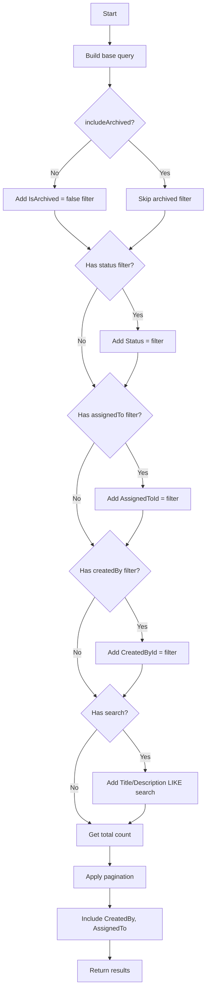
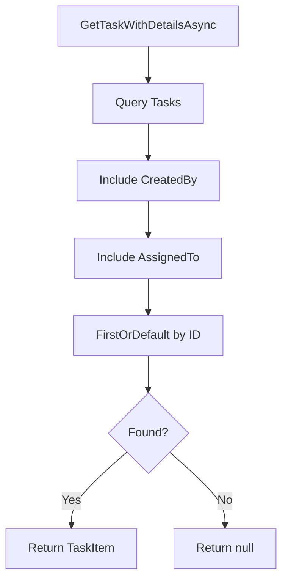
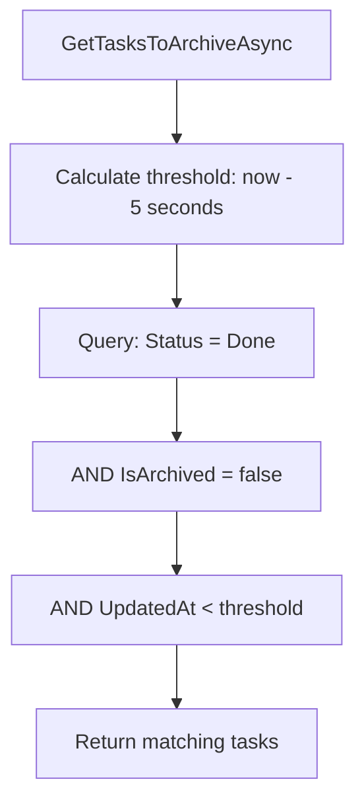
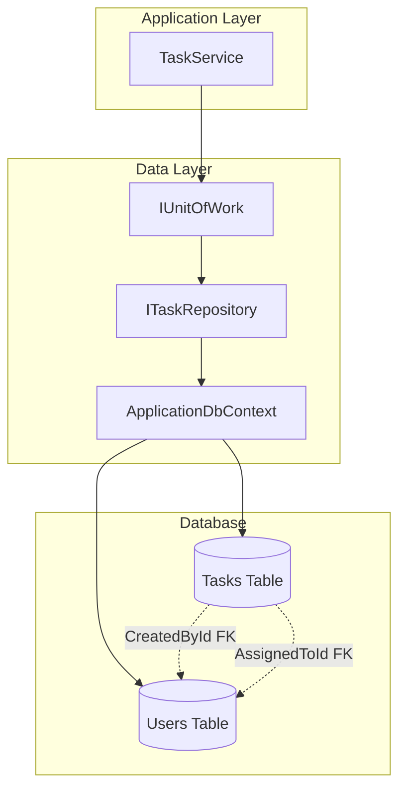

# Task - Data Layer

## ITaskRepository

**Interface:** `Repositories/Interfaces/ITaskRepository.cs`
**Implementation:** `Repositories/TaskRepository.cs`

---

## Entity

### TaskItem

**File:** `Data/Entities/TaskItem.cs`

| Property | Type | Description |
|----------|------|-------------|
| Id | int | Primary Key |
| Title | string | Task title |
| Description | string? | Task description (nullable) |
| Status | TaskStatus | Task status enum |
| CreatedById | int | Foreign Key → Users |
| AssignedToId | int? | Foreign Key → Users (nullable) |
| CreatedAt | DateTime | Creation timestamp |
| UpdatedAt | DateTime | Last update timestamp |
| IsArchived | bool | Archive flag |
| ArchivedAt | DateTime? | Archive timestamp (nullable) |
| CreatedBy | User | Navigation property |
| AssignedTo | User? | Navigation property (nullable) |

### TaskStatus Enum

**File:** `Data/Enums/TaskStatus.cs`

| Value | Int | Description |
|-------|-----|-------------|
| ToDo | 0 | Not started |
| Development | 1 | In development |
| Review | 2 | Under review |
| Merge | 3 | Ready to merge |
| Done | 4 | Completed |

### Database Schema

| Column | Type | Constraints |
|--------|------|-------------|
| Id | int | Primary Key, Auto Increment |
| Title | nvarchar(200) | Required |
| Description | nvarchar(2000) | Nullable |
| Status | int | Required (enum) |
| CreatedById | int | Foreign Key → Users |
| AssignedToId | int | Foreign Key → Users, Nullable |
| CreatedAt | datetime | Required |
| UpdatedAt | datetime | Required |
| IsArchived | bit | Required, Default: 0 |
| ArchivedAt | datetime | Nullable |

---

## Methods Overview

| Method | Input | Output | Description |
|--------|-------|--------|-------------|
| `GetTasksWithFilterAsync` | queryParams, includeArchived | (Tasks, Count) | Filtered pagination |
| `GetTasksByCreatorAsync` | userId, page, pageSize | (Tasks, Count) | User's created tasks |
| `GetTasksByAssigneeAsync` | userId, page, pageSize | (Tasks, Count) | User's assigned tasks |
| `GetTaskWithDetailsAsync` | id | TaskItem? | Task with navigation |
| `GetTasksToArchiveAsync` | - | Tasks | Tasks ready to archive |

---

## GetTasksWithFilterAsync

### Signature

```csharp
Task<(IEnumerable<TaskItem> Tasks, int TotalCount)> GetTasksWithFilterAsync(
    TaskQueryParams queryParams,
    bool includeArchived = false);
```

### Input

| Parameter | Type | Description |
|-----------|------|-------------|
| queryParams | TaskQueryParams | Filtering and pagination options |
| includeArchived | bool | Include archived tasks (Admin only) |

### Output

| Type | Description |
|------|-------------|
| `(IEnumerable<TaskItem>, int)` | Filtered tasks and total count |

### Implementation Logic



1. Start with base query on Tasks DbSet
2. If `!includeArchived`, add filter `Where(t => !t.IsArchived)`
3. If `queryParams.Status` is not empty, parse to enum and add status filter
4. If `queryParams.AssignedTo` has value, add assignee filter
5. If `queryParams.CreatedBy` has value, add creator filter
6. If `queryParams.Search` is not empty, add title/description LIKE filter (case-insensitive)
7. Get total count using `CountAsync()`
8. Order by `UpdatedAt` descending
9. Apply pagination using `Skip((page-1) * pageSize).Take(pageSize)`
10. Include navigation properties (CreatedBy, AssignedTo)
11. Execute query and return (tasks, totalCount)

### Query Generated (Example)

```sql
-- Count query
SELECT COUNT(*)
FROM Tasks
WHERE IsArchived = 0
  AND Status = @status
  AND (LOWER(Title) LIKE @search OR LOWER(Description) LIKE @search)

-- Data query
SELECT t.*, cb.*, a.*
FROM Tasks t
LEFT JOIN Users cb ON t.CreatedById = cb.Id
LEFT JOIN Users a ON t.AssignedToId = a.Id
WHERE t.IsArchived = 0
  AND t.Status = @status
  AND (LOWER(t.Title) LIKE @search OR LOWER(t.Description) LIKE @search)
ORDER BY t.UpdatedAt DESC
OFFSET @skip ROWS FETCH NEXT @take ROWS ONLY
```

---

## GetTasksByCreatorAsync

### Signature

```csharp
Task<(IEnumerable<TaskItem> Tasks, int TotalCount)> GetTasksByCreatorAsync(
    int userId, int page, int pageSize);
```

### Input

| Parameter | Type | Description |
|-----------|------|-------------|
| userId | int | Creator's user ID |
| page | int | Page number |
| pageSize | int | Items per page |

### Implementation Logic

1. Filter tasks where `CreatedById == userId` AND `!IsArchived`
2. Get total count
3. Order by `UpdatedAt` descending
4. Apply pagination
5. Include CreatedBy, AssignedTo navigation properties
6. Return (tasks, totalCount)

---

## GetTasksByAssigneeAsync

### Signature

```csharp
Task<(IEnumerable<TaskItem> Tasks, int TotalCount)> GetTasksByAssigneeAsync(
    int userId, int page, int pageSize);
```

### Implementation Logic

1. Filter tasks where `AssignedToId == userId` AND `!IsArchived`
2. Get total count
3. Order by `UpdatedAt` descending
4. Apply pagination
5. Include CreatedBy, AssignedTo navigation properties
6. Return (tasks, totalCount)

---

## GetTaskWithDetailsAsync

### Signature

```csharp
Task<TaskItem?> GetTaskWithDetailsAsync(int id);
```

### Input

| Parameter | Type | Description |
|-----------|------|-------------|
| id | int | Task ID |

### Output

| Type | Description |
|------|-------------|
| `TaskItem?` | Task with CreatedBy, AssignedTo |

### Implementation Logic



1. Query Tasks DbSet
2. Include CreatedBy navigation property
3. Include AssignedTo navigation property
4. Filter by `Id == id`
5. Return first match or null

---

## GetTasksToArchiveAsync

### Signature

```csharp
Task<IEnumerable<TaskItem>> GetTasksToArchiveAsync();
```

### Output

| Type | Description |
|------|-------------|
| `IEnumerable<TaskItem>` | Tasks ready for archiving |

### Archive Conditions

| Condition | Value |
|-----------|-------|
| Status | Done |
| IsArchived | false |
| UpdatedAt | > 5 seconds ago |

### Implementation Logic



1. Calculate threshold: `DateTime.UtcNow.AddSeconds(-5)`
2. Filter tasks where:
   - `Status == TaskStatus.Done`
   - `!IsArchived`
   - `UpdatedAt < threshold`
3. Return matching tasks

### Query Generated

```sql
SELECT *
FROM Tasks
WHERE Status = 4  -- Done
  AND IsArchived = 0
  AND UpdatedAt < @threshold
```

---

## EF Core Configuration

### Entity Configuration

| Property | Configuration |
|----------|---------------|
| Id | Primary Key |
| Title | Required, MaxLength(200) |
| Description | MaxLength(2000) |
| Status | Required, stored as int |
| IsArchived | Default value = false |

### Relationships

| Relationship | Configuration |
|--------------|---------------|
| CreatedBy | Required, Restrict delete |
| AssignedTo | Optional, SetNull on delete |

---

## Data Flow Diagram



---

## Related Documentation

- [Task Presentation Layer](./Presentation.md)
- [Task Application Layer](./Application.md)
- [TaskArchiveBackgroundService](./Application-Background-TaskArchiveService.md)
- [Layer Architecture](../Layer-Architecture.md)
