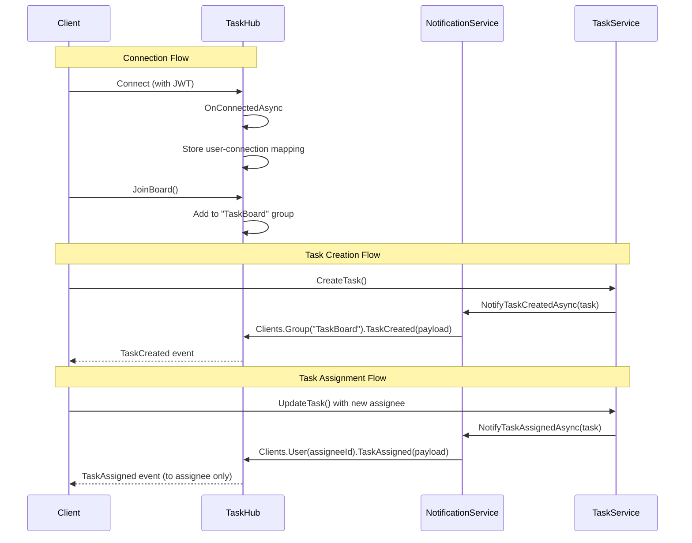

# Task - Presentation Layer (SignalR)

## TaskHub

**File:** `Hubs/TaskHub.cs`
**URL:** `/hubs/tasks`

---

## Hub Overview

Real-time SignalR hub for task notifications and live updates.

| Method | Description |
|--------|-------------|
| `JoinBoard` | Join task board room for updates |
| `LeaveBoard` | Leave task board room |

| Event | Recipients | Description |
|-------|------------|-------------|
| `TaskCreated` | All connected users | Broadcast task creation |
| `TaskAssigned` | Assigned user only | Notify assignment |
| `TaskUpdated` | Task creator only | Notify status change by assignee |
| `TaskDeleted` | All connected users | Broadcast task deletion |

---

## JoinBoard

### Signature

```csharp
Task JoinBoard();
```

### Description

- Add current connection to "TaskBoard" group
- Called when user opens task board page
- Enables receiving all task-related broadcasts

### Implementation Logic

1. Get current connection ID from `Context.ConnectionId`
2. Add connection to "TaskBoard" group via `Groups.AddToGroupAsync`
3. Optionally track user-connection mapping for targeted notifications

---

## LeaveBoard

### Signature

```csharp
Task LeaveBoard();
```

### Description

- Remove current connection from "TaskBoard" group
- Called when user leaves task board page
- Stops receiving task broadcasts

### Implementation Logic

1. Get current connection ID from `Context.ConnectionId`
2. Remove connection from "TaskBoard" group via `Groups.RemoveFromGroupAsync`

---

## Client Events

### TaskCreated

**Recipients:** All connected users in "TaskBoard" group

**Payload:**
```json
{
  "task": {
    "id": 112,
    "title": "Implement dark mode theme",
    "status": "ToDo"
  },
  "message": "Task created: Implement dark mode theme"
}
```

**Trigger:** When any user creates a new task

---

### TaskAssigned

**Recipients:** Assigned user only (targeted notification)

**Payload:**
```json
{
  "task": {
    "id": 112,
    "title": "Implement dark mode theme",
    "assignedTo": {
      "id": 3,
      "name": "Mike Johnson"
    }
  },
  "message": "You have been assigned to: Implement dark mode theme"
}
```

**Trigger:** When a task is assigned or reassigned to a user

---

### TaskUpdated

**Recipients:** Task creator only (targeted notification)

**Payload:**
```json
{
  "task": {
    "id": 101,
    "title": "Implement user authentication flow",
    "status": "Done",
    "previousStatus": "Review"
  },
  "message": "Task 'Implement user authentication flow' status updated to: Done"
}
```

**Trigger:** When assignee updates task status (not when creator updates)

---

### TaskDeleted

**Recipients:** All connected users in "TaskBoard" group

**Payload:**
```json
{
  "taskId": 105,
  "title": "Old feature request",
  "message": "Task deleted: Old feature request"
}
```

**Trigger:** When any task is deleted

---

## Connection Lifecycle

### OnConnectedAsync

```csharp
override Task OnConnectedAsync();
```

**Implementation Logic:**
- Extract user ID from JWT claims
- Store user-connection mapping (for targeted notifications)
- Call base implementation

---

### OnDisconnectedAsync

```csharp
override Task OnDisconnectedAsync(Exception? exception);
```

**Implementation Logic:**
- Remove user-connection mapping
- Clean up any group memberships
- Call base implementation

---

## User-Connection Tracking

For targeted notifications, maintain a mapping of users to their SignalR connections.

| Storage Option | Description |
|----------------|-------------|
| `ConcurrentDictionary` | In-memory, single server |
| `IDistributedCache` | Redis, multi-server support |

**Mapping Structure:**
```
UserId -> List<ConnectionId>
```

One user can have multiple connections (multiple browser tabs).

---

## Flow Diagram



---

## Configuration

**Program.cs:**
```csharp
// Add SignalR
builder.Services.AddSignalR();

// Map hub endpoint
app.MapHub<TaskHub>("/hubs/tasks");
```

**CORS for SignalR:**
```csharp
policy.AllowCredentials(); // Required for SignalR
```

---

## Related Documentation

- [NotificationService](./Application-SignalR-NotificationService.md)
- [Task Presentation Layer](./Presentation.md)
- [Layer Architecture](../Layer-Architecture.md)
