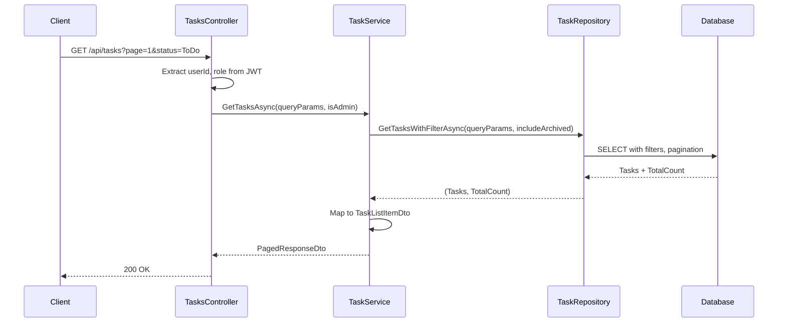
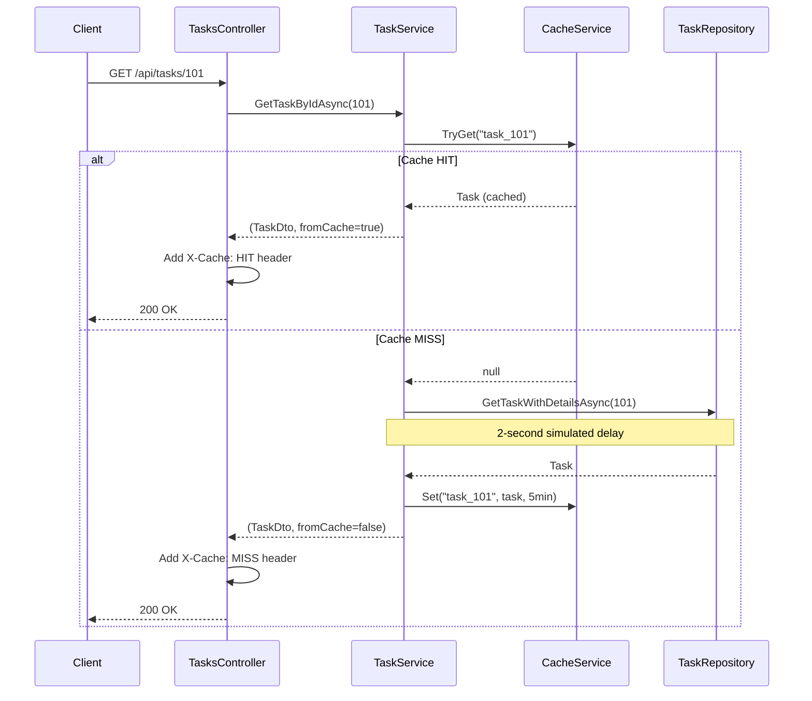

# Task - Presentation Layer

## TasksController

**File:** `Controllers/TasksController.cs`
**Route:** `/api/tasks`

---

## Endpoints Overview

| Method | Endpoint | Description | Auth |
|--------|----------|-------------|------|
| GET | `/api/tasks` | Get all tasks (paginated) | Yes |
| GET | `/api/tasks/{id}` | Get single task (cached) | Yes |
| POST | `/api/tasks` | Create new task | Yes |
| PUT | `/api/tasks/{id}` | Update task | Yes |
| DELETE | `/api/tasks/{id}` | Delete task | Yes |
| GET | `/api/tasks/my` | Get user's created tasks | Yes |
| GET | `/api/tasks/assigned` | Get user's assigned tasks | Yes |

---

## GET `/api/tasks`

### Description
Get all tasks with pagination and filtering. Regular users see non-archived tasks only. Admins can see archived tasks with `includeArchived=true`.

### Request

**Headers:**
```
Authorization: Bearer {token}
```

**Query Parameters:**

| Parameter | Type | Default | Description |
|-----------|------|---------|-------------|
| page | int | 1 | Page number |
| pageSize | int | 20 | Items per page |
| status | string | - | Filter by status (ToDo, Development, Review, Merge, Done) |
| assignedTo | int | - | Filter by assignee ID |
| createdBy | int | - | Filter by creator ID |
| search | string | - | Search in title/description |
| includeArchived | bool | false | Include archived tasks (Admin only) |

### Response

**Success (200 OK):**
```json
{
  "data": [
    {
      "id": 101,
      "title": "Implement user authentication",
      "description": "We need to implement...",
      "status": "Development",
      "createdBy": {
        "id": 1,
        "name": "John Doe",
        "initials": "JD"
      },
      "assignedTo": {
        "id": 2,
        "name": "Jane Smith",
        "initials": "JS"
      },
      "createdAt": "2025-12-01T09:00:00Z",
      "updatedAt": "2025-12-07T14:30:00Z",
      "isArchived": false
    }
  ],
  "page": 1,
  "pageSize": 20,
  "totalCount": 50,
  "totalPages": 3
}
```

### Action Method

```csharp
[HttpGet]
[Authorize]
[ProducesResponseType(typeof(PagedResponseDto<TaskListItemDto>), StatusCodes.Status200OK)]
public async Task<IActionResult> GetTasks([FromQuery] TaskQueryParams queryParams);
```

### Implementation Logic

1. Extract userId and role from JWT claims
2. Call `ITaskService.GetTasksAsync(queryParams, isAdmin)`
3. Return PagedResponseDto

### Flow Diagram



---

## GET `/api/tasks/{id}`

### Description
Get a single task by ID. Uses caching with 5-minute TTL. Returns `X-Cache` header indicating cache hit/miss.

### Request

**Headers:**
```
Authorization: Bearer {token}
```

**Path Parameters:**
| Parameter | Type | Description |
|-----------|------|-------------|
| id | int | Task ID |

### Response

**Headers:**
```
X-Cache: HIT  (or MISS)
```

**Success (200 OK):**
```json
{
  "id": 101,
  "title": "Implement user authentication",
  "description": "We need to implement secure login...",
  "status": "Development",
  "createdBy": { "id": 1, "name": "John Doe", "initials": "JD" },
  "assignedTo": { "id": 2, "name": "Jane Smith", "initials": "JS" },
  "createdAt": "2025-12-01T09:00:00Z",
  "updatedAt": "2025-12-07T14:30:00Z",
  "isArchived": false,
  "archivedAt": null
}
```

**Error (404 Not Found):**
```json
{ "error": "Not Found", "message": "Task not found" }
```

### Action Method

```csharp
[HttpGet("{id}")]
[Authorize]
[ProducesResponseType(typeof(TaskResponseDto), StatusCodes.Status200OK)]
[ProducesResponseType(typeof(ErrorResponseDto), StatusCodes.Status404NotFound)]
public async Task<IActionResult> GetTask(int id);
```

### Implementation Logic

1. Call `ITaskService.GetTaskByIdAsync(id)` which returns (task, fromCache)
2. If task is null, return 404 NotFound
3. Add `X-Cache: HIT` or `X-Cache: MISS` header based on fromCache flag
4. Return TaskResponseDto

### Flow Diagram (with Caching)



---

## POST `/api/tasks`

### Description
Create a new task. Triggers SignalR notifications to all users (TaskCreated) and assigned user (TaskAssigned).

### Request

**Headers:**
```
Authorization: Bearer {token}
Content-Type: application/json
```

**Body:** `CreateTaskRequestDto`
```json
{
  "title": "Implement dark mode",
  "description": "Add dark mode theme support",
  "assignedToId": 3
}
```

**Validation Rules:**
| Field | Rules |
|-------|-------|
| title | Required, MaxLength(200) |
| description | Optional, MaxLength(2000) |
| assignedToId | Optional, must exist in Users |

### Response

**Success (201 Created):**
```json
{
  "id": 112,
  "title": "Implement dark mode",
  "status": "ToDo",
  ...
}
```

### Action Method

```csharp
[HttpPost]
[Authorize]
[ProducesResponseType(typeof(TaskResponseDto), StatusCodes.Status201Created)]
[ProducesResponseType(typeof(ErrorResponseDto), StatusCodes.Status400BadRequest)]
public async Task<IActionResult> CreateTask([FromBody] CreateTaskRequestDto request);
```

### Implementation Logic

1. Extract userId from JWT claims
2. Call `ITaskService.CreateTaskAsync(request, userId)`
3. Return 201 Created with CreatedAtAction pointing to GetTask

### SignalR Notifications

| Event | Recipients | Message |
|-------|------------|---------|
| TaskCreated | All users | "Task created: {title}" |
| TaskAssigned | Assigned user only | "You have been assigned to: {title}" |

---

## PUT `/api/tasks/{id}`

### Description
Update an existing task. Authorization rules apply. Invalidates cache. Triggers TaskUpdated notification if status changed by assignee.

### Request

**Body:** `UpdateTaskRequestDto`
```json
{
  "title": "Implement dark mode - Updated",
  "description": "Add dark mode theme support with toggle",
  "status": "Development",
  "assignedToId": 3
}
```

### Authorization Rules

| User Type | Can Update |
|-----------|------------|
| Creator | All fields |
| Assignee | Status only |
| Admin | All fields on any task |

### Response

**Success (200 OK):** Updated TaskResponseDto

**Error (403 Forbidden):**
```json
{ "error": "Forbidden", "message": "You don't have permission to edit this task" }
```

**Error (404 Not Found):**
```json
{ "error": "Not Found", "message": "Task not found" }
```

### Action Method

```csharp
[HttpPut("{id}")]
[Authorize]
[ProducesResponseType(typeof(TaskResponseDto), StatusCodes.Status200OK)]
[ProducesResponseType(typeof(ErrorResponseDto), StatusCodes.Status403Forbidden)]
[ProducesResponseType(typeof(ErrorResponseDto), StatusCodes.Status404NotFound)]
public async Task<IActionResult> UpdateTask(int id, [FromBody] UpdateTaskRequestDto request);
```

### Implementation Logic

1. Extract userId and role from JWT claims
2. Call `ITaskService.UpdateTaskAsync(id, request, userId, userRole)`
3. If null returned, determine if 404 or 403
4. Return updated task

---

## DELETE `/api/tasks/{id}`

### Description
Delete a task. Only creator or admin can delete. Invalidates cache. Triggers TaskDeleted notification to all users.

### Authorization Rules

| User Type | Can Delete |
|-----------|------------|
| Creator | Yes |
| Assignee | No |
| Admin | Yes (any task) |

### Response

**Success (204 No Content):** (empty body)

**Error (403 Forbidden):**
```json
{ "error": "Forbidden", "message": "You don't have permission to delete this task" }
```

### Action Method

```csharp
[HttpDelete("{id}")]
[Authorize]
[ProducesResponseType(StatusCodes.Status204NoContent)]
[ProducesResponseType(typeof(ErrorResponseDto), StatusCodes.Status403Forbidden)]
[ProducesResponseType(typeof(ErrorResponseDto), StatusCodes.Status404NotFound)]
public async Task<IActionResult> DeleteTask(int id);
```

### Implementation Logic

1. Extract userId and role from JWT claims
2. Call `ITaskService.DeleteTaskAsync(id, userId, userRole)`
3. If false returned, return 404 or 403
4. Return 204 NoContent

---

## GET `/api/tasks/my`

### Description
Get tasks created by the current user.

### Request

**Query Parameters:**
| Parameter | Type | Default |
|-----------|------|---------|
| page | int | 1 |
| pageSize | int | 20 |

### Action Method

```csharp
[HttpGet("my")]
[Authorize]
public async Task<IActionResult> GetMyTasks([FromQuery] int page = 1, [FromQuery] int pageSize = 20);
```

### Implementation Logic

1. Extract userId from JWT claims
2. Call `ITaskService.GetMyTasksAsync(userId, page, pageSize)`
3. Return PagedResponseDto

---

## GET `/api/tasks/assigned`

### Description
Get tasks assigned to the current user.

### Action Method

```csharp
[HttpGet("assigned")]
[Authorize]
public async Task<IActionResult> GetAssignedTasks([FromQuery] int page = 1, [FromQuery] int pageSize = 20);
```

### Implementation Logic

1. Extract userId from JWT claims
2. Call `ITaskService.GetAssignedTasksAsync(userId, page, pageSize)`
3. Return PagedResponseDto

---

## DTOs

### Request DTOs

**Location:** `Controllers/DTOs/Task/`

| DTO | Fields |
|-----|--------|
| `CreateTaskRequestDto` | title, description, assignedToId |
| `UpdateTaskRequestDto` | title, description, status, assignedToId |
| `TaskQueryParams` | page, pageSize, status, assignedTo, createdBy, search, includeArchived |

### Response DTOs

| DTO | Fields |
|-----|--------|
| `TaskResponseDto` | id, title, description, status, createdBy, assignedTo, createdAt, updatedAt, isArchived, archivedAt |
| `TaskListItemDto` | id, title, status, createdBy, assignedTo, createdAt, updatedAt, isArchived |

---

## Controller Dependencies

| Dependency | Description |
|------------|-------------|
| `ITaskService` | Task business logic |

---

## Related Documentation

- [Task Application Layer](./Application.md)
- [Task Data Layer](./Data.md)
- [TaskHub (SignalR)](./Presentation-SignalR-TaskHub.md)
- [Layer Architecture](../Layer-Architecture.md)
