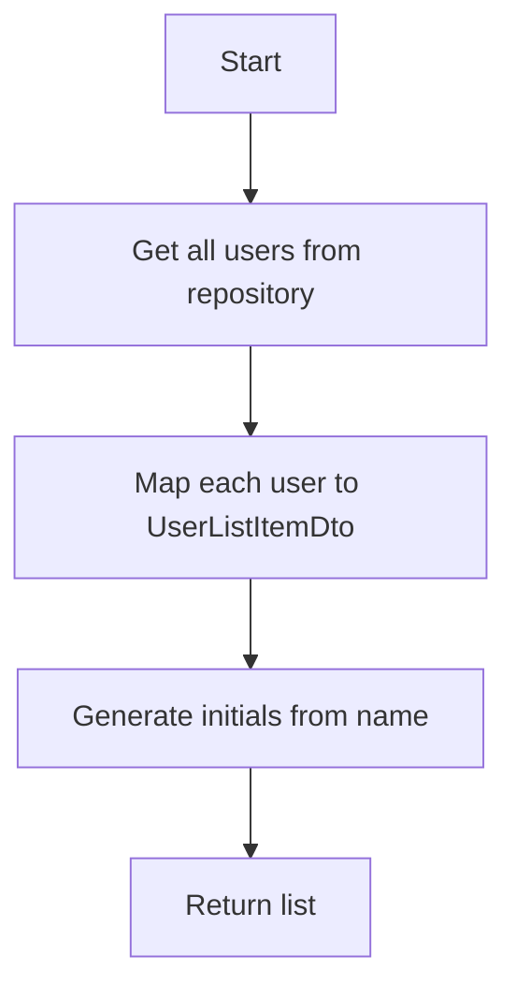
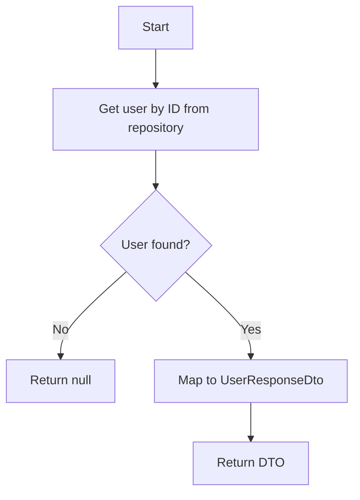

# User - Application Layer

## IUserService

**Interface:** `Services/Interfaces/IUserService.cs`
**Implementation:** `Services/UserService.cs`

---

## Methods Overview

| Method | Input | Output | Description |
|--------|-------|--------|-------------|
| `GetAllUsersAsync` | - | List<UserListItemDto> | Get all users for assignment |
| `GetUserByIdAsync` | id | UserResponseDto? | Get user details |

---

## GetAllUsersAsync

### Signature

```csharp
Task<IEnumerable<UserListItemDto>> GetAllUsersAsync();
```

### Input

None

### Output

| Type | Description |
|------|-------------|
| `IEnumerable<UserListItemDto>` | List of users with id, name, initials |

### Implementation Logic



1. Call `_unitOfWork.Users.GetAllAsync()` to get all users
2. Map each User entity to UserListItemDto:
   - Id → Id
   - Name → Name
   - Name → Initials (via GetInitials helper)
3. Return the list

### Helper Method: GetInitials

Generates initials from user name:

| Name | Initials | Logic |
|------|----------|-------|
| John Doe | JD | First letter of first + last name |
| Jane Smith | JS | First letter of first + last name |
| Mike Johnson | MJ | First letter of first + last name |
| Sarah | SA | First 2 characters of single name |

---

## GetUserByIdAsync

### Signature

```csharp
Task<UserResponseDto?> GetUserByIdAsync(int id);
```

### Input

| Parameter | Type | Description |
|-----------|------|-------------|
| id | int | User ID |

### Output

| Type | Description |
|------|-------------|
| `UserResponseDto?` | User details or null if not found |

### Implementation Logic



1. Call `_unitOfWork.Users.GetByIdAsync(id)` to find user
2. If user is null, return null
3. Map User entity to UserResponseDto:
   - Id → Id
   - Name → Name
   - Email → Email
   - Username → Username
   - Role → Role
   - CreatedAt → CreatedAt
4. Return the DTO

---

## Service Dependencies

| Dependency | Description |
|------------|-------------|
| `IUnitOfWork` | Database operations |

---

## Related Documentation

- [User Presentation Layer](./Presentation.md)
- [User Data Layer](./Data.md)
- [Layer Architecture](../Layer-Architecture.md)
