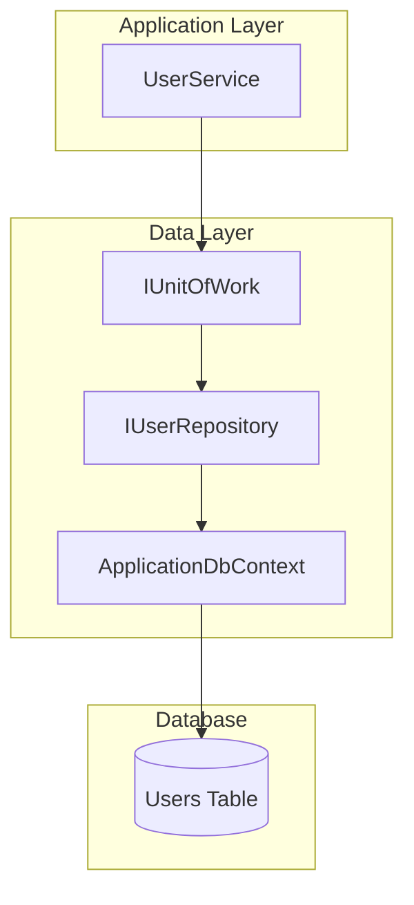

# User - Data Layer

## IUserRepository

**Interface:** `Repositories/Interfaces/IUserRepository.cs`
**Implementation:** `Repositories/UserRepository.cs`

> **Note:** User entity and full repository documentation is in [Auth/Data.md](../Auth/Data.md) since User is primarily used for authentication.

---

## Methods Used by UserService

| Method | Input | Output | Description |
|--------|-------|--------|-------------|
| `GetAllAsync` | - | IEnumerable<User> | Get all users |
| `GetByIdAsync` | id | User? | Get user by ID |

---

## GetAllAsync

### Signature

```csharp
Task<IEnumerable<User>> GetAllAsync();
```

### Output

| Type | Description |
|------|-------------|
| `IEnumerable<User>` | All users in the database |

### Implementation Logic

1. Query Users DbSet
2. Execute `ToListAsync()` to get all users
3. Return the list

### Query Generated

```sql
SELECT * FROM Users
```

---

## GetByIdAsync

### Signature

```csharp
Task<User?> GetByIdAsync(int id);
```

### Input

| Parameter | Type | Description |
|-----------|------|-------------|
| id | int | User ID |

### Output

| Type | Description |
|------|-------------|
| `User?` | User entity or null |

### Implementation Logic

1. Use `FindAsync(id)` for primary key lookup
2. Return user or null

### Query Generated

```sql
SELECT * FROM Users WHERE Id = @id
```

---

## Data Flow Diagram



---

## Related Documentation

- [Auth Data Layer](../Auth/Data.md) - Full User entity and repository documentation
- [User Presentation Layer](./Presentation.md)
- [User Application Layer](./Application.md)
- [Layer Architecture](../Layer-Architecture.md)
