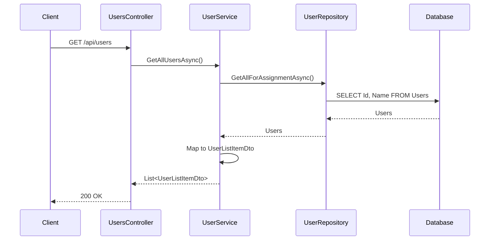
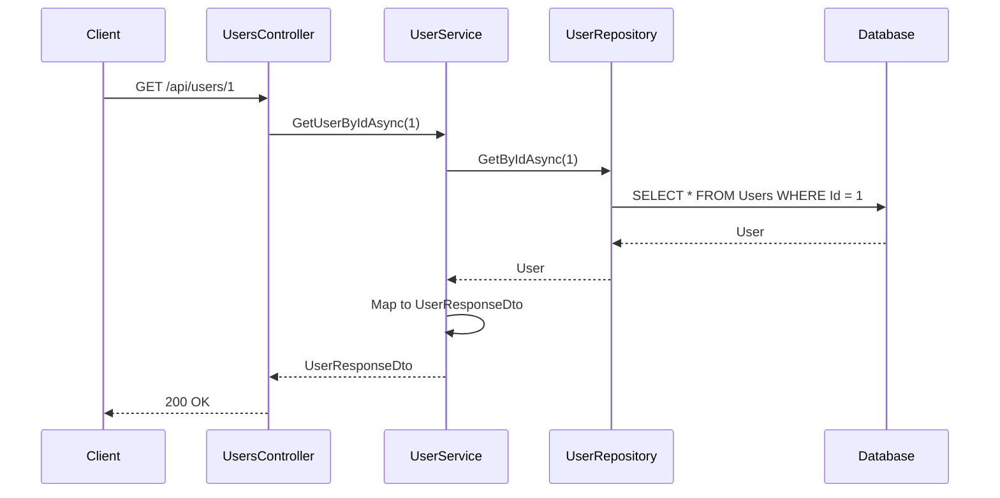

# User - Presentation Layer

## UsersController

**File:** `Controllers/UsersController.cs`
**Route:** `/api/users`

---

## Endpoints Overview

| Method | Endpoint | Description | Auth |
|--------|----------|-------------|------|
| GET | `/api/users` | Get all users (for assignment) | Yes |
| GET | `/api/users/{id}` | Get user details | Yes |

---

## GET `/api/users`

### Description
Get all users for the task assignment dropdown. Returns minimal user info (id, name, initials).

### Request

**Headers:**
```
Authorization: Bearer {token}
```

### Response

**Success (200 OK):**
```json
[
  {
    "id": 1,
    "name": "John Doe",
    "initials": "JD"
  },
  {
    "id": 2,
    "name": "Jane Smith",
    "initials": "JS"
  },
  {
    "id": 3,
    "name": "Mike Johnson",
    "initials": "MJ"
  }
]
```

### Action Method

```csharp
[HttpGet]
[Authorize]
[ProducesResponseType(typeof(IEnumerable<UserListItemDto>), StatusCodes.Status200OK)]
public async Task<IActionResult> GetUsers();
```

### Implementation Logic

1. Call `_userService.GetAllUsersAsync()`
2. Return Ok with list of UserListItemDto

### Flow Diagram



---

## GET `/api/users/{id}`

### Description
Get detailed information about a specific user.

### Request

**Headers:**
```
Authorization: Bearer {token}
```

**Path Parameters:**
| Parameter | Type | Description |
|-----------|------|-------------|
| id | int | User ID |

### Response

**Success (200 OK):**
```json
{
  "id": 1,
  "name": "John Doe",
  "email": "john.doe@example.com",
  "username": "johndoe",
  "role": "Admin",
  "createdAt": "2025-11-01T08:00:00Z"
}
```

**Error (404 Not Found):**
```json
{
  "error": "Not Found",
  "message": "User not found"
}
```

### Action Method

```csharp
[HttpGet("{id}")]
[Authorize]
[ProducesResponseType(typeof(UserResponseDto), StatusCodes.Status200OK)]
[ProducesResponseType(typeof(ErrorResponseDto), StatusCodes.Status404NotFound)]
public async Task<IActionResult> GetUser(int id);
```

### Implementation Logic

1. Call `_userService.GetUserByIdAsync(id)`
2. If user is null, return 404 NotFound with ErrorResponseDto
3. Return Ok with UserResponseDto

### Flow Diagram



---

## DTOs

### Response DTOs

**Location:** `Controllers/DTOs/User/`

| DTO | Fields | Usage |
|-----|--------|-------|
| `UserListItemDto` | id, name, initials | Assignment dropdown |
| `UserResponseDto` | id, name, email, username, role, createdAt | Full user profile |

---

## Controller Dependencies

| Dependency | Description |
|------------|-------------|
| `IUserService` | User business logic |

---

## Related Documentation

- [User Application Layer](./Application.md)
- [User Data Layer](./Data.md)
- [Layer Architecture](../Layer-Architecture.md)
