# Backend Layer Architecture

## Task Collaboration System - Two-Tier Architecture

This document defines the layered architecture for the ASP.NET Core Web API backend based on the Final Project PDF requirements.

---

## Architecture Overview

```mermaid
flowchart TD
    CLIENT[Client / React Frontend]

    CLIENT -->|HTTP/WebSocket| PL

    subgraph PL["🔵 PRESENTATION LAYER"]
        subgraph Controllers
            AC[AuthController]
            TC[TasksController]
            UC[UsersController]
        end
        subgraph Hubs
            TH[TaskHub]
        end
        subgraph DTOs
            AD[Auth DTOs]
            TD[Task DTOs]
            UD[User DTOs]
        end
    end

    PL --> AL

    subgraph AL["🟠 APPLICATION LAYER"]
        subgraph Business Services
            AS[IAuthService]
            TS[ITaskService]
            US[IUserService]
        end
        subgraph Infrastructure Services
            CACHE[ICacheService]
            NOTIF[INotificationService]
        end
        subgraph Background Services
            ARCHIVE[TaskArchiveBackgroundService]
        end
    end

    AL --> DL
    ARCHIVE --> DL

    subgraph DL["🟢 DATA LAYER"]
        subgraph Repositories
            GR[IRepository‹T›]
            UR[IUserRepository]
            TR[ITaskRepository]
        end
        subgraph Unit of Work
            UW[IUnitOfWork]
        end
    end

    DL --> DB

    subgraph DB["💾 DATABASE"]
        CTX[ApplicationDbContext]
        SEED[DbSeeder]
        subgraph Entities
            USER[User]
            TASK[TaskItem]
        end
    end

    %% Detailed connections
    AC --> AS
    TC --> TS
    UC --> US

    AS --> UW
    TS --> UW
    TS --> CACHE
    TS --> NOTIF
    US --> UW

    UW --> UR
    UW --> TR

    UR --> CTX
    TR --> CTX

    style PL fill:#e1f5fe,stroke:#0288d1
    style AL fill:#fff3e0,stroke:#f57c00
    style DL fill:#e8f5e9,stroke:#388e3c
    style DB fill:#fce4ec,stroke:#c2185b
```



---

## Layer Descriptions

### 1. Presentation Layer

HTTP request/response handling and real-time communication.

#### Controllers

| Controller | Endpoints | Description |
|------------|-----------|-------------|
| `AuthController` | `/api/auth/*` | Authentication & Authorization |
| `TasksController` | `/api/tasks/*` | Task CRUD operations |
| `UsersController` | `/api/users/*` | User management |

##### AuthController Endpoints

| Method | Endpoint | Description | Auth |
|--------|----------|-------------|------|
| POST | `/api/auth/register` | User registration | No |
| POST | `/api/auth/login` | Login with username/password | No |
| POST | `/api/auth/google` | Google OAuth callback | No |
| POST | `/api/auth/refresh` | Refresh JWT token | No |
| GET | `/api/auth/me` | Get current user info | Yes |

##### TasksController Endpoints

| Method | Endpoint | Description | Auth |
|--------|----------|-------------|------|
| GET | `/api/tasks` | Get all tasks (with pagination/filtering) | Yes |
| GET | `/api/tasks/{id}` | Get single task (with X-Cache header) | Yes |
| POST | `/api/tasks` | Create new task | Yes |
| PUT | `/api/tasks/{id}` | Update task | Yes |
| DELETE | `/api/tasks/{id}` | Delete task | Yes |
| GET | `/api/tasks/my` | Get current user's created tasks | Yes |
| GET | `/api/tasks/assigned` | Get tasks assigned to current user | Yes |

##### UsersController Endpoints

| Method | Endpoint | Description | Auth |
|--------|----------|-------------|------|
| GET | `/api/users` | Get all users (for assignment dropdown) | Yes |
| GET | `/api/users/{id}` | Get user details | Yes |

#### Request Validation

**Validation Method:** Data Annotations (or FluentValidation)

##### Registration Validation

| Field | Rules |
|-------|-------|
| Name | Required, MaxLength(100) |
| Email | Required, EmailAddress, Unique |
| Username | Required, MinLength(3), MaxLength(50), Unique |
| Password | Required, MinLength(8), must contain uppercase, lowercase, number |

##### Task Validation

| Field | Rules |
|-------|-------|
| Title | Required, MaxLength(200) |
| Description | Optional, MaxLength(2000) |
| Status | Required, must be valid enum value |
| AssignedToId | Optional, must exist in Users table |

#### HTTP Status Codes

| Status Code | Usage |
|-------------|-------|
| 200 OK | Successful GET, PUT requests |
| 201 Created | Successful POST (resource created) |
| 400 Bad Request | Validation errors, invalid input |
| 401 Unauthorized | Missing or invalid JWT token |
| 403 Forbidden | User lacks permission for action |
| 404 Not Found | Resource does not exist |
| 500 Internal Server Error | Unexpected server error |

#### API Documentation

| Tool | URL | Description |
|------|-----|-------------|
| Swagger UI | `/swagger` | Interactive API documentation |
| OpenAPI JSON | `/swagger/v1/swagger.json` | OpenAPI 3.0 specification |

#### SignalR Hub

| Hub | URL | Description |
|-----|-----|-------------|
| `TaskHub` | `/hubs/tasks` | Real-time task notifications |

##### Hub Methods (Server)

| Method | Description |
|--------|-------------|
| `JoinBoard` | Join the task board room for updates |
| `LeaveBoard` | Leave the task board room |

##### Hub Events (Client)

| Event | Recipients | Trigger |
|-------|------------|---------|
| `TaskCreated` | All connected users | When any user creates a task |
| `TaskAssigned` | Assigned user only | When a task is assigned to a user |
| `TaskUpdated` | Task creator only | When assignee updates task status |
| `TaskDeleted` | All connected users | When any task is deleted |

---

### 2. Application Layer

Business logic, orchestration, caching, and background processing.

#### Business Services

##### IAuthService

| Method | Description |
|--------|-------------|
| `LoginAsync(usernameOrEmail, password)` | Authenticate user and return JWT |
| `RegisterAsync(registerDto)` | Create new user account |
| `GoogleAuthAsync(idToken)` | Authenticate via Google OAuth |
| `RefreshTokenAsync(refreshToken)` | Generate new JWT from refresh token |
| `GetCurrentUserAsync(userId)` | Get current user's profile |
| `GenerateJwtToken(user)` | Create JWT with claims |
| `HashPassword(password)` | Hash password using BCrypt |
| `VerifyPassword(hash, password)` | Verify password against hash |

##### ITaskService

| Method | Description |
|--------|-------------|
| `GetTasksAsync(queryParams)` | Get tasks with pagination/filtering |
| `GetTaskByIdAsync(id)` | Get single task (with caching) |
| `CreateTaskAsync(dto, userId)` | Create task and notify users |
| `UpdateTaskAsync(id, dto, userId)` | Update task and notify if needed |
| `DeleteTaskAsync(id, userId)` | Delete task and notify users |
| `GetMyTasksAsync(userId)` | Get tasks created by user |
| `GetAssignedTasksAsync(userId)` | Get tasks assigned to user |
| `CanUserEditTask(task, userId, role)` | Check edit permission |
| `CanUserDeleteTask(task, userId, role)` | Check delete permission |

##### IUserService

| Method | Description |
|--------|-------------|
| `GetAllUsersAsync()` | Get all users for assignment |
| `GetUserByIdAsync(id)` | Get user by ID |

#### Infrastructure Services

##### ICacheService (IMemoryCache Wrapper)

| Method | Description |
|--------|-------------|
| `GetAsync<T>(key)` | Get cached item |
| `SetAsync<T>(key, value, ttl)` | Set cached item with TTL |
| `RemoveAsync(key)` | Remove cached item |

**Caching Rules:**
- Cache key format: `task_{id}`
- TTL: 5 minutes (configurable)
- Invalidate on: PUT/DELETE operations
- Response header: `X-Cache: HIT` or `X-Cache: MISS`
- Simulate 2-second database delay for demonstration

##### INotificationService (SignalR Wrapper)

| Method | Recipients | Description |
|--------|------------|-------------|
| `NotifyTaskCreatedAsync(task)` | All users | Broadcast task creation |
| `NotifyTaskAssignedAsync(task)` | Assigned user | Notify assignment |
| `NotifyTaskStatusUpdatedAsync(task)` | Task creator | Notify status change |
| `NotifyTaskDeletedAsync(taskId, title)` | All users | Broadcast deletion |

#### Background Services

##### TaskArchiveBackgroundService (IHostedService)

**Execution:** Every 2 seconds

**Logic:**
1. Find tasks matching ALL conditions:
   - `Status = "Done"`
   - `UpdatedAt > 5 seconds ago`
   - `IsArchived = false`
2. For each matching task:
   - Set `IsArchived = true`
   - Set `ArchivedAt = DateTime.UtcNow`
3. Do NOT delete tasks from database
4. Log archival operations

**Requirements:**
- Use `CancellationToken` for graceful shutdown
- Implement proper logging

---

### 3. Data Layer

Data access abstraction and persistence.

#### Repository Pattern

##### IRepository<T> (Generic Base)

| Method | Description |
|--------|-------------|
| `GetByIdAsync(id)` | Get entity by ID |
| `GetAllAsync()` | Get all entities |
| `AddAsync(entity)` | Add new entity |
| `Update(entity)` | Update existing entity |
| `Delete(entity)` | Delete entity |
| `FindAsync(predicate)` | Find entities by condition |

##### IUserRepository

| Method | Description |
|--------|-------------|
| `FindByEmailAsync(email)` | Find user by email |
| `FindByUsernameAsync(username)` | Find user by username |
| `FindByEmailOrUsernameAsync(value)` | Find user by email or username |
| `ExistsAsync(email, username)` | Check if user exists |

##### ITaskRepository

| Method | Description |
|--------|-------------|
| `GetTasksWithFilterAsync(queryParams)` | Get tasks with pagination/filtering |
| `GetTasksByCreatorAsync(userId)` | Get tasks created by user |
| `GetTasksByAssigneeAsync(userId)` | Get tasks assigned to user |
| `GetTasksToArchiveAsync()` | Get tasks ready for archiving |
| `GetTaskWithDetailsAsync(id)` | Get task with Creator/Assignee included |

#### Unit of Work Pattern

##### IUnitOfWork

| Property/Method | Description |
|-----------------|-------------|
| `Users` | IUserRepository instance |
| `Tasks` | ITaskRepository instance |
| `SaveChangesAsync()` | Persist all changes |
| `BeginTransactionAsync()` | Start transaction |
| `CommitAsync()` | Commit transaction |
| `RollbackAsync()` | Rollback transaction |

#### Database Context

##### ApplicationDbContext

| DbSet | Entity |
|-------|--------|
| `Users` | User |
| `Tasks` | TaskItem |

**Configuration:**
- Database: EF Core In-Memory (`UseInMemoryDatabase`)
- Relationships configured in `OnModelCreating`

##### DbSeeder

**Seed Data:**
- 1 Admin user (configurable email)
- 4 Regular users
- Sample tasks for demonstration

---

## Entity Models

### User

| Column | Type | Constraints |
|--------|------|-------------|
| Id | int | Primary Key |
| Name | string | Required |
| Email | string | Unique, Required |
| Username | string | Unique, Required |
| PasswordHash | string | Required |
| Role | string | Required ("Admin" or "User") |
| CreatedAt | DateTime | Required |

**Navigation Properties:**
- `CreatedTasks`: Collection of tasks created by user
- `AssignedTasks`: Collection of tasks assigned to user

### TaskItem

| Column | Type | Constraints |
|--------|------|-------------|
| Id | int | Primary Key |
| Title | string | Required |
| Description | string | Nullable |
| Status | TaskStatus | Required |
| CreatedById | int | Foreign Key → User |
| AssignedToId | int? | Foreign Key → User, Nullable |
| CreatedAt | DateTime | Required |
| UpdatedAt | DateTime | Required |
| IsArchived | bool | Required, Default: false |
| ArchivedAt | DateTime? | Nullable |

**Navigation Properties:**
- `CreatedBy`: User who created the task
- `AssignedTo`: User assigned to the task

---

## Enums

### TaskStatus

| Value | Description | Background | Text Color |
|-------|-------------|------------|------------|
| ToDo | Not started | #dfe1e6 | #5e6c84 |
| Development | In progress | #deebff | #0052cc |
| Review | Under review | #fff0b3 | #ff991f |
| Merge | Ready to merge | #eae6ff | #6554c0 |
| Done | Completed | #e3fcef | #00875a |

### UserRole

| Value | Description |
|-------|-------------|
| Admin | Full access to all tasks, can see archived |
| User | Can only edit own tasks or assigned tasks (status only) |

---

## Project Folder Structure

```
Backend/
└── TaskCollaborationApp.API/
    │
    │── ─────────────────────────────────────────────────────────
    │   PRESENTATION LAYER
    │── ─────────────────────────────────────────────────────────
    │
    ├── Controllers/
    │   ├── AuthController.cs
    │   ├── TasksController.cs
    │   ├── UsersController.cs
    │   └── DTOs/                        ← API Request/Response DTOs
    │       ├── Auth/
    │       │   ├── LoginRequestDto.cs
    │       │   ├── LoginResponseDto.cs
    │       │   ├── RegisterRequestDto.cs
    │       │   ├── RefreshTokenRequestDto.cs
    │       │   └── GoogleAuthRequestDto.cs
    │       ├── Task/
    │       │   ├── TaskResponseDto.cs
    │       │   ├── TaskListItemDto.cs
    │       │   ├── CreateTaskRequestDto.cs
    │       │   ├── UpdateTaskRequestDto.cs
    │       │   └── TaskQueryParams.cs
    │       ├── User/
    │       │   ├── UserResponseDto.cs
    │       │   └── UserListItemDto.cs
    │       └── Common/
    │           ├── PagedResponseDto.cs
    │           └── ErrorResponseDto.cs
    │
    ├── Hubs/
    │   └── TaskHub.cs
    │
    ├── Middleware/
    │   └── ExceptionHandlingMiddleware.cs
    │
    │── ─────────────────────────────────────────────────────────
    │   APPLICATION LAYER
    │── ─────────────────────────────────────────────────────────
    │
    ├── Services/
    │   ├── Interfaces/
    │   │   ├── IAuthService.cs
    │   │   ├── ITaskService.cs
    │   │   ├── IUserService.cs
    │   │   ├── ICacheService.cs
    │   │   └── INotificationService.cs
    │   ├── AuthService.cs
    │   ├── TaskService.cs
    │   ├── UserService.cs
    │   ├── CacheService.cs
    │   └── NotificationService.cs
    │
    ├── BackgroundServices/
    │   └── TaskArchiveBackgroundService.cs
    │
    │── ─────────────────────────────────────────────────────────
    │   DATA LAYER
    │── ─────────────────────────────────────────────────────────
    │
    ├── Data/
    │   ├── Entities/                    ← Database Entity Models
    │   │   ├── User.cs
    │   │   └── TaskItem.cs
    │   ├── Enums/                       ← Entity-related Enums
    │   │   ├── TaskStatus.cs
    │   │   └── UserRole.cs
    │   ├── ApplicationDbContext.cs
    │   └── DbSeeder.cs
    │
    ├── Repositories/
    │   ├── Interfaces/
    │   │   ├── IRepository.cs
    │   │   ├── IUserRepository.cs
    │   │   ├── ITaskRepository.cs
    │   │   └── IUnitOfWork.cs
    │   ├── Repository.cs
    │   ├── UserRepository.cs
    │   ├── TaskRepository.cs
    │   └── UnitOfWork.cs
    │
    │── ─────────────────────────────────────────────────────────
    │   CONFIGURATION
    │── ─────────────────────────────────────────────────────────
    │
    ├── Configuration/
    │   └── JwtSettings.cs
    │
    ├── Program.cs
    ├── appsettings.json
    └── appsettings.Development.json
```

### Folder Organization Rationale

| Folder | Layer | Contents |
|--------|-------|----------|
| `Controllers/` | Presentation | API endpoints |
| `Controllers/DTOs/` | Presentation | Request/Response objects for API |
| `Hubs/` | Presentation | SignalR real-time communication |
| `Middleware/` | Presentation | HTTP pipeline middleware |
| `Services/` | Application | Business logic |
| `BackgroundServices/` | Application | Scheduled background jobs |
| `Data/Entities/` | Data | Database entity models |
| `Data/Enums/` | Data | Entity-related enumerations |
| `Repositories/` | Data | Data access abstraction |

---

## Dependency Injection Registration

```csharp
// Program.cs

// 1. Database
builder.Services.AddDbContext<ApplicationDbContext>(options =>
    options.UseInMemoryDatabase("TaskCollaborationDb"));

// 2. Repositories
builder.Services.AddScoped(typeof(IRepository<>), typeof(Repository<>));
builder.Services.AddScoped<IUserRepository, UserRepository>();
builder.Services.AddScoped<ITaskRepository, TaskRepository>();
builder.Services.AddScoped<IUnitOfWork, UnitOfWork>();

// 3. Services
builder.Services.AddScoped<IAuthService, AuthService>();
builder.Services.AddScoped<ITaskService, TaskService>();
builder.Services.AddScoped<IUserService, UserService>();
builder.Services.AddScoped<INotificationService, NotificationService>();
builder.Services.AddSingleton<ICacheService, CacheService>();

// 4. Background Services
builder.Services.AddHostedService<TaskArchiveBackgroundService>();

// 5. Caching
builder.Services.AddMemoryCache();

// 6. SignalR
builder.Services.AddSignalR();

// 7. Authentication
builder.Services.AddAuthentication(JwtBearerDefaults.AuthenticationScheme)
    .AddJwtBearer(options => { /* JWT configuration */ });

// 8. CORS
builder.Services.AddCors(options =>
{
    options.AddPolicy("AllowFrontend", policy =>
    {
        policy.WithOrigins("http://localhost:3000", "http://localhost:5173")
              .AllowAnyHeader()
              .AllowAnyMethod()
              .AllowCredentials();
    });
});
```

---

## Authorization Rules

### Regular Users
- Can create tasks
- Can edit/delete only their **own created** tasks
- Can edit tasks **assigned to them** (status only)
- Can view tasks assigned to them
- Cannot see "All Tasks" page
- Cannot see archived tasks

### Admin Users
- Can edit/delete **any** task
- Can see "All Tasks" page with filters
- Can assign tasks to anyone
- Can change any task status
- Can view archived tasks (`includeArchived=true`)

---

## Configuration Requirements

| Setting | Value | Location |
|---------|-------|----------|
| JWT Secret Key | Secure random string | appsettings.json |
| Token Expiry | 7 days | appsettings.json |
| Admin User Email | Configurable | appsettings.json |
| Cache TTL | 5 minutes | appsettings.json |
| Archive Interval | 2 seconds | appsettings.json |
| Database Delay | 2 seconds | For caching demo |

---

## Related Documentation

- [API Contract Documentation](../API-Contract-Documentation.md)
- [Interface Definitions](./Interface-Definitions.md) (TODO)

---

*Document created for Task Collaboration System - Two-Tier Architecture*
*Based on Final Project PDF Requirements (18 marks Backend)*
