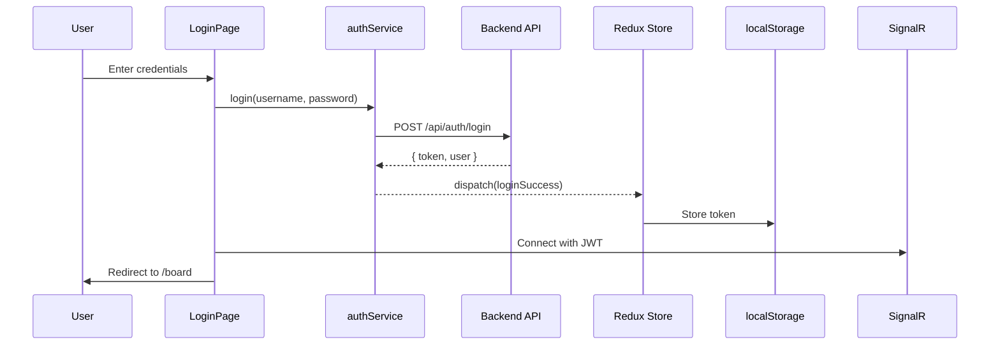

# Auth Feature

## Overview

| Item | Value |
|------|-------|
| Folder | `src/features/auth/` |
| Redux Slice | `authSlice.ts` |
| Related Pages | LoginPage, RegisterPage |
| Backend Domain | Auth |

---

## Folder Structure

```
features/auth/
├── components/
│   ├── LoginForm.tsx
│   ├── RegisterForm.tsx
│   └── GoogleAuthButton.tsx
├── hooks/
│   ├── useAuth.ts
│   └── useAuthGuard.ts
├── services/
│   └── authService.ts
├── types.ts
└── authSlice.ts
```

---

## State Structure (authSlice)

| Property | Type | Description |
|----------|------|-------------|
| `user` | `User \| null` | Current logged-in user info |
| `token` | `string \| null` | JWT access token |
| `isAuthenticated` | `boolean` | Whether user is logged in |
| `loading` | `boolean` | API call in progress |
| `error` | `string \| null` | Error message from last operation |

### User Type

| Property | Type | Description |
|----------|------|-------------|
| `id` | `number` | User ID |
| `name` | `string` | Display name |
| `email` | `string` | Email address |
| `username` | `string` | Username |
| `role` | `'Admin' \| 'User'` | User role |

---

## Actions & Thunks

| Action | Type | API Endpoint | Description |
|--------|------|--------------|-------------|
| `login` | Async Thunk | `POST /api/auth/login` | Login with username/password |
| `register` | Async Thunk | `POST /api/auth/register` | Create new account |
| `googleAuth` | Async Thunk | `POST /api/auth/google` | Google OAuth authentication |
| `refreshToken` | Async Thunk | `POST /api/auth/refresh` | Refresh JWT token |
| `fetchCurrentUser` | Async Thunk | `GET /api/auth/me` | Get current user info |
| `logout` | Reducer | - | Clear token and state |
| `clearError` | Reducer | - | Clear error message |

---

## Services (authService.ts)

| Function | Parameters | Returns | Description |
|----------|------------|---------|-------------|
| `login` | `{ username, password }` | `{ token, user }` | Authenticate with credentials |
| `register` | `{ name, email, username, password }` | `{ token, user }` | Create new account |
| `googleAuth` | `{ idToken }` | `{ token, user }` | Authenticate with Google |
| `refreshToken` | `{ refreshToken }` | `{ token }` | Get new access token |
| `getCurrentUser` | - | `User` | Get current user profile |

---

## Components

### LoginForm

| Element | Description |
|---------|-------------|
| Username input | Text input for username or email |
| Password input | Password input with visibility toggle |
| Submit button | "Sign In" button, disabled during loading |
| Error display | Inline error message on validation/auth failure |

### RegisterForm

| Element | Description |
|---------|-------------|
| Name input | Full name (required) |
| Email input | Email with validation (required, unique) |
| Username input | Username (required, min 3 chars, unique) |
| Password input | Password (required, min 8 chars, complexity rules) |
| Submit button | "Create Account" button |
| Login link | "Already have an account? Sign in" |

### GoogleAuthButton

| Element | Description |
|---------|-------------|
| Google button | "Sign in with Google" styled button |
| Loading state | Spinner during OAuth flow |

---

## Hooks

### useAuth

```typescript
const { user, isAuthenticated, loading, error, login, logout, register } = useAuth();
```

| Return Value | Type | Description |
|--------------|------|-------------|
| `user` | `User \| null` | Current user |
| `isAuthenticated` | `boolean` | Auth status |
| `loading` | `boolean` | Loading state |
| `error` | `string \| null` | Error message |
| `login` | `function` | Login action dispatcher |
| `logout` | `function` | Logout action dispatcher |
| `register` | `function` | Register action dispatcher |

### useAuthGuard

```typescript
useAuthGuard({ requireAuth: true, requireAdmin: false });
```

| Parameter | Type | Default | Description |
|-----------|------|---------|-------------|
| `requireAuth` | `boolean` | `true` | Redirect to login if not authenticated |
| `requireAdmin` | `boolean` | `false` | Redirect to board if not admin |

---

## Pages

### LoginPage

| Feature | Description |
|---------|-------------|
| Path | `/login` |
| Auth Required | No |
| Components | LoginForm, GoogleAuthButton |
| Navigation | Link to RegisterPage |
| On Success | Redirect to `/board`, connect SignalR |

### RegisterPage

| Feature | Description |
|---------|-------------|
| Path | `/register` |
| Auth Required | No |
| Components | RegisterForm |
| Navigation | Link to LoginPage |
| On Success | Redirect to `/board`, connect SignalR |

---

## Authentication Flow



---

## Token Management

| Action | Behavior |
|--------|----------|
| Login Success | Store token in `localStorage`, set in Redux state |
| Page Refresh | Read token from `localStorage`, validate, restore state |
| Token Expired | Intercept 401, attempt refresh, redirect to login if failed |
| Logout | Clear `localStorage`, clear Redux state, disconnect SignalR |

---

## Validation Rules

### Login

| Field | Rules |
|-------|-------|
| Username | Required |
| Password | Required |

### Registration

| Field | Rules |
|-------|-------|
| Name | Required, max 100 characters |
| Email | Required, valid email format, unique |
| Username | Required, 3-50 characters, unique |
| Password | Required, min 8 characters, must contain uppercase, lowercase, number |

---

## Related Documentation

- [Frontend Architecture](../Frontend-Architecture.md)
- [Login Page API Contract](../../api-contracts/01-Login-Page-Contract.md)
- [Registration Page API Contract](../../api-contracts/02-Registration-Page-Contract.md)
