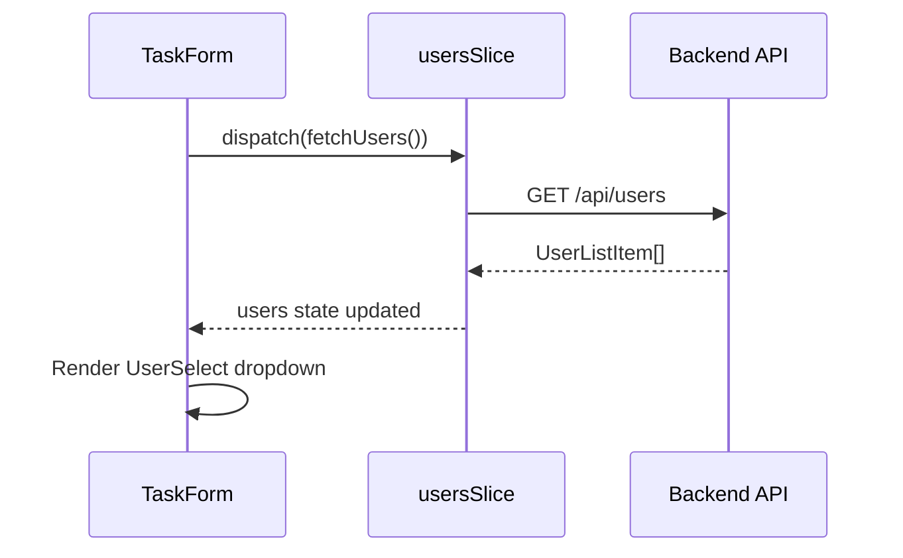

# Users Feature

## Overview

| Item | Value |
|------|-------|
| Folder | `src/features/users/` |
| Redux Slice | `usersSlice.ts` |
| Related Pages | Used in TaskForm (assignment dropdown) |
| Backend Domain | User |

---

## Folder Structure

```
features/users/
├── components/
│   └── UserSelect.tsx
├── hooks/
│   └── useUsers.ts
├── services/
│   └── userService.ts
├── types.ts
└── usersSlice.ts
```

---

## State Structure (usersSlice)

| Property | Type | Description |
|----------|------|-------------|
| `users` | `UserListItem[]` | List of all users |
| `loading` | `boolean` | API call in progress |
| `error` | `string \| null` | Error message |

### UserListItem Type

| Property | Type | Description |
|----------|------|-------------|
| `id` | `number` | User ID |
| `name` | `string` | Display name |
| `email` | `string` | Email address |
| `username` | `string` | Username |

---

## Actions & Thunks

| Action | Type | API Endpoint | Description |
|--------|------|--------------|-------------|
| `fetchUsers` | Async Thunk | `GET /api/users` | Get all users for assignment dropdown |
| `fetchUserById` | Async Thunk | `GET /api/users/:id` | Get single user details |

---

## Services (userService.ts)

| Function | Parameters | Returns | Description |
|----------|------------|---------|-------------|
| `getUsers` | - | `UserListItem[]` | Get all users |
| `getUserById` | `id` | `User` | Get user by ID |

---

## Components

### UserSelect

Dropdown component for selecting a user (used in task assignment).

| Prop | Type | Description |
|------|------|-------------|
| `value` | `number \| null` | Selected user ID |
| `onChange` | `(userId: number \| null) => void` | Selection handler |
| `placeholder` | `string` | Placeholder text |
| `disabled` | `boolean` | Disable selection |

| Feature | Description |
|---------|-------------|
| Options | All users from Redux state |
| Display | User name (username) |
| Empty Option | "Unassigned" option |
| Loading State | Spinner while fetching users |

---

## Usage Example

```typescript
// In TaskForm component
import { UserSelect } from '@/features/users/components/UserSelect';
import { useUsers } from '@/features/users/hooks/useUsers';

const TaskForm = () => {
  const { users, loading } = useUsers();
  const [assignedToId, setAssignedToId] = useState<number | null>(null);

  return (
    <UserSelect
      value={assignedToId}
      onChange={setAssignedToId}
      placeholder="Select assignee"
      disabled={loading}
    />
  );
};
```

---

## Data Flow



---

## Related Documentation

- [Frontend Architecture](../Frontend-Architecture.md)
- [Tasks Feature](./Tasks.md) - Uses UserSelect for assignment
