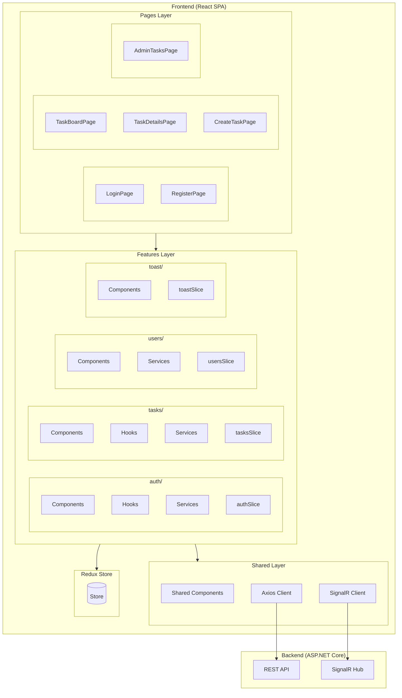
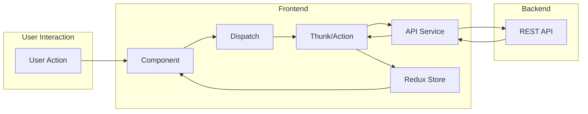
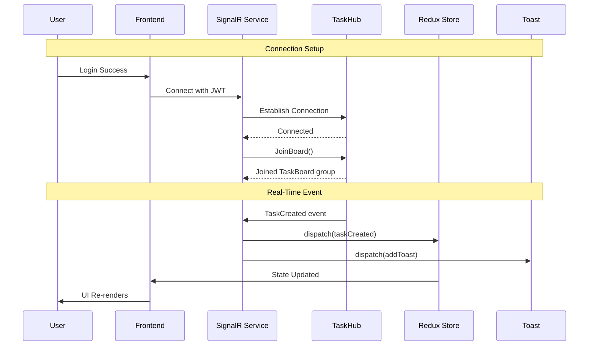
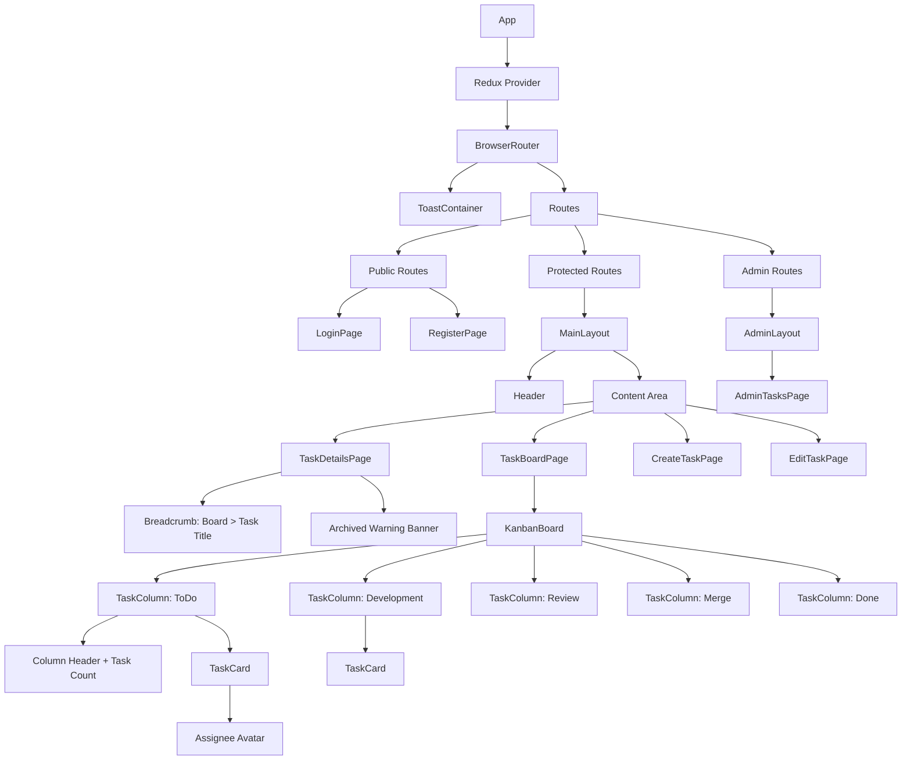
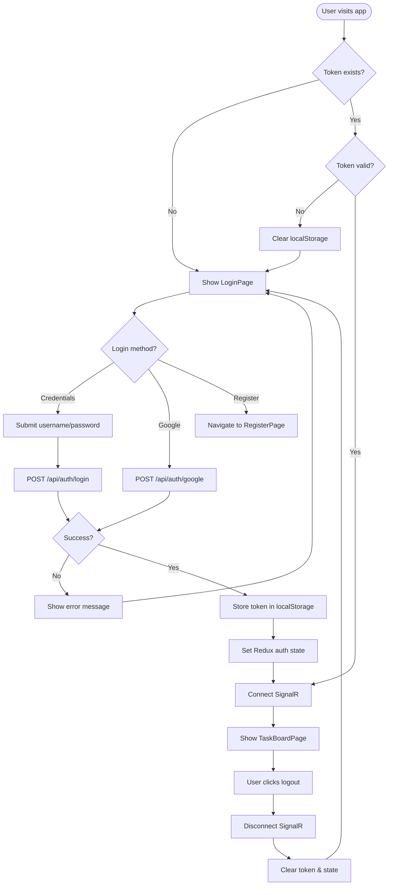

# Frontend Architecture

## Overview

React-based Single Page Application consuming the Backend API. This document describes the overall architecture following **Feature-Based Architecture** pattern, which is the industry-recommended approach for scalable React applications in 2025.

| Item | Value |
|------|-------|
| Framework | React 18 + TypeScript |
| State Management | Redux Toolkit |
| HTTP Client | Axios |
| Real-time | @microsoft/signalr |
| Routing | React Router v6 |
| Styling | Tailwind CSS |
| Build Tool | Vite |

---

## Architecture Overview



---

## Data Flow Diagram



---

## SignalR Real-Time Flow



---

## Component Hierarchy



---

## Authentication Flow



---

## Architecture Pattern: Feature-Based

Feature-Based Architecture organizes code by **business domain** rather than technical type. This approach keeps related files together, making the codebase easier to understand and maintain.

### Why Feature-Based?

| Approach | Structure | Problem |
|----------|-----------|---------|
| **Type-Based** (old) | All components in `/components`, all hooks in `/hooks` | Files scattered across folders, hard to find related code |
| **Feature-Based** (recommended) | Each feature has its own components, hooks, services | Related code stays together, mirrors backend domains |

### Comparison with Backend

| Backend (Domain-based) | Frontend (Feature-based) |
|------------------------|--------------------------|
| `Auth/` domain | `auth/` feature |
| `User/` domain | `users/` feature |
| `Task/` domain | `tasks/` feature |
| Presentation → Application → Data layers | Components → Hooks → Services layers |

---

## Project Structure

```
src/
├── app/                      # Application setup
│   ├── store.ts              # Redux store configuration
│   ├── hooks.ts              # Typed Redux hooks
│   └── router.tsx            # Route definitions
│
├── features/                 # Feature modules (business domains)
│   ├── auth/                 # Authentication feature
│   │   ├── components/       # Auth-specific components
│   │   ├── hooks/            # Auth-specific hooks
│   │   ├── services/         # Auth API calls
│   │   ├── types.ts          # Auth type definitions
│   │   └── authSlice.ts      # Auth Redux slice
│   │
│   ├── tasks/                # Tasks feature
│   │   ├── components/       # Task-specific components
│   │   ├── hooks/            # Task-specific hooks
│   │   ├── services/         # Task API calls
│   │   ├── types.ts          # Task type definitions
│   │   └── tasksSlice.ts     # Tasks Redux slice
│   │
│   ├── users/                # Users feature
│   │   ├── components/       # User-specific components
│   │   ├── services/         # User API calls
│   │   ├── types.ts          # User type definitions
│   │   └── usersSlice.ts     # Users Redux slice
│   │
│   └── toast/                # Toast notifications feature
│       ├── components/       # Toast UI components
│       └── toastSlice.ts     # Toast Redux slice
│
├── components/               # Shared UI components
│   ├── Button.tsx
│   ├── Input.tsx
│   ├── Select.tsx
│   ├── Modal.tsx
│   ├── Avatar.tsx
│   ├── LoadingSpinner.tsx
│   └── StatusBadge.tsx
│
├── layouts/                  # Layout components
│   ├── MainLayout.tsx        # Authenticated layout (header + content)
│   └── AuthLayout.tsx        # Public layout (login/register)
│
├── pages/                    # Route entry points
│   ├── LoginPage.tsx
│   ├── RegisterPage.tsx
│   ├── TaskBoardPage.tsx
│   ├── TaskDetailsPage.tsx
│   ├── CreateTaskPage.tsx
│   ├── EditTaskPage.tsx
│   └── AdminTasksPage.tsx
│
├── services/                 # Shared services
│   ├── api.ts                # Axios instance with interceptors
│   └── signalr.ts            # SignalR connection manager
│
├── utils/                    # Utility functions
│   ├── constants.ts          # App-wide constants
│   └── helpers.ts            # Helper functions
│
├── App.tsx                   # Root component
├── main.tsx                  # Entry point
└── index.css                 # Tailwind imports
```

---

## Feature Module Structure

Each feature follows a consistent internal structure:

```
features/{feature-name}/
├── components/           # UI components specific to this feature
├── hooks/                # Custom hooks for this feature
├── services/             # API calls for this feature
├── types.ts              # TypeScript interfaces
└── {feature}Slice.ts     # Redux slice (state + actions + reducers)
```

### Feature Responsibilities

| Feature | Responsibility | Backend Mapping |
|---------|---------------|-----------------|
| `auth` | Login, Register, Token management, Current user | Auth domain |
| `tasks` | Task CRUD, Board display, Filtering, Caching | Task domain |
| `users` | User list for assignment dropdown | User domain |
| `toast` | Real-time notifications display | SignalR events |

---

## Component Pattern: Container vs Presentational

Each feature uses the **Container-Presentational** pattern to separate concerns:

| Type | Responsibility | Location |
|------|---------------|----------|
| **Container** | Business logic, API calls, state management | `pages/` or feature `components/` |
| **Presentational** | Pure UI rendering, receives props only | `components/` (shared) or feature `components/` |

---

## Routing Structure

| Path | Page | Auth Required | Role |
|------|------|---------------|------|
| `/login` | LoginPage | No | - |
| `/register` | RegisterPage | No | - |
| `/board` | TaskBoardPage | Yes | All |
| `/tasks/:id` | TaskDetailsPage | Yes | All |
| `/tasks/new` | CreateTaskPage | Yes | All |
| `/tasks/:id/edit` | EditTaskPage | Yes | Creator/Assignee/Admin |
| `/admin/tasks` | AdminTasksPage | Yes | Admin only |
| `/` | Redirect to `/board` | - | - |

### Route Protection

- **Public Routes**: Accessible without authentication (Login, Register)
- **Protected Routes**: Require valid JWT token, redirect to `/login` if not authenticated
- **Admin Routes**: Require Admin role, redirect to `/board` if not authorized

> For detailed page specifications, see [Auth Feature](./Features/Auth.md) and [Tasks Feature](./Features/Tasks.md).

---

## State Management: Redux Toolkit

### Store Structure

| Slice | State Contents | Details |
|-------|---------------|---------|
| `auth` | Current user, JWT token, isAuthenticated flag, loading/error states | [Auth.md](./Features/Auth.md) |
| `tasks` | Task list, selected task, pagination, filters, cache status | [Tasks.md](./Features/Tasks.md) |
| `users` | User list for assignment dropdown | [Users.md](./Features/Users.md) |
| `toast` | Array of notification objects (id, type, message) | [Toast.md](./Features/Toast.md) |

---

## API Integration

### Axios Configuration

The shared Axios instance handles:
- Base URL configuration from environment variables
- JWT token injection via request interceptor
- 401 response handling via response interceptor (redirect to login)
- Error response transformation

### API-Feature Mapping

| Feature | Endpoints Used |
|---------|---------------|
| `auth` | POST /auth/login, /auth/register, /auth/google, /auth/refresh, GET /auth/me |
| `tasks` | GET/POST /tasks, GET/PUT/DELETE /tasks/:id, GET /tasks/my, /tasks/assigned |
| `users` | GET /users, GET /users/:id |

### Admin-Only Query Parameters

| Endpoint | Parameter | Description |
|----------|-----------|-------------|
| `GET /api/tasks` | `includeArchived=true` | Include archived tasks in results (Admin only) |

### Cache Header Handling

For `GET /api/tasks/:id`, the `X-Cache` response header indicates whether data came from cache:
- `X-Cache: HIT` → Display "Cached" badge
- `X-Cache: MISS` → Display "Live" badge

---

## Real-Time: SignalR Integration

### Connection Lifecycle

1. User logs in successfully
2. Frontend establishes SignalR connection with JWT token
3. Frontend joins "TaskBoard" group via `JoinBoard()` method
4. Frontend listens for events (TaskCreated, TaskAssigned, TaskUpdated, TaskDeleted)
5. On logout or page close, frontend calls `LeaveBoard()` and disconnects

### Event Handling

| SignalR Event | Redux Action |
|---------------|-------------|
| `TaskCreated` | Add task to list |
| `TaskAssigned` | Update task in list |
| `TaskUpdated` | Update task in list |
| `TaskDeleted` | Remove task from list |

> For event-to-toast mapping and notification details, see [Tasks Feature](./Features/Tasks.md#signalr-event-handling) and [Toast Feature](./Features/Toast.md).

---

## Styling: Tailwind CSS

### Design System (JIRA-inspired)

| Element | Color Code | Usage |
|---------|-----------|-------|
| Primary | `#0052cc` | Buttons, links, headers |
| Status: ToDo | bg: `#dfe1e6`, text: `#5e6c84` | Kanban column, badges |
| Status: Development | bg: `#deebff`, text: `#0052cc` | Kanban column, badges |
| Status: Review | bg: `#fff0b3`, text: `#ff991f` | Kanban column, badges |
| Status: Merge | bg: `#eae6ff`, text: `#6554c0` | Kanban column, badges |
| Status: Done | bg: `#e3fcef`, text: `#00875a` | Kanban column, badges |
| Toast: Success | `#00875a` | Success notifications |
| Toast: Info | `#0052cc` | Info notifications |
| Toast: Warning | `#ff991f` | Warning notifications |
| Toast: Error | `#de350b` | Error notifications |

---

## Authorization Rules

### UI Visibility Matrix

| UI Element | Regular User | Admin |
|------------|-------------|-------|
| Edit button (own task) | Show | Show |
| Edit button (others' task) | Hide | Show |
| Delete button (own task) | Show | Show |
| Delete button (others' task) | Hide | Show |
| "All Tasks" menu | Hide | Show |
| Status dropdown (assigned task) | Show | Show |
| Archived tasks | Hide | Show (with filter) |

### Archived Task Visibility Rules

| User Role | Can See Archived Tasks | How to Access |
|-----------|----------------------|---------------|
| Regular User | No | N/A - Archived tasks are hidden |
| Admin | Yes | Use `includeArchived=true` filter on Admin Tasks page |

> For detailed Admin Tasks page features, see [Tasks Feature](./Features/Tasks.md#admintaskspage).

---

## Loading & Error States

### Loading States

| Scenario | UI Behavior |
|----------|------------|
| Page initial load | Full-page spinner |
| Task list fetching | Skeleton cards in columns |
| Form submission | Button disabled with spinner |
| Single task fetch | Content area spinner |

> For Task Details page layout and UI elements, see [Tasks Feature](./Features/Tasks.md#taskdetailsview).

### Error Handling

| HTTP Status | User Feedback |
|-------------|--------------|
| 400 Bad Request | Display validation errors inline |
| 401 Unauthorized | Redirect to login page |
| 403 Forbidden | Display "Access Denied" message |
| 404 Not Found | Display "Resource not found" message |
| 500 Server Error | Display "Something went wrong. Please try again." |

---

## Toast Notification Rules

| Rule | Implementation |
|------|---------------|
| Position | Fixed top-right corner |
| Auto-dismiss | **NO** - User must click × to close |
| Stacking | Multiple toasts stack vertically |

> For detailed toast styling and SignalR event mapping, see [Toast Feature](./Features/Toast.md).

---

## Environment Configuration

| Variable | Purpose |
|----------|---------|
| `VITE_API_BASE_URL` | Backend API base URL (https://localhost:5001/api) |
| `VITE_SIGNALR_HUB_URL` | SignalR hub URL (https://localhost:5001/hubs/tasks) |
| `VITE_GOOGLE_CLIENT_ID` | Google OAuth client ID |

---

## Related Documentation

- [API Contract Documentation](../API-Contract-Documentation.md)
- [Backend Layer Architecture](../backend/Layer-Architecture.md)
- Feature Implementation Specifications:
  - [Auth Feature](./Features/Auth.md)
  - [Tasks Feature](./Features/Tasks.md)
  - [Users Feature](./Features/Users.md)
  - [Toast Feature](./Features/Toast.md)

---

## Sources

- [GeeksforGeeks - React Architecture Pattern and Best Practices 2025](https://www.geeksforgeeks.org/react-architecture-pattern-and-best-practices/)
- [DEV Community - Frontend Architecture in 2025](https://dev.to/frontendtoolstech/frontend-architecture-in-2025-how-to-structure-large-scale-web-apps-8ke)
- [Maybe.works - React App Architecture: Scalable Patterns](https://maybe.works/blogs/react-architecture)
