# Repository Pattern - Complete Architecture Diagram

## Full System Diagram

```mermaid
flowchart TB
    AuthService["AuthService"]

    subgraph UNITOFWORK_INTERFACE["UNIT OF WORK (Interface)"]
        direction LR
        IUnitOfWork["IUnitOfWork<br/>─────────────<br/>«interface»<br/>+Users: IUserRepository<br/>+SaveChangesAsync()<br/>+BeginTransactionAsync()<br/>+CommitAsync()<br/>+RollbackAsync()"]
        IDisposable["IDisposable<br/>─────────────<br/>«interface»<br/>+Dispose()"]
        IUnitOfWork -.->|extends| IDisposable
    end

    subgraph UNITOFWORK_IMPL["UNIT OF WORK (Implementation)"]
        direction LR
        UnitOfWork["UnitOfWork<br/>─────────────<br/>-_context<br/>-_transaction<br/>+Users<br/>+SaveChangesAsync()<br/>+BeginTransactionAsync()<br/>+CommitAsync()<br/>+RollbackAsync()<br/>+Dispose()"]
    end

    subgraph REPOSITORY_INTERFACE["REPOSITORY (Interface)"]
        direction LR
        IRepository["IRepository‹T›<br/>─────────────<br/>«interface»<br/>+GetByIdAsync()<br/>+GetAllAsync()<br/>+FindAsync()<br/>+AddAsync()<br/>+DeleteAsync()<br/>+EditAsync()"]
        IUserRepository["IUserRepository<br/>─────────────<br/>«interface»<br/>+FindByEmailAsync()<br/>+FindByUsernameAsync()<br/>+FindByEmailOrUsernameAsync()<br/>+ExistsAsync()"]
        IUserRepository -.->|extends| IRepository
    end

    subgraph REPOSITORY_IMPL["REPOSITORY (Implementation)"]
        direction LR
        Repository["Repository‹T›<br/>─────────────<br/>«abstract»<br/>#_context<br/>#_dbSet<br/>+GetByIdAsync()<br/>+GetAllAsync()<br/>+FindAsync()<br/>+AddAsync()<br/>+DeleteAsync()<br/>+EditAsync()"]
        UserRepository["UserRepository<br/>─────────────<br/>+FindByEmailAsync()<br/>+FindByUsernameAsync()<br/>+FindByEmailOrUsernameAsync()<br/>+ExistsAsync()"]
        UserRepository -.->|extends| Repository
    end

    subgraph EFCORE["EF CORE"]
        direction LR
        ApplicationDbContext["ApplicationDbContext<br/>─────────────<br/>+Users: DbSet‹User›<br/>+Tasks: DbSet‹TaskItem›<br/>+SaveChangesAsync()<br/>+Set‹T›()<br/>+Database"]
        DbSet["DbSet‹T›<br/>─────────────<br/>+FindAsync()<br/>+ToListAsync()<br/>+Where()<br/>+AddAsync()<br/>+Remove()<br/>+Update()"]
        DatabaseFacade["DatabaseFacade<br/>─────────────<br/>+BeginTransactionAsync()"]
        IDbContextTransaction["IDbContextTransaction<br/>─────────────<br/>«interface»<br/>+CommitAsync()<br/>+RollbackAsync()<br/>+DisposeAsync()"]
        ApplicationDbContext --> DbSet
        ApplicationDbContext --> DatabaseFacade
        DatabaseFacade --> IDbContextTransaction
    end

    subgraph DI["DI (Program.cs)"]
        direction LR
        ProgramCS["builder.Services<br/>─────────────<br/>AddDbContext‹ApplicationDbContext›()<br/>AddScoped‹IUserRepository, UserRepository›()<br/>AddScoped‹IUnitOfWork, UnitOfWork›()"]
    end

    %% Interface implementations
    UnitOfWork -.->|implements| IUnitOfWork
    Repository -.->|implements| IRepository
    UserRepository -.->|implements| IUserRepository

    %% Client uses interfaces
    AuthService -->|uses| IUnitOfWork

    %% UnitOfWork contains IUserRepository
    UnitOfWork -->|contains| IUserRepository
    IUnitOfWork -->|exposes| IUserRepository

    %% UnitOfWork direct dependencies to EF Core
    UnitOfWork -->|uses| ApplicationDbContext
    UnitOfWork -->|uses| IDbContextTransaction

    %% Repository direct dependencies to EF Core
    Repository -->|uses| ApplicationDbContext
    Repository -->|uses| DbSet

    %% DI registrations
    DI -.->|registers| ApplicationDbContext
    DI -.->|registers| UserRepository
    DI -.->|registers| UnitOfWork
```

## Layer Separation View

```mermaid
flowchart TB
    subgraph CLIENT["🎯 CLIENT LAYER (Consumers)"]
        direction LR
        AC[AuthController]
        AS[AuthService]
        AC --> AS
    end

    subgraph INTERFACE["📋 INTERFACE LAYER (Contracts)"]
        direction LR
        IR["IRepository&lt;T&gt;<br/>───────────<br/>GetByIdAsync()<br/>GetAllAsync()<br/>FindAsync()<br/>AddAsync()<br/>DeleteAsync()<br/>EditAsync()"]
        IUR["IUserRepository<br/>───────────<br/>FindByEmailAsync()<br/>FindByUsernameAsync()<br/>FindByEmailOrUsernameAsync()<br/>ExistsAsync()"]
        IUOW["IUnitOfWork<br/>───────────<br/>Users: IUserRepository<br/>SaveChangesAsync()<br/>BeginTransactionAsync()<br/>CommitAsync()<br/>RollbackAsync()"]

        IUR -->|extends| IR
    end

    subgraph IMPLEMENTATION["⚙️ IMPLEMENTATION LAYER"]
        direction LR
        R["Repository&lt;T&gt;<br/>(abstract)<br/>───────────<br/>#_context<br/>#_dbSet<br/>───────────<br/>All CRUD methods"]
        UR["UserRepository<br/>───────────<br/>FindByEmailAsync()<br/>FindByUsernameAsync()<br/>FindByEmailOrUsernameAsync()<br/>ExistsAsync()"]
        UOW["UnitOfWork<br/>───────────<br/>-_context<br/>-_transaction<br/>+Users<br/>───────────<br/>SaveChangesAsync()<br/>Transaction methods"]

        UR -->|extends| R
    end

    subgraph EFCORE["🗄️ EF CORE LAYER"]
        direction LR
        DBC["ApplicationDbContext<br/>───────────<br/>Users: DbSet&lt;User&gt;<br/>Tasks: DbSet&lt;TaskItem&gt;"]
        DBS["DbSet&lt;T&gt;<br/>───────────<br/>FindAsync()<br/>ToListAsync()<br/>Where()<br/>AddAsync()"]
        DBF["DatabaseFacade<br/>───────────<br/>BeginTransactionAsync()"]
        IDBT["IDbContextTransaction<br/>───────────<br/>CommitAsync()<br/>RollbackAsync()"]

        DBC --> DBS
        DBC --> DBF
        DBF --> IDBT
    end

    subgraph DI["📦 DI CONTAINER (Program.cs)"]
        direction LR
        REG["builder.Services<br/>───────────<br/>AddDbContext&lt;ApplicationDbContext&gt;()<br/>AddScoped&lt;IUserRepository, UserRepository&gt;()<br/>AddScoped&lt;IUnitOfWork, UnitOfWork&gt;()"]
    end

    %% Vertical Flow
    CLIENT -->|uses| INTERFACE
    INTERFACE -->|implemented by| IMPLEMENTATION
    IMPLEMENTATION -->|uses| EFCORE
    DI -->|registers & injects| IMPLEMENTATION
    DI -.->|provides to| CLIENT

    %% Implementation relationships
    R -.->|implements| IR
    UR -.->|implements| IUR
    UOW -.->|implements| IUOW
```

## Method Flow: FindByEmailAsync Example

## DI Injection Flow

## Legend

| Symbol | Meaning |
|--------|---------|
| `<<interface>>` | Interface (contract only) |
| `<<abstract>>` | Abstract class (cannot instantiate) |
| `--|>` | Inheritance (extends) |
| `..|>` | Implementation (implements interface) |
| `-->` | Dependency (uses) |
| `..>` | Weak dependency (registers) |
| `#` | Protected member |
| `-` | Private member |
| `+` | Public member |
