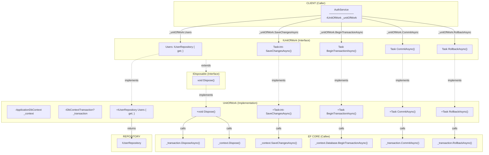

# Unit of Work - Method Signature Connections

## UnitOfWork Method Connection Diagram



## Call Flow Summary

```
AuthService
    │
    ├── _unitOfWork.Users ──────────────→ IUserRepository (Repository Access)
    │
    ├── _unitOfWork.SaveChangesAsync() ─→ _context.SaveChangesAsync() (Persist to DB)
    │
    ├── Transaction Methods:
    │   ├── BeginTransactionAsync() ────→ _context.Database.BeginTransactionAsync()
    │   ├── CommitAsync() ──────────────→ _transaction.CommitAsync()
    │   └── RollbackAsync() ────────────→ _transaction.RollbackAsync()
    │
    └── Dispose() (from IDisposable)
        ├── _transaction?.Dispose()
        └── _context.Dispose()
```

## Interface Inheritance

```
IDisposable          (System)
    │
    └── IUnitOfWork  (Our Interface)
            │
            └── UnitOfWork  (Our Implementation)
```

UnitOfWork must implement `Dispose()` because IUnitOfWork extends IDisposable.

## Legend

| Arrow | Meaning |
|-------|---------|
| `-->` | Method call |
| `-.->` | Implements / Extends |
| `-->│returns│` | Return value |
