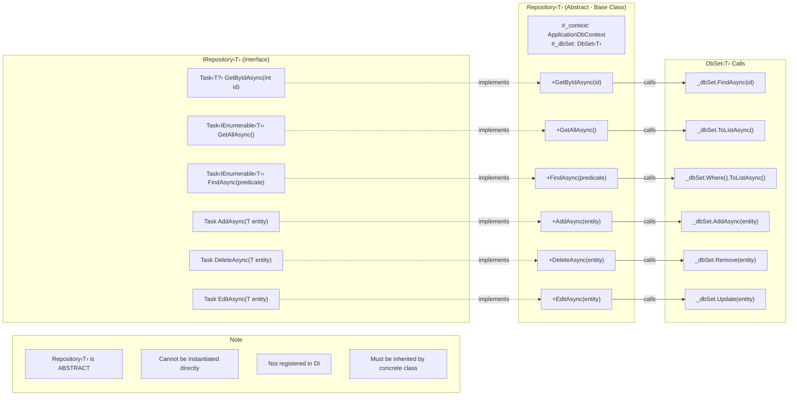
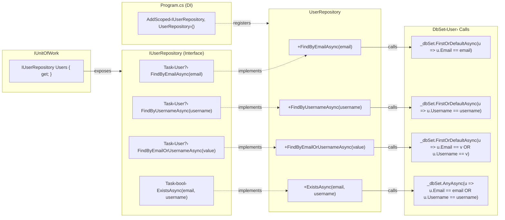
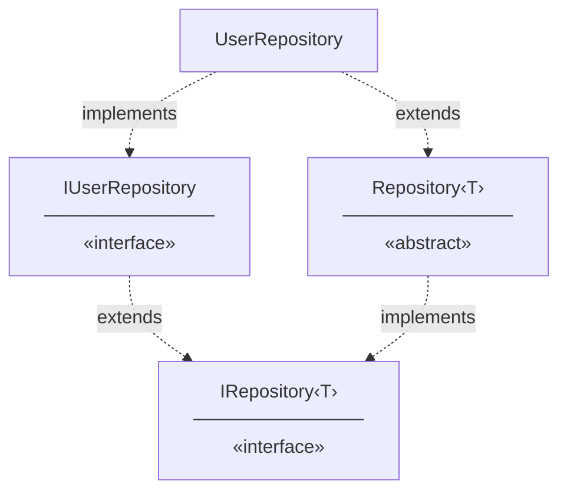

# Repository - Method Signature Connections

## IRepository‹T› Method Connections



## IUserRepository Method Connections



## Inheritance Structure



## Call Flow Summary

```
AuthService (via _unitOfWork.Users)
    │
    ├── IUserRepository Methods (User-specific):
    │   ├── FindByEmailAsync(email) ────────────→ _dbSet.FirstOrDefaultAsync(u => u.Email == email)
    │   ├── FindByUsernameAsync(username) ──────→ _dbSet.FirstOrDefaultAsync(u => u.Username == username)
    │   ├── FindByEmailOrUsernameAsync(value) ──→ _dbSet.FirstOrDefaultAsync(u => u.Email == value || u.Username == value)
    │   └── ExistsAsync(email, username) ───────→ _dbSet.AnyAsync(u => u.Email == email || u.Username == username)
    │
    └── IRepository‹User› Methods (Inherited from base):
        ├── GetByIdAsync(id) ───────────────────→ _dbSet.FindAsync(id)
        ├── GetAllAsync() ──────────────────────→ _dbSet.ToListAsync()
        ├── FindAsync(predicate) ───────────────→ _dbSet.Where(predicate).ToListAsync()
        ├── AddAsync(entity) ───────────────────→ _dbSet.AddAsync(entity)
        ├── DeleteAsync(entity) ────────────────→ _dbSet.Remove(entity)
        └── EditAsync(entity) ──────────────────→ _dbSet.Update(entity)
```

## Interface Inheritance

```
IRepository‹T›              (Generic CRUD Interface)
    │
    └── IUserRepository     (User-specific Interface, extends IRepository‹User›)

Repository‹T›               (Abstract Base Class, implements IRepository‹T›)
    │
    └── UserRepository      (Concrete Class, extends Repository‹User›, implements IUserRepository)
```

UserRepository has access to:
- Its own methods: `FindByEmailAsync`, `FindByUsernameAsync`, `FindByEmailOrUsernameAsync`, `ExistsAsync`
- Inherited methods from Repository‹T›: `GetByIdAsync`, `GetAllAsync`, `FindAsync`, `AddAsync`, `DeleteAsync`, `EditAsync`
- Inherited fields: `#_context`, `#_dbSet`

## Legend

| Arrow | Meaning |
|-------|---------|
| `-->` | Method call |
| `-.->` | Implements / Extends |
