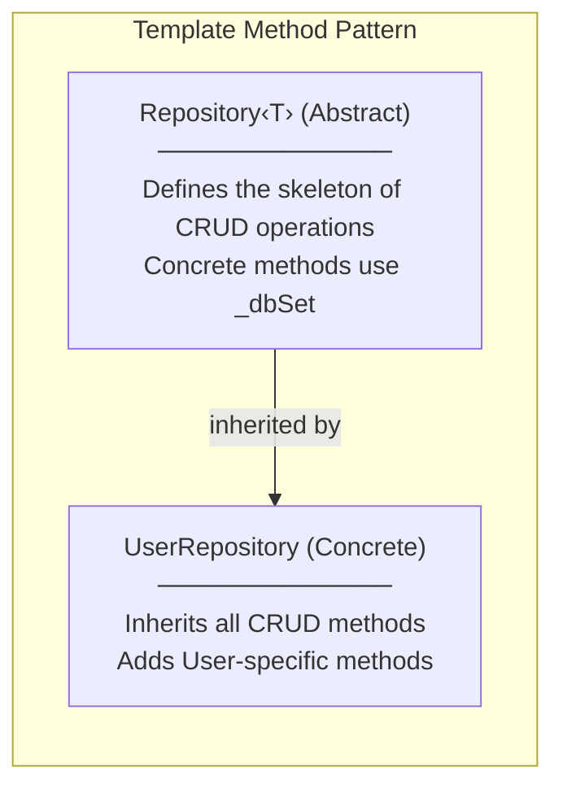
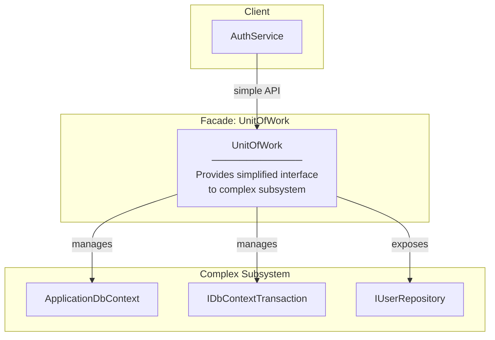
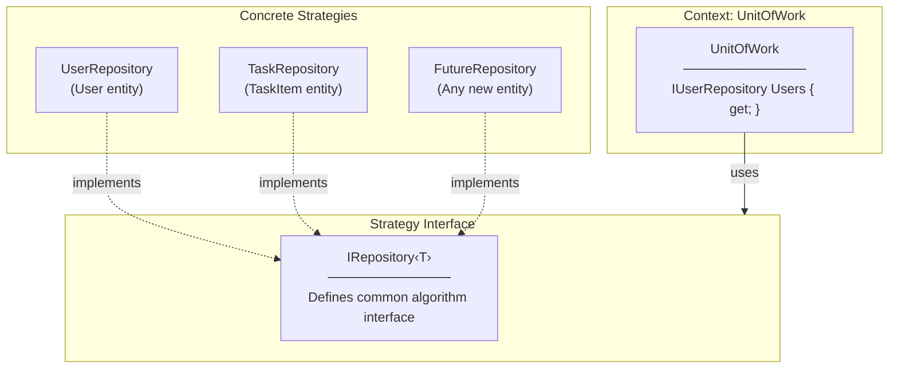
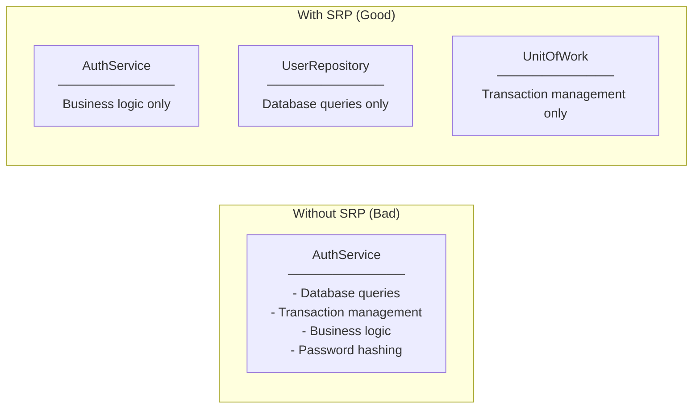
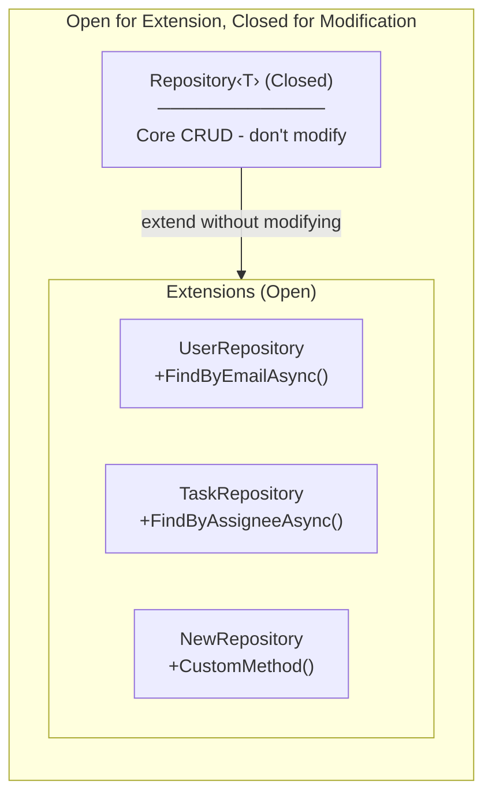
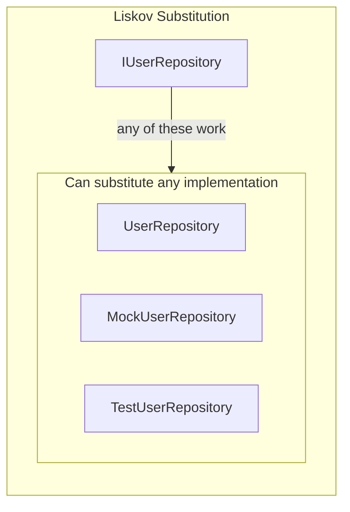
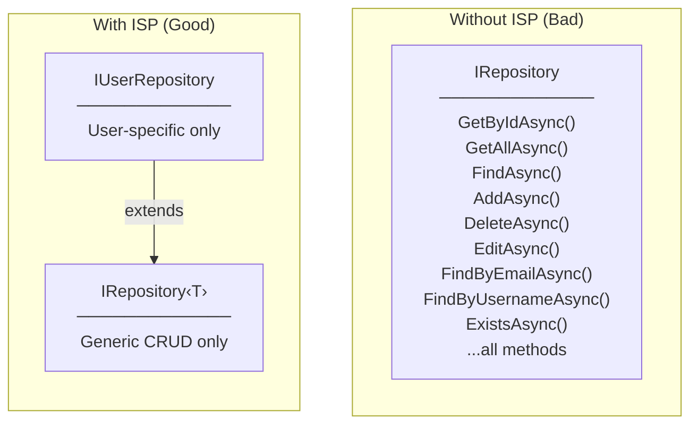
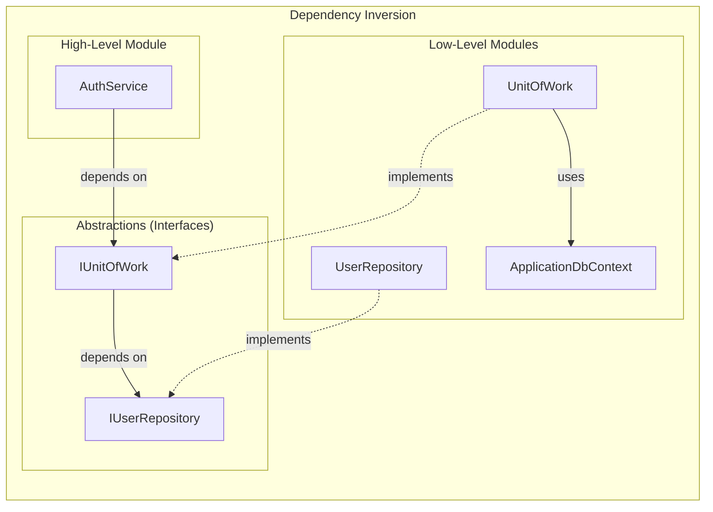

# Design Patterns & SOLID Principles in Repository Pattern

## GoF Design Patterns Applied

### 1. Template Method Pattern (Repository‹T›)



**Where:** `Repository<T>` → `UserRepository`

**Why Template Method:**
- `Repository<T>` defines the **skeleton** of CRUD operations
- Subclasses (`UserRepository`) **inherit** these operations without rewriting
- Subclasses can **extend** with additional methods (`FindByEmailAsync`)

```csharp
// Template (Abstract Base)
public abstract class Repository<T> : IRepository<T> where T : class
{
    protected readonly DbSet<T> _dbSet;  // Shared resource

    // Template methods - same for all entities
    public async Task<T?> GetByIdAsync(int id) => await _dbSet.FindAsync(id);
    public async Task<IEnumerable<T>> GetAllAsync() => await _dbSet.ToListAsync();
}

// Concrete Implementation
public class UserRepository : Repository<User>, IUserRepository
{
    // Inherits all CRUD from Repository<User>
    // Adds User-specific methods
    public async Task<User?> FindByEmailAsync(string email) => ...
}
```

---

### 2. Facade Pattern (UnitOfWork)



**Where:** `UnitOfWork` wraps `ApplicationDbContext`, `IDbContextTransaction`, `IUserRepository`

**Why Facade:**
- Client (`AuthService`) only knows about `IUnitOfWork`
- Hides complexity of `DbContext`, transactions, multiple repositories
- Single entry point for all data operations

```csharp
// Without Facade - Client must manage everything
var context = new ApplicationDbContext();
var userRepo = new UserRepository(context);
var transaction = await context.Database.BeginTransactionAsync();
// ... complex coordination

// With Facade - Simple API
await _unitOfWork.Users.AddAsync(user);
await _unitOfWork.SaveChangesAsync();
```

---

### 3. Strategy Pattern (IRepository‹T›)



**Where:** `IRepository<T>` with different entity implementations

**Why Strategy:**
- Same interface (`IRepository<T>`) for different entities
- Can swap implementations without changing client code
- Easy to add new entity repositories

---

## SOLID Principles Applied

### S - Single Responsibility Principle (SRP)



**Where Applied:**
| Class | Single Responsibility |
|-------|----------------------|
| `Repository<T>` | Generic CRUD operations only |
| `UserRepository` | User-specific queries only |
| `UnitOfWork` | Transaction coordination only |
| `AuthService` | Authentication business logic only |

---

### O - Open/Closed Principle (OCP)



**Where Applied:**
- `Repository<T>` is **closed** - we don't modify its CRUD methods
- `UserRepository` is **open** - we extend with new methods
- Adding `TaskRepository` doesn't require changing existing code

```csharp
// Adding new repository - NO modification to Repository<T>
public class TaskRepository : Repository<TaskItem>, ITaskRepository
{
    public async Task<IEnumerable<TaskItem>> FindByAssigneeAsync(int userId) => ...
}
```

---

### L - Liskov Substitution Principle (LSP)



**Where Applied:**
- Anywhere `IUserRepository` is expected, `UserRepository` works correctly
- Anywhere `IRepository<User>` is expected, `UserRepository` works correctly
- Can substitute with mock implementations for testing

```csharp
// Both work correctly - LSP satisfied
IUserRepository repo1 = new UserRepository(context);
IRepository<User> repo2 = new UserRepository(context);

// For testing - substitute with mock
IUserRepository mockRepo = new MockUserRepository();
```

---

### I - Interface Segregation Principle (ISP)



**Where Applied:**
- `IRepository<T>` - only generic CRUD methods (6 methods)
- `IUserRepository` - only User-specific methods (4 methods)
- Clients depend only on interfaces they actually use

```csharp
// ISP - Separate interfaces for different concerns
public interface IRepository<T>  // Generic CRUD
{
    Task<T?> GetByIdAsync(int id);
    Task AddAsync(T entity);
    // ... only generic methods
}

public interface IUserRepository : IRepository<User>  // User-specific
{
    Task<User?> FindByEmailAsync(string email);
    Task<bool> ExistsAsync(string email, string username);
    // ... only User methods
}
```

---

### D - Dependency Inversion Principle (DIP)



**Where Applied:**
- `AuthService` depends on `IUnitOfWork` (abstraction), not `UnitOfWork` (concrete)
- `UnitOfWork` depends on `IUserRepository` (abstraction), not `UserRepository` (concrete)
- High-level modules don't depend on low-level modules

```csharp
// DIP - Depend on abstractions
public class AuthService
{
    private readonly IUnitOfWork _unitOfWork;  // Interface, not concrete class

    public AuthService(IUnitOfWork unitOfWork)  // Injected via DI
    {
        _unitOfWork = unitOfWork;
    }
}

// Program.cs - DI wires up concrete implementations
builder.Services.AddScoped<IUnitOfWork, UnitOfWork>();
builder.Services.AddScoped<IUserRepository, UserRepository>();
```

---

## Summary Table

| Pattern/Principle | Where Applied | Benefit |
|-------------------|---------------|---------|
| **Template Method** | Repository‹T› → UserRepository | Code reuse, consistent CRUD |
| **Facade** | UnitOfWork | Simplified API, hide complexity |
| **Strategy** | IRepository‹T› implementations | Swappable, extensible |
| **SRP** | Each class has one job | Maintainable, testable |
| **OCP** | Repository‹T› base class | Extend without modify |
| **LSP** | Interface implementations | Substitutable, mockable |
| **ISP** | IRepository‹T› + IUserRepository | Focused interfaces |
| **DIP** | Constructor injection | Loose coupling, testable |
