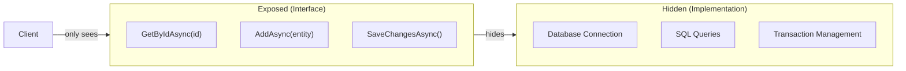
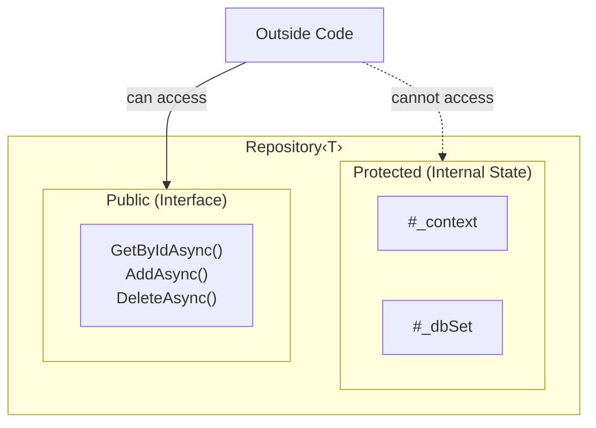
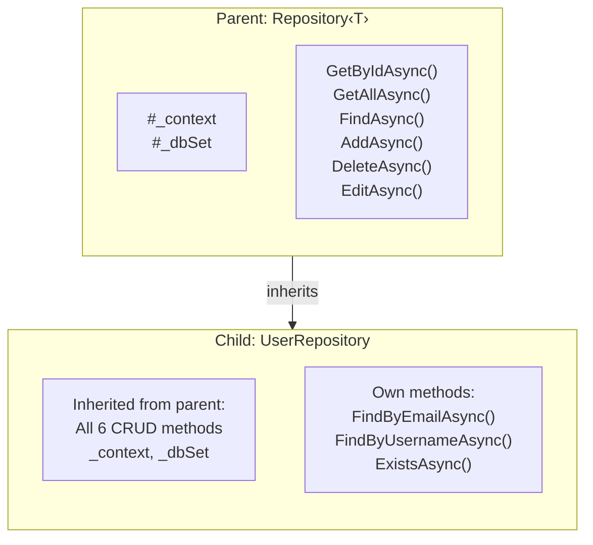
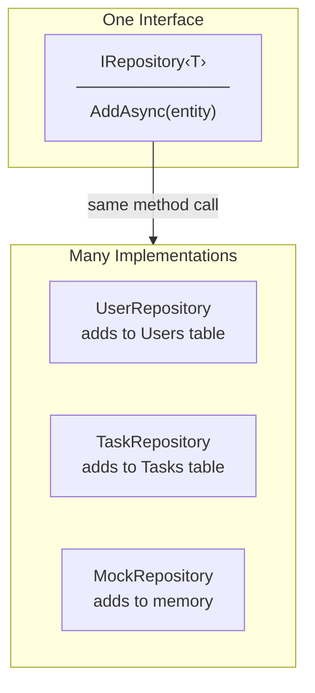
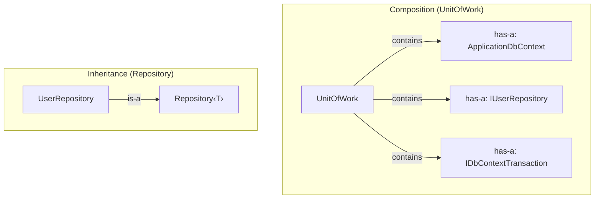
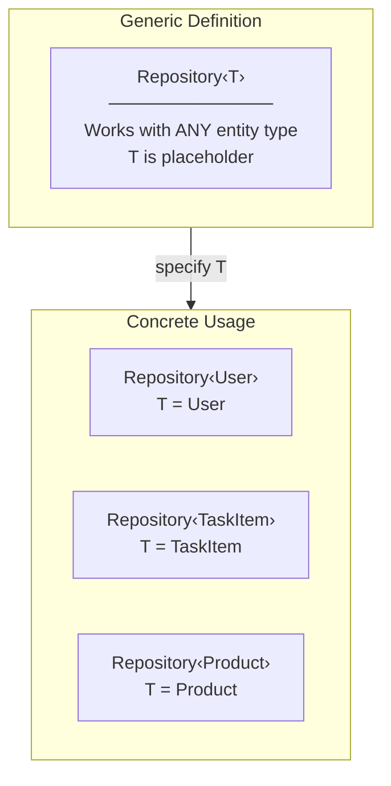
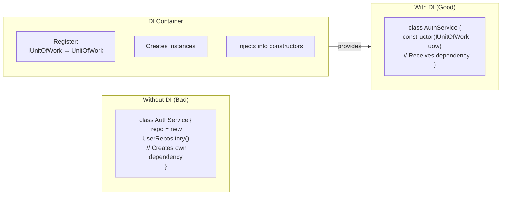
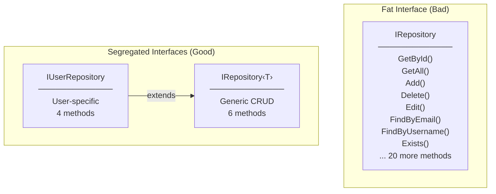
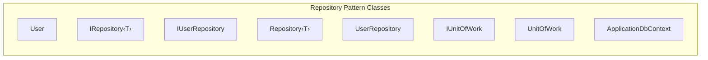
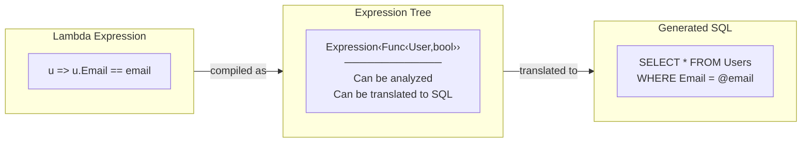

# Programming Concepts Recap (Language Agnostic)

## Table of Contents

1. [Abstraction](#1-abstraction)
2. [Encapsulation](#2-encapsulation)
3. [Inheritance](#3-inheritance)
4. [Polymorphism](#4-polymorphism)
5. [Composition over Inheritance](#5-composition-over-inheritance)
6. [Generics](#6-generics)
7. [Dependency Injection (IoC)](#7-dependency-injection-ioc)
8. [Interface Segregation](#8-interface-segregation)
9. [Separation of Concerns (Single Reason to Change)](#9-separation-of-concerns-single-reason-to-change)
10. [Expression Trees](#10-expression-trees)

---

## 1. Abstraction

**Concept:** Hide complex implementation details, expose only what's necessary.



**Where Applied:**
- `IUnitOfWork` hides `ApplicationDbContext`, `IDbContextTransaction`
- `IUserRepository` hides `DbSet<User>`, LINQ queries
- Client only knows "save user" not "how to save user"

**Benefit:** Client code doesn't need to know database details.

---

## 2. Encapsulation

**Concept:** Bundle data and methods that operate on that data together. Control access with visibility modifiers.



**Where Applied:**
| Class | Protected/Private | Public |
|-------|-------------------|--------|
| `Repository<T>` | `#_context`, `#_dbSet` | CRUD methods |
| `UnitOfWork` | `-_context`, `-_transaction` | `Users`, `SaveChangesAsync()` |

**Access Modifiers:**
- `+` public - anyone can access
- `#` protected - only class and subclasses
- `-` private - only the class itself

---

## 3. Inheritance

**Concept:** Create new class based on existing class. Child inherits parent's properties and methods.



**Where Applied:**
- `UserRepository : Repository<User>` - inherits all CRUD operations
- `IUserRepository : IRepository<User>` - inherits interface contract

**Keyword:** `: base(context)` - call parent constructor

```
// Pseudocode (any language)
class UserRepository extends Repository<User> {
    constructor(context) {
        super(context);  // Call parent constructor
    }
}
```

---

## 4. Polymorphism

**Concept:** Same interface, different implementations. "Many forms."



**Where Applied:**
- `IUserRepository` can be `UserRepository` or `MockUserRepository`
- Same method call (`AddAsync`), different behavior based on actual type
- Runtime decides which implementation to use

**Types of Polymorphism:**
1. **Interface Polymorphism** - `IUserRepository repo = new UserRepository()`
2. **Inheritance Polymorphism** - `Repository<User> repo = new UserRepository()`

---

## 5. Composition over Inheritance

**Concept:** Build complex objects by combining simpler objects rather than inheriting.



**Where Applied:**
- `UnitOfWork` **has-a** `ApplicationDbContext` (composition)
- `UnitOfWork` **has-a** `IUserRepository` (composition)
- `UserRepository` **is-a** `Repository<User>` (inheritance)

**When to use which:**
- **Inheritance:** "is-a" relationship (UserRepository IS A Repository)
- **Composition:** "has-a" relationship (UnitOfWork HAS A Repository)

---

## 6. Generics

**Concept:** Write code that works with any type. Type is specified when used.



**Where Applied:**
- `IRepository<T>` - generic interface
- `Repository<T>` - generic abstract class
- `DbSet<T>` - generic EF Core collection

**Constraint:** `where T : class` - T must be a reference type (not int, bool, etc.)

```
// Pseudocode
interface IRepository<T> where T is ReferenceType {
    T GetById(id)
    List<T> GetAll()
    void Add(T entity)
}
```

---

## 7. Dependency Injection (IoC)

**Concept:** Don't create dependencies inside class. Receive them from outside (injected).



**Where Applied:**
- `AuthService` receives `IUnitOfWork` via constructor
- `UnitOfWork` receives `ApplicationDbContext`, `IUserRepository` via constructor
- `Program.cs` registers all mappings

**Benefits:**
- Loose coupling
- Easy testing (inject mocks)
- Single place to change implementations

---

## 8. Interface Segregation

**Concept:** Many small, focused interfaces are better than one large interface.



**Where Applied:**
- `IRepository<T>` - only generic CRUD (6 methods)
- `IUserRepository` - only User-specific (4 methods)
- Clients use only what they need

---

## 9. Separation of Concerns (Single Reason to Change)

**Concept:** Each class should have only **one reason to change**.



**Reason to Change Analysis:**

| Class | Reason to Change | Example Change Scenario |
|-------|------------------|------------------------|
| `User` | User data structure changes | Add `PhoneNumber` property |
| `IRepository‹T›` | Generic CRUD contract changes | Add `CountAsync()` method |
| `IUserRepository` | User query contract changes | Add `FindByRoleAsync()` method |
| `Repository‹T›` | Generic CRUD implementation changes | Change `FindAsync` to use raw SQL |
| `UserRepository` | User query implementation changes | Optimize `FindByEmailAsync` query |
| `IUnitOfWork` | Transaction contract changes | Add `SaveChangesWithAuditAsync()` |
| `UnitOfWork` | Transaction implementation changes | Add logging to `CommitAsync` |
| `ApplicationDbContext` | Database schema/connection changes | Add new `DbSet<Product>` |

**Why This Matters:**

```
Bad Design (Multiple Reasons to Change):
┌─────────────────────────────────────┐
│ UserRepository                      │
│ - FindByEmailAsync()                │  ← Change if User queries change
│ - SaveChangesAsync()                │  ← Change if save logic changes
│ - BeginTransactionAsync()           │  ← Change if transaction logic changes
│ - GetConnectionString()             │  ← Change if DB config changes
└─────────────────────────────────────┘

Good Design (Single Reason to Change):
┌─────────────────────┐  ┌─────────────────────┐  ┌─────────────────────┐
│ UserRepository      │  │ UnitOfWork          │  │ ApplicationDbContext│
│ - FindByEmailAsync()│  │ - SaveChangesAsync()│  │ - Connection config │
│ - FindByUsername()  │  │ - BeginTransaction()│  │ - DbSet management  │
└─────────────────────┘  └─────────────────────┘  └─────────────────────┘
   User queries only       Transaction only         DB connection only
```

---

## 10. Expression Trees

**Concept:** Code represented as data structure that can be analyzed and transformed.



**Where Applied:**
- `FindAsync(Expression<Func<T, bool>> predicate)`
- EF Core translates expression to SQL
- Runs on database, not in memory

**Why Expression, not just Func:**
- `Func<T, bool>` - compiled code, runs in C#
- `Expression<Func<T, bool>>` - data structure, can be translated to SQL

---

## Summary Table

| Concept | Where Applied | Key Benefit |
|---------|---------------|-------------|
| **Abstraction** | Interfaces hide DbSet, DbContext | Simple API for clients |
| **Encapsulation** | `#_context`, `#_dbSet` protected | Controlled access |
| **Inheritance** | Repository‹T› → UserRepository | Code reuse |
| **Polymorphism** | IUserRepository implementations | Flexibility, testing |
| **Composition** | UnitOfWork contains IUserRepository | Flexible assembly |
| **Generics** | Repository‹T›, DbSet‹T› | Type-safe reuse |
| **DI** | Constructor injection | Loose coupling |
| **Interface Segregation** | IRepository‹T› + IUserRepository | Minimal dependencies |
| **Separation of Concerns** | Each class = one responsibility | Maintainability |
| **Expression Trees** | FindAsync predicate | SQL translation |
