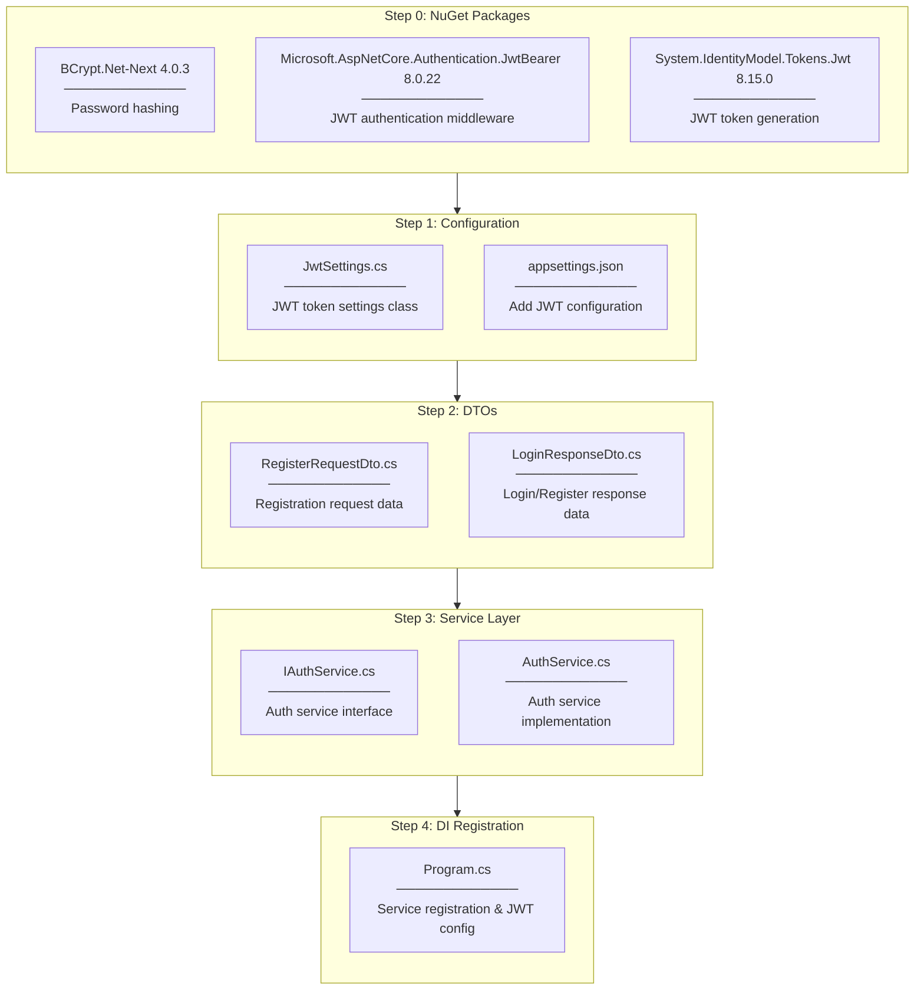
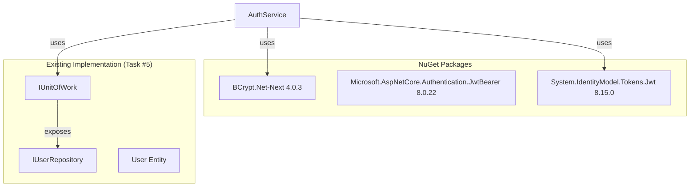

# AuthService Implementation Plan

## Changes from Original Plan

### JWT Token Generation Separated into JwtService

**Original Plan:** `GenerateJwtToken()` as private method inside `AuthService`

**Actual Implementation:** Separate `IJwtService` / `JwtService`

**Why Changed:**
- **Single Responsibility Principle (SRP)** - Each class should have one reason to change
  - `AuthService` → Authentication logic only (register, validate)
  - `JwtService` → JWT token generation only
- **Reusability** - `JwtService` can be used by other services (e.g., future `GoogleOAuthService`)
- **Testability** - Easier to mock `IJwtService` in unit tests
- **Clarity** - Easier to understand when responsibilities are separated

**Files Added:**

| File | Location |
|------|----------|
| `IJwtService.cs` | `Services/Interfaces/` |
| `JwtService.cs` | `Services/` |

**Updated Architecture:**
```
AuthService
    ├── IUnitOfWork (data access)
    ├── IJwtService (token generation)  ← NEW
    └── IConfiguration (admin email)
```

---

### Name Field Missing in RegisterRequestDto (Bug Fix)

**Original Plan:** `RegisterRequestDto` with Username, Email, Password only

**Actual Requirement:** `Name` field is required per Final Project PDF and API Contract

**What Was Missing:**
1. `RegisterRequestDto.cs` - Missing `Name` property
2. `AuthService.cs` - Missing `Name = request.Name` mapping in User creation

**Why It Was Missed:**
- Original development plan listed only Username, Email, Password (Line 136-138)
- Did not cross-reference with Final Project PDF Users Table schema

**Files Modified:**

| File | Change |
|------|--------|
| `RegisterRequestDto.cs` | Added `Name` property with validation attributes |
| `AuthService.cs` | Added `Name = request.Name` in User entity creation |

**Validation Attributes Added:**
- Data Annotations for format validation (Required, MaxLength, MinLength, EmailAddress)
- Business validation (Unique check) remains in Service layer via `ExistsAsync()`

**Lesson Learned:**
- Always verify DTO fields against source documents (Final Project PDF, API Contract)
- Cross-reference Entity properties with DTO properties

---

## Overview

Task #6: Implement `AuthService.RegisterAsync` - User registration functionality

## Implementation Flow



---

## File-by-File Implementation Order

### Step 0: NuGet Packages (Completed)

Install required packages for authentication:

```bash
dotnet add package BCrypt.Net-Next --version 4.0.3
dotnet add package Microsoft.AspNetCore.Authentication.JwtBearer --version 8.0.22
dotnet add package System.IdentityModel.Tokens.Jwt --version 8.15.0
```

| Package | Version | Purpose |
|---------|---------|---------|
| `BCrypt.Net-Next` | 4.0.3 | Password hashing |
| `Microsoft.AspNetCore.Authentication.JwtBearer` | 8.0.22 | JWT authentication middleware |
| `System.IdentityModel.Tokens.Jwt` | 8.15.0 | JWT token generation |

---

### Step 1: Configuration

#### 1.1 JwtSettings.cs

**Location:** `Configuration/JwtSettings.cs`

**Purpose:** Class to hold JWT token generation settings

**Properties:**
- `SecretKey` - Secret key for token signing
- `Issuer` - Token issuer
- `Audience` - Token audience
- `ExpirationMinutes` - Token expiration time

**Pattern Used:** Options Pattern (`IOptions<JwtSettings>`)

---

#### 1.2 appsettings.json Update

**Location:** `appsettings.json`

**Changes:**
- Add `JwtSettings` section
- Add `AdminEmail` setting (for automatic admin role assignment)

---

### Step 2: DTOs (Data Transfer Objects)

#### 2.1 RegisterRequestDto.cs

**Location:** `Controllers/DTOs/Auth/RegisterRequestDto.cs`

**Purpose:** Client → Server registration request data

**Properties:**
- `Username` (string)
- `Email` (string)
- `Password` (string)

---

#### 2.2 LoginResponseDto.cs

**Location:** `Controllers/DTOs/Auth/LoginResponseDto.cs`

**Purpose:** Server → Client authentication response data

**Properties:**
- `Token` (string) - JWT token
- `UserId` (int)
- `Username` (string)
- `Email` (string)
- `Role` (string)

---

### Step 3: Service Layer

#### 3.1 IAuthService.cs

**Location:** `Services/Interfaces/IAuthService.cs`

**Purpose:** Define authentication service contract

**Methods:**
```csharp
Task<LoginResponseDto> RegisterAsync(RegisterRequestDto request);
// LoginAsync will be implemented in Task #7
```

---

#### 3.2 AuthService.cs

**Location:** `Services/AuthService.cs`

**Purpose:** Implement authentication logic

**Dependencies:**
- `IUnitOfWork` - Data access
- `IOptions<JwtSettings>` - JWT settings
- `IConfiguration` - AdminEmail setting

**RegisterAsync Flow:**
```
1. Check for duplicates (Email, Username)
   └── Call ExistsAsync()
   └── Throw exception if duplicate exists

2. Hash password
   └── BCrypt.HashPassword()

3. Determine role
   └── Email == AdminEmail ? "Admin" : "User"

4. Create User entity
   └── new User { ... }

5. Save to database
   └── _unitOfWork.Users.AddAsync()
   └── _unitOfWork.SaveChangesAsync()

6. Generate JWT token
   └── Call GenerateJwtToken()

7. Return LoginResponseDto
```

**Private Methods:**
- `GenerateJwtToken(User user)` - Generate JWT token

---

### Step 4: DI Registration

#### 4.1 Program.cs Update

**Changes:**

1. **Bind JwtSettings:**
```csharp
builder.Services.Configure<JwtSettings>(
    builder.Configuration.GetSection("JwtSettings"));
```

2. **Register AuthService:**
```csharp
builder.Services.AddScoped<IAuthService, AuthService>();
```

---

## Dependencies



---

## Checklist

- [x] 0.1 Install BCrypt.Net-Next 4.0.3
- [x] 0.2 Install Microsoft.AspNetCore.Authentication.JwtBearer 8.0.22
- [x] 0.3 Install System.IdentityModel.Tokens.Jwt 8.15.0
- [x] 1.1 Create JwtSettings.cs
- [x] 1.2 Update appsettings.json
- [x] 2.1 Create RegisterRequestDto.cs
- [x] 2.2 Create LoginResponseDto.cs
- [x] 3.1 Create IAuthService.cs
- [x] 3.2 Create IJwtService.cs (added for SRP)
- [x] 3.3 Create JwtService.cs (added for SRP)
- [x] 3.4 Create AuthService.cs
- [x] 4.1 Update Program.cs with DI registration
- [x] Build verification
