# AuthService - Complete Architecture Diagram

## Full System Diagram

```mermaid
flowchart TB
    Controller["AuthController<br/>(Task #8)"]

    subgraph AUTH_INTERFACE["AUTH SERVICE (Interface)"]
        direction LR
        IAuthService["IAuthService<br/>─────────────<br/>«interface»<br/>+RegisterAsync(RegisterRequestDto)"]
    end

    subgraph AUTH_IMPL["AUTH SERVICE (Implementation)"]
        direction LR
        AuthService["AuthService<br/>─────────────<br/>-_unitOfWork<br/>-_jwtService<br/>-_configuration<br/>+RegisterAsync()"]
    end

    subgraph JWT_INTERFACE["JWT SERVICE (Interface)"]
        direction LR
        IJwtService["IJwtService<br/>─────────────<br/>«interface»<br/>+GenerateToken(User)"]
    end

    subgraph JWT_IMPL["JWT SERVICE (Implementation)"]
        direction LR
        JwtService["JwtService<br/>─────────────<br/>-_jwtSettings<br/>+GenerateToken()"]
    end

    subgraph CONFIG["CONFIGURATION"]
        direction LR
        JwtSettings["JwtSettings<br/>─────────────<br/>+SecretKey<br/>+Issuer<br/>+Audience<br/>+ExpirationMinutes"]
        IConfiguration["IConfiguration<br/>─────────────<br/>«interface»<br/>+GetSection()<br/>+AdminEmail"]
        IOptions["IOptions‹JwtSettings›<br/>─────────────<br/>«interface»<br/>+Value"]
    end

    subgraph DTO["DTOs"]
        direction LR
        RegisterRequestDto["RegisterRequestDto<br/>─────────────<br/>+Username<br/>+Email<br/>+Password"]
        LoginResponseDto["LoginResponseDto<br/>─────────────<br/>+Token<br/>+UserId<br/>+Username<br/>+Email<br/>+Role"]
    end

    subgraph NUGET["NuGet Packages"]
        direction LR
        BCrypt["BCrypt.Net.BCrypt<br/>─────────────<br/>+HashPassword()<br/>+Verify()"]
        JwtLib["System.IdentityModel.Tokens.Jwt<br/>─────────────<br/>+JwtSecurityToken<br/>+JwtSecurityTokenHandler<br/>+SigningCredentials"]
    end

    subgraph REPOSITORY["REPOSITORY LAYER"]
        direction LR
        IUnitOfWork["IUnitOfWork<br/>─────────────<br/>«interface»<br/>+Users: IUserRepository<br/>+SaveChangesAsync()"]
        IUserRepository["IUserRepository<br/>─────────────<br/>«interface»<br/>+ExistsAsync()<br/>+AddAsync()"]
    end

    subgraph DI["DI (Program.cs)"]
        direction LR
        ProgramCS["builder.Services<br/>─────────────<br/>Configure‹JwtSettings›()<br/>AddScoped‹IJwtService, JwtService›()<br/>AddScoped‹IAuthService, AuthService›()"]
    end

    %% Interface implementations
    AuthService -.->|implements| IAuthService
    JwtService -.->|implements| IJwtService

    %% Controller uses AuthService interface
    Controller -->|uses| IAuthService

    %% AuthService dependencies
    AuthService -->|uses| IJwtService
    AuthService -->|uses| IUnitOfWork
    AuthService -->|uses| IConfiguration
    AuthService -->|uses| BCrypt
    AuthService -->|receives| RegisterRequestDto
    AuthService -->|returns| LoginResponseDto

    %% JwtService dependencies
    JwtService -->|uses| IOptions
    JwtService -->|uses| JwtLib
    IOptions -->|wraps| JwtSettings

    %% Repository relationships
    IUnitOfWork -->|exposes| IUserRepository

    %% DI registrations
    DI -.->|registers| JwtService
    DI -.->|registers| AuthService
    DI -.->|binds| JwtSettings
```

---

## Layer Separation View

```mermaid
flowchart TB
    subgraph CLIENT["🎯 CLIENT LAYER (Consumers)"]
        direction LR
        AC[AuthController]
    end

    subgraph INTERFACE["📋 INTERFACE LAYER (Contracts)"]
        direction LR
        IAS["IAuthService<br/>───────────<br/>RegisterAsync()"]
        IJS["IJwtService<br/>───────────<br/>GenerateToken()"]
    end

    subgraph IMPLEMENTATION["⚙️ IMPLEMENTATION LAYER"]
        direction LR
        AS["AuthService<br/>───────────<br/>-_unitOfWork<br/>-_jwtService<br/>-_configuration<br/>───────────<br/>RegisterAsync()"]
        JS["JwtService<br/>───────────<br/>-_jwtSettings<br/>───────────<br/>GenerateToken()"]
    end

    subgraph CONFIG["🔧 CONFIGURATION LAYER"]
        direction LR
        JST["JwtSettings<br/>───────────<br/>SecretKey<br/>Issuer<br/>Audience<br/>ExpirationMinutes"]
        ICF["IConfiguration<br/>───────────<br/>AdminEmail"]
    end

    subgraph REPOSITORY["🗄️ REPOSITORY LAYER"]
        direction LR
        IUOW["IUnitOfWork<br/>───────────<br/>Users<br/>SaveChangesAsync()"]
        IUR["IUserRepository<br/>───────────<br/>ExistsAsync()<br/>AddAsync()"]
    end

    subgraph DI["📦 DI CONTAINER (Program.cs)"]
        direction LR
        REG["builder.Services<br/>───────────<br/>Configure‹JwtSettings›()<br/>AddScoped‹IJwtService, JwtService›()<br/>AddScoped‹IAuthService, AuthService›()"]
    end

    %% Vertical Flow
    CLIENT -->|uses| INTERFACE
    INTERFACE -->|implemented by| IMPLEMENTATION
    IMPLEMENTATION -->|uses| CONFIG
    IMPLEMENTATION -->|uses| REPOSITORY
    DI -->|registers & injects| IMPLEMENTATION
    DI -.->|provides to| CLIENT

    %% Implementation relationships
    AS -.->|implements| IAS
    JS -.->|implements| IJS
    AS -->|uses| IJS
```

---

## Method Flow: RegisterAsync

---

## DI Injection Flow

```mermaid
flowchart LR
    subgraph Registration["Program.cs (Startup)"]
        R1["Configure‹JwtSettings›(section)"]
        R2["AddScoped‹IJwtService, JwtService›()"]
        R3["AddScoped‹IAuthService, AuthService›()"]
    end

    subgraph Container["DI Container"]
        JST[(JwtSettings)]
        JS2[(JwtService)]
        AS2[(AuthService)]
    end

    subgraph Injection["Constructor Injection"]
        direction TB
        I1["JwtService(IOptions‹JwtSettings› jwtSettings)"]
        I2["AuthService(IUnitOfWork, IJwtService, IConfiguration)"]
    end

    R1 --> JST
    R2 --> JS2
    R3 --> AS2

    JST -->|wrapped in IOptions| I1
    JS2 -->|injected into| I2

    I1 --> JS2
    I2 --> AS2
```

---

## Options Pattern Flow

```mermaid
flowchart LR
    subgraph JSON["appsettings.json"]
        Section["JwtSettings section<br/>───────────<br/>SecretKey<br/>Issuer<br/>Audience<br/>ExpirationMinutes"]
    end

    subgraph PROGRAM["Program.cs"]
        Configure["Configure‹JwtSettings›<br/>───────────<br/>GetSection - JwtSettings"]
    end

    subgraph DICONTAINER["DI Container"]
        IOptions["IOptions‹JwtSettings›"]
    end

    subgraph SERVICE["JwtService"]
        Constructor["Constructor<br/>───────────<br/>IOptions‹JwtSettings› opts"]
        Field["_jwtSettings = opts.Value"]
    end

    Section --> Configure
    Configure --> IOptions
    IOptions -->|injected| Constructor
    Constructor --> Field
```

---

## Legend

| Symbol | Meaning |
|--------|---------|
| `«interface»` | Interface (contract only) |
| `-.->` | Implementation (implements interface) |
| `-->` | Dependency (uses) |
| `-.->` (from DI) | Registration |
| `-` | Private member |
| `+` | Public member |
