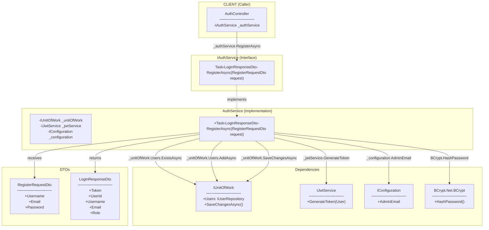
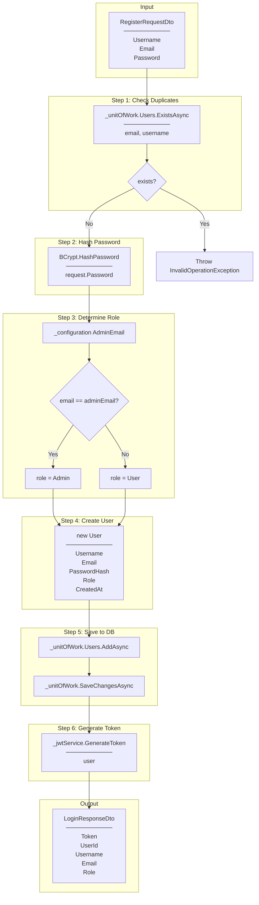
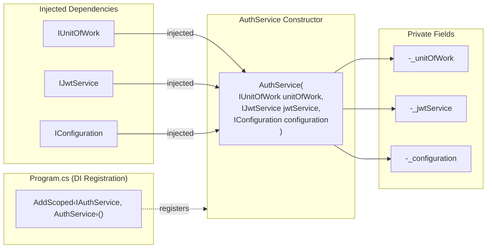

# AuthService - Method Signature Connections

## AuthService Method Connection Diagram



---

## RegisterAsync Internal Flow



---

## Dependency Injection



---

## Call Flow Summary

```
AuthController
    │
    └── _authService.RegisterAsync(RegisterRequestDto)
            │
            ├── Step 1: _unitOfWork.Users.ExistsAsync(email, username)
            │           └── Returns: bool
            │
            ├── Step 2: BCrypt.HashPassword(request.Password)
            │           └── Returns: string passwordHash
            │
            ├── Step 3: _configuration["AdminEmail"]
            │           └── Determine role: "Admin" or "User"
            │
            ├── Step 4: new User { ... }
            │
            ├── Step 5: _unitOfWork.Users.AddAsync(user)
            │           _unitOfWork.SaveChangesAsync()
            │
            ├── Step 6: _jwtService.GenerateToken(user)
            │           └── Returns: string token
            │
            └── Return: LoginResponseDto
```

---

## Legend

| Arrow | Meaning |
|-------|---------|
| `-->` | Method call / Uses |
| `-.->` | Implements / Registers |
