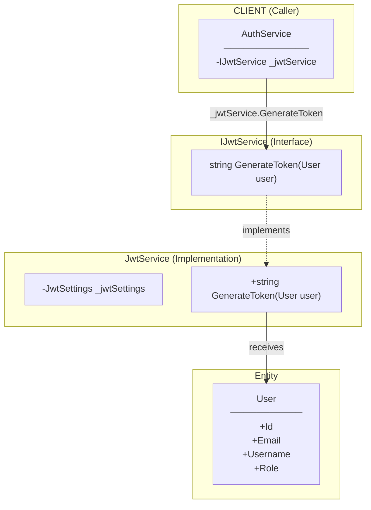
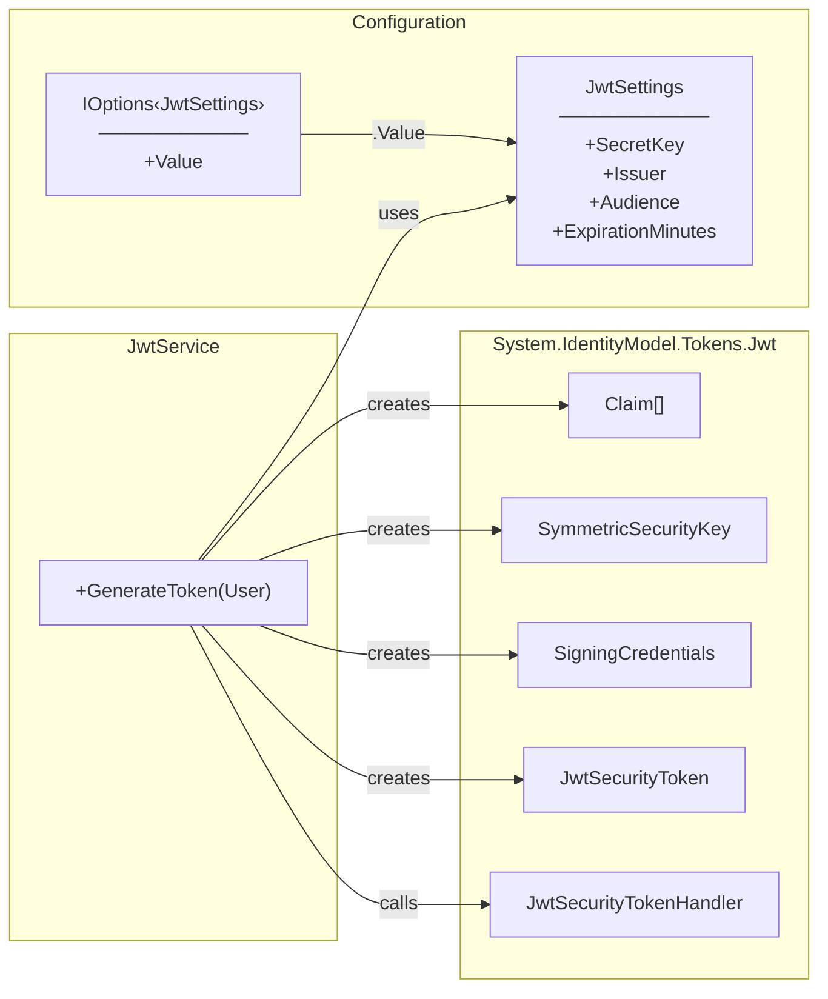
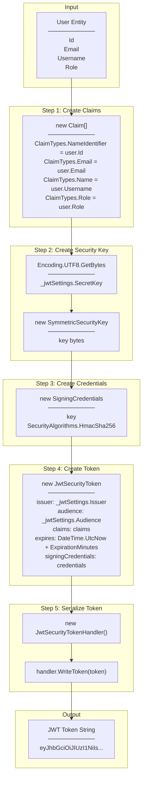
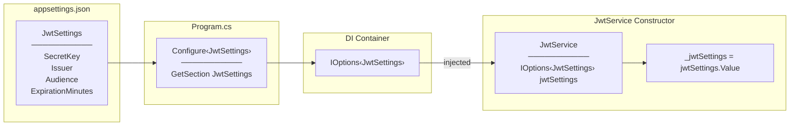
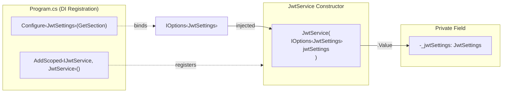
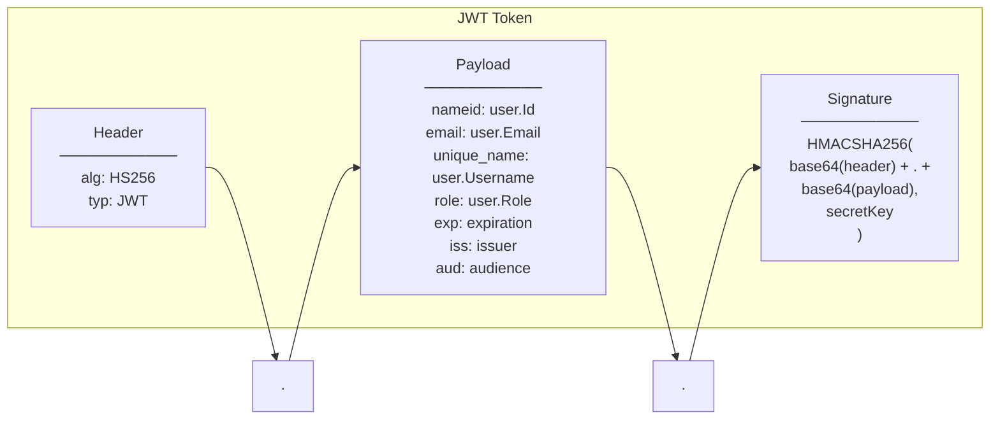

# JwtService - Method Signature Connections

## JwtService Method Connection Diagram



---

## JwtService Dependencies



---

## GenerateToken Internal Flow



---

## Options Pattern Binding



---

## Dependency Injection



---

## JWT Token Structure



---

## Call Flow Summary

```
AuthService
    │
    └── _jwtService.GenerateToken(User user)
            │
            ├── Step 1: Create Claims array
            │           └── NameIdentifier, Email, Name, Role
            │
            ├── Step 2: Create SymmetricSecurityKey
            │           └── From _jwtSettings.SecretKey
            │
            ├── Step 3: Create SigningCredentials
            │           └── HmacSha256 algorithm
            │
            ├── Step 4: Create JwtSecurityToken
            │           └── issuer, audience, claims, expires, credentials
            │
            ├── Step 5: Serialize with JwtSecurityTokenHandler
            │           └── WriteToken(token)
            │
            └── Return: JWT token string
```

---

## Legend

| Arrow | Meaning |
|-------|---------|
| `-->` | Method call / Uses / Creates |
| `-.->` | Implements / Registers / Binds |
