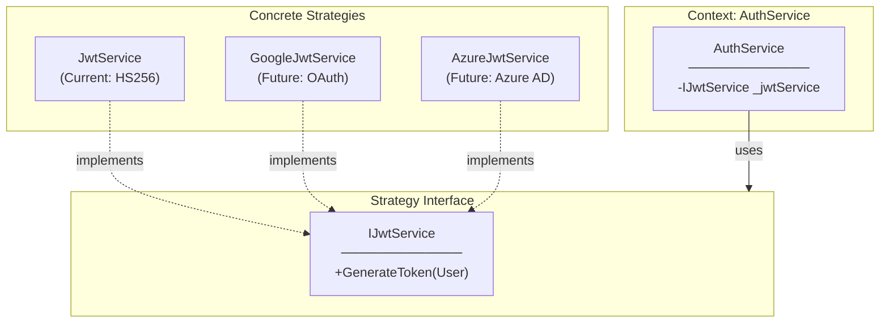
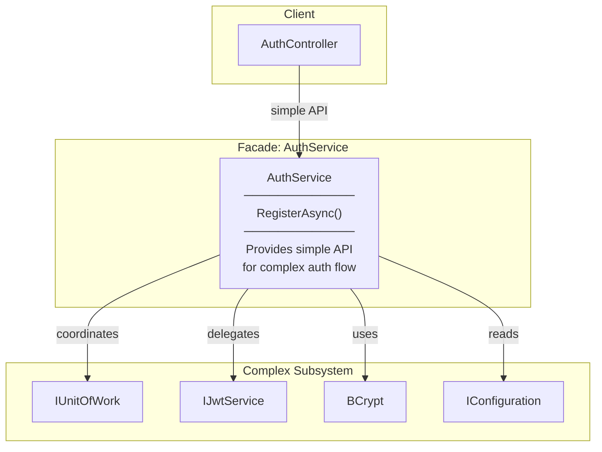
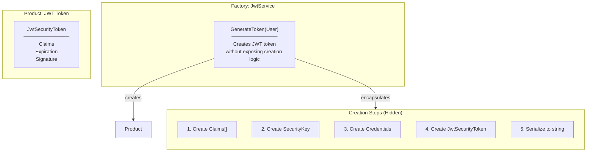
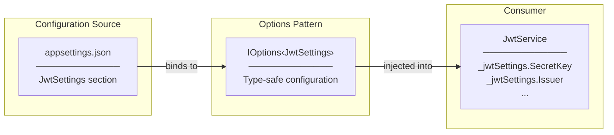
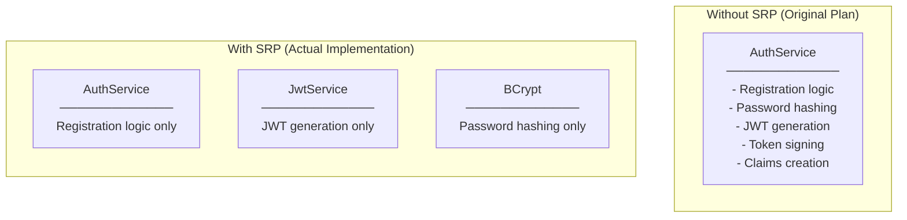
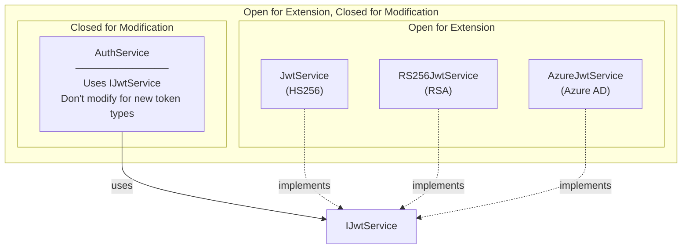
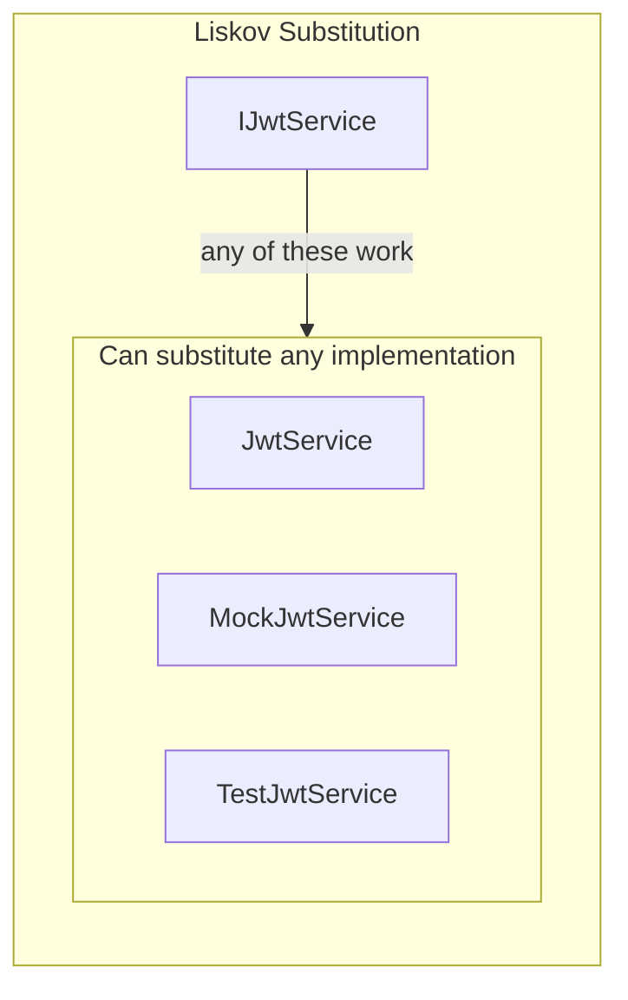
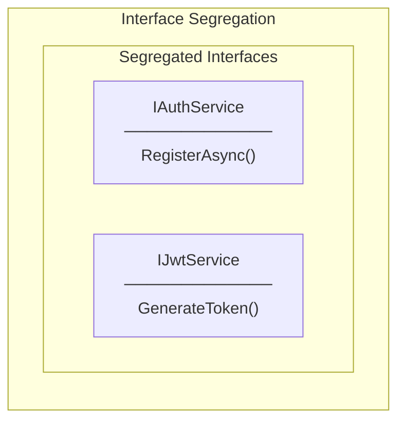
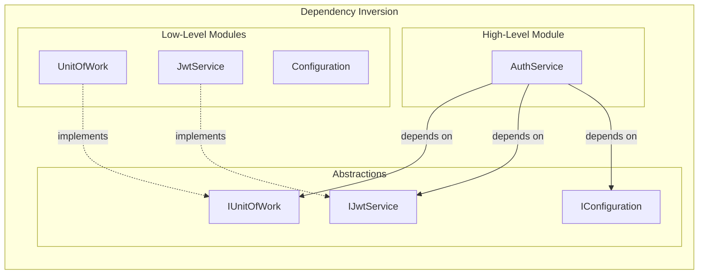

# Design Patterns & SOLID Principles in Auth Service

## GoF Design Patterns Applied

### 1. Strategy Pattern (IJwtService)



**Where:** `IJwtService` with `JwtService` implementation

**Why Strategy:**
- `AuthService` doesn't know HOW tokens are generated
- Can swap `JwtService` with different implementations (OAuth, Azure AD) without changing `AuthService`
- Algorithm (token generation) is encapsulated and interchangeable

```csharp
// AuthService doesn't care which strategy is used
public class AuthService : IAuthService
{
    private readonly IJwtService _jwtService;  // Strategy interface

    public async Task<LoginResponseDto> RegisterAsync(...)
    {
        // ... registration logic
        var token = _jwtService.GenerateToken(user);  // Delegated to strategy
    }
}
```

---

### 2. Facade Pattern (AuthService)



**Where:** `AuthService` wraps multiple dependencies

**Why Facade:**
- Controller only knows `IAuthService.RegisterAsync()`
- Hides complexity: duplicate check, password hashing, role assignment, token generation
- Single entry point for authentication operations

---

### 3. Factory Method Pattern (JwtService.GenerateToken)



**Where:** `JwtService.GenerateToken()` creates JWT tokens

**Why Factory Method:**
- Client (`AuthService`) doesn't know JWT creation details
- Complex creation logic is encapsulated
- Returns a "product" (JWT string) from a "factory" (JwtService)

---

### 4. Options Pattern (JwtSettings)



**Where:** `JwtSettings` configuration class with `IOptions<JwtSettings>`

**Why Options Pattern:**
- Type-safe configuration (no magic strings)
- Compile-time checking
- Separation of configuration from code
- Microsoft recommended pattern for configuration

---

## SOLID Principles Applied

### S - Single Responsibility Principle (SRP)



**Where Applied:**
| Class | Single Responsibility |
|-------|----------------------|
| `AuthService` | Authentication business logic (registration flow) |
| `JwtService` | JWT token generation only |
| `JwtSettings` | JWT configuration data only |
| `RegisterRequestDto` | Registration input data only |
| `LoginResponseDto` | Login response data only |

**Why Separated JwtService:**
- Original plan: `GenerateJwtToken()` as private method in `AuthService`
- Actual: Separate `JwtService` class
- Reason: JWT generation is independent responsibility, reusable by other services

---

### O - Open/Closed Principle (OCP)



**Where Applied:**
- Adding new token generation strategy doesn't modify `AuthService`
- Adding new auth methods (LoginAsync) extends `IAuthService` without modifying existing

---

### L - Liskov Substitution Principle (LSP)



**Where Applied:**
- Any `IJwtService` implementation can replace `JwtService`
- Any `IAuthService` implementation can replace `AuthService`
- Mock implementations work for unit testing

---

### I - Interface Segregation Principle (ISP)



**Where Applied:**
- `IAuthService` - only authentication methods
- `IJwtService` - only token generation methods
- Services depend only on interfaces they use
- `AuthController` depends only on `IAuthService`, not `IJwtService`

---

### D - Dependency Inversion Principle (DIP)



**Where Applied:**
- `AuthService` depends on `IJwtService` (abstraction), not `JwtService` (concrete)
- `JwtService` depends on `IOptions<JwtSettings>` (abstraction)
- DI Container wires concrete implementations

```csharp
// Constructor injection - all abstractions
public AuthService(
    IUnitOfWork unitOfWork,      // Abstraction
    IJwtService jwtService,       // Abstraction
    IConfiguration configuration) // Abstraction
```

---

## Summary Table

| Pattern/Principle | Where Applied | Benefit |
|-------------------|---------------|---------|
| **Strategy** | IJwtService → JwtService | Swappable token generation |
| **Facade** | AuthService | Simple API, hide complexity |
| **Factory Method** | JwtService.GenerateToken() | Encapsulated token creation |
| **Options Pattern** | IOptions‹JwtSettings› | Type-safe configuration |
| **SRP** | AuthService, JwtService separated | Single responsibility each |
| **OCP** | IJwtService implementations | Extend without modify |
| **LSP** | Interface implementations | Substitutable, mockable |
| **ISP** | IAuthService, IJwtService | Focused interfaces |
| **DIP** | Constructor injection | Loose coupling, testable |
