# Programming Concepts Recap (Language Agnostic)

## Table of Contents

1. [Abstraction](#1-abstraction)
2. [Encapsulation](#2-encapsulation)
3. [Composition over Inheritance](#3-composition-over-inheritance)
4. [Dependency Injection](#4-dependency-injection)
5. [Delegation Pattern](#5-delegation-pattern)
6. [Built-in Services (IConfiguration)](#6-built-in-services-iconfiguration)
7. [Options Pattern](#7-options-pattern)
8. [Static Methods vs Instance Methods](#8-static-methods-vs-instance-methods)
9. [Using Alias](#9-using-alias)
10. [Null Coalescing and Null Propagation](#10-null-coalescing-and-null-propagation)
11. [Async/Await Pattern](#11-asyncawait-pattern)

---

## 1. Abstraction

**Concept:** Hide complex implementation details, expose only what's necessary.

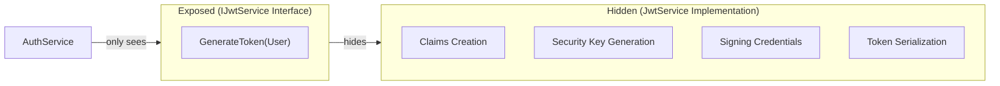

**Where Applied:**
- `IJwtService` hides JWT creation complexity (claims, keys, signing)
- `IAuthService` hides registration flow (validation, hashing, DB save)
- Client only knows "generate token" not "how to create JWT"

**Benefit:** AuthService doesn't need to know JWT library details.

---

## 2. Encapsulation

**Concept:** Bundle data and methods together. Control access with visibility modifiers.

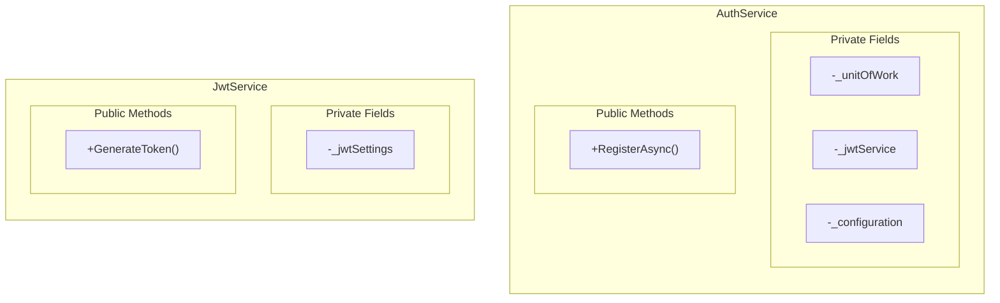

**Where Applied:**
| Class | Private | Public |
|-------|---------|--------|
| `AuthService` | `_unitOfWork`, `_jwtService`, `_configuration` | `RegisterAsync()` |
| `JwtService` | `_jwtSettings` | `GenerateToken()` |

**Access Modifiers:**
- `-` private - only the class itself can access
- `+` public - anyone can access

---

## 3. Composition over Inheritance

**Concept:** Build complex objects by combining simpler objects (has-a) rather than inheriting (is-a).

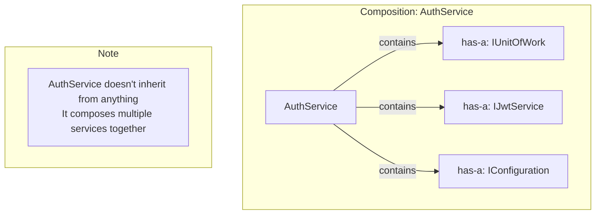

**Where Applied:**
- `AuthService` **has-a** `IUnitOfWork` (data access)
- `AuthService` **has-a** `IJwtService` (token generation)
- `AuthService` **has-a** `IConfiguration` (settings)
- `JwtService` **has-a** `JwtSettings` (configuration)

**Why Composition Here:**
- AuthService is NOT a type of UnitOfWork
- AuthService USES these services to do its job
- More flexible than inheritance

---

## 4. Dependency Injection

**Concept:** Don't create dependencies inside class. Receive them from outside (constructor injection).

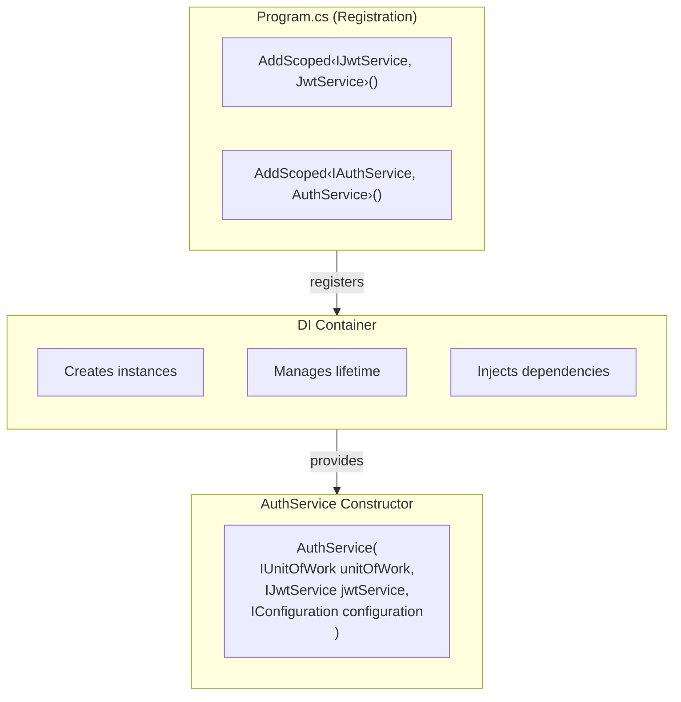

**Where Applied:**

```
// AuthService receives 3 dependencies
constructor(
    IUnitOfWork unitOfWork,      // Data access
    IJwtService jwtService,       // Token generation
    IConfiguration configuration  // App settings
)

// JwtService receives 1 dependency
constructor(
    IOptions<JwtSettings> jwtSettings  // JWT configuration
)
```

**Benefits:**
- Loose coupling - depends on interfaces, not concrete classes
- Testability - can inject mocks
- Flexibility - swap implementations without code changes

---

## 5. Delegation Pattern

**Concept:** Object delegates responsibility to another object instead of doing it itself.

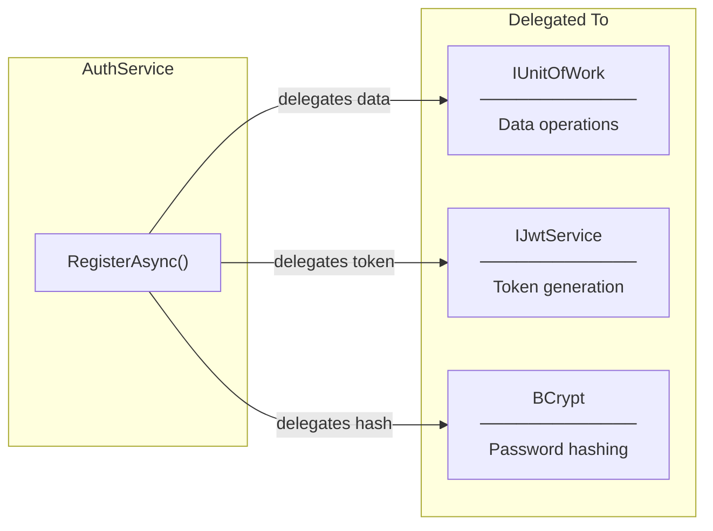

**Where Applied:**
- `AuthService` delegates token generation to `IJwtService`
- `AuthService` delegates password hashing to `BCrypt`
- `AuthService` delegates data persistence to `IUnitOfWork`

**Why Delegation:**
- Single Responsibility - AuthService only coordinates
- Each delegate does one thing well
- Easy to replace any delegate

```
// AuthService delegates to IJwtService
var token = _jwtService.GenerateToken(user);  // Delegated

// NOT doing it itself
// var token = CreateJwtToken(user);  // Would violate SRP
```

---

## 6. Built-in Services (IConfiguration)

**Concept:** ASP.NET Core automatically registers common services in DI container. No manual registration needed.

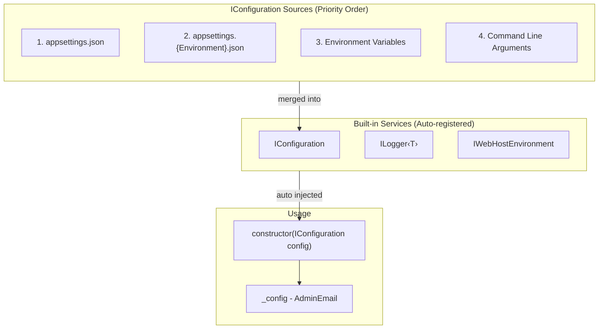

**Where Applied:**
- `AuthService` receives `IConfiguration` without any registration in `Program.cs`
- Access settings via indexer: `_configuration["AdminEmail"]`
- Access nested settings: `_configuration["Section:Key"]`

**Built-in vs Manual Registration:**

| Service | Registration | Example |
|---------|--------------|---------|
| `IConfiguration` | **Automatic** | `_configuration["AdminEmail"]` |
| `ILogger<T>` | **Automatic** | `_logger.LogInformation(...)` |
| `IAuthService` | **Manual** | `AddScoped<IAuthService, AuthService>()` |
| `IJwtService` | **Manual** | `AddScoped<IJwtService, JwtService>()` |

**IConfiguration vs IOptions:**

| Aspect | IConfiguration | IOptions‹T› |
|--------|----------------|-------------|
| Type Safety | Returns `string?` | Strongly typed |
| Compile Check | Runtime errors possible | Compile-time errors |
| Use Case | Simple, few settings | Complex, grouped settings |
| Example | `config["AdminEmail"]` | `options.Value.SecretKey` |

---

## 7. Options Pattern

**Concept:** Type-safe configuration binding from settings files.

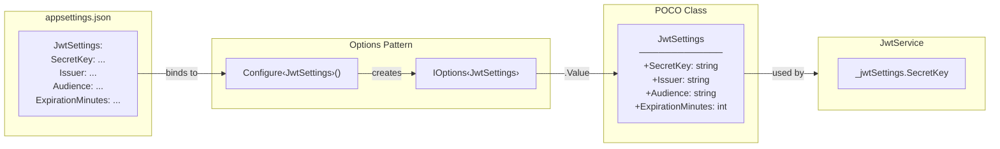

**Where Applied:**
- `JwtSettings` class maps to `appsettings.json` section
- `IOptions<JwtSettings>` injected into `JwtService`
- Access via `_jwtSettings.SecretKey` (type-safe!)

**Benefits vs Raw Configuration:**

```
// Without Options Pattern (Bad)
var secret = _configuration["JwtSettings:SecretKey"];  // string, no compile check
var minutes = int.Parse(_configuration["JwtSettings:ExpirationMinutes"]);  // manual parse

// With Options Pattern (Good)
var secret = _jwtSettings.SecretKey;       // string, compile-time checked
var minutes = _jwtSettings.ExpirationMinutes;  // already int, type-safe
```

---

## 8. Static Methods vs Instance Methods

**Concept:** Static methods belong to class, instance methods belong to object.

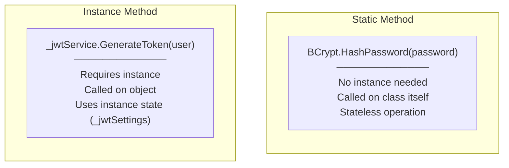

**Where Applied:**

| Type | Example | Why |
|------|---------|-----|
| Static | `BCrypt.HashPassword(password)` | Stateless, no configuration needed |
| Instance | `_jwtService.GenerateToken(user)` | Needs `_jwtSettings` state |

**When to Use:**
- **Static:** Pure functions, utilities, no state needed
- **Instance:** Needs configuration, state, or dependencies

---

## 9. Using Alias

**Concept:** Create short name for long namespace or class to avoid naming conflicts and improve readability.

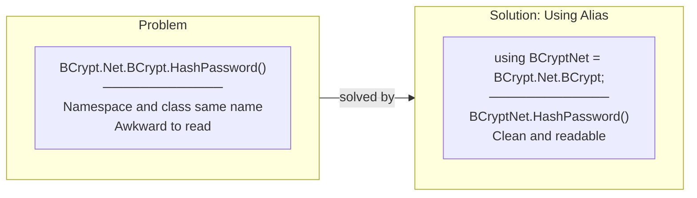

**Where Applied:**

```csharp
// At top of file
using BCryptNet = BCrypt.Net.BCrypt;

// In code - clean usage
var hash = BCryptNet.HashPassword(password);
var valid = BCryptNet.Verify(password, hash);
```

**Why Alias Here:**
- Package name: `BCrypt.Net`
- Class name: `BCrypt`
- Full path: `BCrypt.Net.BCrypt` (confusing!)
- Alias: `BCryptNet` (clear!)

---

## 10. Null Coalescing and Null Propagation

**Concept:** Safe handling of null values without verbose if-checks.

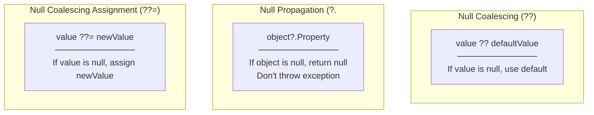

**Where Applied:**

```
// Null coalescing - provide default
var role = isAdmin ? "Admin" : "User";

// Null propagation - safe access
var email = user?.Email;  // null if user is null

// In configuration
var adminEmail = _configuration["AdminEmail"] ?? "";
```

**Benefit:** Cleaner code than verbose null checks.

---

## 11. Async/Await Pattern

**Concept:** Non-blocking asynchronous operations. Method can "await" without blocking thread.

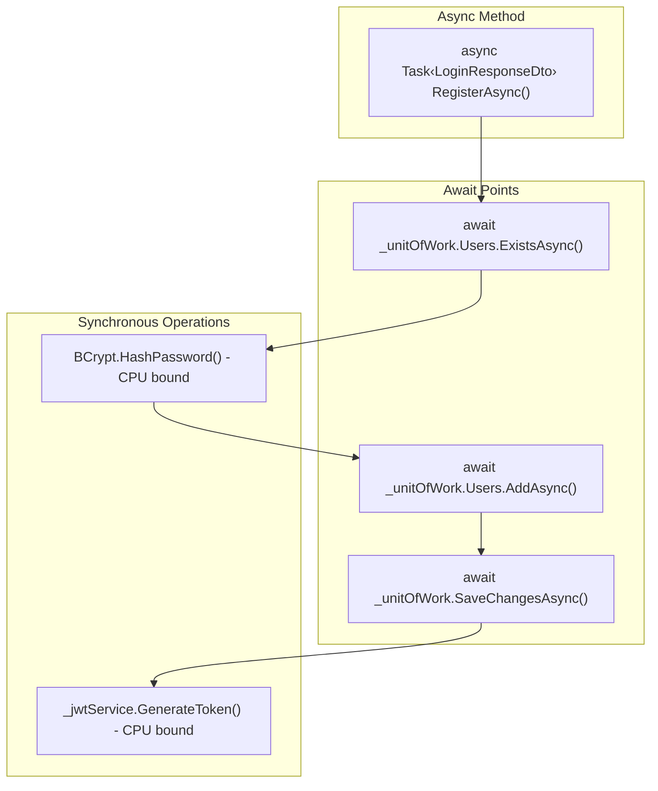

**Where Applied:**
- `RegisterAsync` - async method
- `ExistsAsync`, `AddAsync`, `SaveChangesAsync` - awaited I/O operations
- `HashPassword`, `GenerateToken` - synchronous (CPU-bound)

**Async vs Sync Decision:**

| Operation | Type | Why |
|-----------|------|-----|
| Database query | `async` | I/O bound, waiting for network |
| Password hash | `sync` | CPU bound, computation |
| Token generation | `sync` | CPU bound, computation |

**Pattern:**
```
async Task<Result> MethodAsync()
{
    await IoOperation();      // Release thread while waiting
    var result = CpuWork();   // Use thread for computation
    return result;
}
```

---

## Summary Table

| Concept | Where Applied | Key Benefit |
|---------|---------------|-------------|
| **Abstraction** | IJwtService, IAuthService | Hide complexity |
| **Encapsulation** | Private fields in services | Controlled access |
| **Composition** | AuthService contains services | Flexible assembly |
| **DI** | Constructor injection | Loose coupling |
| **Delegation** | AuthService → JwtService, BCrypt | Single responsibility |
| **Built-in Services** | IConfiguration auto-injected | No manual registration |
| **Options Pattern** | IOptions‹JwtSettings› | Type-safe config |
| **Static Methods** | BCrypt.HashPassword() | Stateless utilities |
| **Using Alias** | BCryptNet = BCrypt.Net.BCrypt | Readable code |
| **Null Handling** | ??, ?., ??= | Safe null access |
| **Async/Await** | RegisterAsync, DB operations | Non-blocking I/O |
