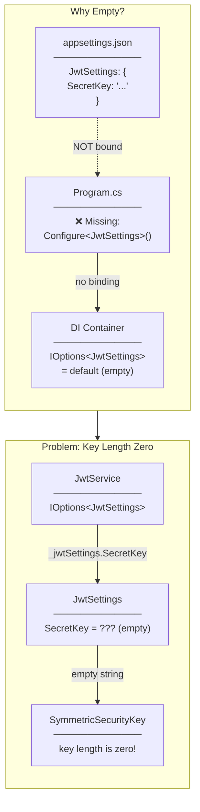
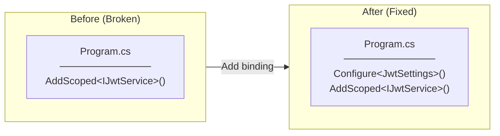
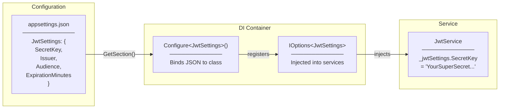
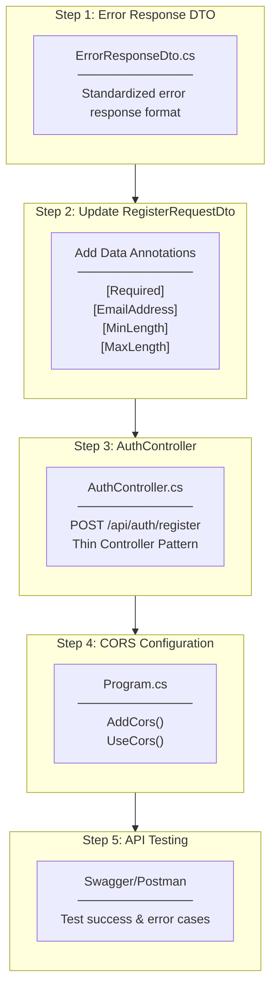
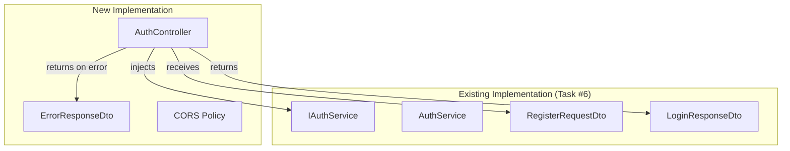
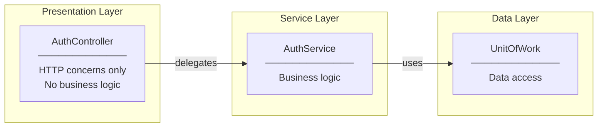

# AuthController Implementation Plan

## Changes from Original Plan

### JwtSettings Binding Missing in Program.cs (Bug Fix)

**Original Plan:** Assumed JwtSettings was already configured in Task #6

**Actual Issue:** `Configure<JwtSettings>()` was not registered in Program.cs DI container

**Error Encountered:**
```
System.ArgumentException: IDX10703: Cannot create a 'SymmetricSecurityKey', key length is zero.
   at JwtService.GenerateToken(User user) in JwtService.cs:line 35
```

**Root Cause Analysis:**



**Solution:**



**Code Added to Program.cs:**
```csharp
// Service Layer - Auth Services
builder.Services.Configure<JwtSettings>(
    builder.Configuration.GetSection("JwtSettings"));  // ← Added
builder.Services.AddScoped<IJwtService, JwtService>();
builder.Services.AddScoped<IAuthService, AuthService>();
```

**Options Pattern Flow (After Fix):**



**Lesson Learned:**
- Options Pattern requires explicit `Configure<T>()` registration
- `IOptions<T>` injection returns default values if not configured (no runtime error until used)
- Always verify configuration binding when using Options Pattern

---

### Name Field Added to RegisterRequestDto (From Task #6 Bug Fix)

This was already documented in Task #6 development plan. The changes carried over:
- Added `Name` property with `[Required]`, `[MaxLength(100)]` validation
- Data Annotations added for all fields (not just Name)

---

## Overview

Task #7: Create AuthController with POST `/api/auth/register` endpoint

## Implementation Flow



---

## File-by-File Implementation Order

### Step 1: Error Response DTO

#### 1.1 ErrorResponseDto.cs

**Location:** `Controllers/DTOs/Common/ErrorResponseDto.cs`

**Purpose:** Standardized error response format for API

**Properties:**
- `Error` (string) - Error type/code
- `Message` (string) - User-friendly error message
- `Details` (object?) - Optional field-specific error details

**Example Response:**
```json
{
  "error": "VALIDATION_ERROR",
  "message": "Invalid input data",
  "details": {
    "email": ["Invalid email format"],
    "password": ["Password must be at least 8 characters"]
  }
}
```

---

### Step 2: Update RegisterRequestDto

#### 2.1 Add Data Annotations

**Location:** `Controllers/DTOs/Auth/RegisterRequestDto.cs`

**Changes:** Add validation attributes

| Property | Validations |
|----------|-------------|
| `Username` | `[Required]`, `[MinLength(3)]`, `[MaxLength(50)]` |
| `Email` | `[Required]`, `[EmailAddress]` |
| `Password` | `[Required]`, `[MinLength(8)]` |

**Concept:** Declarative Validation with Data Annotations

---

### Step 3: AuthController

#### 3.1 AuthController.cs

**Location:** `Controllers/AuthController.cs`

**Attributes:**
- `[ApiController]` - Automatic model validation, binding source inference
- `[Route("api/[controller]")]` - Route: `/api/auth`

**Endpoint:**
```
POST /api/auth/register
```

**Request:** `RegisterRequestDto` (JSON body)

**Responses:**
| Status | Condition | Body |
|--------|-----------|------|
| 201 Created | Success | `LoginResponseDto` |
| 400 Bad Request | Validation error | `ValidationProblemDetails` (auto) |
| 400 Bad Request | Duplicate email/username | `ErrorResponseDto` |

**Pattern:** Thin Controller
- Controller only handles HTTP concerns
- Business logic delegated to `IAuthService`
- No try-catch needed (global exception handling later)

**Flow:**
```
1. [ApiController] validates request automatically
2. Call _authService.RegisterAsync(request)
3. Return CreatedAtAction with LoginResponseDto
```

---

### Step 4: CORS Configuration

#### 4.1 Program.cs Update

**Purpose:** Allow frontend to call API from different origin

**Configuration:**
```csharp
builder.Services.AddCors(options =>
{
    options.AddPolicy("AllowFrontend", policy =>
    {
        policy.WithOrigins(
            "http://localhost:3000",   // React default
            "http://localhost:5173"    // Vite default
        )
        .AllowAnyMethod()
        .AllowAnyHeader()
        .AllowCredentials();  // For SignalR later
    });
});

// In middleware pipeline
app.UseCors("AllowFrontend");
```

**Concept:** Cross-Origin Resource Sharing (CORS)
- Browser security feature
- Backend must explicitly allow frontend origins
- Required for frontend ↔ backend communication

---

### Step 5: API Testing

#### 5.1 Test with Swagger

**Success Case:**
```json
POST /api/auth/register
{
  "username": "testuser",
  "email": "test@example.com",
  "password": "password123"
}

Response: 201 Created
{
  "token": "eyJhbG...",
  "userId": 6,
  "username": "testuser",
  "email": "test@example.com",
  "role": "User"
}
```

**Validation Error Case:**
```json
POST /api/auth/register
{
  "username": "",
  "email": "invalid-email",
  "password": "123"
}

Response: 400 Bad Request
{
  "type": "https://tools.ietf.org/html/rfc9110#section-15.5.1",
  "title": "One or more validation errors occurred.",
  "status": 400,
  "errors": {
    "Username": ["The Username field is required."],
    "Email": ["The Email field is not a valid e-mail address."],
    "Password": ["The field Password must be a string with a minimum length of 8."]
  }
}
```

**Duplicate Error Case:**
```json
POST /api/auth/register
{
  "username": "existinguser",
  "email": "existing@example.com",
  "password": "password123"
}

Response: 400 Bad Request
{
  "error": "DUPLICATE_USER",
  "message": "User with this email or username already exists"
}
```

---

## Dependencies



---

## Architecture Pattern



**Thin Controller Pattern:**
- Controller is "thin" - minimal code
- Only handles: receive request, call service, return response
- All business logic in Service layer
- Benefits: testable, maintainable, clear separation

---

## Checklist

- [x] 1.1 Create ErrorResponseDto.cs
- [x] 2.1 Update RegisterRequestDto with validation attributes
- [x] 3.1 Create AuthController.cs
- [x] 4.1 Add CORS configuration to Program.cs
- [x] 4.2 Add JwtSettings binding to Program.cs (bug fix)
- [x] 5.1 Test success case with Swagger (201 Created)
- [x] 5.2 Test validation error case (400 Bad Request)
- [x] 5.3 Test duplicate user error case (400 DUPLICATE_USER)
- [x] Build verification
