# AuthController - Complete Architecture Diagram

## Full System Diagram

```mermaid
flowchart TB
    Client["Client<br/>(React Frontend)"]

    subgraph PRESENTATION["PRESENTATION LAYER"]
        direction TB
        subgraph CONTROLLER["CONTROLLER"]
            AuthController["AuthController<br/>─────────────<br/>-_authService<br/>+Register()"]
        end
        subgraph DTOS["DTOs"]
            direction LR
            RegisterRequestDto["RegisterRequestDto<br/>─────────────<br/>+Name<br/>+Email<br/>+Username<br/>+Password<br/>───────────<br/>[Required]<br/>[EmailAddress]<br/>[MinLength]<br/>[MaxLength]"]
            LoginResponseDto["LoginResponseDto<br/>─────────────<br/>+Token<br/>+UserId<br/>+Username<br/>+Email<br/>+Role"]
            ErrorResponseDto["ErrorResponseDto<br/>─────────────<br/>+Error<br/>+Message<br/>+Details"]
        end
    end

    subgraph ASPNET["ASP.NET CORE PIPELINE"]
        direction TB
        ModelBinding["Model Binding<br/>─────────────<br/>JSON → DTO"]
        ModelValidation["Model Validation<br/>─────────────<br/>Data Annotations<br/>check"]
        ApiController["[ApiController]<br/>─────────────<br/>Auto validation<br/>Auto 400 response"]
    end

    subgraph SERVICE["SERVICE LAYER"]
        direction LR
        IAuthService["IAuthService<br/>─────────────<br/>«interface»<br/>+RegisterAsync()"]
        AuthService["AuthService<br/>─────────────<br/>+RegisterAsync()"]
        AuthService -.->|implements| IAuthService
    end

    subgraph CORS["CORS CONFIGURATION"]
        direction LR
        CorsPolicy["AllowFrontend Policy<br/>─────────────<br/>Origins:<br/>localhost:3000<br/>localhost:5173<br/>───────────<br/>AllowAnyMethod()<br/>AllowAnyHeader()<br/>AllowCredentials()"]
    end

    subgraph DI["DI (Program.cs)"]
        direction LR
        ProgramCS["builder.Services<br/>─────────────<br/>AddControllers()<br/>AddCors()<br/>AddScoped‹IAuthService›()"]
    end

    %% Client to Controller flow
    Client -->|"POST /api/auth/register"| ASPNET
    ASPNET -->|"validated request"| AuthController

    %% ASP.NET Pipeline
    ModelBinding --> ModelValidation
    ModelValidation --> ApiController

    %% Controller dependencies
    AuthController -->|uses| IAuthService
    AuthController -->|receives| RegisterRequestDto
    AuthController -->|returns 201| LoginResponseDto
    AuthController -->|returns 400| ErrorResponseDto

    %% Service implementation
    IAuthService -->|implemented by| AuthService

    %% CORS
    Client -.->|"CORS check"| CorsPolicy

    %% DI registrations
    DI -.->|registers| AuthController
    DI -.->|registers| AuthService
    DI -.->|configures| CorsPolicy
```

---

## Layer Separation View

```mermaid
flowchart TB
    subgraph CLIENT["🌐 CLIENT LAYER"]
        direction LR
        Browser["Browser / Postman / Swagger"]
    end

    subgraph ASPNET["⚡ ASP.NET CORE MIDDLEWARE"]
        direction LR
        CORS["UseCors()<br/>───────────<br/>CORS check"]
        AUTH["UseAuthorization()<br/>───────────<br/>JWT check (future)"]
        ROUTING["MapControllers()<br/>───────────<br/>Route matching"]
    end

    subgraph PRESENTATION["🎯 PRESENTATION LAYER"]
        direction LR
        AC["AuthController<br/>───────────<br/>-_authService<br/>───────────<br/>POST /api/auth/register"]
        DTOs["DTOs<br/>───────────<br/>RegisterRequestDto<br/>LoginResponseDto<br/>ErrorResponseDto"]
    end

    subgraph SERVICE["⚙️ SERVICE LAYER"]
        direction LR
        IAS["IAuthService<br/>───────────<br/>RegisterAsync()"]
        AS["AuthService<br/>───────────<br/>Business Logic"]
    end

    subgraph DI["📦 DI CONTAINER"]
        direction LR
        REG["builder.Services<br/>───────────<br/>AddControllers()<br/>AddCors()<br/>AddScoped‹IAuthService›()"]
    end

    %% Vertical Flow
    CLIENT -->|"HTTP Request"| ASPNET
    ASPNET -->|"routed request"| PRESENTATION
    PRESENTATION -->|"delegates"| SERVICE
    DI -->|"registers & injects"| PRESENTATION
    DI -->|"registers & injects"| SERVICE

    %% Implementation relationships
    AS -.->|implements| IAS
    AC -->|uses| IAS
```

---

## Request Flow: POST /api/auth/register

```mermaid
sequenceDiagram
    participant C as Client
    participant CORS as CORS Middleware
    participant MB as Model Binding
    participant MV as Model Validation
    participant AC as AuthController
    participant AS as AuthService
    participant DB as Database

    Note over C,DB: Registration Request Flow

    C->>CORS: POST /api/auth/register
    CORS->>CORS: Check Origin header

    alt Origin not allowed
        CORS-->>C: 403 Forbidden (CORS error)
    end

    CORS->>MB: Request passes CORS

    Note over MB: JSON → RegisterRequestDto
    MB->>MV: RegisterRequestDto object

    Note over MV: Check Data Annotations
    MV->>MV: [Required] checks
    MV->>MV: [EmailAddress] check
    MV->>MV: [MinLength] checks
    MV->>MV: [MaxLength] checks

    alt Validation fails
        MV-->>C: 400 Bad Request (ValidationProblemDetails)
    end

    MV->>AC: Valid RegisterRequestDto
    AC->>AS: RegisterAsync(request)

    alt Duplicate user
        AS-->>AC: throw InvalidOperationException
        AC-->>C: 400 Bad Request (ErrorResponseDto)
    end

    AS->>DB: Save User
    DB-->>AS: User saved
    AS-->>AC: LoginResponseDto

    AC-->>C: 201 Created (LoginResponseDto)
```

---

## Thin Controller Pattern

```mermaid
flowchart LR
    subgraph THIN["✅ Thin Controller (Our Approach)"]
        direction TB
        TC_Controller["AuthController<br/>───────────<br/>• Receive HTTP request<br/>• Call service<br/>• Return HTTP response<br/>• Handle exceptions"]
        TC_Service["AuthService<br/>───────────<br/>• Validate business rules<br/>• Hash password<br/>• Create user<br/>• Generate token"]
        TC_Controller -->|"delegates all logic"| TC_Service
    end

    subgraph FAT["❌ Fat Controller (Anti-pattern)"]
        direction TB
        FC_Controller["AuthController<br/>───────────<br/>• Receive HTTP request<br/>• Validate business rules<br/>• Hash password<br/>• Create user<br/>• Generate token<br/>• Return HTTP response"]
    end

    THIN -.->|"Preferred"| Benefits
    FAT -.->|"Avoid"| Problems

    subgraph Benefits["Benefits"]
        B1["Testable"]
        B2["Maintainable"]
        B3["Reusable"]
        B4["Single Responsibility"]
    end

    subgraph Problems["Problems"]
        P1["Hard to test"]
        P2["Code duplication"]
        P3["Mixed concerns"]
        P4["Violates SRP"]
    end
```

---

## Data Annotations Validation Flow

```mermaid
flowchart TB
    subgraph REQUEST["Incoming Request"]
        JSON["JSON Body<br/>───────────<br/>{<br/>  name: '',<br/>  email: 'invalid',<br/>  username: 'ab',<br/>  password: '123'<br/>}"]
    end

    subgraph BINDING["Model Binding"]
        DTO["RegisterRequestDto<br/>───────────<br/>Name = ''<br/>Email = 'invalid'<br/>Username = 'ab'<br/>Password = '123'"]
    end

    subgraph VALIDATION["Model Validation"]
        direction TB
        V1["[Required] Name<br/>───────────<br/>❌ 'Name is required'"]
        V2["[EmailAddress] Email<br/>───────────<br/>❌ 'Invalid email format'"]
        V3["[MinLength 3] Username<br/>───────────<br/>❌ 'Username must be at least 3 characters'"]
        V4["[MinLength 8] Password<br/>───────────<br/>❌ 'Password must be at least 8 characters'"]
    end

    subgraph RESPONSE["Auto Response (400)"]
        Error["ValidationProblemDetails<br/>───────────<br/>{<br/>  title: 'Validation errors',<br/>  status: 400,<br/>  errors: {<br/>    Name: [...],<br/>    Email: [...],<br/>    Username: [...],<br/>    Password: [...]<br/>  }<br/>}"]
    end

    JSON --> DTO
    DTO --> V1
    DTO --> V2
    DTO --> V3
    DTO --> V4
    V1 --> Error
    V2 --> Error
    V3 --> Error
    V4 --> Error

    Note1["[ApiController] attribute<br/>enables automatic<br/>400 response on<br/>validation failure"]
```

---

## CORS Configuration Flow

```mermaid
flowchart LR
    subgraph FRONTEND["Frontend (localhost:5173)"]
        React["React App"]
    end

    subgraph BROWSER["Browser"]
        Preflight["Preflight Request<br/>───────────<br/>OPTIONS /api/auth/register<br/>Origin: localhost:5173"]
        Actual["Actual Request<br/>───────────<br/>POST /api/auth/register<br/>Origin: localhost:5173"]
    end

    subgraph BACKEND["Backend (localhost:7158)"]
        CorsMiddleware["CORS Middleware<br/>───────────<br/>Check Origin against<br/>AllowFrontend policy"]
        Controller["AuthController"]
    end

    subgraph POLICY["AllowFrontend Policy"]
        Origins["WithOrigins()<br/>───────────<br/>localhost:3000 ✅<br/>localhost:5173 ✅<br/>other ❌"]
        Methods["AllowAnyMethod()<br/>───────────<br/>GET, POST, PUT,<br/>DELETE, etc."]
        Headers["AllowAnyHeader()<br/>───────────<br/>Content-Type,<br/>Authorization, etc."]
        Credentials["AllowCredentials()<br/>───────────<br/>For SignalR later"]
    end

    React --> Preflight
    Preflight --> CorsMiddleware
    CorsMiddleware --> Origins
    Origins --> Methods
    Methods --> Headers
    Headers --> Credentials

    CorsMiddleware -->|"allowed"| Actual
    Actual --> Controller
```

---

## DI Injection Flow

```mermaid
flowchart LR
    subgraph Registration["Program.cs (Startup)"]
        R1["AddControllers()"]
        R2["AddCors(options => ...)"]
        R3["AddScoped‹IAuthService, AuthService›()"]
    end

    subgraph Container["DI Container"]
        AC[(AuthController)]
        AS[(AuthService)]
        CORS[(CORS Policy)]
    end

    subgraph Injection["Constructor Injection"]
        direction TB
        I1["AuthController(IAuthService authService)"]
    end

    R1 --> AC
    R2 --> CORS
    R3 --> AS

    AS -->|injected into| I1
    I1 --> AC
```

---

## HTTP Status Codes

```mermaid
flowchart TB
    subgraph REQUEST["POST /api/auth/register"]
        Input["Request Body"]
    end

    subgraph VALIDATION["Validation Layer"]
        DataAnnotations["Data Annotations<br/>───────────<br/>[Required]<br/>[EmailAddress]<br/>[MinLength]<br/>[MaxLength]"]
    end

    subgraph BUSINESS["Business Layer"]
        DuplicateCheck["ExistsAsync()<br/>───────────<br/>Email/Username<br/>duplicate check"]
    end

    subgraph SUCCESS["Success Path"]
        Created["201 Created<br/>───────────<br/>LoginResponseDto<br/>{token, userId, ...}"]
    end

    subgraph ERRORS["Error Paths"]
        E400V["400 Bad Request<br/>───────────<br/>ValidationProblemDetails<br/>(auto by [ApiController])"]
        E400D["400 Bad Request<br/>───────────<br/>ErrorResponseDto<br/>{error: 'DUPLICATE_USER'}"]
    end

    Input --> DataAnnotations
    DataAnnotations -->|"valid"| DuplicateCheck
    DataAnnotations -->|"invalid"| E400V
    DuplicateCheck -->|"not exists"| Created
    DuplicateCheck -->|"exists"| E400D
```

---

## Legend

| Symbol | Meaning |
|--------|---------|
| `«interface»` | Interface (contract only) |
| `-.->` | Implementation (implements interface) |
| `-->` | Dependency (uses) |
| `-.->` (from DI) | Registration |
| `-` | Private member |
| `+` | Public member |
| `[Attribute]` | Data Annotation |
