# Design Patterns & SOLID Principles in Auth Controller

## GoF Design Patterns Applied

### 1. Facade Pattern (AuthController)

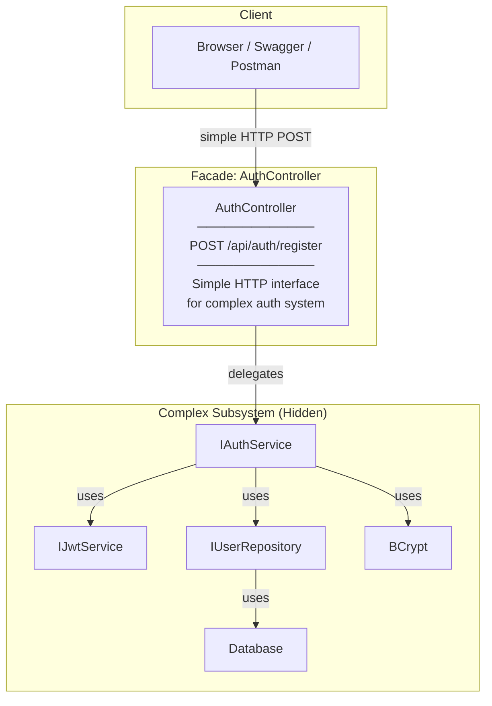

**Where:** `AuthController` exposes simple HTTP endpoint to complex auth system

**Why Facade:**
- Client only knows HTTP endpoint (`POST /api/auth/register`)
- Hides entire authentication subsystem (Service, Repository, JWT, BCrypt)
- Single entry point for registration

```csharp
// Without Facade - Client must orchestrate everything
var userRepo = new UserRepository(context);
if (await userRepo.ExistsAsync(email, username)) throw ...;
var hash = BCrypt.HashPassword(password);
var user = new User { ... };
await userRepo.AddAsync(user);
var token = jwtService.GenerateToken(user);
return new LoginResponseDto { ... };

// With Facade - Simple HTTP call
POST /api/auth/register
{ "name": "...", "email": "...", "username": "...", "password": "..." }
```

---

### 2. Thin Controller Pattern (Presentation Layer Pattern)

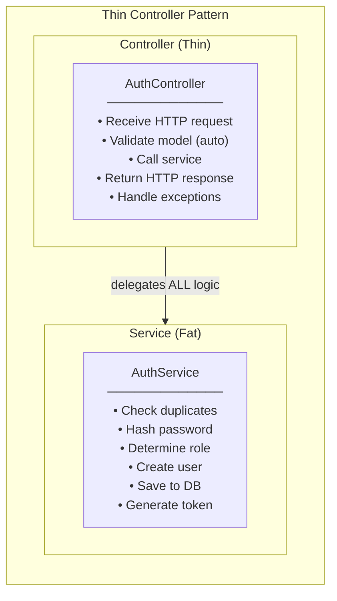

**Where:** `AuthController` delegates all business logic to `AuthService`

**Why Thin Controller:**
- Controller only handles HTTP concerns (request/response)
- Business logic lives in Service layer
- Testable: Service can be unit tested without HTTP
- Maintainable: Changes to business logic don't affect Controller

```csharp
// Thin Controller - Only HTTP concerns
[HttpPost("register")]
public async Task<IActionResult> Register([FromBody] RegisterRequestDto request)
{
    try
    {
        var result = await _authService.RegisterAsync(request);  // Delegate
        return CreatedAtAction(nameof(Register), result);        // HTTP response
    }
    catch (InvalidOperationException ex)
    {
        return BadRequest(new ErrorResponseDto { ... });         // Error response
    }
}
```

---

### 3. Strategy Pattern (Error Handling)

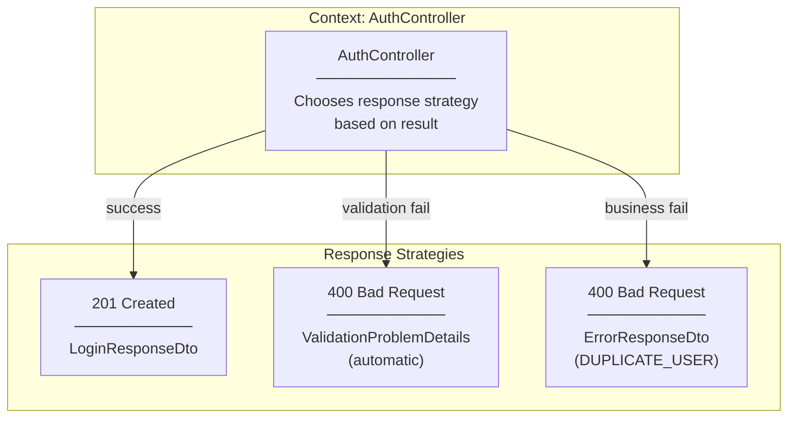

**Where:** Controller returns different response types based on outcome

**Why Strategy:**
- Same endpoint, different response formats
- Each error type has its own response structure
- Easily extensible for new error types

---

### 4. Decorator Pattern (Data Annotations)

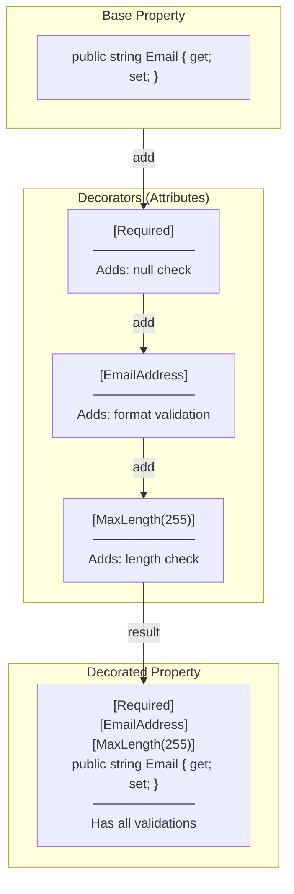

**Where:** `RegisterRequestDto` properties with Data Annotations

**Why Decorator:**
- Add validation behavior without modifying property itself
- Stack multiple validations on same property
- Each annotation adds specific validation "layer"

```csharp
// Decorators stacked on property
[Required(ErrorMessage = "Email is required")]           // Decorator 1
[EmailAddress(ErrorMessage = "Invalid email format")]    // Decorator 2
public string Email { get; set; } = string.Empty;
```

---

## SOLID Principles Applied

### S - Single Responsibility Principle (SRP)

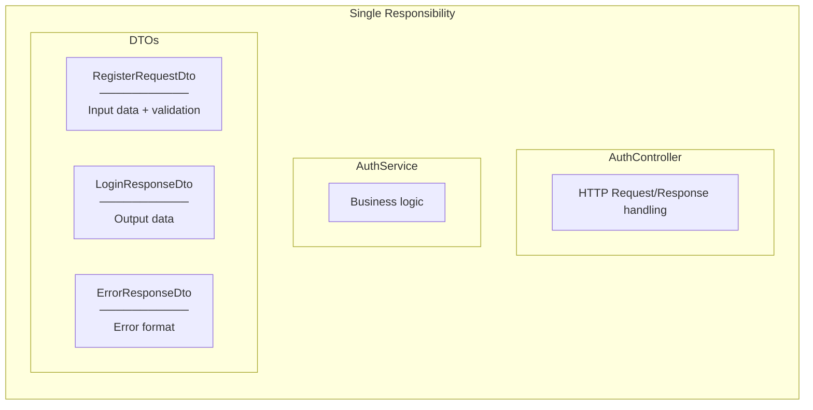

**Where Applied:**
| Class | Single Responsibility |
|-------|----------------------|
| `AuthController` | HTTP concerns only (receive request, return response) |
| `RegisterRequestDto` | Registration input data and validation rules |
| `LoginResponseDto` | Login response data structure |
| `ErrorResponseDto` | Error response format |
| `AuthService` | Authentication business logic |

---

### O - Open/Closed Principle (OCP)

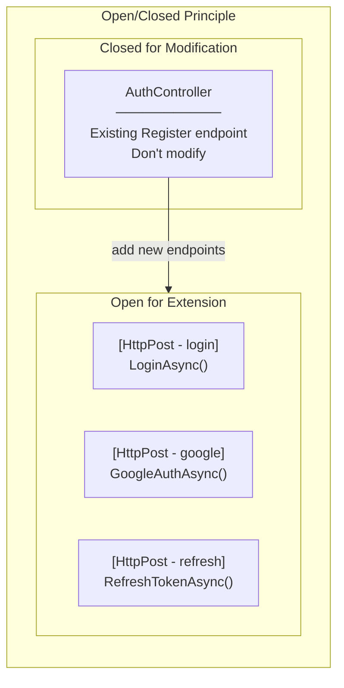

**Where Applied:**
- Adding new endpoints (Login, Google OAuth) doesn't modify existing Register
- Adding new validation attributes doesn't modify DTO structure
- Adding new error types doesn't modify existing error handling

---

### L - Liskov Substitution Principle (LSP)

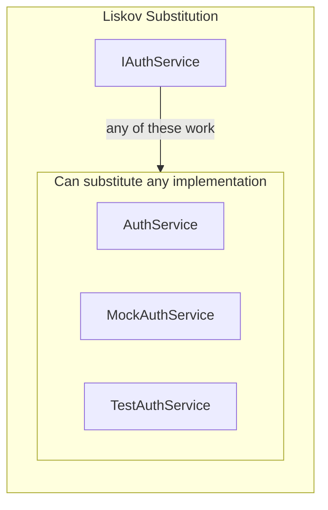

**Where Applied:**
- `AuthController` depends on `IAuthService`
- Any implementation of `IAuthService` can be substituted
- Mock implementations work for testing

```csharp
// Controller works with any IAuthService implementation
public class AuthController : ControllerBase
{
    private readonly IAuthService _authService;  // Interface

    public AuthController(IAuthService authService)  // Any implementation
    {
        _authService = authService;
    }
}
```

---

### I - Interface Segregation Principle (ISP)

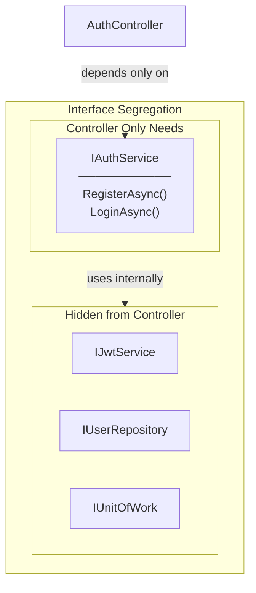

**Where Applied:**
- `AuthController` only depends on `IAuthService`
- Controller doesn't know about `IJwtService`, `IUserRepository`
- Each layer has focused interfaces

---

### D - Dependency Inversion Principle (DIP)

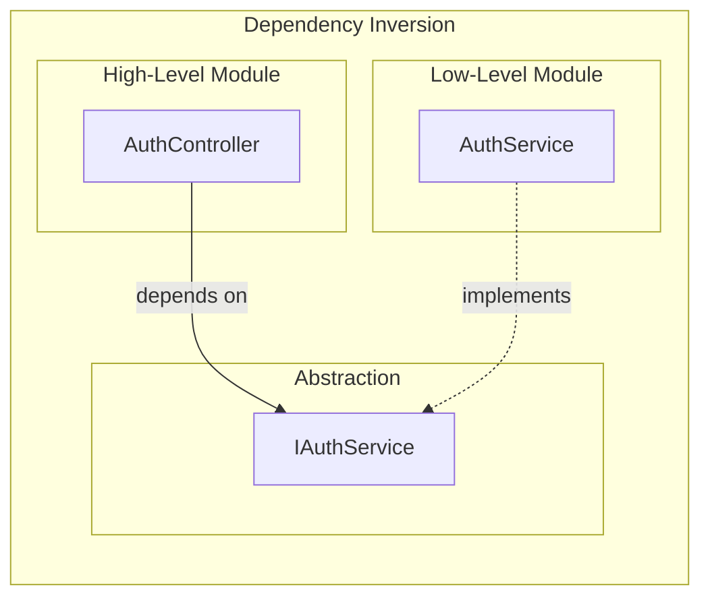

**Where Applied:**
- `AuthController` depends on `IAuthService` (abstraction)
- Not on `AuthService` (concrete class)
- DI Container wires up implementation

```csharp
// Program.cs - DI wires concrete to interface
builder.Services.AddScoped<IAuthService, AuthService>();

// Controller depends on abstraction
public AuthController(IAuthService authService)  // Interface injected
```

---

## ASP.NET Core Specific Patterns

### [ApiController] Attribute Pattern

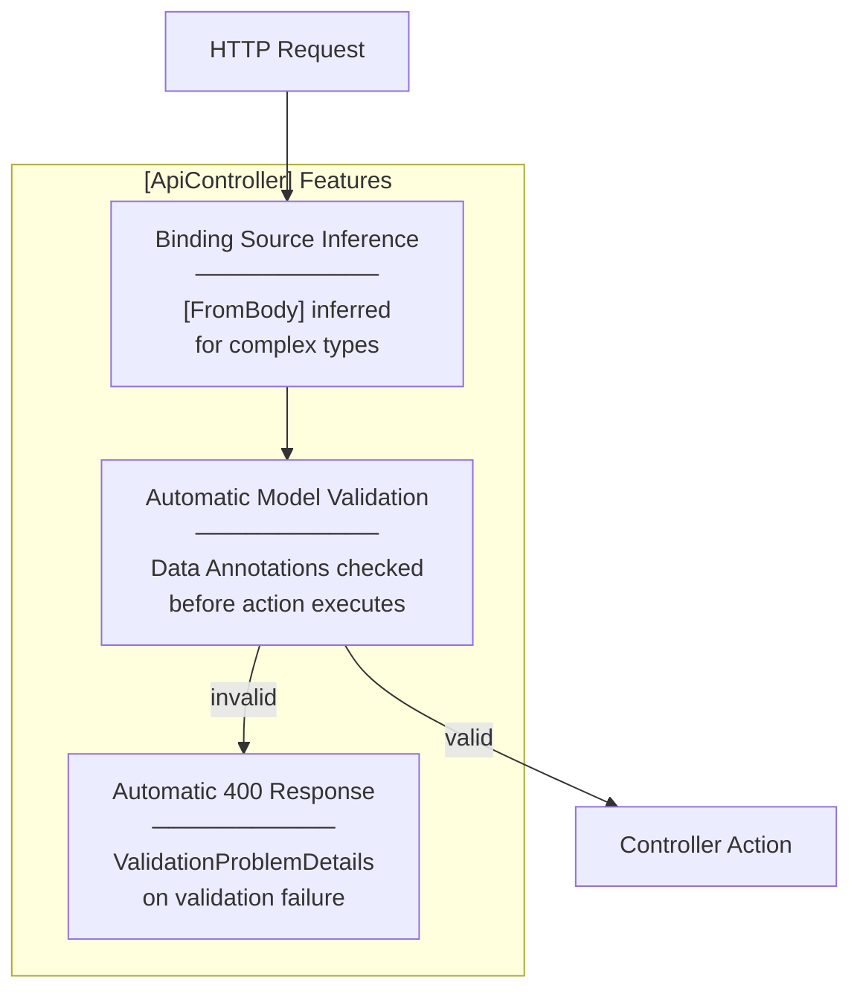

**Where:** `[ApiController]` attribute on `AuthController`

**Why:**
- Automatic model validation (no manual `ModelState.IsValid` check)
- Automatic 400 response on validation failure
- Cleaner controller code

---

### Middleware Pipeline Pattern

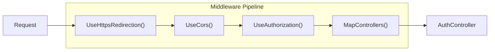

**Where:** `Program.cs` middleware configuration

**Why:**
- Order matters: CORS before Authorization
- Each middleware processes request/response
- Chain of Responsibility pattern

---

## Summary Table

| Pattern/Principle | Where Applied | Benefit |
|-------------------|---------------|---------|
| **Facade** | AuthController | Simple HTTP interface to complex auth system |
| **Thin Controller** | AuthController | HTTP concerns only, business logic in Service |
| **Strategy** | Response types | Different responses for different outcomes |
| **Decorator** | Data Annotations | Stack validation behaviors on properties |
| **SRP** | Controller, DTOs | Each class has one responsibility |
| **OCP** | New endpoints | Add without modifying existing |
| **LSP** | IAuthService | Any implementation substitutable |
| **ISP** | Controller dependencies | Only depends on needed interface |
| **DIP** | Constructor injection | Depends on abstraction, not concrete |
| **[ApiController]** | Auto validation | Cleaner controller code |
| **Middleware Pipeline** | Request processing | Chain of Responsibility |
