# Programming Concepts Recap (Language Agnostic)

## Table of Contents

1. [Abstraction](#1-abstraction)
2. [Encapsulation](#2-encapsulation)
3. [Dependency Injection](#3-dependency-injection)
4. [Delegation Pattern](#4-delegation-pattern)
5. [Attributes / Decorators](#5-attributes--decorators)
6. [Data Annotations (Declarative Validation)](#6-data-annotations-declarative-validation)
7. [HTTP Abstraction](#7-http-abstraction)
8. [Exception Handling](#8-exception-handling)
9. [Middleware Pipeline](#9-middleware-pipeline)
10. [CORS (Cross-Origin Resource Sharing)](#10-cors-cross-origin-resource-sharing)
11. [Model Binding](#11-model-binding)

---

## 1. Abstraction

**Concept:** Hide complex implementation details, expose only what's necessary.

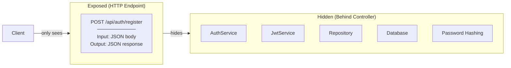

**Where Applied:**
- `AuthController` hides entire authentication system
- Client only knows HTTP endpoint, not implementation details
- REST API is abstraction over business logic

**Benefit:** Frontend doesn't need to know about JWT, BCrypt, or database.

---

## 2. Encapsulation

**Concept:** Bundle data and methods together. Control access with visibility modifiers.

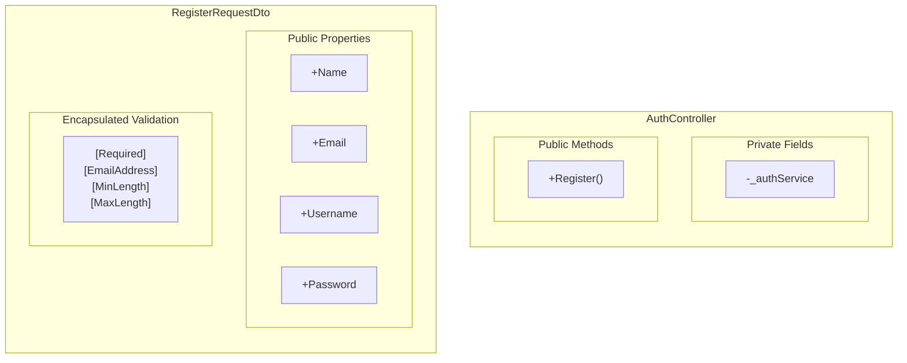

**Where Applied:**
| Class | Private | Public |
|-------|---------|--------|
| `AuthController` | `_authService` | `Register()` |
| `RegisterRequestDto` | None | Properties with validation |
| `ErrorResponseDto` | None | `Error`, `Message`, `Details` |

**DTO Encapsulation:**
- Properties are public (data transfer)
- Validation rules are encapsulated via attributes
- External code cannot bypass validation

---

## 3. Dependency Injection

**Concept:** Don't create dependencies inside class. Receive them from outside (constructor injection).

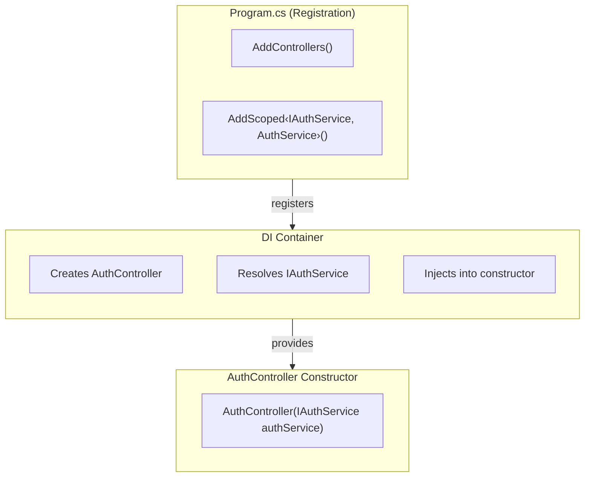

**Where Applied:**

```
// AuthController receives dependency via constructor
public AuthController(IAuthService authService)
{
    _authService = authService;  // Store for later use
}
```

**Benefits:**
- Controller doesn't know about `AuthService` concrete class
- Easy to mock `IAuthService` for testing
- Swap implementations without changing controller

---

## 4. Delegation Pattern

**Concept:** Object delegates responsibility to another object instead of doing it itself.

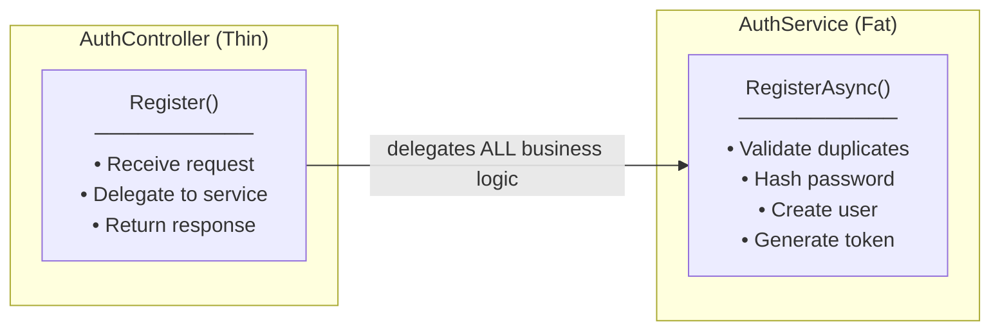

**Where Applied:**
- Controller delegates registration logic to `IAuthService`
- Controller only handles HTTP concerns
- All business logic lives in Service layer

**Why Delegation (Thin Controller):**
```
// Controller does NOT do this:
[HttpPost("register")]
public async Task<IActionResult> Register(RegisterRequestDto request)
{
    // ❌ BAD - Business logic in controller
    if (await _context.Users.AnyAsync(u => u.Email == request.Email))
        return BadRequest("Duplicate");
    var hash = BCrypt.HashPassword(request.Password);
    var user = new User { ... };
    await _context.SaveChangesAsync();
    var token = GenerateJwt(user);
    return Ok(new { token });
}

// Controller DOES this:
[HttpPost("register")]
public async Task<IActionResult> Register(RegisterRequestDto request)
{
    // ✅ GOOD - Delegate to service
    var result = await _authService.RegisterAsync(request);
    return CreatedAtAction(nameof(Register), result);
}
```

---

## 5. Attributes / Decorators

**Concept:** Add metadata or behavior to classes/methods without modifying their code.

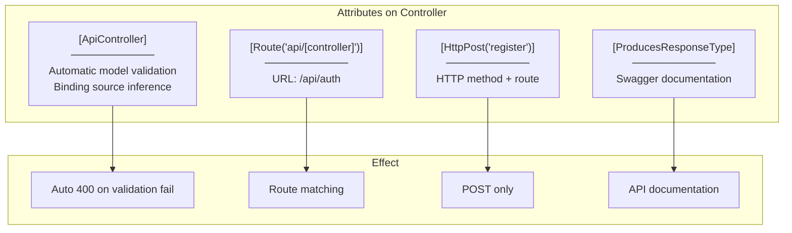

**Where Applied:**
| Attribute | Target | Effect |
|-----------|--------|--------|
| `[ApiController]` | Class | Auto validation, auto 400 |
| `[Route]` | Class/Method | URL routing |
| `[HttpPost]` | Method | HTTP verb binding |
| `[FromBody]` | Parameter | Request body binding |
| `[ProducesResponseType]` | Method | Swagger docs |

**Benefits:**
- Declarative - say WHAT, not HOW
- Separation of concerns - behavior added without modifying method body
- Reusable - same attributes on multiple controllers

---

## 6. Data Annotations (Declarative Validation)

**Concept:** Declare validation rules as attributes. Framework enforces automatically.

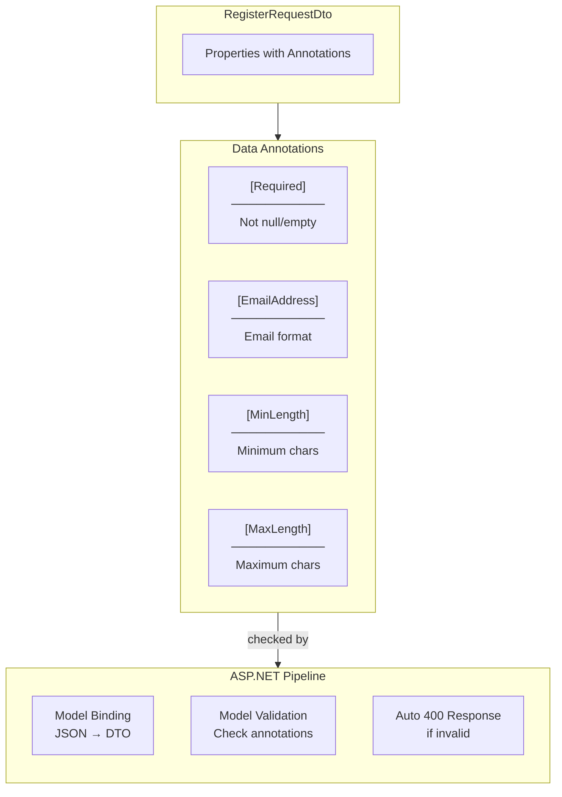

**Where Applied:**

```
public class RegisterRequestDto
{
    [Required(ErrorMessage = "Name is required")]
    [MaxLength(100)]
    public string Name { get; set; }

    [Required]
    [EmailAddress(ErrorMessage = "Invalid email format")]
    public string Email { get; set; }

    [Required]
    [MinLength(3)]
    [MaxLength(50)]
    public string Username { get; set; }

    [Required]
    [MinLength(8)]
    public string Password { get; set; }
}
```

**Declarative vs Imperative:**

```
// Imperative (Bad) - Controller does validation
if (string.IsNullOrEmpty(request.Name))
    return BadRequest("Name required");
if (!IsValidEmail(request.Email))
    return BadRequest("Invalid email");
// ... many more checks

// Declarative (Good) - Annotations do validation
[Required]
[EmailAddress]
public string Email { get; set; }
// Framework handles validation automatically
```

---

## 7. HTTP Abstraction

**Concept:** Framework abstracts HTTP details. Developer works with high-level concepts.

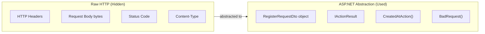

**Where Applied:**

| Raw HTTP | ASP.NET Abstraction |
|----------|---------------------|
| Request JSON body | `RegisterRequestDto` parameter |
| `201 Created` status | `CreatedAtAction()` |
| `400 Bad Request` status | `BadRequest()` |
| Response JSON | Return DTO object (auto-serialized) |

**Benefits:**
- No manual JSON parsing
- No manual HTTP status codes
- Type-safe request/response

---

## 8. Exception Handling

**Concept:** Catch exceptions and convert to appropriate HTTP responses.

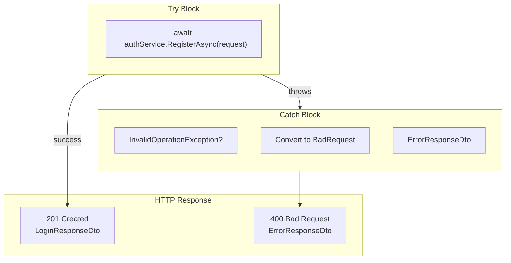

**Where Applied:**

```
try
{
    var result = await _authService.RegisterAsync(request);
    return CreatedAtAction(nameof(Register), result);
}
catch (InvalidOperationException ex)  // Duplicate user
{
    return BadRequest(new ErrorResponseDto
    {
        Error = "DUPLICATE_USER",
        Message = ex.Message
    });
}
```

**Exception to HTTP Mapping:**
| Exception | HTTP Status | Response |
|-----------|-------------|----------|
| Success | 201 Created | `LoginResponseDto` |
| `InvalidOperationException` | 400 Bad Request | `ErrorResponseDto` |
| Validation fail (auto) | 400 Bad Request | `ValidationProblemDetails` |

---

## 9. Middleware Pipeline

**Concept:** Request passes through chain of middleware. Each can process or pass to next.

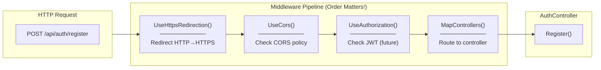

**Where Applied (Program.cs):**

```
app.UseHttpsRedirection();
app.UseCors("AllowFrontend");  // Must be before UseAuthorization
app.UseAuthorization();
app.MapControllers();
```

**Order Matters!**
- CORS must be before Authorization
- Authorization must be before routing
- Wrong order = unexpected behavior

---

## 10. CORS (Cross-Origin Resource Sharing)

**Concept:** Browser security prevents cross-origin requests. Server must explicitly allow origins.

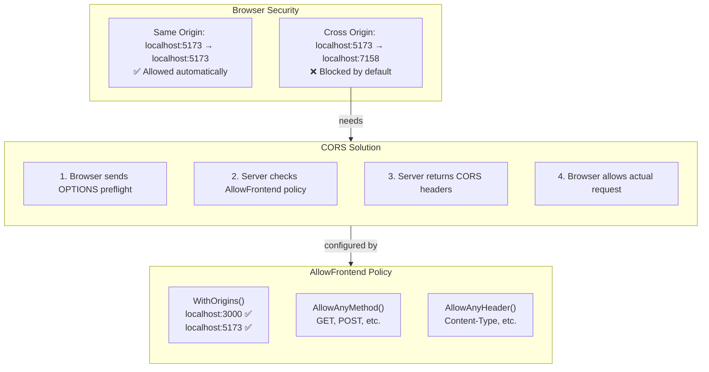

**Where Applied:**

```
// Program.cs - Configure policy
builder.Services.AddCors(options =>
{
    options.AddPolicy("AllowFrontend", policy =>
    {
        policy.WithOrigins("http://localhost:5173")  // Frontend origin
              .AllowAnyMethod()   // GET, POST, PUT, DELETE
              .AllowAnyHeader()   // Content-Type, Authorization
              .AllowCredentials(); // For cookies/SignalR
    });
});

// Program.cs - Apply middleware
app.UseCors("AllowFrontend");
```

**Why Needed:**
- Frontend (React): `http://localhost:5173`
- Backend (API): `https://localhost:7158`
- Different ports = different origins = blocked by browser

---

## 11. Model Binding

**Concept:** Framework automatically converts HTTP request data to method parameters.

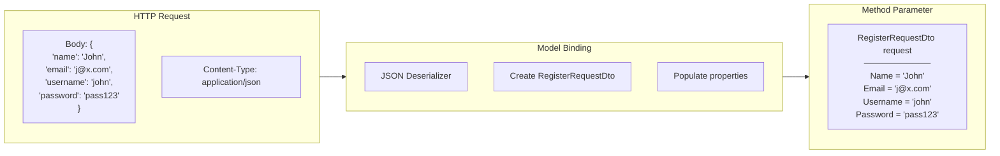

**Where Applied:**

```
[HttpPost("register")]
public async Task<IActionResult> Register([FromBody] RegisterRequestDto request)
//                                         ^^^^^^^^^ Model binding source
//                                                   ^^^^^^^^^^^^^^^^^^^^ Bound object
```

**Binding Sources:**
| Attribute | Source | Example |
|-----------|--------|---------|
| `[FromBody]` | Request body | JSON payload |
| `[FromRoute]` | URL path | `/api/users/{id}` |
| `[FromQuery]` | Query string | `?page=1&size=10` |
| `[FromHeader]` | HTTP header | `Authorization: Bearer ...` |

**`[ApiController]` Inference:**
- Complex types → `[FromBody]` (auto)
- Simple types from route → `[FromRoute]` (auto)

---

## Summary Table

| Concept | Where Applied | Key Benefit |
|---------|---------------|-------------|
| **Abstraction** | HTTP endpoint hides system | Simple API |
| **Encapsulation** | Private `_authService` | Controlled access |
| **DI** | Constructor injection | Loose coupling |
| **Delegation** | Controller → Service | Thin controller |
| **Attributes** | `[ApiController]`, `[HttpPost]` | Declarative behavior |
| **Data Annotations** | `[Required]`, `[EmailAddress]` | Auto validation |
| **HTTP Abstraction** | `CreatedAtAction()`, DTOs | High-level API |
| **Exception Handling** | try-catch to HTTP | Graceful errors |
| **Middleware** | Pipeline order | Request processing |
| **CORS** | AllowFrontend policy | Cross-origin access |
| **Model Binding** | `[FromBody]` | Auto deserialization |
