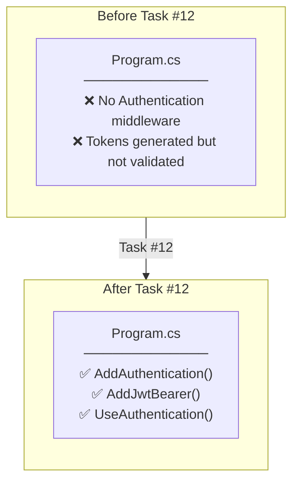
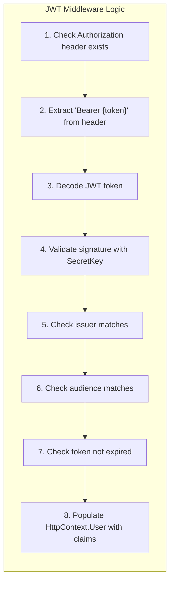
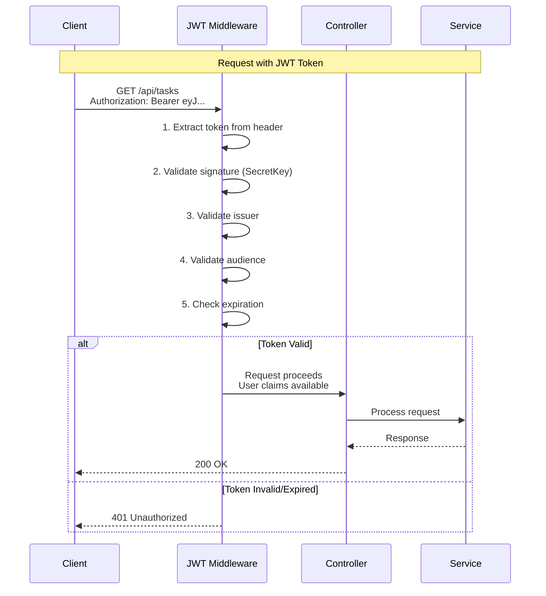
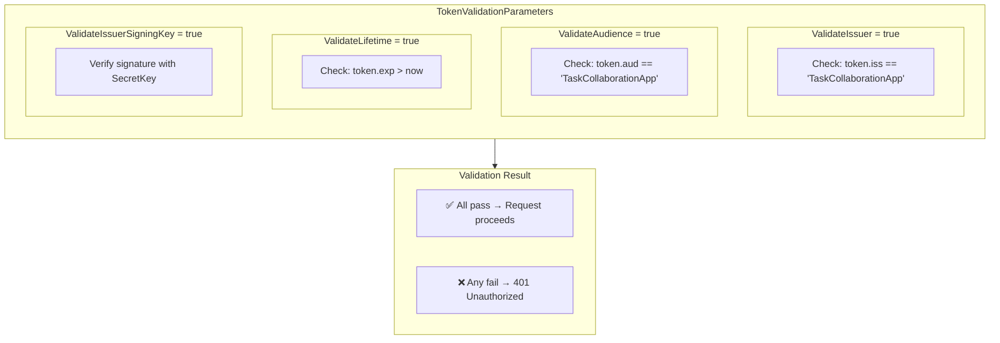
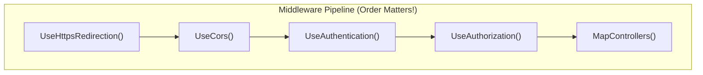

# JWT Middleware Implementation Plan

## Overview

Task #12: Configure JWT Bearer authentication middleware in Program.cs

**GitHub Issue:** #12

---

## What Already Existed (From Task #6, #7)

| Component | Status | Location |
|-----------|--------|----------|
| JwtSettings.cs | ✅ Already existed | Configuration/JwtSettings.cs |
| JwtService.cs | ✅ Already existed | Services/JwtService.cs |
| appsettings.json JWT config | ✅ Already existed | appsettings.json |
| Configure<JwtSettings>() | ✅ Already existed | Program.cs (from Task #7 bug fix) |

---

## What Was Added in This Task

### JWT Bearer Authentication Middleware

**Location:** Program.cs

**Purpose:** Enable ASP.NET Core to validate JWT tokens in incoming requests

---

## JWT Authentication Middleware

### Responsibility

| Aspect | Description |
|--------|-------------|
| **What it does** | Validates JWT tokens in incoming HTTP requests |
| **Where it runs** | In the ASP.NET Core middleware pipeline |
| **When it runs** | On every request before reaching controllers |
| **Output** | Populates `HttpContext.User` with claims from valid tokens |

### Logic (Step-by-Step)

### Runtime Behavior

| Scenario | Result |
|----------|--------|
| No Authorization header | Request continues (anonymous) |
| Valid token | `HttpContext.User.Identity.IsAuthenticated = true` |
| Invalid signature | 401 Unauthorized |
| Expired token | 401 Unauthorized |
| Wrong issuer/audience | 401 Unauthorized |

### Changes When

| Condition | Action Required |
|-----------|-----------------|
| SecretKey changes | All existing tokens become invalid |
| Issuer/Audience changes | Update both appsettings.json AND token generation |
| Expiration policy changes | Only affects newly issued tokens |

### Does NOT Do

| What it doesn't do | Why |
|-------------------|-----|
| Generate tokens | That's JwtService's responsibility |
| Store tokens | Tokens are stateless (client stores them) |
| Check user permissions | That's Authorization's responsibility (`[Authorize]` attribute) |
| Handle refresh tokens | Separate endpoint/logic required |
| Invalidate tokens | JWTs are stateless; use short expiry or blacklist |

---

## JWT Authentication Flow

---

## TokenValidationParameters

### Responsibility

| Aspect | Description |
|--------|-------------|
| **What it does** | Configures what the middleware validates in each token |
| **Where it's set** | In `AddJwtBearer()` options during service registration |
| **When it's used** | Every time a token is validated |

### Logic (Each Parameter)

| Parameter | Purpose |
|-----------|---------|
| ValidateIssuer | Ensure token was issued by our server |
| ValidateAudience | Ensure token was intended for our app |
| ValidateLifetime | Reject expired tokens |
| ValidateIssuerSigningKey | Verify signature hasn't been tampered |

### Runtime Behavior

| If disabled | Risk |
|-------------|------|
| ValidateIssuer = false | Accepts tokens from any issuer |
| ValidateAudience = false | Accepts tokens meant for other apps |
| ValidateLifetime = false | Accepts expired tokens |
| ValidateIssuerSigningKey = false | Accepts tokens with invalid signatures |

### Changes When

| Condition | Impact |
|-----------|--------|
| Add new validation parameter | More strict token validation |
| Remove validation parameter | Security vulnerability |
| Change ValidIssuer/ValidAudience | Must update token generation to match |

### Does NOT Do

| What | Why |
|------|-----|
| Custom claim validation | Use `IAuthorizationHandler` for that |
| Role-based checks | Use `[Authorize(Roles = "Admin")]` attribute |
| Token refresh | Separate endpoint logic |

---

## Middleware Order

### Responsibility

| Aspect | Description |
|--------|-------------|
| **What it does** | Determines the sequence of request processing |
| **Why order matters** | Each middleware depends on previous ones |

### Logic

### Runtime Behavior

| Order | Reason |
|-------|--------|
| CORS before Auth | Preflight requests need CORS headers before auth check |
| Auth before Authz | Must know WHO (authentication) before checking permissions (authorization) |

### Changes When

| Change | Impact |
|--------|--------|
| Move Auth after Authz | Authorization fails - user identity not set yet |
| Move CORS after Auth | Preflight requests fail with 401 |

### Does NOT Do

| What | Why |
|------|-----|
| Handle exceptions | Use UseExceptionHandler() |
| Serve static files | Use UseStaticFiles() |

---

## Token Expiry Configuration

### Responsibility

| Aspect | Description |
|--------|-------------|
| **What it does** | Defines how long tokens remain valid |
| **Where it's set** | appsettings.json → JwtSettings.ExpirationMinutes |

### Logic

| Setting | Calculation |
|---------|-------------|
| ExpirationMinutes = 10080 | 60 min × 24 hr × 7 days = 10080 |

### Runtime Behavior

| Token Age | Result |
|-----------|--------|
| < 7 days | Token valid |
| > 7 days | 401 Unauthorized |

### Changes When

| Condition | Impact |
|-----------|--------|
| Decrease expiry | Users need to re-login more often |
| Increase expiry | Longer window if token is compromised |

### Does NOT Do

| What | Alternative |
|------|-------------|
| Refresh expired tokens | Implement /auth/refresh endpoint |
| Invalidate active tokens | Use token blacklist or short expiry |

---

## Checklist

- [x] Add using statements for JWT namespaces
- [x] Add AddAuthentication() with JwtBearer scheme
- [x] Configure TokenValidationParameters
- [x] Add UseAuthentication() middleware
- [x] Verify middleware order (Auth before Authz)
- [x] Update ExpirationMinutes to 10080 (7 days)

---

## Related Documentation

- [Login Page API Contract](../../../api-contracts/01-Login-Page-Contract.md)
- [Task #6 Auth Service](../06-auth-service/00-development-plan.md)
- [Task #7 Auth Controller](../07-auth-controller/00-development-plan.md)
