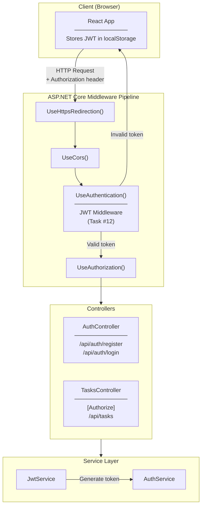
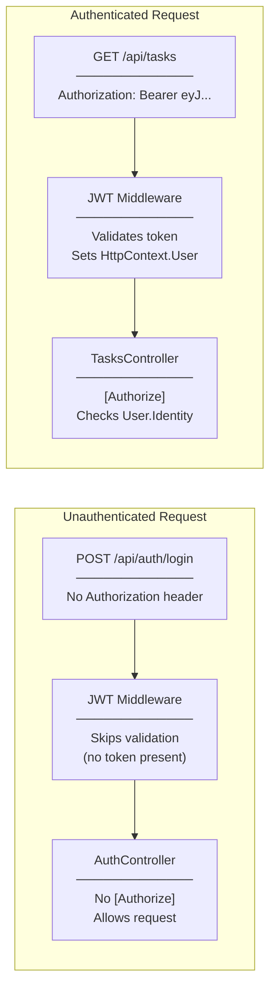
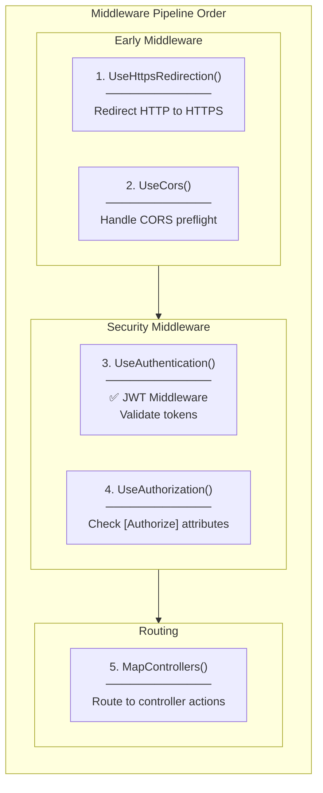
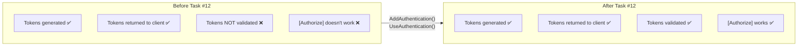
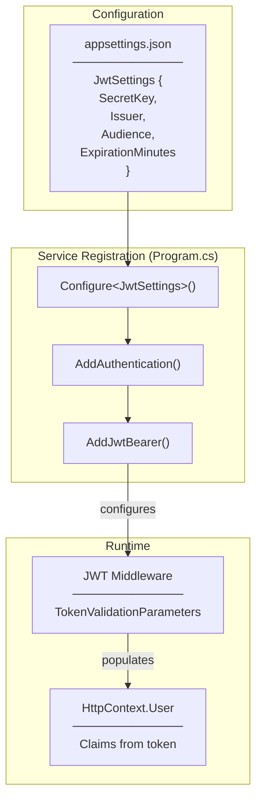

# Architecture Diagram - Task #12

## Overview

This document shows where JWT Middleware fits in the overall application architecture.

---

## System Architecture with JWT Middleware

---

## Request Flow: Authenticated vs Unauthenticated

---

## JWT Middleware Position in Pipeline

---

## Before vs After Task #12

---

## Component Interaction

---

## Related Documentation

- [00-development-plan.md](./00-development-plan.md) - Implementation details
- [02-design-patterns-and-solid.md](./02-design-patterns-and-solid.md) - Design patterns used
- [03-programming-concepts.md](./03-programming-concepts.md) - Programming concepts
