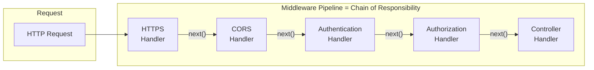
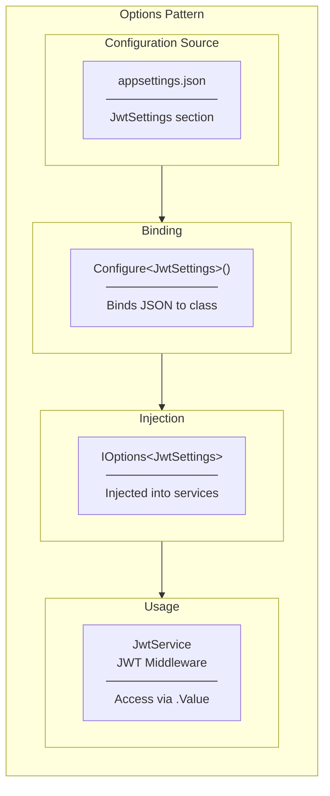
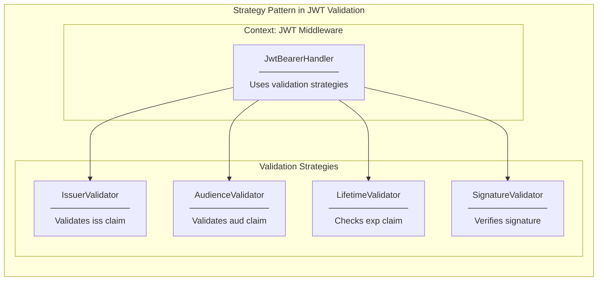
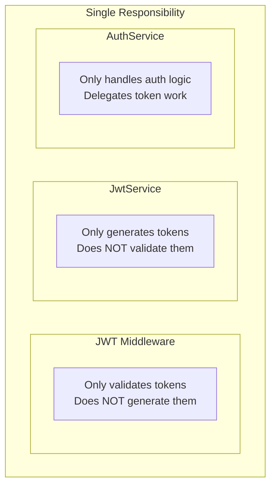
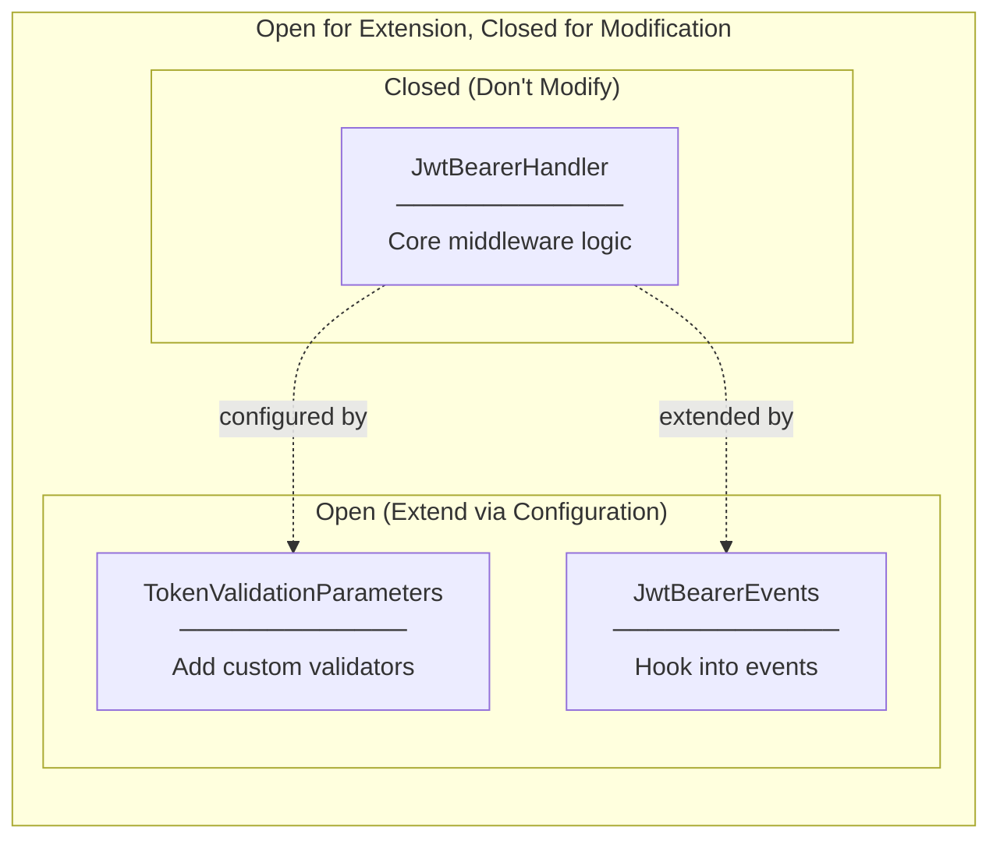
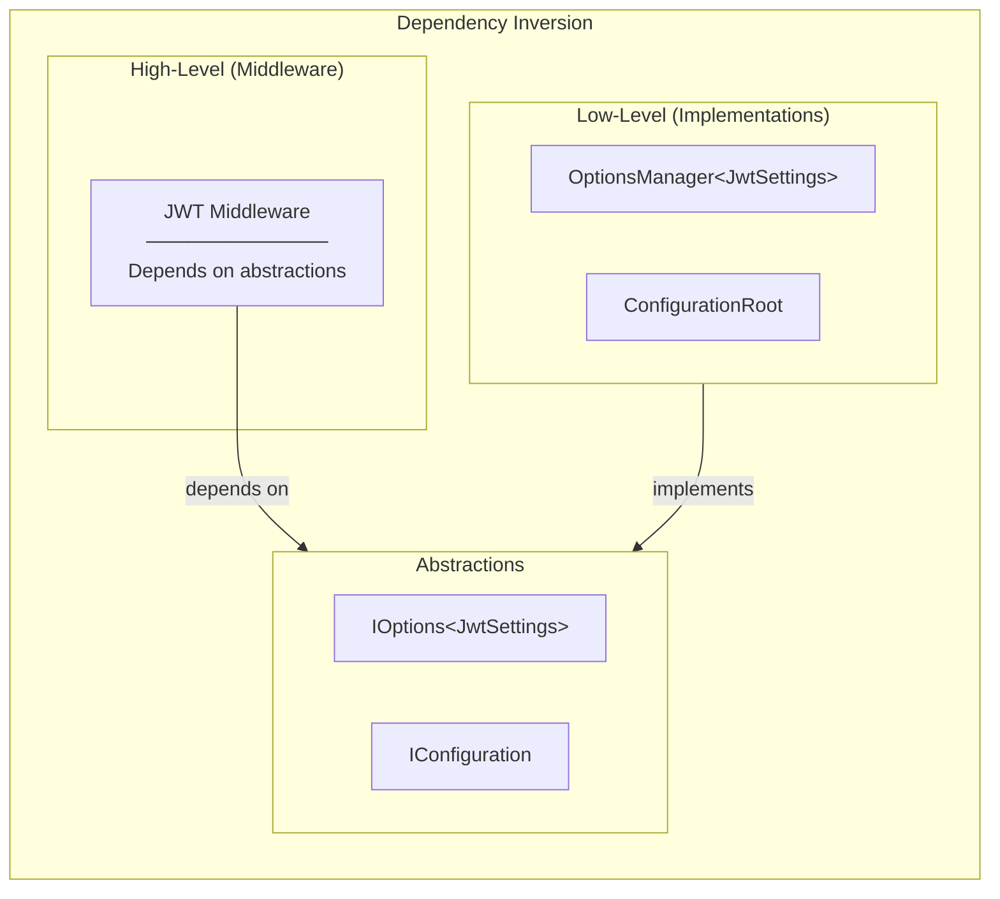

# Design Patterns and SOLID Principles - Task #12

## Overview

This document analyzes the design patterns and SOLID principles applied in the JWT Middleware implementation.

---

## Design Patterns

### 1. Chain of Responsibility Pattern

| Aspect | Description |
|--------|-------------|
| **Responsibility** | Decouples request sender from receivers |
| **Logic** | Each middleware decides to handle or pass to next |
| **Runtime** | Request flows through chain until handled or completed |
| **Changes when** | Add/remove middleware in pipeline |
| **Does NOT do** | Guarantee order (developer must configure correctly) |

---

### 2. Options Pattern

| Aspect | Description |
|--------|-------------|
| **Responsibility** | Strongly-typed configuration access |
| **Logic** | Binds JSON sections to C# classes |
| **Runtime** | Configuration values available via DI |
| **Changes when** | appsettings.json changes (with reload support) |
| **Does NOT do** | Validate configuration at startup (use IValidateOptions for that) |

---

### 3. Strategy Pattern (in TokenValidation)

| Aspect | Description |
|--------|-------------|
| **Responsibility** | Allows swappable validation algorithms |
| **Logic** | Each validator is independent strategy |
| **Runtime** | All strategies run; all must pass |
| **Changes when** | Custom validators added via TokenValidationParameters |
| **Does NOT do** | Short-circuit on first failure (all are checked) |

---

## SOLID Principles

### Single Responsibility Principle (SRP)

| Component | Single Responsibility |
|-----------|----------------------|
| JWT Middleware | Validate incoming tokens |
| JwtService | Generate new tokens |
| AuthService | Coordinate authentication flow |
| TokenValidationParameters | Configure validation rules |

---

### Open/Closed Principle (OCP)

| Extension Point | How to Extend |
|-----------------|---------------|
| Custom validation | Add IssuerValidator delegate |
| Event hooks | Configure OnAuthenticationFailed, OnTokenValidated |
| Custom claims | Use ClaimsTransformation |

---

### Dependency Inversion Principle (DIP)

| Abstraction | Implementation |
|-------------|----------------|
| IOptions<JwtSettings> | OptionsManager<JwtSettings> |
| IConfiguration | ConfigurationRoot |
| SecurityKey | SymmetricSecurityKey |

---

## Pattern Summary

| Pattern | Where Applied | Benefit |
|---------|--------------|---------|
| Chain of Responsibility | Middleware Pipeline | Decoupled request processing |
| Options Pattern | JwtSettings configuration | Strongly-typed settings |
| Strategy Pattern | Token validation | Swappable validators |

| SOLID Principle | How Applied |
|-----------------|-------------|
| SRP | Each component has one job |
| OCP | Extend via configuration, not modification |
| DIP | Depend on IOptions, not concrete settings |

---

## Related Documentation

- [00-development-plan.md](./00-development-plan.md) - Implementation details
- [01-architecture-diagram.md](./01-architecture-diagram.md) - System architecture
- [03-programming-concepts.md](./03-programming-concepts.md) - Programming concepts
