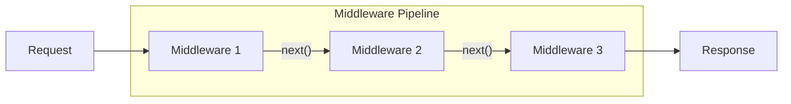
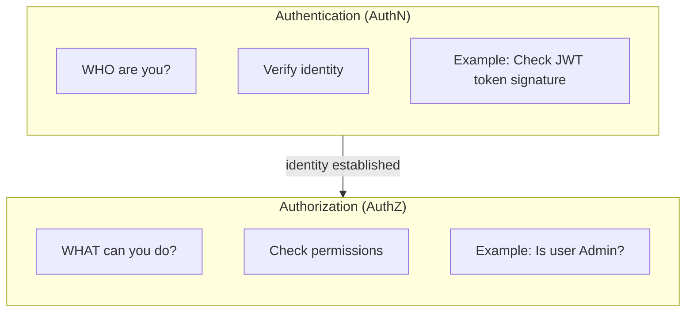
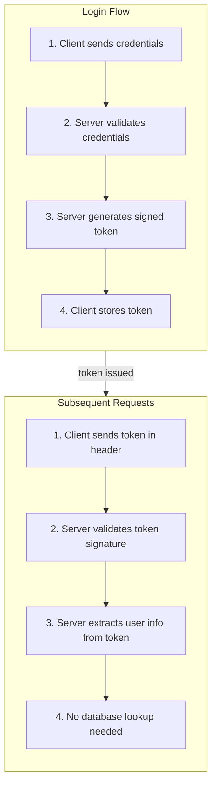
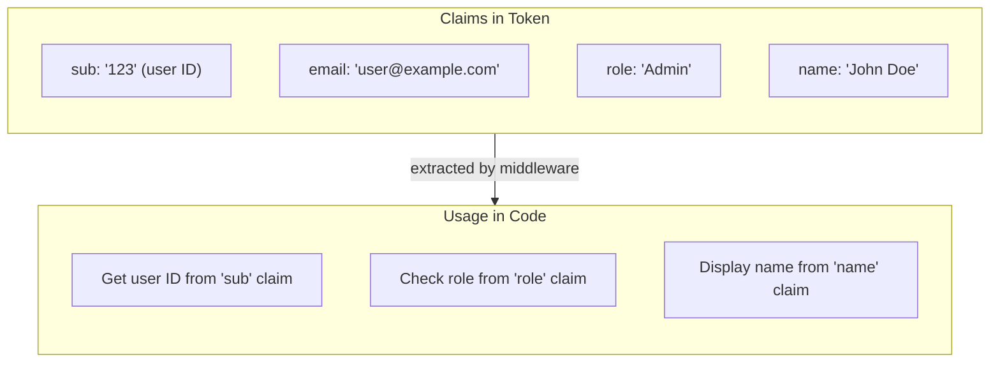
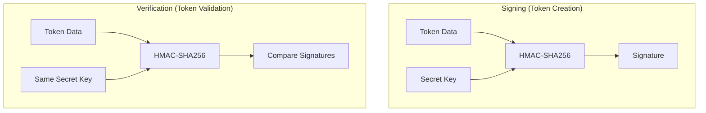
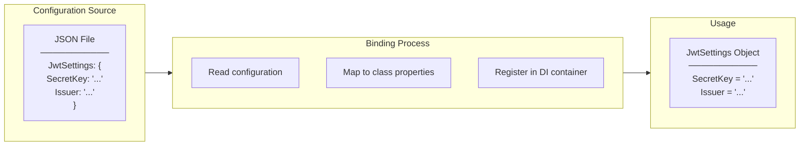
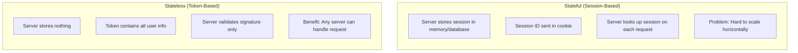

# Programming Concepts Recap (Language Agnostic)

## Table of Contents

1. [Middleware Pipeline](#1-middleware-pipeline)
2. [Authentication vs Authorization](#2-authentication-vs-authorization)
3. [Token-Based Authentication](#3-token-based-authentication)
4. [Claims-Based Identity](#4-claims-based-identity)
5. [Symmetric Key Cryptography](#5-symmetric-key-cryptography)
6. [Configuration Binding](#6-configuration-binding)
7. [Stateless Authentication](#7-stateless-authentication)

---

## 1. Middleware Pipeline

**Concept:** A chain of components that process requests in sequence. Each component can handle the request, modify it, or pass it to the next component.

**Where Applied:**
- HTTPS Redirect → CORS → Authentication → Authorization → Routing
- Each middleware has single responsibility
- Order matters: authentication must run before authorization

**Key Insight:**
| Action | Effect |
|--------|--------|
| Call next() | Pass to next middleware |
| Don't call next() | Short-circuit (stop pipeline) |
| Return early | Send response immediately |

**Benefit:** Separation of concerns - each middleware handles one aspect of request processing.

---

## 2. Authentication vs Authorization

**Concept:** Two distinct security concerns often confused.

**Where Applied:**
| Aspect | Authentication | Authorization |
|--------|---------------|---------------|
| Question | "Who is this user?" | "Can they do this?" |
| Happens | First (validate token) | Second (check roles) |
| Failure | 401 Unauthorized | 403 Forbidden |
| Mechanism | JWT Middleware | [Authorize] attribute |

**Key Insight:** Authentication always comes before Authorization. You can't check permissions without knowing who the user is.

---

## 3. Token-Based Authentication

**Concept:** Server issues a signed token. Client sends token with each request. Server validates token without database lookup.

**Where Applied:**
- JWT (JSON Web Token) contains encoded user claims
- Token sent in Authorization header: `Bearer eyJ...`
- Server validates signature without session state

**Benefit:** Stateless - server doesn't need to store sessions. Scalable for distributed systems.

---

## 4. Claims-Based Identity

**Concept:** User identity represented as a collection of claims (key-value pairs) rather than a single ID.

**Where Applied:**
| Claim | Purpose |
|-------|---------|
| sub (subject) | Unique user identifier |
| email | User's email address |
| role | User's role for authorization |
| exp | Token expiration time |
| iat | Token issued at time |

**Key Insight:** Claims are self-contained. Server doesn't need database lookup to know user's role.

**Benefit:** Flexible identity model - add any claims you need without schema changes.

---

## 5. Symmetric Key Cryptography

**Concept:** Same key used for both signing and verification. Must be kept secret on server.

**Where Applied:**
- Server signs token with SecretKey
- Server verifies token with same SecretKey
- Client never sees SecretKey

**Key Insight:**
| If... | Then... |
|-------|---------|
| Key is compromised | Attacker can forge tokens |
| Key changes | All existing tokens become invalid |
| Key is weak | Vulnerable to brute force |

**Benefit:** Fast verification - no asymmetric crypto overhead.

---

## 6. Configuration Binding

**Concept:** Map configuration data (from files, environment) to strongly-typed objects.

**Where Applied:**
- JWT settings from appsettings.json
- Bound to JwtSettings class
- Injected via IOptions<JwtSettings>

**Benefit:** Type-safe configuration access. Compile-time checking instead of runtime string lookups.

---

## 7. Stateless Authentication

**Concept:** Server doesn't store session state. All information needed for authentication is in the token itself.

**Where Applied:**
- JWT tokens are self-contained
- No session database needed
- Any server instance can validate token

**Key Insight:**
| Aspect | Stateful | Stateless |
|--------|----------|-----------|
| Server storage | Required | None |
| Scalability | Complex | Simple |
| Logout | Delete session | Revocation challenging |
| Token size | Small (session ID) | Larger (contains claims) |

**Trade-off:** Stateless is more scalable but harder to revoke tokens before expiry.

---

## Summary Table

| Concept | Where Applied | Key Benefit |
|---------|---------------|-------------|
| **Middleware Pipeline** | Request processing chain | Separation of concerns |
| **AuthN vs AuthZ** | Security layers | Clear responsibility |
| **Token-Based Auth** | JWT in Authorization header | Stateless, scalable |
| **Claims-Based Identity** | User info in token | Self-contained identity |
| **Symmetric Key** | Token signing/verification | Fast, simple |
| **Configuration Binding** | appsettings.json to class | Type-safe settings |
| **Stateless Auth** | No server-side sessions | Horizontal scaling |

---

## Related Documentation

- [00-development-plan.md](./00-development-plan.md) - Implementation details
- [01-architecture-diagram.md](./01-architecture-diagram.md) - System architecture
- [02-design-patterns-and-solid.md](./02-design-patterns-and-solid.md) - Design patterns
