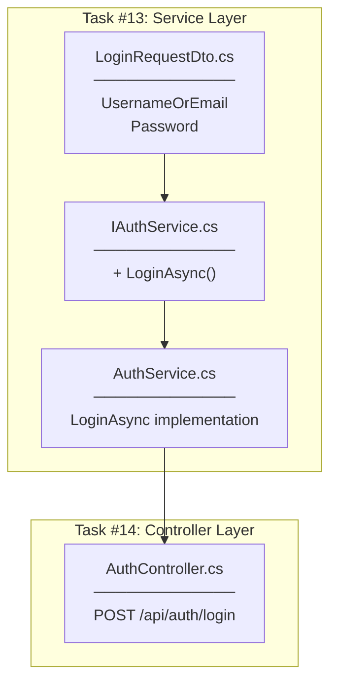
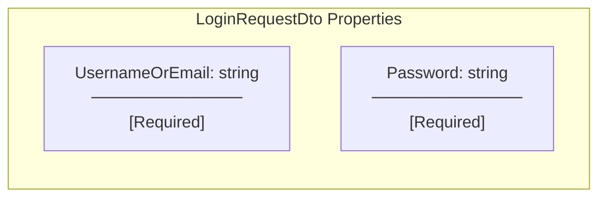
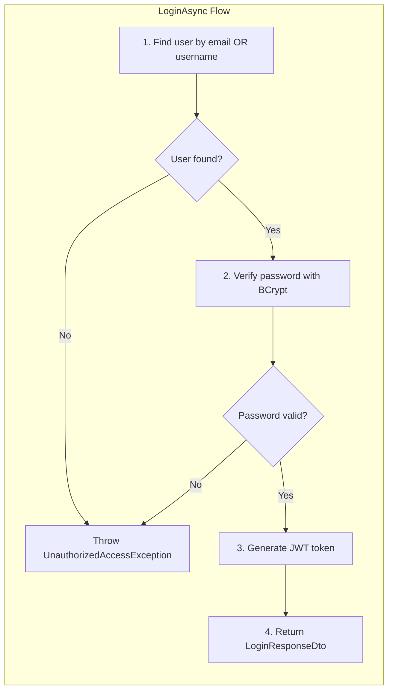
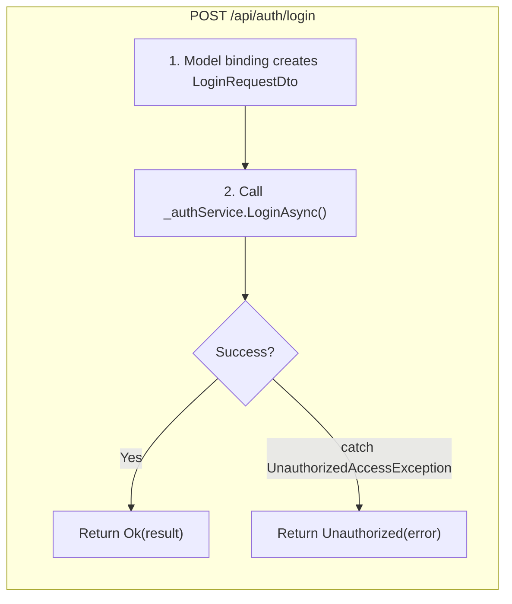
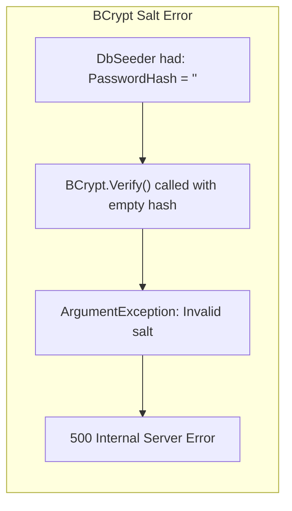
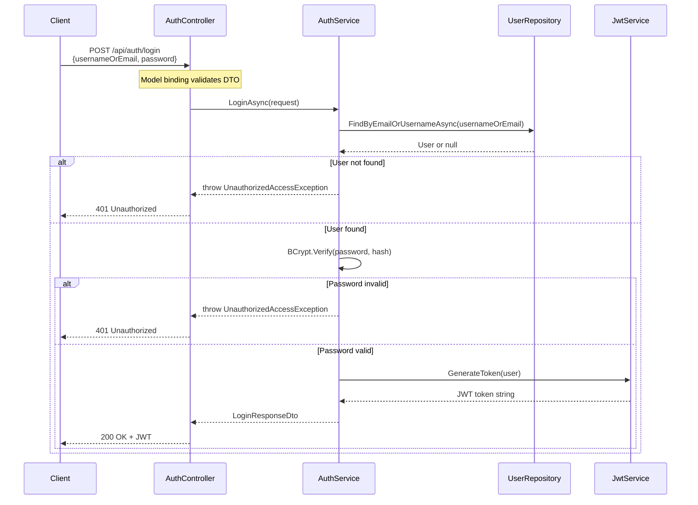

# Login Implementation Plan

## Overview

Task #13: Add LoginRequestDto + LoginAsync method
Task #14: Add POST /api/auth/login endpoint

**GitHub Issues:** #13, #14

---

## What Was Implemented

### Task #13: Service Layer

| Component | Location | Purpose |
|-----------|----------|---------|
| LoginRequestDto.cs | Controllers/DTOs/Auth/ | Client → Server login request data |
| IAuthService.LoginAsync | Services/Interfaces/ | Service contract method signature |
| AuthService.LoginAsync | Services/ | Login logic implementation |

### Task #14: Controller Layer

| Component | Location | Purpose |
|-----------|----------|---------|
| AuthController.Login | Controllers/ | POST /api/auth/login endpoint |

---

## Implementation Flow

---

## LoginRequestDto

### Responsibility

| Aspect | Description |
|--------|-------------|
| **What it does** | Carries login credentials from client to server |
| **Where it's used** | Received by AuthController.Login endpoint |
| **When it's validated** | Model binding validates before action executes |

### Logic

### Runtime Behavior

| Scenario | Result |
|----------|--------|
| Missing UsernameOrEmail | 400 Bad Request (validation error) |
| Missing Password | 400 Bad Request (validation error) |
| Empty JSON body | 400 Bad Request (validation error) |
| Malformed JSON | 400 Bad Request (parse error) |

### Changes When

| Condition | Action Required |
|-----------|-----------------|
| Add new login method (e.g., phone number) | Add new property with validation |
| Add "Remember Me" feature | Add optional boolean property |

### Does NOT Do

| What it doesn't do | Why |
|-------------------|-----|
| Validate credentials | That's AuthService's responsibility |
| Check user existence | That's AuthService's responsibility |
| Hash password | Password sent in plain text (HTTPS encrypts in transit) |

---

## LoginAsync (Service Method)

### Responsibility

| Aspect | Description |
|--------|-------------|
| **What it does** | Validates credentials and returns JWT token |
| **Where it's called** | From AuthController.Login |
| **When it throws** | When credentials are invalid |

### Logic (Step-by-Step)

### Runtime Behavior

| Scenario | Result |
|----------|--------|
| Valid username + valid password | 200 OK + JWT token |
| Valid email + valid password | 200 OK + JWT token |
| Valid user + wrong password | UnauthorizedAccessException |
| Non-existent user | UnauthorizedAccessException |

### Changes When

| Condition | Action Required |
|-----------|-----------------|
| Add account lockout | Track failed attempts before BCrypt verify |
| Add 2FA | Add verification step after password check |
| Add login logging | Log attempt after result determined |

### Does NOT Do

| What it doesn't do | Why |
|-------------------|-----|
| Register new users | That's RegisterAsync's responsibility |
| Validate request format | DTO validation handles this |
| Store login history | Could be added as separate concern |
| Rate limiting | Should be handled at middleware level |

---

## Login Endpoint

### Responsibility

| Aspect | Description |
|--------|-------------|
| **What it does** | HTTP entry point for user login |
| **Route** | POST /api/auth/login |
| **Returns** | 200 OK with JWT or 401 Unauthorized |

### Logic

### Runtime Behavior

| HTTP Status | Condition |
|-------------|-----------|
| 200 OK | Valid credentials |
| 400 Bad Request | Invalid request format (model binding) |
| 401 Unauthorized | Invalid credentials |

### Changes When

| Condition | Action Required |
|-----------|-----------------|
| Add refresh token | Return refresh token in response |
| Add login audit | Log successful logins |
| Add CAPTCHA | Add verification before calling service |

### Does NOT Do

| What it doesn't do | Why |
|-------------------|-----|
| Validate credentials | Delegates to AuthService |
| Generate tokens | Delegates to JwtService via AuthService |
| Handle registration | Separate /register endpoint |

---

## Bug Fix: DbSeeder Password Hash

### Problem

### Solution

| Before | After |
|--------|-------|
| `PasswordHash = ""` | `PasswordHash = BCryptNet.HashPassword("User123!")` |

### Lesson Learned

| Issue | Prevention |
|-------|------------|
| Empty password hash in seeder | Always hash passwords, even for test data |
| BCrypt requires valid hash format | Seeder must use same hashing as registration |

---

## Request Flow (End-to-End)

---

## Testing Results

### Test Cases

| # | Test Case | Input | Expected | Result |
|---|-----------|-------|----------|--------|
| 1 | Valid username + password | johndoe / User123! | 200 OK + token | ✅ |
| 2 | Wrong password | johndoe / wrong123 | 401 Unauthorized | ✅ |
| 3 | Non-existent user | nobody / pass123 | 401 Unauthorized | ✅ |
| 4 | Valid email + password | john@example.com / User123! | 200 OK + token | ✅ |

### Model Binding Tests

| # | Test Case | Input | Expected | Result |
|---|-----------|-------|----------|--------|
| 1 | Wrong field name | {username: "..."} | 400 Bad Request | ✅ |
| 2 | Malformed JSON | {usernameOrEmail:} | 400 Bad Request | ✅ |
| 3 | Empty body | (empty) | 400 Bad Request | ✅ |
| 4 | Wrong content type | (no body) | 400 Bad Request | ✅ |

---

## Checklist

- [x] Create LoginRequestDto.cs
- [x] Add LoginAsync to IAuthService
- [x] Implement LoginAsync in AuthService
- [x] Add Login endpoint to AuthController
- [x] Fix DbSeeder password hash bug
- [x] Test all scenarios via Swagger
- [x] Test model binding validation

---

## Related Documentation

- [Task #12 JWT Middleware](../12-jwt-middleware/00-development-plan.md)
- [Task #6 Auth Service](../06-auth-service/00-development-plan.md)
- [Task #7 Auth Controller](../07-auth-controller/00-development-plan.md)
