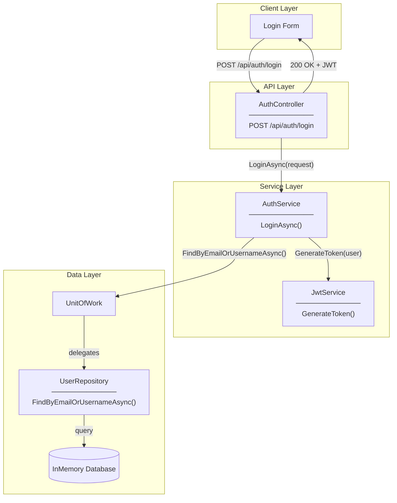
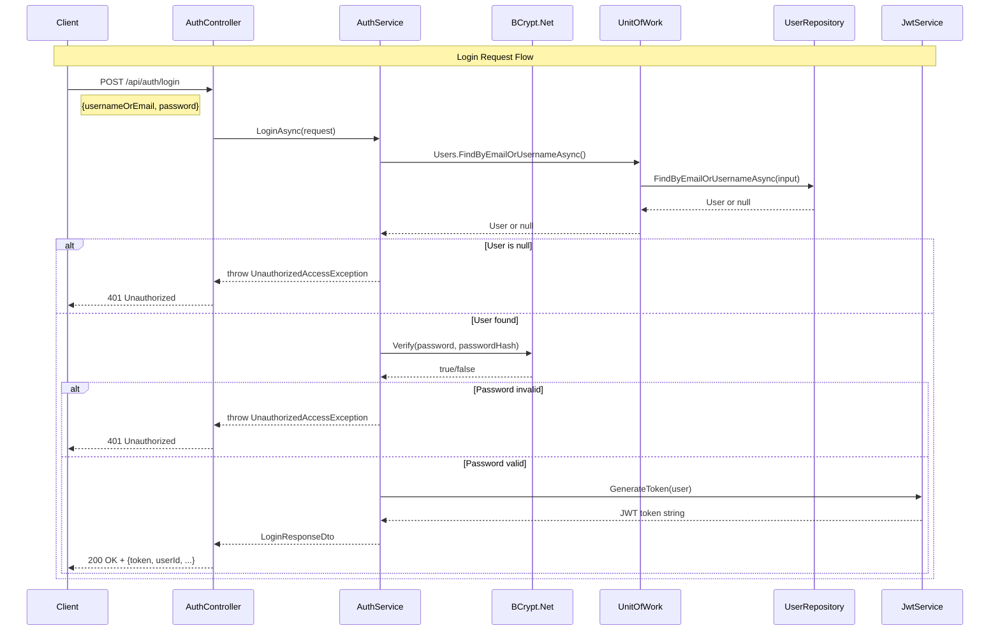
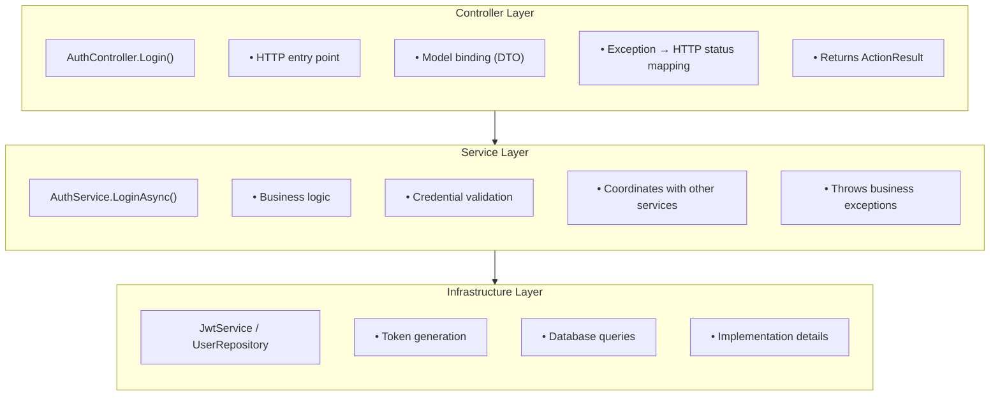
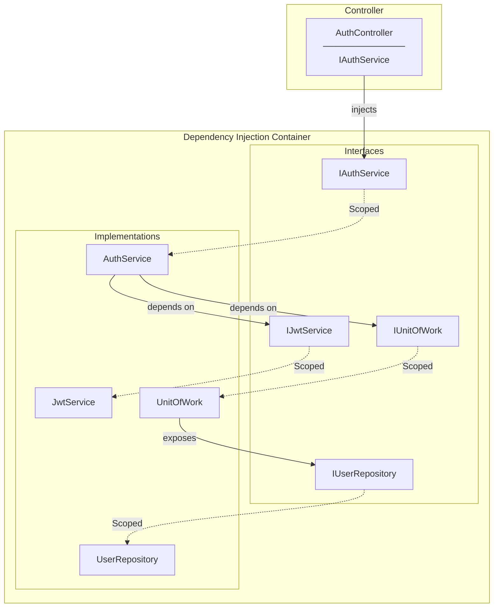
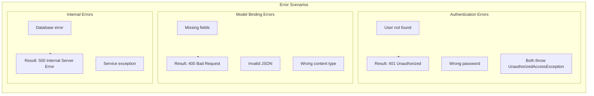
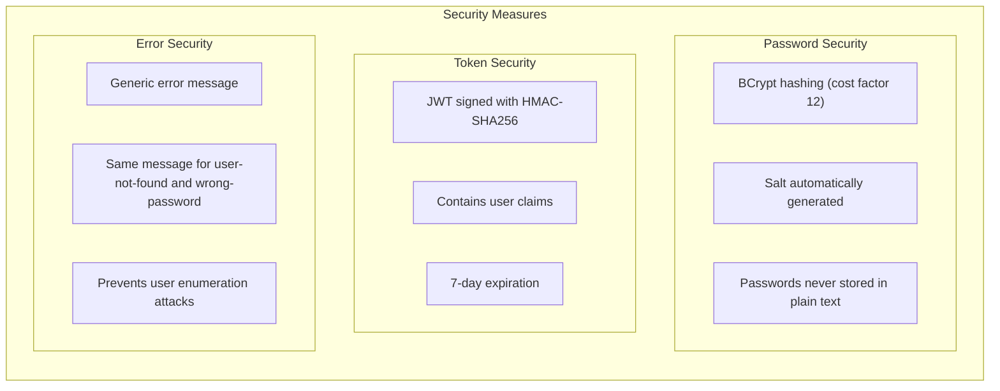

# Login Architecture Diagram

## System Overview

---

## Login Request Flow

---

## Layer Responsibilities

---

## Dependency Injection Graph

---

## Error Handling Flow

---

## Security Design

---

## Data Flow Summary

| Step | Component | Action | Output |
|------|-----------|--------|--------|
| 1 | Client | Send credentials | HTTP POST request |
| 2 | Model Binding | Validate request | LoginRequestDto |
| 3 | AuthController | Route to service | LoginAsync() call |
| 4 | AuthService | Find user | User or null |
| 5 | BCrypt | Verify password | true/false |
| 6 | JwtService | Generate token | JWT string |
| 7 | AuthService | Build response | LoginResponseDto |
| 8 | AuthController | Return result | 200 OK or 401 |
