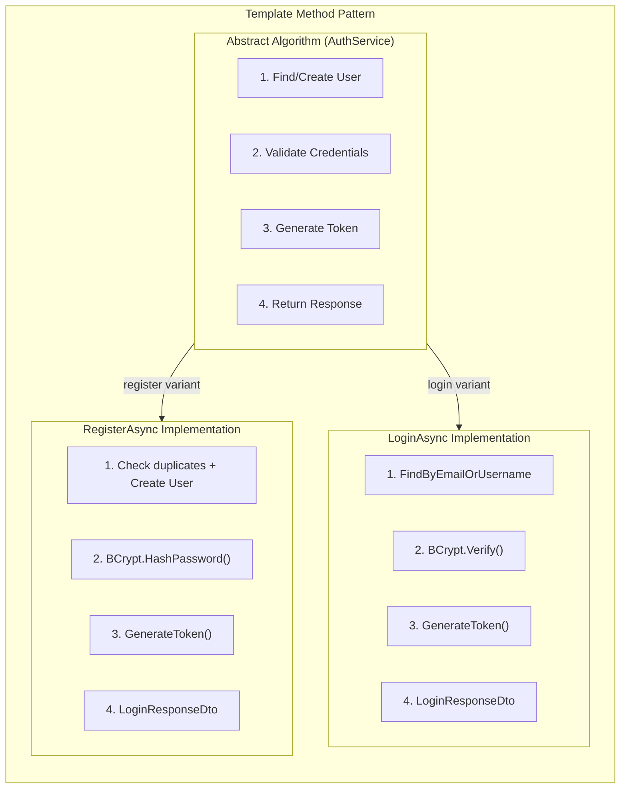
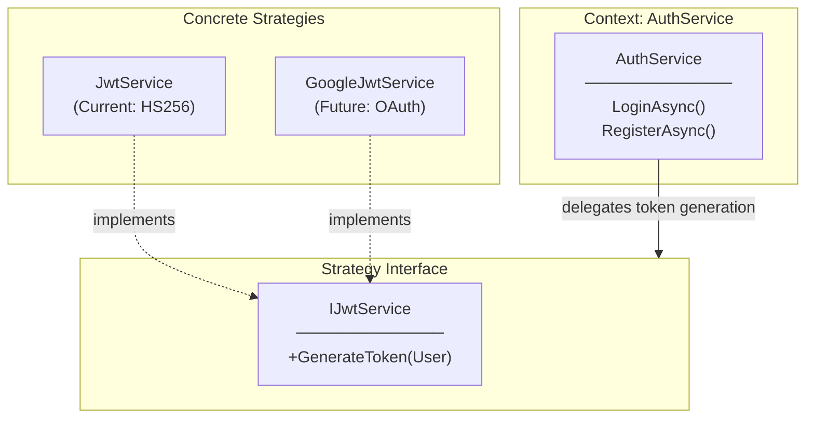
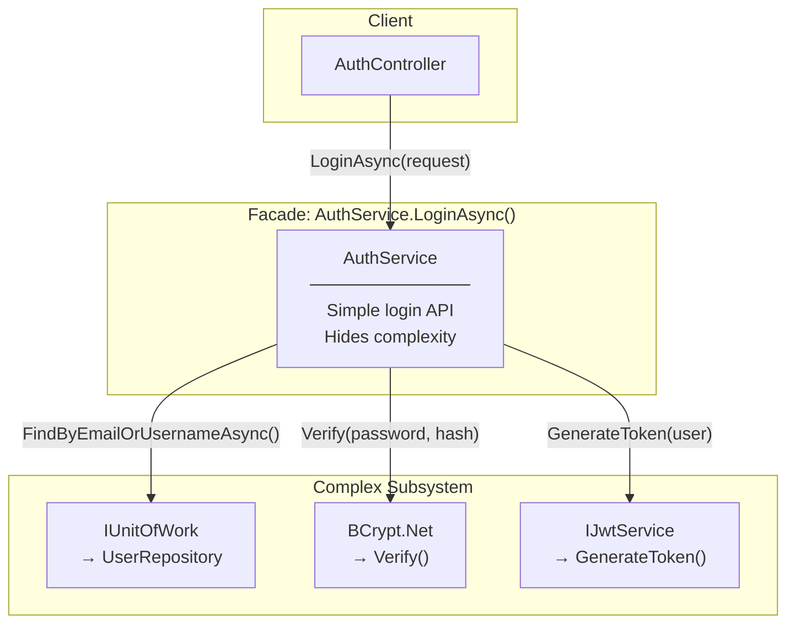
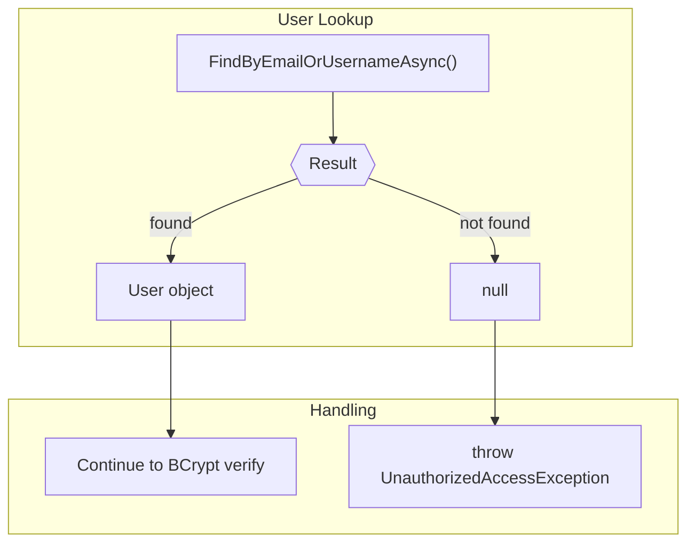
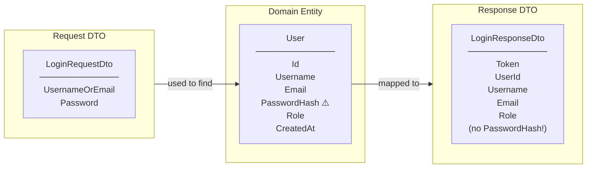
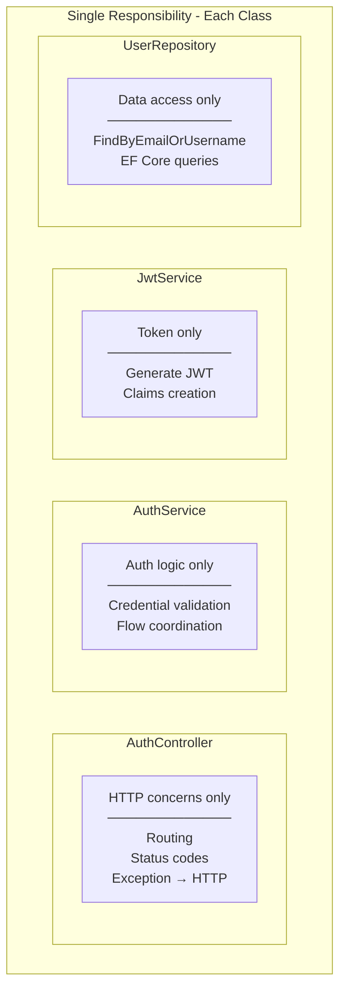
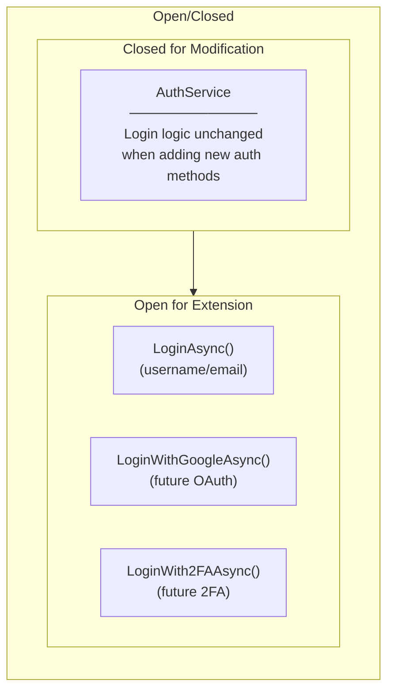
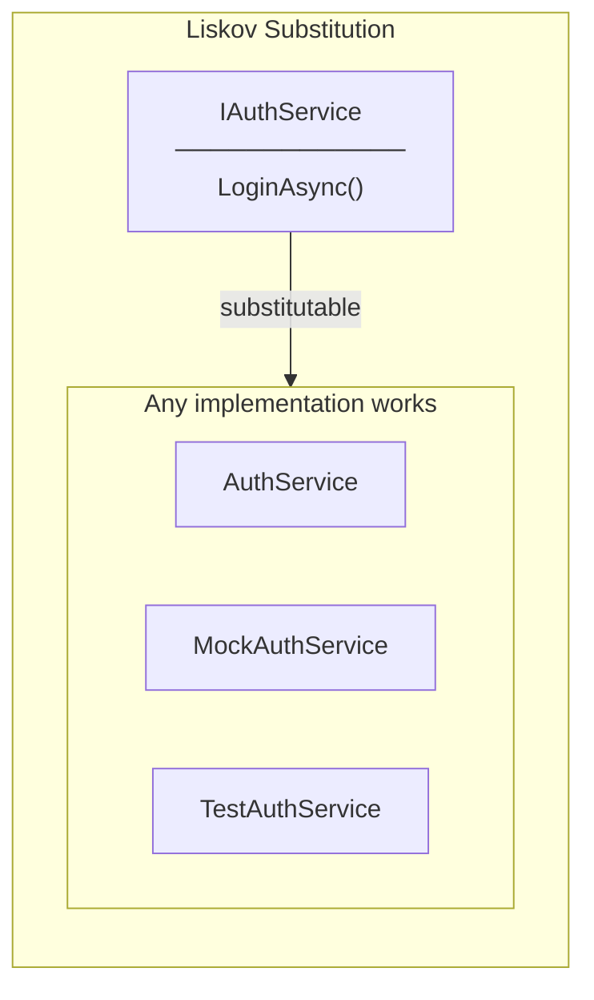
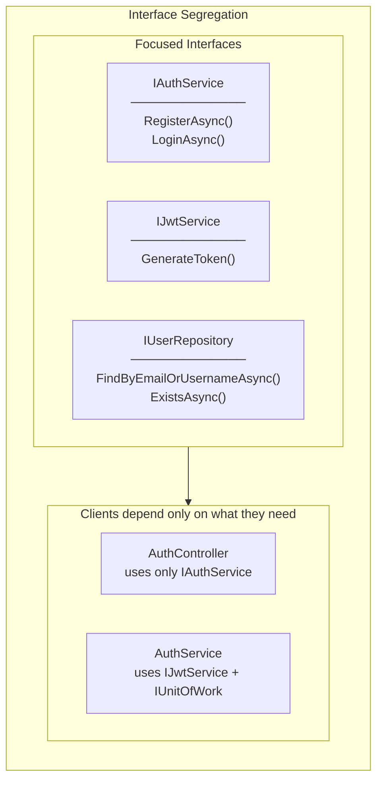
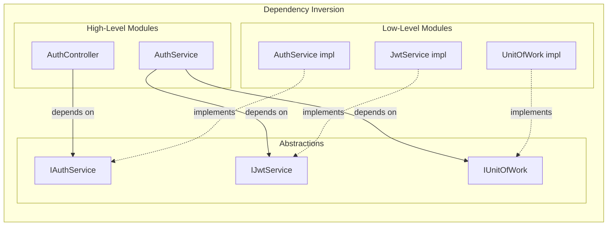

# Design Patterns & SOLID Principles in Login Implementation

## GoF Design Patterns Applied

### 1. Template Method Pattern (LoginAsync vs RegisterAsync)

**Where:** `AuthService.LoginAsync()` and `AuthService.RegisterAsync()` share common steps

**Why Template Method:**
- Both methods follow same skeleton: user operation → credential operation → token → response
- Step 3 and 4 are identical (reuse `_jwtService.GenerateToken()` and `LoginResponseDto`)
- Variation only in steps 1-2 (find vs create, verify vs hash)

---

### 2. Strategy Pattern (IJwtService)

**Where:** `IJwtService` used by both `LoginAsync` and `RegisterAsync`

**Why Strategy:**
- AuthService doesn't know HOW tokens are generated
- Same strategy used for both login and registration
- Token generation algorithm is encapsulated and interchangeable

---

### 3. Facade Pattern (AuthService as Facade)

**Where:** `AuthService.LoginAsync()` coordinates multiple subsystems

**Why Facade:**
- Controller only calls one method: `LoginAsync()`
- Hides complexity: user lookup, password verification, token generation
- Single entry point for login operation

---

### 4. Null Object Pattern (Error Handling)

**Where:** User lookup returns `null` for non-existent user

**Why This Approach:**
- Explicit null check before proceeding
- Same exception for "user not found" and "wrong password"
- Prevents user enumeration attacks (same error message)

---

### 5. Data Transfer Object (DTO) Pattern

**Where:** `LoginRequestDto` and `LoginResponseDto`

**Why DTO:**
- Decouple API contract from entity structure
- Hide sensitive data (PasswordHash never returned)
- Validation attributes on DTO, not entity

---

## SOLID Principles Applied

### S - Single Responsibility Principle (SRP)

| Class | Single Responsibility |
|-------|----------------------|
| `AuthController.Login` | HTTP routing, status code mapping |
| `AuthService.LoginAsync` | Login business logic |
| `JwtService` | Token generation |
| `UserRepository` | User data access |
| `LoginRequestDto` | Input data structure |

---

### O - Open/Closed Principle (OCP)

**Where Applied:**
- New auth methods can be added to `IAuthService` without modifying `LoginAsync`
- New JWT strategies implement `IJwtService` without modifying existing

---

### L - Liskov Substitution Principle (LSP)

**Where Applied:**
- Any `IAuthService` implementation can be injected into `AuthController`
- Mock implementation for unit testing
- All return `LoginResponseDto` or throw `UnauthorizedAccessException`

---

### I - Interface Segregation Principle (ISP)

**Where Applied:**
- `AuthController` only depends on `IAuthService`
- `AuthController` doesn't know about `IJwtService` or `IUserRepository`
- Each interface has focused methods

---

### D - Dependency Inversion Principle (DIP)

**Where Applied:**
- `AuthController` constructor receives `IAuthService` (abstraction)
- `AuthService` constructor receives `IJwtService`, `IUnitOfWork` (abstractions)
- DI Container wires concrete implementations at runtime

---

## Summary Table

| Pattern/Principle | Where Applied | Benefit |
|-------------------|---------------|---------|
| **Template Method** | LoginAsync / RegisterAsync | Shared skeleton, varying steps |
| **Strategy** | IJwtService | Swappable token generation |
| **Facade** | AuthService.LoginAsync | Simple API, hide complexity |
| **DTO** | LoginRequestDto / ResponseDto | Decouple API from entity |
| **SRP** | Separate classes | Single reason to change |
| **OCP** | IAuthService interface | Extend without modify |
| **LSP** | Interface implementations | Substitutable, mockable |
| **ISP** | Focused interfaces | No unused dependencies |
| **DIP** | Constructor injection | Loose coupling, testable |

---

## Related Documentation

- [00-development-plan.md](./00-development-plan.md) - Implementation details
- [01-architecture-diagram.md](./01-architecture-diagram.md) - System architecture
- [03-programming-concepts.md](./03-programming-concepts.md) - Programming concepts
