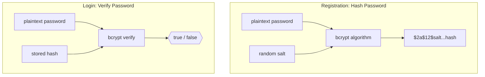
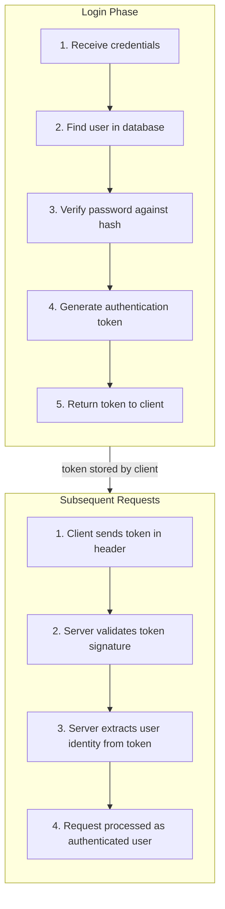
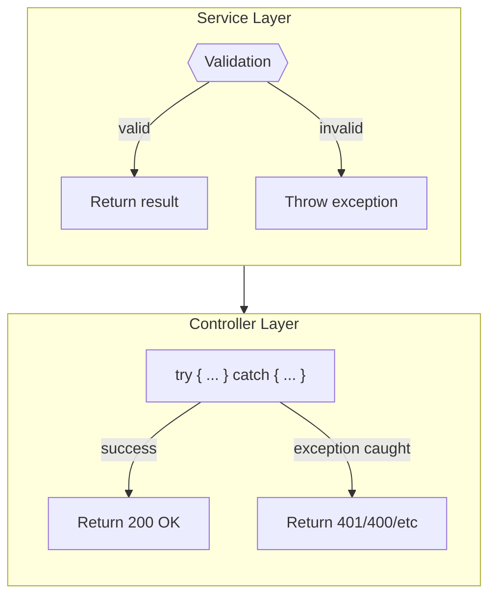
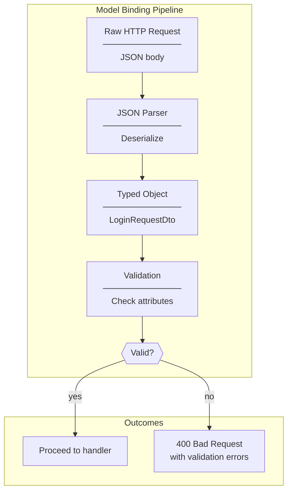
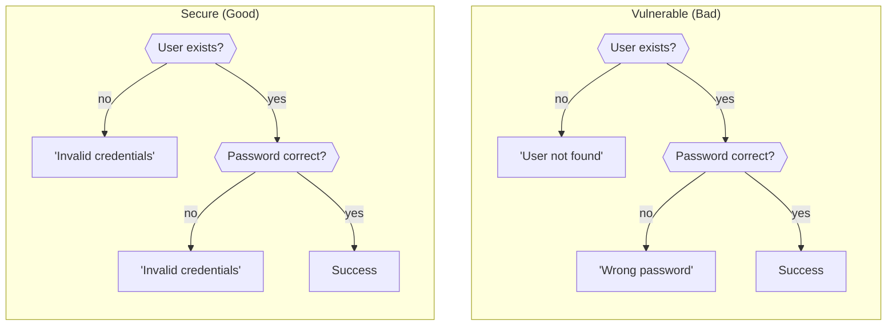
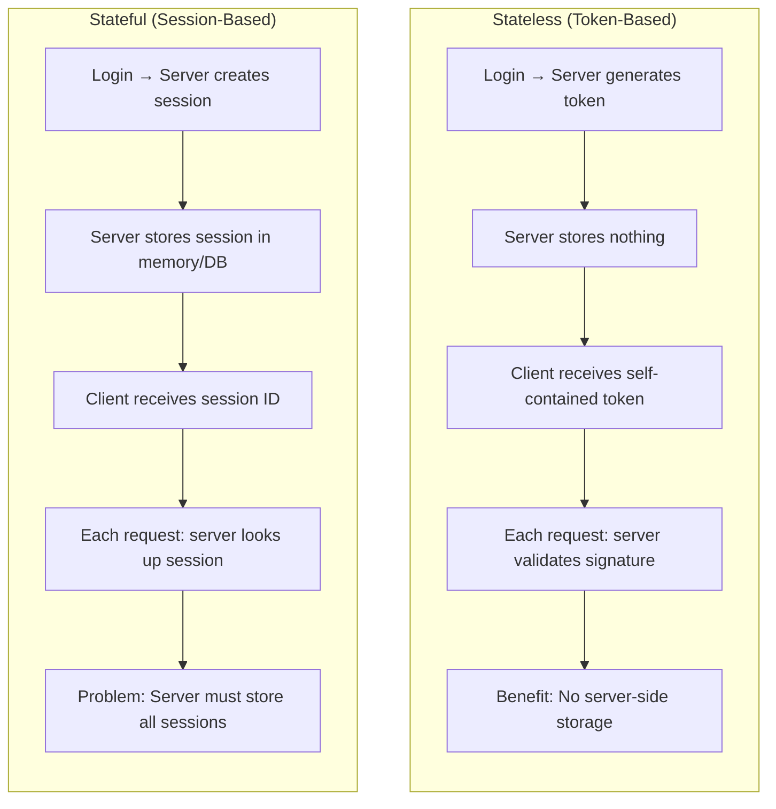
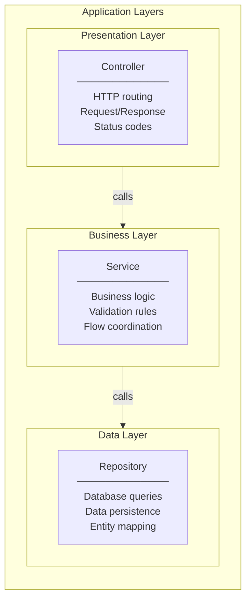

# Programming Concepts Recap (Language Agnostic)

## Table of Contents

1. [Password Verification vs Hashing](#1-password-verification-vs-hashing)
2. [Authentication Flow](#2-authentication-flow)
3. [Exception-Based Control Flow](#3-exception-based-control-flow)
4. [Model Binding and Validation](#4-model-binding-and-validation)
5. [User Enumeration Prevention](#5-user-enumeration-prevention)
6. [Stateless Token Authentication](#6-stateless-token-authentication)
7. [Layered Architecture](#7-layered-architecture)

---

## 1. Password Verification vs Hashing

**Concept:** Hashing converts passwords to irreversible fixed-length strings. Verification checks if input matches stored hash without decryption.

**Key Insight:**

| Operation | Input | Output | When Used |
|-----------|-------|--------|-----------|
| Hash | plain password | hash string | Registration |
| Verify | plain password + stored hash | boolean | Login |

**Why BCrypt:**
- Automatically generates and stores salt
- Configurable cost factor (slower = more secure)
- Designed for passwords (intentionally slow)

---

## 2. Authentication Flow

**Concept:** Credential-based authentication verifies identity, then issues a proof of authentication (token) for subsequent requests.

**Key Insight:**

| Phase | Database Access | Token Operation |
|-------|-----------------|-----------------|
| Login | Yes (find user, verify password) | Generate new token |
| Subsequent | No (stateless) | Validate existing token |

---

## 3. Exception-Based Control Flow

**Concept:** Use exceptions to signal business rule violations, letting calling code handle them appropriately.

**Key Insight:**

| Exception Type | Business Meaning | HTTP Status |
|----------------|------------------|-------------|
| UnauthorizedAccessException | Invalid credentials | 401 Unauthorized |
| InvalidOperationException | Business rule violation | 400 Bad Request |
| ArgumentException | Invalid input | 400 Bad Request |

**Benefit:** Service layer remains HTTP-agnostic; controller translates business exceptions to HTTP responses.

---

## 4. Model Binding and Validation

**Concept:** Framework automatically converts incoming request data to typed objects and validates against defined rules before executing handler code.

**Key Insight:**

| Validation Stage | What Happens | Example |
|------------------|--------------|---------|
| Parsing | JSON to object | Malformed JSON → 400 |
| Binding | Map properties | Missing field → null |
| Validation | Check attributes | [Required] → error |

**Benefit:** Handler code only executes with valid, typed data.

---

## 5. User Enumeration Prevention

**Concept:** Return identical error messages for "user not found" and "wrong password" to prevent attackers from discovering valid usernames.

**Key Insight:**

| Scenario | Vulnerable Response | Secure Response |
|----------|-------------------|-----------------|
| User not found | "User not found" | "Invalid credentials" |
| Wrong password | "Wrong password" | "Invalid credentials" |
| Valid login | Success | Success |

**Attack Prevented:** Attacker cannot enumerate valid usernames by observing different error messages.

---

## 6. Stateless Token Authentication

**Concept:** Token contains all necessary information for authentication; server doesn't store session state.

**Key Insight:**

| Aspect | Stateful | Stateless |
|--------|----------|-----------|
| Server storage | Sessions in memory/DB | None |
| Scaling | Complex (sticky sessions) | Simple (any server) |
| Revocation | Easy (delete session) | Hard (use short expiry) |
| Payload size | Small (session ID) | Larger (claims in token) |

---

## 7. Layered Architecture

**Concept:** Separate code into layers with distinct responsibilities; each layer only communicates with adjacent layers.

**Key Insight:**

| Layer | Knows About | Doesn't Know About |
|-------|-------------|-------------------|
| Controller | Service interface | Database, SQL |
| Service | Repository interface | HTTP, status codes |
| Repository | Database context | HTTP, business rules |

**Benefit:** Changes in one layer don't cascade to others; easier testing and maintenance.

---

## Summary Table

| Concept | Where Applied | Key Benefit |
|---------|---------------|-------------|
| **Password Verification** | AuthService.LoginAsync | Secure credential check |
| **Authentication Flow** | Login → Token → Requests | Stateless authentication |
| **Exception Control Flow** | Service → Controller | Clean error handling |
| **Model Binding** | Controller parameters | Automatic validation |
| **Enumeration Prevention** | Error messages | Security against enumeration |
| **Stateless Tokens** | JWT authentication | Scalable, no session storage |
| **Layered Architecture** | Controller/Service/Repo | Separation of concerns |

---

## Related Documentation

- [00-development-plan.md](./00-development-plan.md) - Implementation details
- [01-architecture-diagram.md](./01-architecture-diagram.md) - System architecture
- [02-design-patterns-and-solid.md](./02-design-patterns-and-solid.md) - Design patterns
