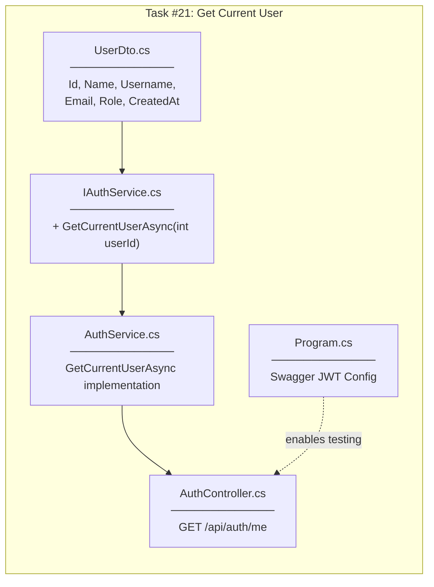
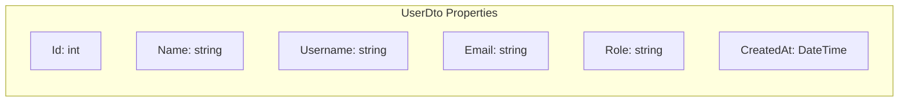
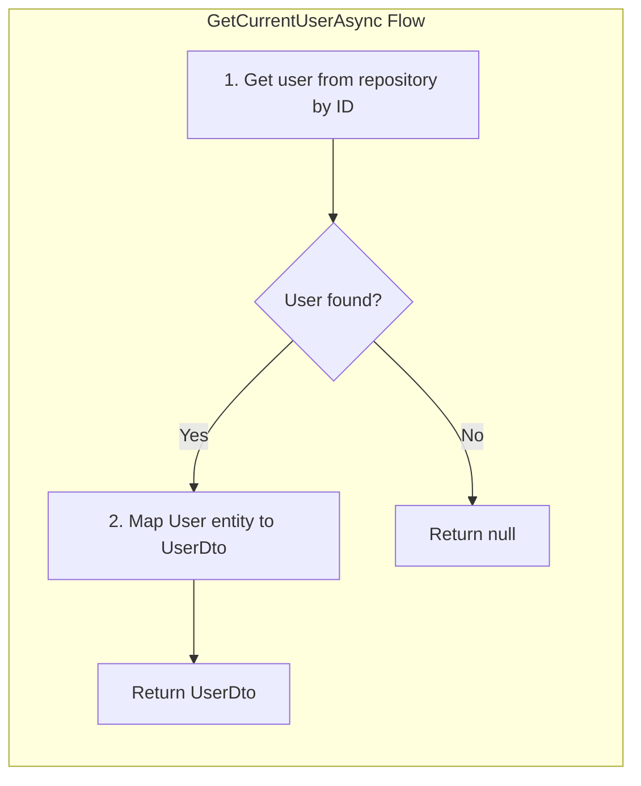
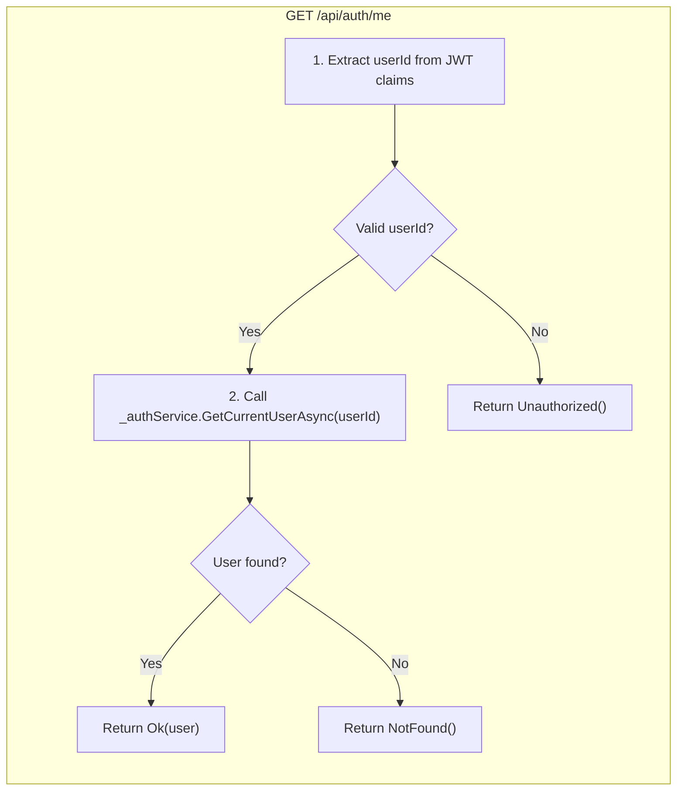
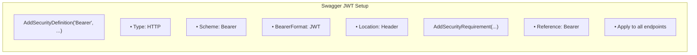
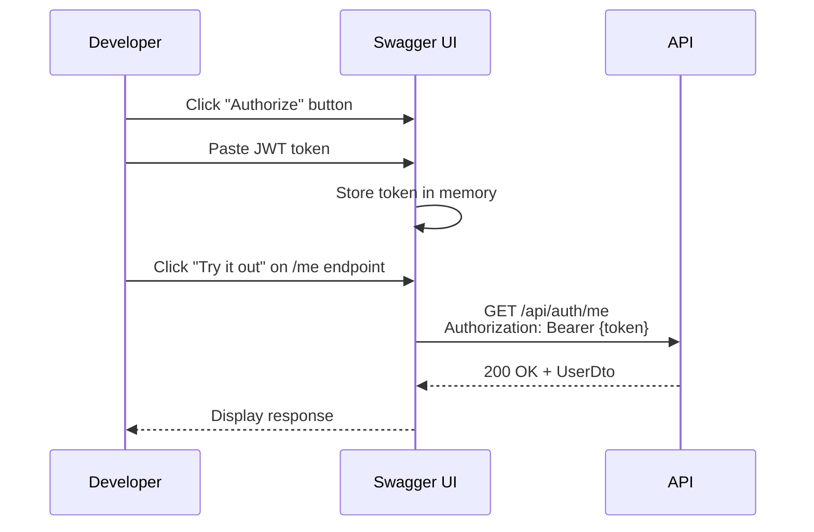
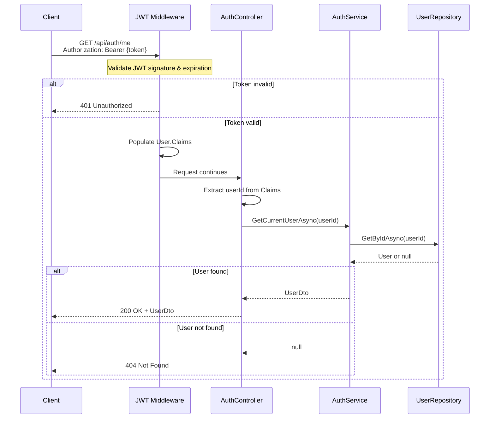
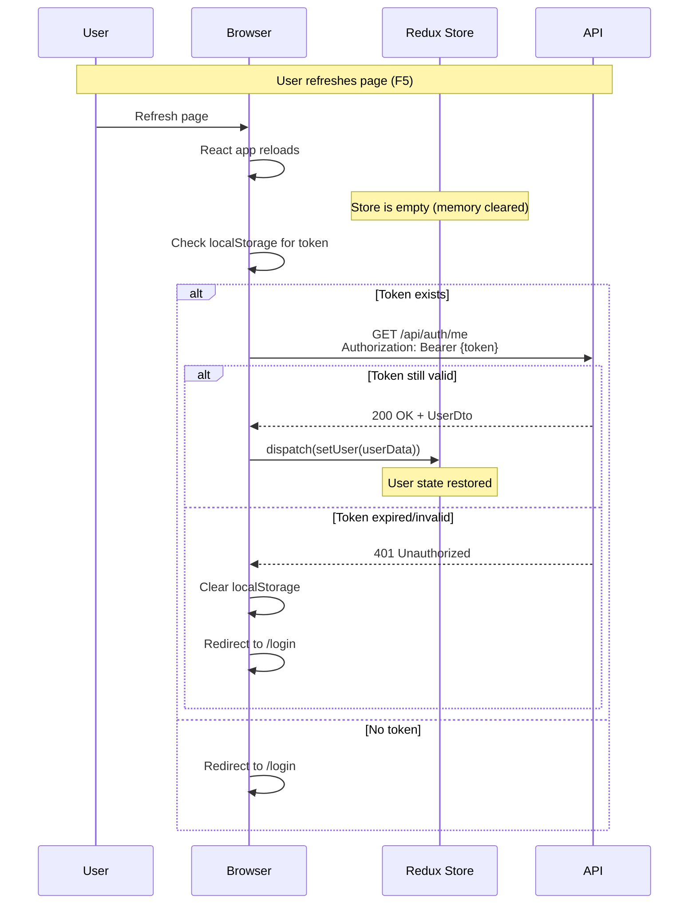

# Get Current User Implementation Plan

## Overview

Task #21: Add GET /api/auth/me endpoint to retrieve current authenticated user's information.

**GitHub Issue:** #21

---

## What Was Implemented

| Component | Location | Purpose |
|-----------|----------|---------|
| UserDto.cs | Controllers/DTOs/Auth/ | Response DTO for /me endpoint |
| IAuthService.GetCurrentUserAsync | Services/Interfaces/ | Service contract method signature |
| AuthService.GetCurrentUserAsync | Services/ | Implementation to fetch user by ID |
| AuthController.GetCurrentUser | Controllers/ | GET /api/auth/me endpoint |
| Swagger JWT Config | Program.cs | Enable JWT authentication in Swagger UI |

---

## Implementation Flow



---

## UserDto

### Responsibility

| Aspect | Description |
|--------|-------------|
| **What it does** | Carries user information from server to client |
| **Where it's used** | Returned by GET /api/auth/me endpoint |
| **Difference from LoginResponseDto** | No token field - user already authenticated |

### Properties



### Why Separate DTO?

| DTO | Contains Token? | Use Case |
|-----|-----------------|----------|
| LoginResponseDto | Yes | Login/Register - client needs token |
| UserDto | No | /me endpoint - client already has token |

---

## GetCurrentUserAsync (Service Method)

### Responsibility

| Aspect | Description |
|--------|-------------|
| **What it does** | Fetches user from database by ID |
| **Where it's called** | From AuthController.GetCurrentUser |
| **Returns** | UserDto or null if user doesn't exist |

### Logic



### Runtime Behavior

| Scenario | Result |
|----------|--------|
| User exists in database | Returns UserDto with user info |
| User doesn't exist (deleted) | Returns null |

---

## GetCurrentUser Endpoint

### Responsibility

| Aspect | Description |
|--------|-------------|
| **What it does** | HTTP entry point for current user info |
| **Route** | GET /api/auth/me |
| **Auth Required** | Yes - [Authorize] attribute |
| **Returns** | 200 OK with UserDto, 401, or 404 |

### Logic



### JWT Claims Extraction

```csharp
var userIdClaim = User.FindFirst(ClaimTypes.NameIdentifier);
int.TryParse(userIdClaim.Value, out var userId);
```

| Claim Type | Value | Source |
|------------|-------|--------|
| ClaimTypes.NameIdentifier | User ID | JwtService.GenerateToken() |
| ClaimTypes.Email | Email | JwtService.GenerateToken() |
| ClaimTypes.Name | Username | JwtService.GenerateToken() |
| ClaimTypes.Role | Role | JwtService.GenerateToken() |

### Runtime Behavior

| HTTP Status | Condition |
|-------------|-----------|
| 200 OK | Valid token + user exists |
| 401 Unauthorized | No token / Invalid token / Expired token |
| 404 Not Found | Valid token but user deleted from DB |

---

## Swagger JWT Configuration

### Why Needed

| Before | After |
|--------|-------|
| No way to input JWT token in Swagger UI | "Authorize" button appears |
| Cannot test [Authorize] endpoints | Can test all endpoints with JWT |

### Configuration Added



### How It Works



---

## Request Flow (End-to-End)



---

## Testing Results

### Test Cases

| # | Test Case | Input | Expected | Result |
|---|-----------|-------|----------|--------|
| 1 | Valid token (Admin) | Bearer {admin_token} | 200 OK + Admin UserDto | ✅ |
| 2 | Valid token (User) | Bearer {user_token} | 200 OK + User UserDto | ✅ |
| 3 | No token | (no Authorization header) | 401 Unauthorized | ✅ |
| 4 | Invalid token | Bearer invalid123 | 401 Unauthorized | ✅ |
| 5 | Expired token | Bearer {expired_token} | 401 Unauthorized | ✅ |

### Response Example

```json
{
  "id": 1,
  "name": "Admin User",
  "username": "admin",
  "email": "admin@taskcollab.com",
  "role": "Admin",
  "createdAt": "2025-12-13T07:19:13.0707375Z"
}
```

---

## Use Case: App Refresh



---

## Checklist

- [x] Create UserDto.cs
- [x] Add GetCurrentUserAsync to IAuthService
- [x] Implement GetCurrentUserAsync in AuthService
- [x] Add GetCurrentUser endpoint to AuthController
- [x] Add Swagger JWT configuration
- [x] Test with valid token (200 OK)
- [x] Test without token (401 Unauthorized)

---

## Related Documentation

- [Task #12 JWT Middleware](../12-jwt-middleware/00-development-plan.md)
- [Task #13-14 Login](../13-14-login/00-development-plan.md)
- [Task #6 Auth Service](../06-auth-service/00-development-plan.md)
