# Get Current User Architecture Diagram

## System Overview

```mermaid
flowchart TB
    subgraph CLIENT["Client Layer"]
        direction TB
        UI["React App / Swagger UI"]
    end

    subgraph MIDDLEWARE["Middleware Layer"]
        direction TB
        JWT["JWT Authentication Middleware<br/>─────────────<br/>Validates token<br/>Populates User.Claims"]
    end

    subgraph API["API Layer"]
        direction TB
        Controller["AuthController<br/>─────────────<br/>GET /api/auth/me<br/>[Authorize]"]
    end

    subgraph SERVICE["Service Layer"]
        direction TB
        AuthService["AuthService<br/>─────────────<br/>GetCurrentUserAsync()"]
    end

    subgraph DATA["Data Layer"]
        direction TB
        UoW["UnitOfWork"]
        UserRepo["UserRepository<br/>─────────────<br/>GetByIdAsync()"]
        DB[(InMemory Database)]
    end

    UI -->|"GET /api/auth/me<br/>+ Bearer token"| JWT
    JWT -->|"Claims populated"| Controller
    Controller -->|"GetCurrentUserAsync(userId)"| AuthService
    AuthService -->|"GetByIdAsync(userId)"| UoW
    UoW -->|"delegates"| UserRepo
    UserRepo -->|"query"| DB
    Controller -->|"200 OK + UserDto"| UI
```

---

## JWT Token to User Flow

---

## Claims Flow Diagram

```mermaid
flowchart LR
    subgraph LOGIN["Login Time"]
        direction TB
        L1["User logs in"]
        L2["JwtService.GenerateToken()"]
        L3["Claims embedded in JWT:<br/>• NameIdentifier = userId<br/>• Email = email<br/>• Name = username<br/>• Role = role"]
    end

    subgraph REQUEST["Request Time"]
        direction TB
        R1["Client sends JWT"]
        R2["JWT Middleware parses token"]
        R3["Claims populated in User object"]
        R4["Controller reads claims"]
    end

    LOGIN --> REQUEST

    L1 --> L2 --> L3
    R1 --> R2 --> R3 --> R4
```

---

## Layer Responsibilities

```mermaid
flowchart TB
    subgraph MIDDLEWARE["Middleware Layer"]
        direction TB
        M1["JWT Authentication"]
        M2["• Validates token signature"]
        M3["• Checks expiration"]
        M4["• Populates User.Claims"]
        M5["• Returns 401 if invalid"]
    end

    subgraph CONTROLLER["Controller Layer"]
        direction TB
        C1["AuthController.GetCurrentUser()"]
        C2["• Extracts userId from claims"]
        C3["• Calls service method"]
        C4["• Returns appropriate HTTP status"]
    end

    subgraph SERVICE["Service Layer"]
        direction TB
        S1["AuthService.GetCurrentUserAsync()"]
        S2["• Fetches user from repository"]
        S3["• Maps entity to DTO"]
        S4["• Returns UserDto or null"]
    end

    subgraph DATA["Data Layer"]
        direction TB
        D1["UserRepository.GetByIdAsync()"]
        D2["• Executes database query"]
        D3["• Returns User entity or null"]
    end

    MIDDLEWARE --> CONTROLLER --> SERVICE --> DATA
```

---

## Error Handling Flow

---

## Swagger JWT Integration

```mermaid
flowchart TB
    subgraph SWAGGER["Swagger UI"]
        direction TB
        S1["Authorize Button 🔓"]
        S2["Token Input Dialog"]
        S3["Token stored in memory"]
    end

    subgraph REQUEST["API Request"]
        direction TB
        R1["Try it out button"]
        R2["Swagger adds header:<br/>Authorization: Bearer {token}"]
        R3["Request sent to API"]
    end

    subgraph API["API"]
        direction TB
        A1["JWT Middleware"]
        A2["AuthController"]
    end

    S1 --> S2 --> S3
    S3 --> R1 --> R2 --> R3
    R3 --> A1 --> A2
```

---

## Data Flow Summary

| Step | Component | Action | Output |
|------|-----------|--------|--------|
| 1 | Client | Send GET request with JWT | HTTP request |
| 2 | JWT Middleware | Validate token | User.Claims populated |
| 3 | [Authorize] | Check authentication | Allow/Deny |
| 4 | AuthController | Extract userId from claims | int userId |
| 5 | AuthService | Fetch user from DB | User entity |
| 6 | AuthService | Map to DTO | UserDto |
| 7 | AuthController | Return response | 200 OK |

---

## Difference: Login vs GetCurrentUser

| Aspect | Login | GetCurrentUser |
|--------|-------|----------------|
| Auth Required | No | Yes |
| Input | Credentials (username/password) | JWT Token |
| Purpose | Obtain new token | Verify existing token & get user info |
| Response | Token + UserInfo | UserInfo only |
| Use Case | Initial login | App refresh / Token validation |
