# Design Patterns & SOLID Principles in Get Current User

## GoF Design Patterns Applied

### 1. Chain of Responsibility Pattern (Middleware Pipeline)

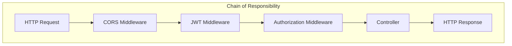

**Where:** ASP.NET Core middleware pipeline

**Why Chain of Responsibility:**
- Each middleware decides to handle or pass to next
- JWT Middleware can short-circuit with 401 if token invalid
- Authorization Middleware can reject if not authenticated
- Order matters: Authentication before Authorization

```csharp
// Program.cs - Chain order
app.UseAuthentication();  // Handler 1: Validate JWT
app.UseAuthorization();   // Handler 2: Check [Authorize]
app.MapControllers();     // Handler 3: Route to action
```

---

### 2. Decorator Pattern (Claims Population)

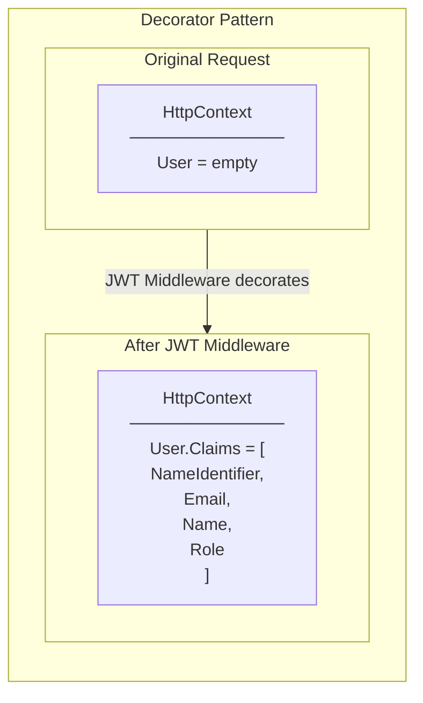

**Where:** JWT Middleware populating `HttpContext.User.Claims`

**Why Decorator:**
- Original HttpContext is enhanced without modification
- Claims are added transparently
- Controller receives enriched context

---

### 3. Facade Pattern (AuthService.GetCurrentUserAsync)

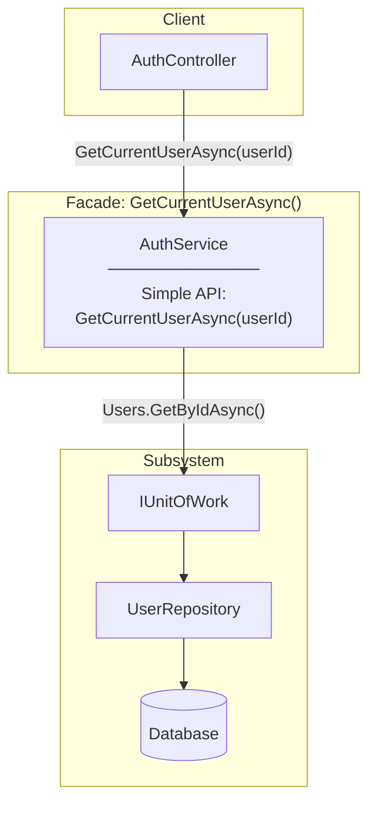

**Where:** `AuthService.GetCurrentUserAsync()` method

**Why Facade:**
- Controller doesn't know about UnitOfWork or Repository
- Single method hides data access complexity
- Easy to use: just pass userId, get UserDto

---

### 4. Data Transfer Object (DTO) Pattern

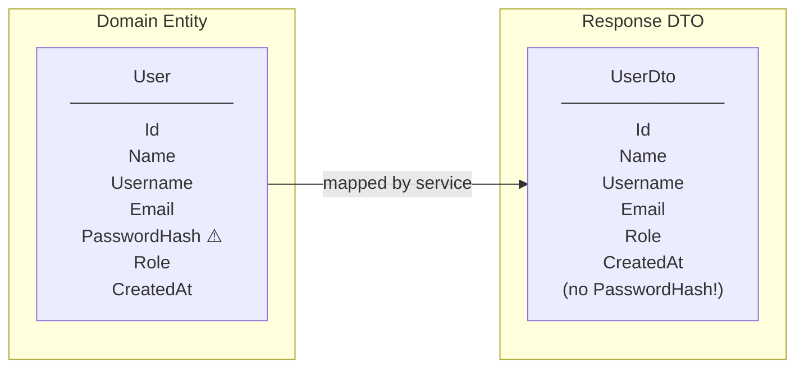

**Where:** `UserDto` returned by GET /api/auth/me

**Why DTO:**
- Never expose PasswordHash to client
- Different shape than entity (no navigation properties)
- Can change entity without breaking API contract

---

### 5. Null Object Pattern (User Not Found)

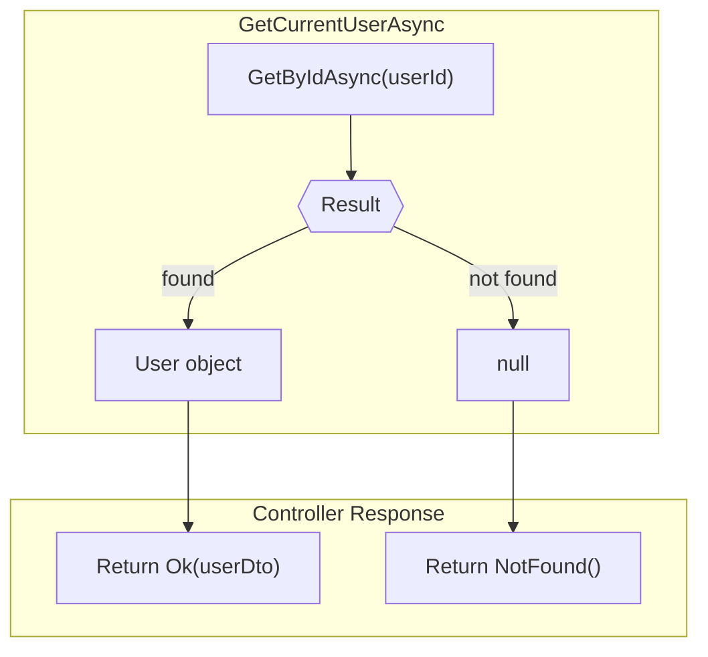

**Where:** User lookup returns `null` if user deleted

**Why:**
- Explicit null check in controller
- Clear 404 response for missing user
- Handles edge case: token valid but user deleted

---

### 6. Template Method Pattern (Service Methods)

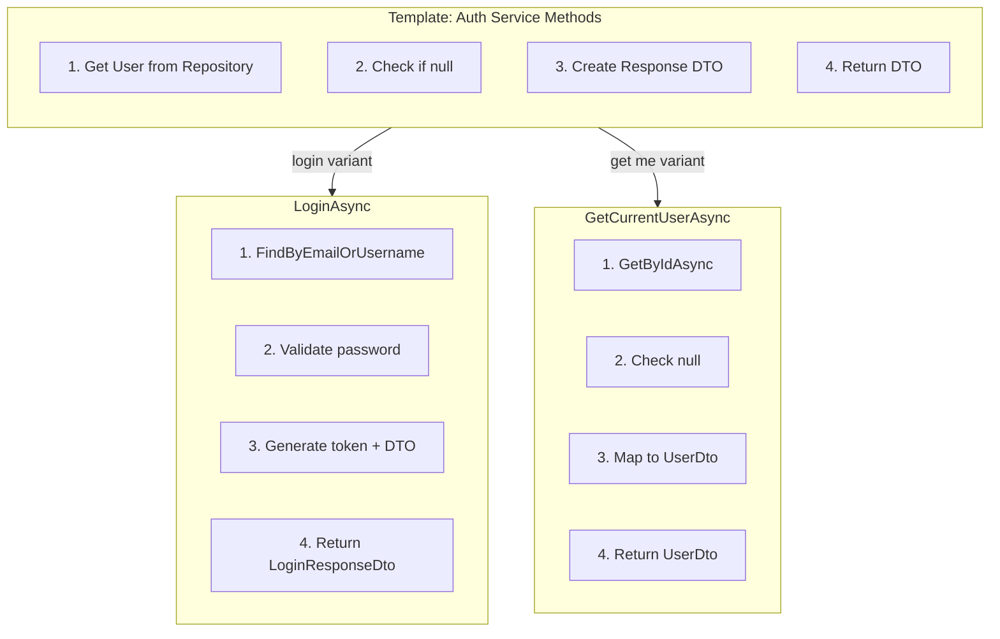

**Where:** `LoginAsync` and `GetCurrentUserAsync` share similar pattern

---

## SOLID Principles Applied

### S - Single Responsibility Principle (SRP)

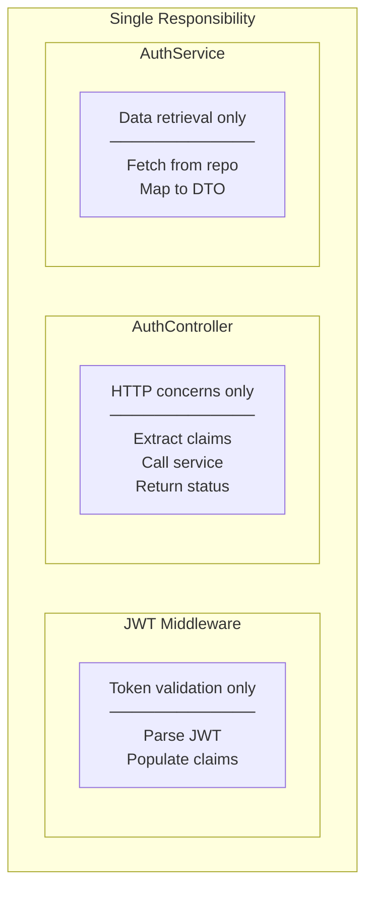

| Component | Single Responsibility |
|-----------|----------------------|
| JWT Middleware | Token validation, claims population |
| [Authorize] Attribute | Check if authenticated |
| AuthController | HTTP routing, claims extraction |
| AuthService | User data retrieval |
| UserDto | API response structure |

---

### O - Open/Closed Principle (OCP)

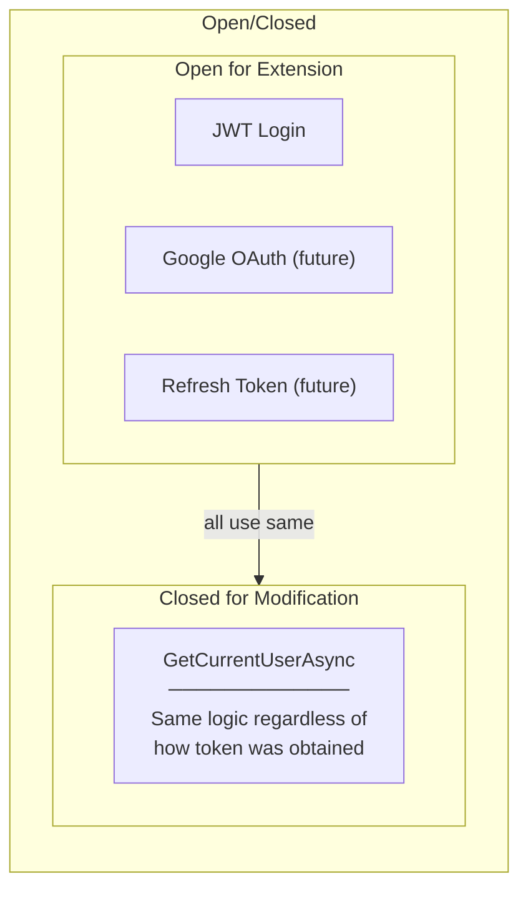

**Where Applied:**
- `GetCurrentUserAsync` doesn't care how user was authenticated
- Same endpoint works for JWT login, Google OAuth, etc.
- New auth methods don't require changes to /me endpoint

---

### L - Liskov Substitution Principle (LSP)

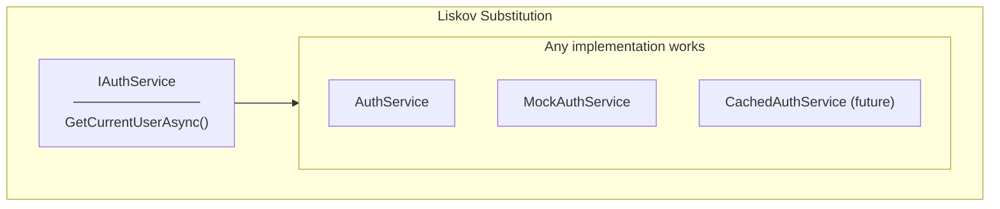

**Where Applied:**
- Controller depends on `IAuthService` interface
- Any implementation returning `UserDto?` is valid
- Can mock for unit testing

---

### I - Interface Segregation Principle (ISP)

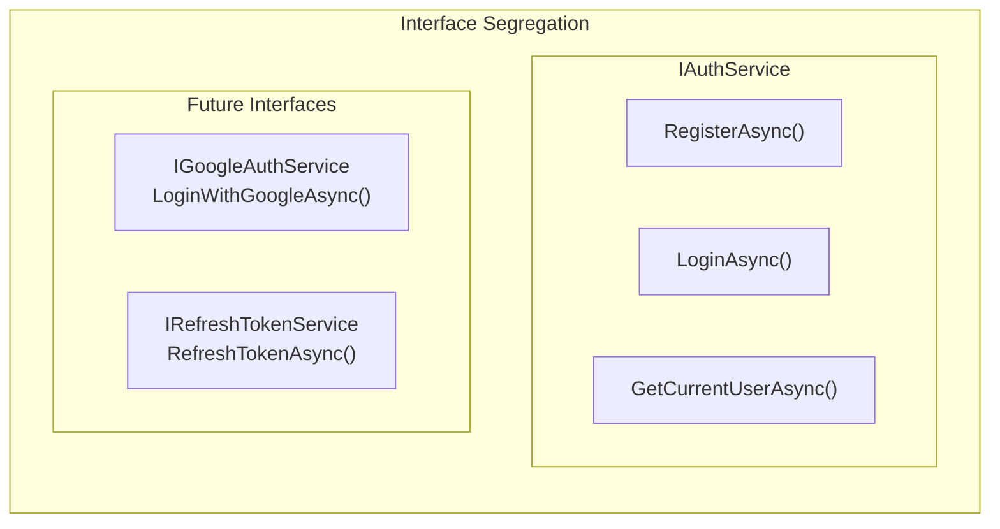

**Where Applied:**
- `IAuthService` contains only auth-related methods
- Controller doesn't depend on JWT internals
- If Google OAuth added, separate interface

---

### D - Dependency Inversion Principle (DIP)

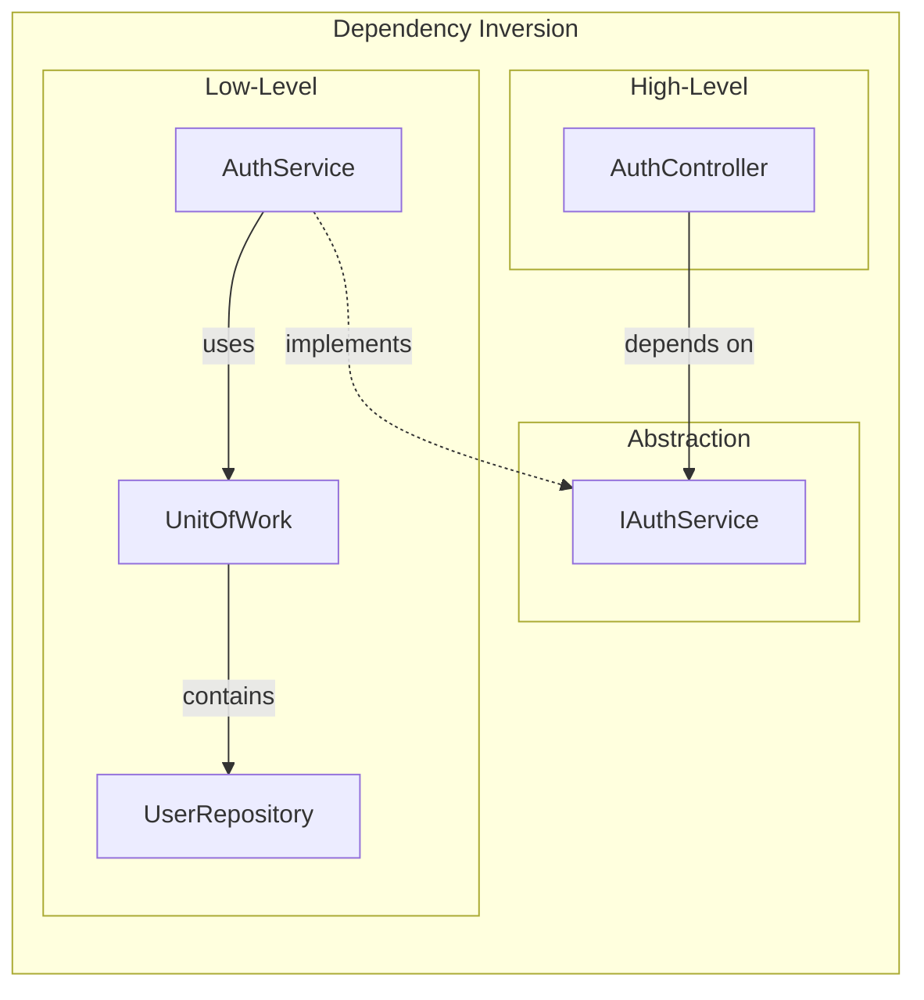

**Where Applied:**
- Controller receives `IAuthService` via constructor injection
- Controller doesn't know about `UnitOfWork` or `UserRepository`
- DI Container wires everything at startup

---

## Summary Table

| Pattern/Principle | Where Applied | Benefit |
|-------------------|---------------|---------|
| **Chain of Responsibility** | Middleware pipeline | Sequential request processing |
| **Decorator** | JWT claims population | Enhance HttpContext transparently |
| **Facade** | GetCurrentUserAsync | Simple API, hide data access |
| **DTO** | UserDto | Hide sensitive data, decouple API |
| **Null Object** | User not found | Explicit 404 handling |
| **Template Method** | Auth service methods | Shared structure, varying details |
| **SRP** | Separate concerns | Each class has one job |
| **OCP** | Auth method agnostic | Same endpoint, any auth method |
| **LSP** | IAuthService | Mockable, testable |
| **ISP** | Focused interfaces | No unused dependencies |
| **DIP** | Constructor injection | Loose coupling |

---

## Related Documentation

- [00-development-plan.md](./00-development-plan.md) - Implementation details
- [01-architecture-diagram.md](./01-architecture-diagram.md) - System architecture
- [03-programming-concepts.md](./03-programming-concepts.md) - Programming concepts
