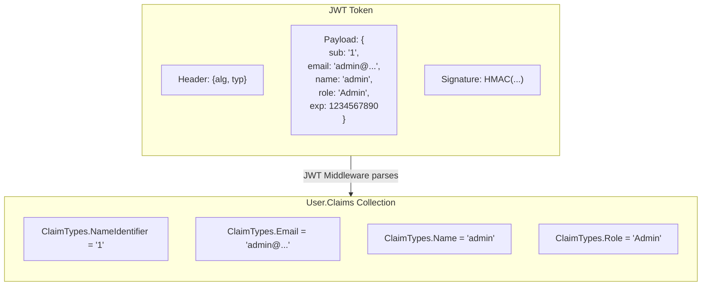
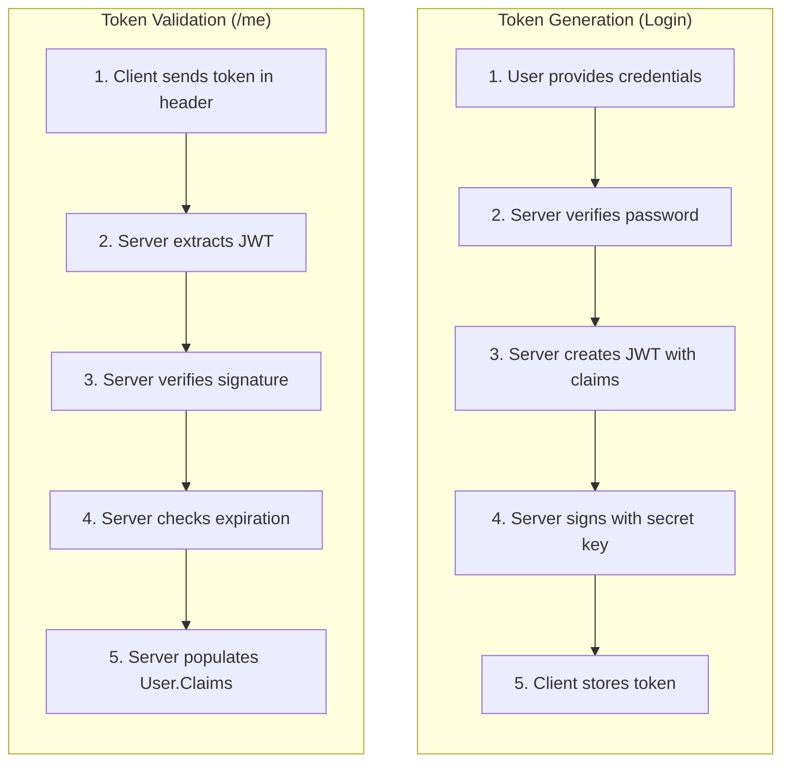
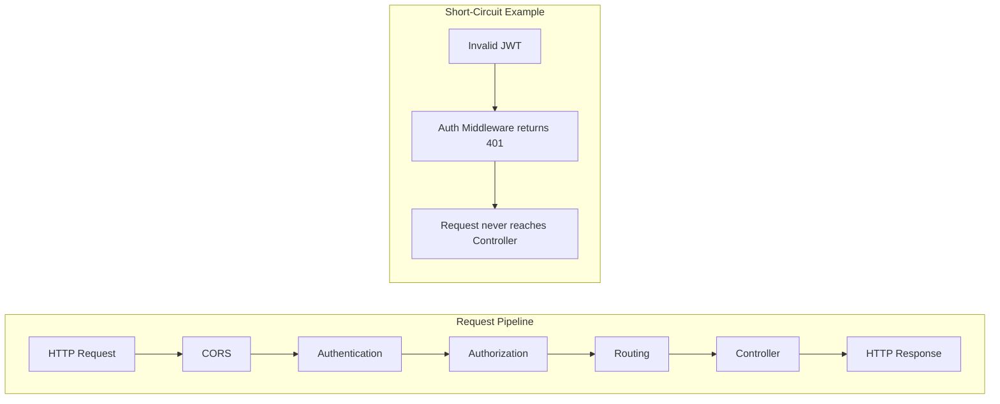
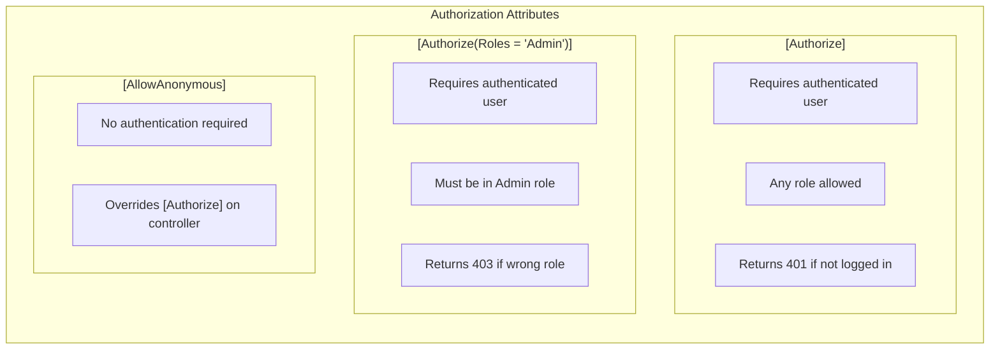
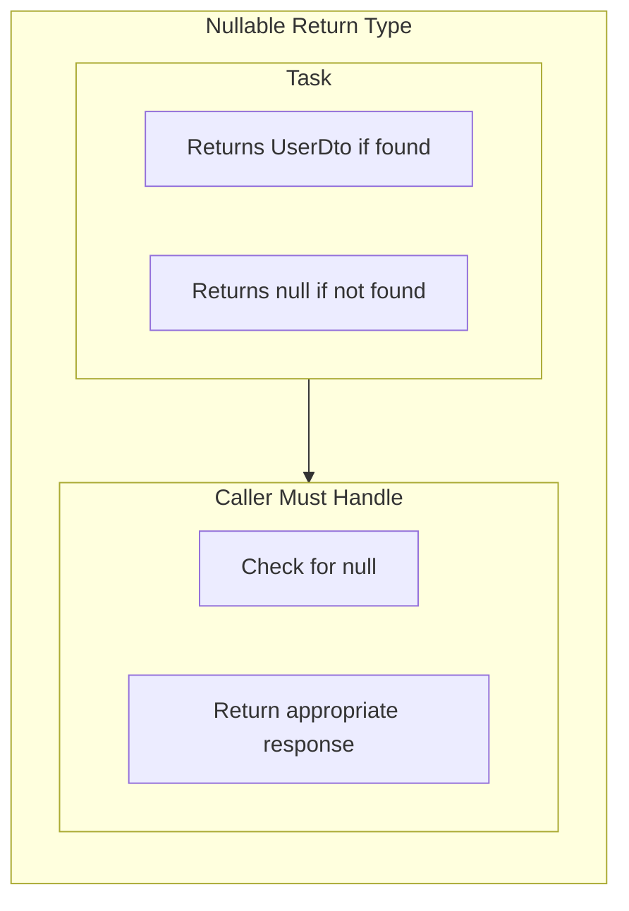
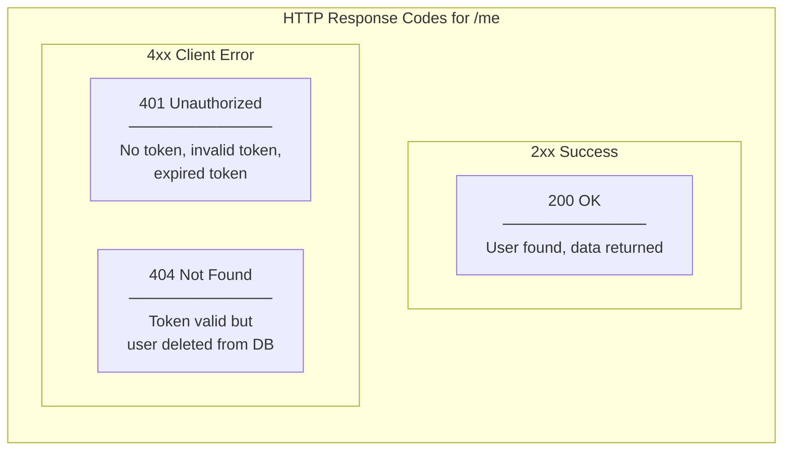
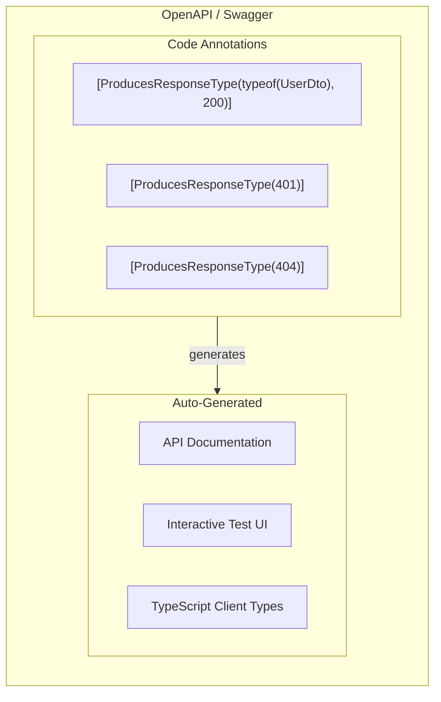

# Programming Concepts Recap (Language Agnostic)

## Table of Contents

1. [Claims-Based Identity](#1-claims-based-identity)
2. [Token Validation vs Token Generation](#2-token-validation-vs-token-generation)
3. [Middleware Pipeline](#3-middleware-pipeline)
4. [Attribute-Based Authorization](#4-attribute-based-authorization)
5. [Nullable Return Types](#5-nullable-return-types)
6. [HTTP Response Semantics](#6-http-response-semantics)
7. [Self-Describing APIs (OpenAPI)](#7-self-describing-apis-openapi)

---

## 1. Claims-Based Identity

**Concept:** User identity is represented as a collection of claims (key-value pairs) rather than a single ID. Claims travel with the token and are available throughout the request.



**Key Insight:**

| Claim Type | Purpose | Example Value |
|------------|---------|---------------|
| NameIdentifier | Unique user ID | "1" |
| Email | User's email | "admin@taskcollab.com" |
| Name | Display name/username | "admin" |
| Role | Authorization role | "Admin" |

**How to Access:**
```csharp
// Get user ID from claims
var userIdClaim = User.FindFirst(ClaimTypes.NameIdentifier);
int userId = int.Parse(userIdClaim.Value);
```

**Benefit:** Claims are standardized, framework-agnostic, and travel with the token.

---

## 2. Token Validation vs Token Generation

**Concept:** Token generation creates new credentials; token validation verifies existing ones. These are separate operations happening at different times.



**Key Insight:**

| Aspect | Generation | Validation |
|--------|------------|------------|
| When | Login/Register | Every protected request |
| Database | Yes (verify user) | No (stateless) |
| Output | New JWT string | Populated claims |
| Who does it | AuthService | JWT Middleware |

---

## 3. Middleware Pipeline

**Concept:** Requests pass through a series of middleware components in order. Each can process the request, short-circuit it, or pass it to the next component.



**Key Insight:**

| Middleware | Can Short-Circuit? | When |
|------------|-------------------|------|
| CORS | Yes | Origin not allowed |
| Authentication | Yes | Invalid/expired token |
| Authorization | Yes | User not in required role |
| Routing | Yes | Route not found (404) |

**Order Matters:**
```csharp
app.UseAuthentication();  // Must come first
app.UseAuthorization();   // Depends on Authentication
app.MapControllers();     // Handles actual request
```

---

## 4. Attribute-Based Authorization

**Concept:** Declarative authorization using attributes on controllers or actions. Framework enforces rules before executing code.



**Key Insight:**

| Attribute | Effect | Failed Response |
|-----------|--------|-----------------|
| `[Authorize]` | Must be logged in | 401 Unauthorized |
| `[Authorize(Roles = "Admin")]` | Must have role | 403 Forbidden |
| `[AllowAnonymous]` | No auth needed | N/A |

**Example:**
```csharp
[Authorize]  // Requires valid JWT
public Task<IActionResult> GetCurrentUser()
```

**Benefit:** Authorization logic is declarative, not imperative. No if-statements needed.

---

## 5. Nullable Return Types

**Concept:** Explicitly indicate that a method can return "no value" using nullable types. Forces caller to handle the null case.



**Key Insight:**

| Return Type | Meaning | Caller Must |
|-------------|---------|-------------|
| `UserDto` | Always returns value | Use directly |
| `UserDto?` | May return null | Check before use |
| `Task<UserDto?>` | Async + nullable | Await + check |

**Example:**
```csharp
// Service returns nullable
public async Task<UserDto?> GetCurrentUserAsync(int userId)
{
    var user = await _repo.GetByIdAsync(userId);
    if (user == null) return null;  // Explicit null
    return MapToDto(user);
}

// Controller handles null
var user = await _authService.GetCurrentUserAsync(userId);
if (user == null) return NotFound();  // 404
return Ok(user);  // 200
```

---

## 6. HTTP Response Semantics

**Concept:** HTTP status codes have specific meanings. Choose the correct code to communicate the outcome accurately.



**Key Insight:**

| Status | When | Meaning |
|--------|------|---------|
| 200 OK | User found | Success, data in body |
| 401 Unauthorized | Token missing/invalid | Authentication failed |
| 403 Forbidden | Wrong role | Authorization failed |
| 404 Not Found | User deleted | Resource doesn't exist |

**Why 404 for deleted user?**
- Token was valid when issued
- User existed then
- User no longer exists now
- "Resource not found" is accurate

---

## 7. Self-Describing APIs (OpenAPI)

**Concept:** APIs describe themselves through metadata, enabling automatic documentation, client generation, and testing tools.



**Key Insight:**

| Annotation | Purpose |
|------------|---------|
| `[HttpGet("me")]` | Route definition |
| `[Authorize]` | Security requirement |
| `[ProducesResponseType(typeof(T), 200)]` | Success response schema |
| `[ProducesResponseType(401)]` | Possible error response |

**Swagger JWT Configuration:**
```csharp
options.AddSecurityDefinition("Bearer", new OpenApiSecurityScheme
{
    Type = SecuritySchemeType.Http,
    Scheme = "Bearer",
    BearerFormat = "JWT"
});
```

**Benefit:** Frontend developers can see exactly what the API expects and returns without reading backend code.

---

## Summary Table

| Concept | Where Applied | Key Benefit |
|---------|---------------|-------------|
| **Claims-Based Identity** | User.Claims | Standardized user info |
| **Token Validation** | JWT Middleware | Stateless authentication |
| **Middleware Pipeline** | ASP.NET Core | Request processing chain |
| **Attribute Authorization** | [Authorize] | Declarative security |
| **Nullable Return Types** | Task<UserDto?> | Explicit null handling |
| **HTTP Semantics** | Status codes | Clear communication |
| **Self-Describing APIs** | OpenAPI/Swagger | Auto documentation |

---

## Related Documentation

- [00-development-plan.md](./00-development-plan.md) - Implementation details
- [01-architecture-diagram.md](./01-architecture-diagram.md) - System architecture
- [02-design-patterns-and-solid.md](./02-design-patterns-and-solid.md) - Design patterns
