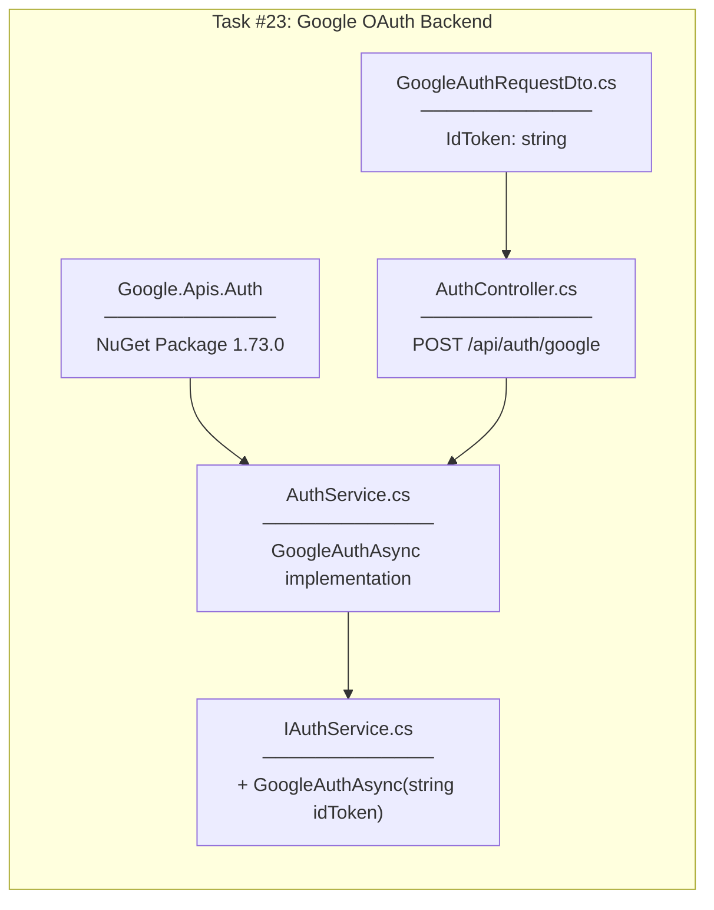
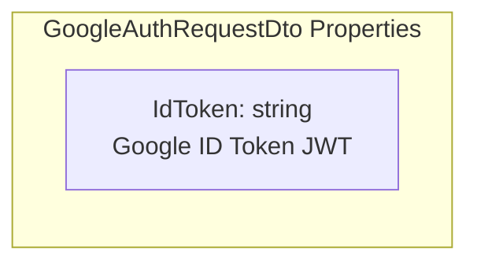
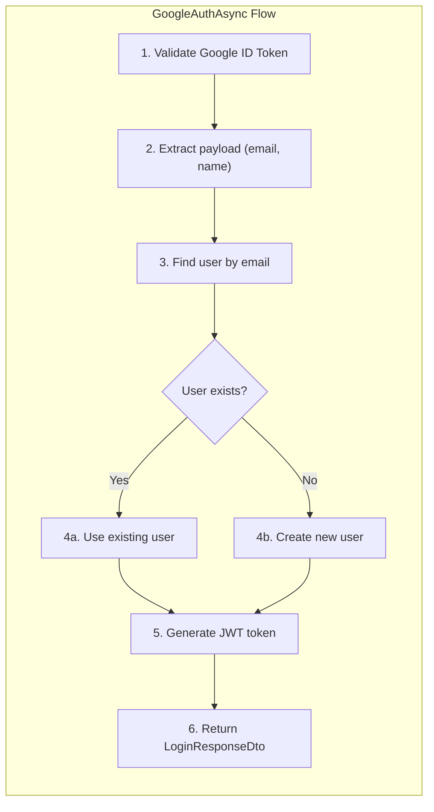
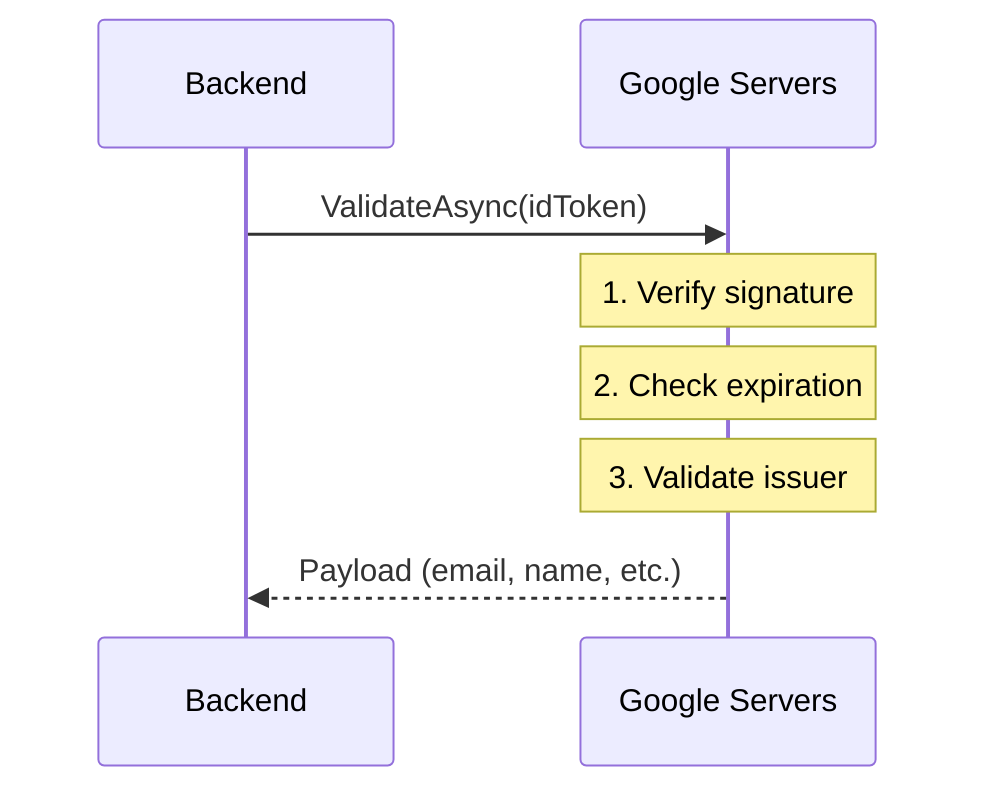
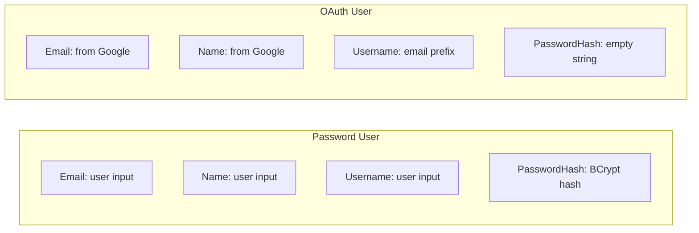
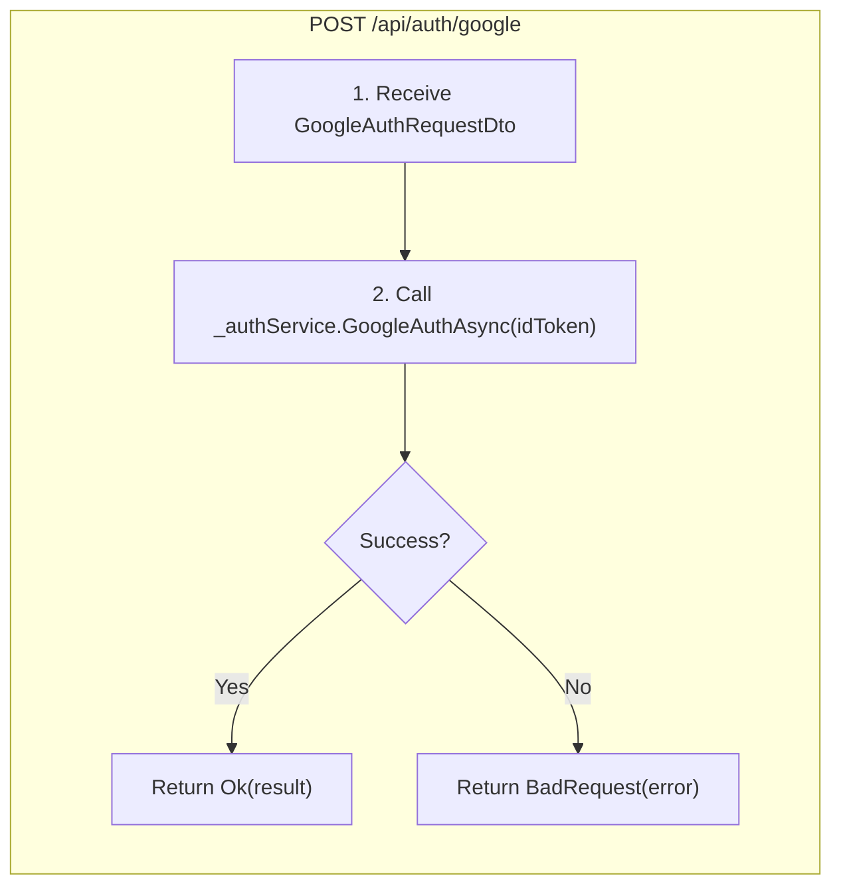
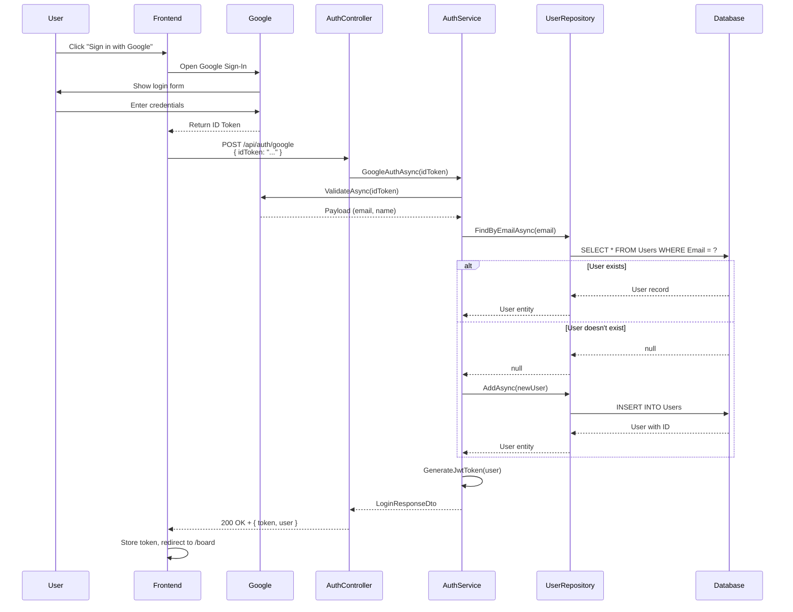
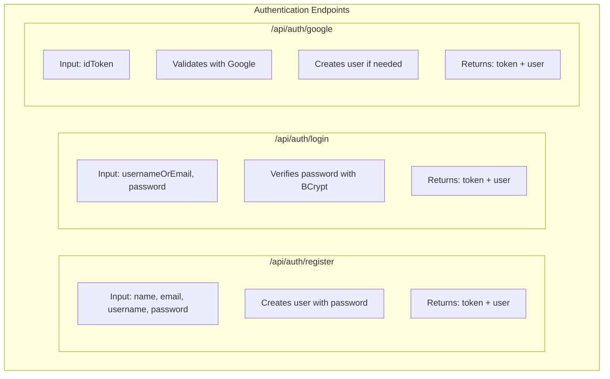
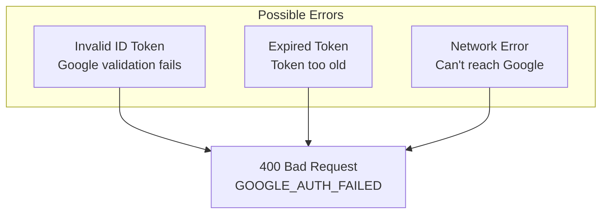

# Google OAuth Backend Implementation Plan

## Overview

Task #23: Add POST /api/auth/google endpoint to authenticate users with Google OAuth.

**GitHub Issue:** #23

---

## What Was Implemented

| Component | Location | Purpose |
|-----------|----------|---------|
| Google.Apis.Auth | NuGet Package | Google ID Token validation library |
| GoogleAuthRequestDto.cs | Controllers/DTOs/Auth/ | Request DTO for Google ID Token |
| IAuthService.GoogleAuthAsync | Services/Interfaces/ | Service contract method signature |
| AuthService.GoogleAuthAsync | Services/ | Google token validation + user creation |
| AuthController.GoogleAuth | Controllers/ | POST /api/auth/google endpoint |

---

## Implementation Flow



---

## GoogleAuthRequestDto

### Responsibility

| Aspect | Description |
|--------|-------------|
| **What it does** | Carries Google ID Token from frontend to backend |
| **Where it's used** | Request body of POST /api/auth/google |
| **What it contains** | Single IdToken property |

### Properties



### What is Google ID Token?

| Aspect | Description |
|--------|-------------|
| **Format** | JWT (JSON Web Token) |
| **Issued by** | Google after successful sign-in |
| **Contains** | email, name, picture, etc. |
| **Validity** | Short-lived (~1 hour) |

---

## GoogleAuthAsync (Service Method)

### Responsibility

| Aspect | Description |
|--------|-------------|
| **What it does** | Validates Google token, finds/creates user, returns JWT |
| **Where it's called** | From AuthController.GoogleAuth |
| **Returns** | LoginResponseDto with JWT token and user info |

### Logic



### GoogleJsonWebSignature.ValidateAsync



| Validation | Description |
|------------|-------------|
| Signature | Token signed by Google |
| Expiration | Token not expired |
| Issuer | Token from accounts.google.com |

### Runtime Behavior

| Scenario | Result |
|----------|--------|
| Valid token, user exists | Login existing user |
| Valid token, user doesn't exist | Create new user, then login |
| Invalid token | Throws exception |
| Expired token | Throws exception |

---

## OAuth User Creation

### Comparison: Password vs OAuth User



| Field | Password User | OAuth User |
|-------|---------------|------------|
| Email | User input | From Google payload |
| Name | User input | From Google payload |
| Username | User input | email.Split('@')[0] |
| PasswordHash | BCrypt hash | Empty string "" |
| Role | Based on AdminEmail | Based on AdminEmail |

### Why Empty PasswordHash?

| Aspect | Description |
|--------|-------------|
| **Security** | OAuth users authenticate via Google, not password |
| **Login** | Only /api/auth/google works, /api/auth/login won't work |
| **Future** | Could allow linking password to OAuth account |

---

## GoogleAuth Endpoint

### Responsibility

| Aspect | Description |
|--------|-------------|
| **What it does** | HTTP entry point for Google OAuth |
| **Route** | POST /api/auth/google |
| **Auth Required** | No - this creates authentication |
| **Returns** | 200 OK with token, or 400 Bad Request |

### Logic



### Runtime Behavior

| HTTP Status | Condition |
|-------------|-----------|
| 200 OK | Valid Google token, user created/found |
| 400 Bad Request | Invalid token, Google validation failed |

---

## Request Flow (End-to-End)



---

## Comparison: Login Endpoints



| Endpoint | Input | Authentication Method |
|----------|-------|----------------------|
| POST /api/auth/register | name, email, username, password | Password (BCrypt) |
| POST /api/auth/login | usernameOrEmail, password | Password (BCrypt) |
| POST /api/auth/google | idToken | Google OAuth |

---

## Error Handling



### Error Response

```json
{
  "error": "GOOGLE_AUTH_FAILED",
  "message": "JWT is not yet valid."
}
```

---

## Checklist

- [x] Install Google.Apis.Auth NuGet package
- [x] Create GoogleAuthRequestDto.cs
- [x] Add GoogleAuthAsync to IAuthService
- [x] Implement GoogleAuthAsync in AuthService
- [x] Add GoogleAuth endpoint to AuthController
- [x] Build successful
- [ ] E2E test (after Frontend Task #24)

---

## Related Documentation

- [Task #6 Auth Service](../06-auth-service/00-development-plan.md)
- [Task #7 Auth Controller](../07-auth-controller/00-development-plan.md)
- [Task #21 Get Current User](../21-get-current-user/00-development-plan.md)
