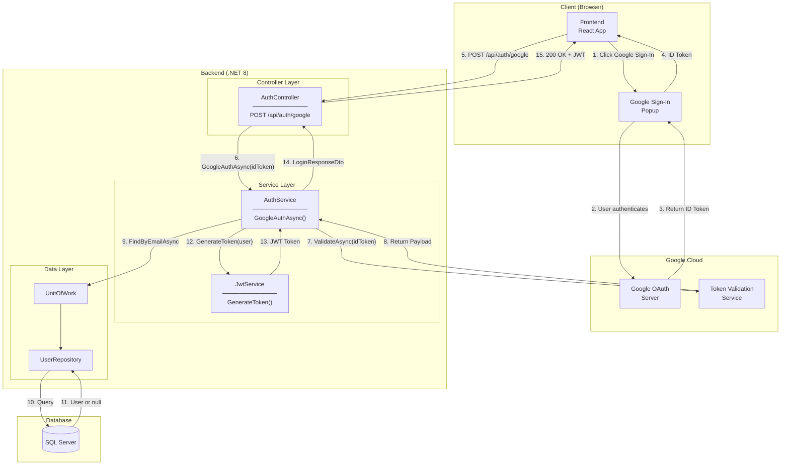
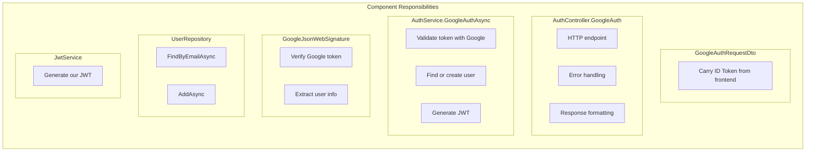
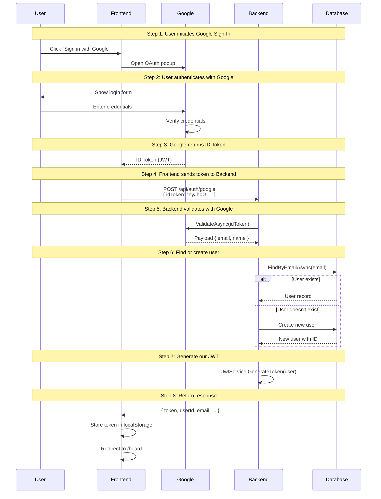
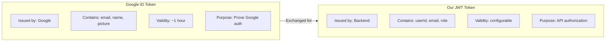
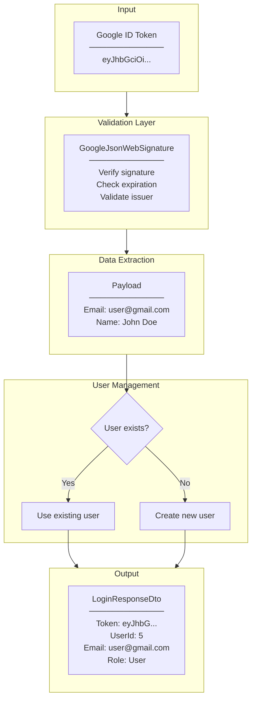
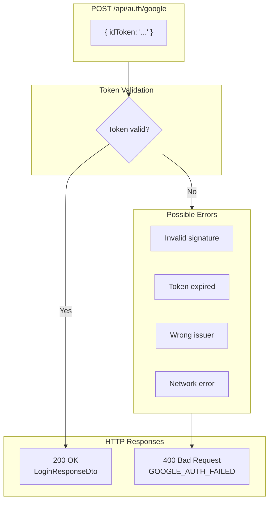

# Google OAuth Architecture Diagram

## System Architecture



---

## Component Responsibilities



| Component              | Responsibility                |
| ---------------------- | ----------------------------- |
| GoogleAuthRequestDto   | Carry Google ID Token         |
| AuthController         | HTTP endpoint, error handling |
| AuthService            | Orchestrate OAuth flow        |
| GoogleJsonWebSignature | Validate Google token         |
| UserRepository         | User data access              |
| JwtService             | Generate our JWT token        |

---

## Authentication Flow Sequence



---

## Token Flow



| Aspect   | Google ID Token             | Our JWT Token       |
| -------- | --------------------------- | ------------------- |
| Issuer   | Google                      | Our Backend         |
| Purpose  | Prove Google authentication | API authorization   |
| Contains | email, name, picture, etc.  | userId, email, role |
| Used for | One-time validation         | All API requests    |
| Validity | ~1 hour                     | Configurable        |

---

## Data Flow Diagram



---

## Error Handling Flow



---

## File Structure

```
Backend/TaskCollaborationApp.API/
├── Controllers/
│   ├── AuthController.cs              ← POST /api/auth/google
│   └── DTOs/
│       └── Auth/
│           ├── GoogleAuthRequestDto.cs ← NEW
│           └── LoginResponseDto.cs     ← Reused
├── Services/
│   ├── Interfaces/
│   │   └── IAuthService.cs            ← + GoogleAuthAsync
│   ├── AuthService.cs                 ← + GoogleAuthAsync impl
│   └── JwtService.cs                  ← Reused
├── Repositories/
│   └── UserRepository.cs              ← FindByEmailAsync
└── TaskCollaborationApp.Api.csproj    ← + Google.Apis.Auth
```

---

## Related Documentation

- [00-development-plan.md](./00-development-plan.md) - Implementation details
- [02-design-patterns-and-solid.md](./02-design-patterns-and-solid.md) - Design patterns
- [03-programming-concepts.md](./03-programming-concepts.md) - Programming concepts
